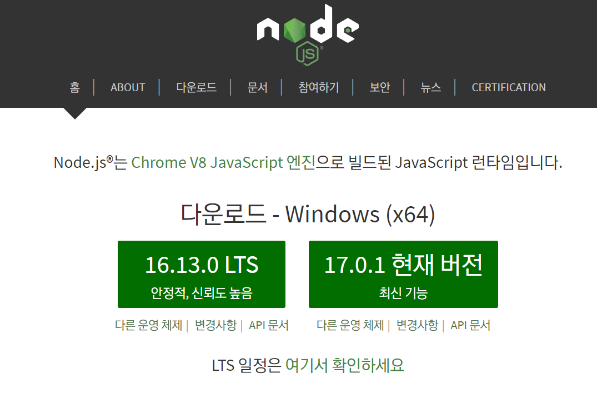

# Node.js

Node.js는 Chrome V8 JavaScript 엔진으로 빌드된 JavaScript 런타임

<br/>

:::note 런타임

프로그래밍 언어가 동작하는 환경

:::

<br/>

- **JavaScript가 동작할 수 있는 환경**
  - Node.js가 설치되어 있는 컴퓨터
    - 웹 페이지를 개발할 때 도움을 받기 위함
  - 웹 브라우저

<br/>

- **웹 개발을 도와주는 모듈들**
  - stylus, Sass, EJS, BABEL, ...
  - HTML, CSS, JavaScipt로 변환하기 위한 환경 : Node.js

<br/>

## Node.js 설치



- LTS (Lont Term Supported)는 장기적으로 안정되고 신뢰도가 높은 지원이 보장되는 버전. 유지/보수와 보안(서버 운영 등)에 초점을 맞춰 대부분 사용자에게 추천되는 버전 (짝수 버전)

- 홀수 버전 : 여러가지 최신 기능을 사용할 수 있는 장점이 있지만 비교적 안정적이지 못하다는 단점

<br/>

### Node Version Manager : NVM

- Node.js의 버전을 바꿀 수 있도록 도와주는 매니저

- https://github.com/coreybutler/nvm-windows

```bash
$ nvm --version

Running version 1.1.8.

Usage:
 
  nvm arch                     : Show if node is running in 32 or 64 bit mode.
  nvm current                  : Display active version.
  nvm install <version> [arch] : The version can be a specific version, "latest" for the latest current version, or "lts" for the
                                 most recent LTS version. Optionally specify whether to install the 32 or 64 bit version (defaults        
                                 to system arch). Set [arch] to "all" to install 32 AND 64 bit versions.
                                 Add --insecure to the end of this command to bypass SSL validation of the remote download server.        
  nvm list [available]         : List the node.js installations. Type "available" at the end to see what can be installed. Aliased as ls. 
  nvm on                       : Enable node.js version management.
  nvm off                      : Disable node.js version management.
  nvm proxy [url]              : Set a proxy to use for downloads. Leave [url] blank to see the current proxy.
                                 Set [url] to "none" to remove the proxy.
  nvm node_mirror [url]        : Set the node mirror. Defaults to https://nodejs.org/dist/. Leave [url] blank to use default url.
  nvm npm_mirror [url]         : Set the npm mirror. Defaults to https://github.com/npm/cli/archive/. Leave [url] blank to default url.   
  nvm uninstall <version>      : The version must be a specific version.
  nvm use [version] [arch]     : Switch to use the specified version. Optionally use "latest", "lts", or "newest".
                                 "newest" is the latest installed version. Optionally specify 32/64bit architecture.
                                 nvm use <arch> will continue using the selected version, but switch to 32/64 bit mode.
  nvm root [path]              : Set the directory where nvm should store different versions of node.js.
                                 If <path> is not set, the current root will be displayed.
  nvm version                  : Displays the current running version of nvm for Windows. Aliased as v.
```

