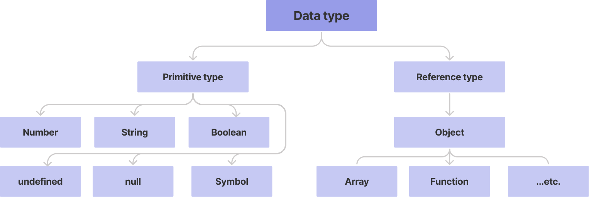

# ES6

## Introduction

### ECMA

- **ECMA** (ECMA International)
   - 정보 통신에 대한 표준을 제정하는 비영리 표준화 기구
- ECMAScript는 ECMA에서 [ECMA-262](https://www.ecma-international.org/publications-and-standards/standards/ecma-262/)* 규격에 따라 정의한 언어
   - ECMA-262* : 범용적인 목적의 프로그래밍 언어에 대한 명세
- ECMAScript6는 ECMA에서 제안하는 [6번째 표준 명세](https://262.ecma-international.org/6.0/)를 말함
   - [참고] ECMAScript6의 발표 연도에 따라 ECMAScript2015라고도 불림


<br/>


### 세미콜론

- 자바스크립트는 세미콜론을 선택적으로 사용 가능
- 세미콜론이 없으면 ASI*에 의해 자동으로 세미콜론이 삽입됨
  - [ASI* : 자동 세미콜론 삽입 규칙 (Automatic Semicolon Insertion)](https://tc39.es/ecma262/#sec-automatic-semicolon-insertion)

  

<br/>


### 코딩 스타일 가이드

- 코딩 스타일의 핵심은 합의된 원칙과 일관성
  - 절대적인 하나의 정답은 없으며, 상황에 맞게 원칙을 정하고 일관성 있게 사용하는 것이 중요
- 코딩 스타일은 코드의 품질에 직결되는 중요한 요수
  - 코드의 가독성, 유지보수 또는 팀원과의 커뮤니케이션 등 개발 과정 전체에 영향을 끼침

:::tip [참고] 자바스크립트의 코딩 스타일 가이드

- [Airbnb JavaScript Style Guide](https://github.com/airbnb/javascript)
- [Google JavaScript Style Guide](https://google.github.io/styleguide/jsguide.html)
- [standardjs](https://standardjs.com/#javascript-style-guide-linter-and-formatter)

:::

<br/>

## 변수와 식별자

### 식별자 정의의 특징

- 식별자(identifier)는 변수를 구분할 수 있는 변수명을 말함
- 식별자는 반드시 문자, 달러($) 또는 밑줄(_)로 시작
- 대소문자를 구분하며, 클래스명 외에는 모두 소문자로 시작
- 예약어* 사용 불가능
  - 예약어 예시: `for`, `if`, `case` 등

<br/>

### 식별자 작성 스타일

- **카멜 케이스**(camelCase, lower-camel-case)
  - 변수, 객체, 함수에 사용
- **파스칼 케이스**(PascalCase, upper-camel-case)
  - 클래스, 생성자에 사용
- **대문자 스네이크 케이스**(SNAKE_CASE)
  - 상수(constants)*에 사용
  - [상수의 정의](https://google.github.io/styleguide/jsguide.html#naming-constant-names): 개발자의 의도와 상관없이 **변경될 가능성이 없는 값을 말함**

<br/>

```javascript
// 카멜 케이스

// 변수
let dog
let variableName

// 객체
const userInfo = { name: 'juan', age: 27 }

// 함수
function getPropertyName () {}
function onClick () {}


// ----------------------------------------------------------
// 파스칼 케이스

// 클래스
class User {
  constructor(options) {
    this.name = options.name
  }
}

// 생성자
const good = new User({
  name: '홍길동'
})


// ----------------------------------------------------------
// 대문자 스네이크 케이스

// 상수
const API_KEY = 'SOMEKEY'
const PI = Math.PI
```


<br/>

### 변수 선언 키워드 (`let`, `const`)

- `let`
  - **재할당 할 수 있는** 변수 선언 시 사용
  - 변수 **재선언 불가능**
  - 블록 스코프*

- `const`
  - **재할당할 수 없는** 변수 선언 시 사용
  - 변수 **재선언 불가능**
  - 블록 스코프*

<br/>

:::tip [참고] 선언, 할당, 초기화

- <b>선언</b> (Declaration)

  - 변수를 생성하는 행위 또는 시점
- <b>할당</b> (Assignment)

  - 선언된 변수에 값을 저장하는 행위 또는 시점
- <b>초기화</b> (Initialization)

  - 선언된 변수에 처음으로 값을 저장하는 행위 또는 시점

```javascript
let foo            // 선언
console.log(foo)   // undefined

foo = 11           // 할당
console.log(foo)   // 11

let bar = 0        // 선언 + 할당
console.log(bar)   // 0
```

:::

<br/>

- **재할당**

```javascript
let number1 = 10      // 1. 선언 및 초기값 할당
number1 = 10          // 2. 재할당

console.log(number1)  // 10


const number2 = 10    // 1. 선언 및 초기값 할당
number2 = 10          // 2. 재할당 불가능

=> Uncaught TypeError
   : Assignment to constant variable
```

<br/>

- **재선언**

```javascript
let number3 = 10      // 1. 선언 및 초기값 할당
let number3 = 50      // 2. 재선언 불가능

=> Uncaught SyntaxError
   : Identifier 'number3' has already been declared
   

const number4 = 10    // 1. 선언 및 초기값 할당
const number5 = 50    // 2. 재선언 불가능

=> Uncaught SyntaxError
   : Identifier 'number4' has already been declared
```

<br/>

#### 블록 스코프* (block scope)

- **if, for, 함수** 등의 **중괄호 내부**를 가리킴
- 블록 스코프를 가지는 변수는 **블록 바깥에서 접근 불가능**

```javascript
let x = 1

if (x === 1) {
    let x = 2
    console.log(x)  // 2
}

console.log(x)      // 1
```

<br/>

### 변수 선언 키워드 - `var`

- **var로 선언한 변수는 재선언 및 재할당 모두 가능**
- **ES6 이전**에 변수를 선언할 때 사용되던 키워드
- **호이스팅***되는 특성으로 인해 예기치 못한 문제 발생 가능
  - 따라서 ES6 이후부터는 var 대신 **const와 let을 사용하는 것을 권장**
- 함수 스코프*

```javascript
var number = 10      // 1. 선언 및 초기값 할당
var number = 50      // 2. 재할당

console.log(number)  // 50
```

<br/>

#### 함수 스코프* (function scope)

- 함수의 중괄호 내부를 가리킴
- 함수 스코프를 가지는 변수는 함수 바깥에서 접근 불가능

```javascript
function foo() {
  var x = 5
  console.log(x)  // 5
}

console.log(x)
// ReferenceError: x is not defined


const codeEditor = 'vscode'

if (codeEditor === 'vscode') {
  var theme = 'dark+'
}
console.log(theme)
// dark+
```

<br/>

#### 호이스팅* (hoisting)

- 변수를 선언 이전에 참조할 수 있는 현상
- 변수 선언 이전의 위치에서 접근 시 undefined를 반환

```javascript
console.log(username)  // undefined
var username = '홍길동'

console.log(email)     // Uncaught Reference Error
let email = 'gildong@gmail.com'

console.log(age)       // Uncaught Reference Error
const age = 50
```

```javascript
console.log(hoisted)  // var 키워드로 선언된 경우 내부적으로 위로 올라간다.
var hoisted = 'can you see me?'

/* 다음과 같다. (결과 : undifined)
var hoisted
console.log(hoisted)
hoisted = 'can you see me?'
*/
```

<br/>

### let, const, var 비교

| 키워드 | 재선언 | 재할당 |   스코프    |     비고     |
| :----: | :----: | :----: | :---------: | :----------: |
|  let   |   X    |   O    | 블록스코프  | ES6부터 도입 |
| const  |   X    |   X    | 블록스코프  | ES6부터 도입 |
|  var   |   O    |   O    | 함수 스코프 |    사용 X    |

<br/>

:::note 변수와 식별자 Quiz
1. <b>자바스크립트 변수 선언 시 사용 가능한 키워드는 const와 let 뿐이다.</b>

   - F: 자바스크립트 변수 사용 시 사용 가능한 키워드는 const, let 그리고 var이다.

2. <b>const 키워드로 선언한 변수는 재할당이 가능하다. </b>

   - F : const 키워드로 선언한 변수는 재할당이 불가능하다.

3. <b>let 키워드로 선언한 변수는 재할당이 가능하다.</b>
   - T

:::

<br/>

## 데이터 타입

- 자바스크립트의 모든 값은 특정한 데이터 타입을 가짐
- 크게 **원시 타입*** (Primitive type)과 **참조 타입*** (Reference type)으로 분류됨



<br/>

:::tip [참조] 원시 타입과 참조 타입 비교

- <b>원시 타입</b> (Primitive type)

  - 객체 (object)가 아닌 기본 타입
  - 변수에 해당 타입의 값이 담김
  - 다른 변수에 복사할 때 실제 값이 복사됨

```javascript
let message = '안녕하세요!'  // 1. message 선언 및 할당

let greeting = message     // 2. greeting에 message 복사
console.log(greeting)      // 3. 안녕하세요! 출력

message = 'Hello, world!'  // 4. message 재할당
console.log(greeting)      // 5. 안녕하세요! 출력

// => 즉, 원시 타입은 실제 해당 타입의 값을 변수에 저장한다.
```

<br/>

- <b>참조 타입</b> (Reference type)

  - 객체 (object) 타입의 자료형
  - 변수에 해당 객체의 참조 값이 담김
  - 다른 변수에 복사할 때 참조 값이 복사됨

```javascript
const message = ['안녕하세요']  // 1. message 선언 및 할당

const greeting = message      // 2. greeting에 message 복사
console.log(greeting)         // 3. ['안녕하세요'] 출력

message[0] = 'Hello, world!'  //  4. message 재할당
console.log(greeting)         //  5. ['Hello, world!'] 출력

// => 즉, 참조 타입은 해당 객체를 참조할 수 있는 참조 값을 저장한다.
```

:::

<br/>

### 숫자 (Number) 타입

- **정수, 실수 구분 없는 하나의 숫자 타입**
- **부동소수점 형식**을 따름
- (참고) NaN (Not-A-Number)
  - 계산 불가능한 경우 반환되는 값
  - ex) 'Angel' / 1004 => NaN

```javascript
const a = 13         // 양의 정수
const b = -5         // 음의 정수
const c = 3.14       // 실수
const d = 2998e8     // 거듭제곱
const e = Infinity   // 양의 무한대
const f = -Infinity  // 음의 무한대
const g = NaN        // 산술 연산 불가
```

<br/>

### 문자열 (String) 타입

- **텍스트 데이터** 를 나타내는 타입
- 16 비트 유니코드 문자의 집합
- 작은따옴표 또는 큰따옴표 모두 가능
- **템플릿 리터럴 (Template Literal)**
  - ES6 부터 지원
  - 따옴표 대신 backtick (``) 으로 표현
  - `${ expression }`형태로 표현식 삽입 가능

```javascript
const firstName = 'Brandan'
const lastName = 'Eich'
const fullName = `${firstName} ${lastName}`

console.log(fullName)  // Brandan Eich
```

<br/>

### undefined

- 변수의 **값이 없음**을 나타내는 데이터 타입
- 변수 선언 이후 **직접 값을 할당하지 않으면, 자동으로 undefined가 할당됨**

```javascript
let firstName
console.log(firstName)  // undefined
```

<br/>

### null

- 변수의 값이 없음을 의도적으로 표현할 때 사용하는 데이터 타입

```javascript
let firstName = null
console.log(firstName)  // null

typeof null // object
```

<br/>

:::tip [참고] null 타입과 typeof 연산자

- <b>typeof 연산자</b> : 자료형 평가를 위한 연산자
- null 타입은 [ECMA 명세의 원시 타입의 정의](https://tc39.es/ecma262/#sec-primitive-value)에 따라 원시 타입에 속하지만, typeof 연산자의 결 과는 객체(object)로 표현됨 ([참고 자료](https://2ality.com/2013/10/typeof-null.html))

:::

<br/>

:::tip [참고] undefined 타입과 null 타입 비교

- <b>undefined</b>

  - 빈 값을 표현하기 위한 데이터 타입
  - <b>변수 선언 시 아무 값도 할당하지 않으면, 자바스크립트가 자동으로 할당</b>
  - typeof 연산자의 결과는 undefined

```javascript
typeof undefined  // undefined
```

<br/>

- <b>null</b>

  - 빈 값을 표현하기 위한 데이터 타입
  - <b>개발자가 의도적으로 필요한 경우 할당</b>
  - typeof 연산자의 결과는 object

```javascript
typeof null  // object
```

:::

<br/>

### Boolean 타입

- 논리적 참 또는 거짓을 나타내는 타입
- true 또는 false로 표현
- **조건문 또는 반복문***에서 유용하게 사용
  - (참고) 조건문 또는 반복문에서 boolean이 아 닌 데이터 타입은 [자동 형변환 규칙](https://tc39.es/ecma262/#sec-type-conversion)에 따라 true 또는 false로 변환됨

```javascript
let isAdmin = true
console.log(isAdmin)  // true

isAdmin = false
console.log(isAdmin)  // false
```

<br/>

:::tip [참고] ToBoolean Conversions (자동 형변환) 정리

- [공식문서](https://tc39.es/ecma262/#sec-toboolean)

| 데이터 타입 |    거짓    |        참        |
| :---------: | :--------: | :--------------: |
| `Undefined` | 항상 거짓  |        X         |
|   `Null`    | 항상 거짓  |        X         |
|  `Number`   | 0, -0, NaN | 나머지 모든 경우 |
|  `String`   | 빈 문자열  | 나머지 모든 경우 |
|  `Object`   |     X      |     항상 참      |

- 조건문 또는 반복문에서 <b>표현식의 결과가 참/거짓으로 판별되는 경우</b> 발생

:::

<br/>

### 참조 타입 (Reference type)

- 자세한 내용은 해당 타입의 챕터 참고
- **타입 별 챕터 링크 목록**
  - 함수 (Functions)
  - 배열 (Arrays)
  - 객체 (Objects)

<br/>

## 연산자

### 할당 연산자

- 오른쪽에 있는 피연산자의 평가 결과를 왼쪽 피연산자에 할당하는 연산자
- 다양한 연산에 대한 단축 연산자 지원

```javascript
let x = 0

x += 10
console.log(x)  // 10

x -= 3
console.log(x)  // 7

x *= 10
console.log(x)  // 70

x /= 10
console.log(x)  // 7

x++             // += 연산자와 동일
console.log(x)  // 8

x--             // -= 연산자와 동일
console.log(x)  // 7
```

<br/>

:::tip [참고] Increment 및 Decrement 연산자

- Increment(++): 피연산자의 값을 1 증가시키는 연산자
- Decrement(--): 피연산자의 값을 1 감소시키는 연산자
- [Airbnb Style Guide](https://github.com/airbnb/javascript#variables--unary-increment-decrement)에서는 `+=` 또는 `-=`와 같이 더 분명한 표현으로 적을 것을 권장

:::

<br/>

### 비교연산자

- 피연산자들(숫자, 문자, Boolean 등)을 비교하고 결과값을 boolean으로 반환하는 연산자
- 문자열은 유니코드 값을 사용하며 표준 사전 순서를 기반으로 비교
- ex) 알파벳끼리 비교할 경우
  - 알파벳 순서상 후순위가 더 크다
  - 소문자가 대문자보다 더 크다

```javascript
const numOne = 1
const numTwo = 100
console.log(numOne < numTwo)  // true

const charOne = 'a'
const charTwo = 'z'
console.log(charOne > charTwo)  // false
```

<br/>

### 동등 비교 연산자 (`==`)

- 두 피연산자가 같은 값으로 평가되는지 비교 후 boolean 값을 반환
- 비교할 때 [암묵적 타입 변환](https://262.ecma-international.org/5.1/#sec-11.9.3)을 통해 타입을 일치시킨 후 같은 값인지 비교
- 두 피연산자가 모두 객체일 경우 메모리의 같은 객체를 바라보는지 판별
- **예상치 못한 결과가 발생할 수 있으므로 [특별한 경우](https://google.github.io/styleguide/jsguide.html#features-equality-checks-exceptions)를 제외하고 사용하지 않음**

```javascript
const a = 1004
const b = '1004'
console.log(a == b)  // true

const c = 1
const d = true
console.log(c == d)  // true

// 자동 타입 변환 예시
console.log(a + b)  // 10041004
console.log(c + d)  // 2
```

<br/>

### 일치 비교 연산자 (`===`)

- 두 피연산자가 같은 값으로 평가되는지 비교 후 boolean 값을 반환
- [엄격한 비교](https://262.ecma-international.org/5.1/#sec-11.9.6)*가 이뤄지며 암묵적 타입 변환이 발생 하지 않음
  - 엄격한 비교*: 두 비교 대상의 **타입과 값 모두 같은지 비교**하는 방식
- 두 피연산자가 모두 객체일 경우 메모리의 같은 객체를 바라보는지 판별

```javascript
const a = 1004
const b = '1004'
console.log(a === b)  // false

const c = 1
const d = true
console.log(c === d)  // false
```

<br/>

### 논리 연산자

- 세 가지 논리 연산자로 구성
  - and 연산은 `&&` 연산자를 이용
  - or 연산은 `||` 연산자를 이용
  - not 연산은 `!` 연산자를 이용
- 단축 평가 지원
  - ex) `false && true => false`
  - ex) `true || false => true`

```javascript
// and 연산
console.log(true && false)  // false
console.log(true && true)   // true
console.log(1 && 0)         // 0
console.log(4 && 7)         // 7
console.log('' && 5)        // ''

// or 연산
console.log(true || false)  // true
console.log(false || false) // false
console.log(1 || 0)         // 1
console.log(4 || 7)         // 4
console.log('' || 5)        // 5

// not 연산
console.log(!true)          // false
console.log(!'Bonjour!')    // false
```

<br/>

### 삼항 연산자 (Ternary Operator)

- 세 개의 피연산자를 사용하여 조건에 따라 값을 반환하는 연산자
- 가장 왼쪽의 조건식이 참이면 콜론(:) 앞의 값을 사용하고 그렇지 않으면 콜론(:) 뒤의 값을 사용
- 삼항 연산자의 결과는 변수에 할당 가능
- (참고) [한 줄에 표기하는 것을 권장](https://github.com/airbnb/javascript#comparison--nested-ternaries)

```javascript
console.log(true ? 1 : 2)   // 1
console.log(false ? 1 : 2)  // 2

const result = Math.PI > 4 ? 'Yes' : 'No'
console.log(result)         // No
```

<br/>

:::note 타입과 연산자 Quiz

1. <b>자바스크립트의 데이터 타입은 크게 원시 타입과 참조 타입으로 분류된다.</b>

   - T

2. <b>Number 타입은 0을 제외한 모든 경우 참으로 자동 형변환이 이뤄진다.</b>

   - F: Number 타입은 0, -0, NaN을 제외한 모든 경우 참으로 형변환 된다.

3. <b>일치 비교 연산자(===)는 자동 형변환을 통해 타입과 값이 같은지 판별한다.</b>

   - F: 일치 비교 연산자는 자동 형변환이 일어나지 않는다.

:::

<br/>

## 조건문

### 조건문의 종류와 특징

- `if` statement
  - 조건 표현식의 결과값을 Boolean 타입으로 변환 후 참/거짓을 판단
- `switch` statement
  - 조건 표현식의 결과값이 어느 값(case)에 해당하는지 판별
  - (참고*) 주로 특정 변수의 값에 따라 조건을 분기할 때 활용
    - 조건이 많아질 경우 if문보다 가독성이 나을 수 있음

<br/>

### `if` statement

- `if`, `else if`, `else`
  - 조건은 <b>소괄호(condition)</b> 안에 작성
  - 실행할 코드는 중괄호 `{}` 안에 작성
  - 블록 스코프 생성

```javascript
if (condition) {
  // do something
} else if (condition) {
  // do something
} else {
  // do something
}
```

```javascript
const nation = 'Korea'

if (nation === 'Korea') {
  console.log('안녕하세요!')
} else if (nation === 'France') {
  console.log('Bonjour!')
} else {
  console.log('Hello!')
}
```

<br/>

### `switch` statement

- `switch`
  - 표현식(expression)의 결과값을 이용한 조건문
  - 표현식의 결과값과 case문의 오른쪽 값을 비교
  - break 및 default문은 [선택적]으로 사용 가능
  - break문이 없는 경우 break문을 만나거나 default문을 실행할 때까지 다음 조건문 실행 
  - 블록 스코프 생성

```javascript
switch (expression) {
  case 'first value': {
    // do something
    [break]
  }
  case 'second value': {
    // do something
    [break]
  }
  [default: {
    // do something
  }]
}
```

<br/>

- break가 있는 경우

```javascript
const nation = 'Korea'

switch (nation) {
  case 'Korea': {
    console.log('안녕하세요!')
    break
  }
  case 'France': {
    console.log('Bonjour!')
    break
  }
  default: {
    console.log('Hello!')
  }
}

// 안녕하세요!
```

<br/>

- break가 없는 경우
  - break를 사용하지 않으면 switch문에서 빠져나오지 않고 break가 걸려있는 케이스를 만날 때까지 다음 case에 해당하는 코드가 계속 실행된다.

```javascript
const nation = 'Korea'

switch (nation) {
  case 'Korea': {
    console.log('안녕하세요!')
  }
  case 'France': {
    console.log('Bonjour!')
  }
  default: {
    console.log('Hello!')
  }
}

/*
안녕하세요!
Bonjour!
Hello!
*/
```

<br/>

:::tip [참고] `if` vs. `switch`

```javascript
const numOne = 5;
const numTwo = 10;
let operator = "+";

if (operator === "+") {
  console.log(numOne + numTwo);
} else if (operator === "-") {
  console.log(numOne - numTwo);
} else if (operator === "*") {
  console.log(numOne * numTwo);
} else if (operator === "/") {
  console.log(numOne / numTwo);
} else {
  console.log("유효하지 않은 연산자입니다.");
}
```

```javascript
const numOne = 5;
const numTwo = 10;
let operator = "+";

switch (operator) {
  case "+": {
    console.log(numOne + numTwo);
    break;
  }
  case "-": {
    console.log(numOne - numTwo);
    break;
  }
  case "*": {
    console.log(numOne * numTwo);
    break;
  }
  case "/": {
    console.log(numOne / numTwo);
    break;
  }
  default: {
    console.log("유효하지 않은 연산자입니다.");
  }
}
```

:::

<br/>

## 반복문

### 반복문의 종류와 특징

- `while`
- `for`
- `for` ... `in`
  - 주로 객체(object)의 속성들을 순회할 때 사용
  - 배열도 순회 가능하지만 인덱스 순으로 순회한다는 보장이 없으므로 권장하지 않음
- `for` ... `of`
  - 반복 가능한(iterable) 객체를 순회하며 값을 꺼낼 때 사용
  - Array, Map, Set, String 등

<br/>

### `while`

- 조건문이 참(true)인 동안 반복 시행
- 조건은 소괄호(condition) 안에 작성
- 실행할 코드는 중괄호`{}` 안에 작성
- 블록 스코프 생성

```javascript
while (condition) {
  // do something
}
```

```js
let i = 0

while (i < 6) {
  console.log(i)  // 0, 1, 2, 3, 4, 5
  i += 1
}
```

<br/>

### `for`

- 세미콜론(;)으로 구분되는 세 부분 으로 구성
- **initialization** : 최초 반복문 진입 시 1회만 실행되는 부분
- **condition** : 매 반복 시행 전 평가되는 부분
- **expression** : 매 반복 이후 실행되는 부분
- 블록 스코프 생성

```js
for (initialization; condition; expression) {
  // do something
}
```

```js
for (let i = 0; i < 6; i++) {
  console.log(i)  // 0, 1, 2, 3, 4, 5
}
```

<br/>

### `for` ... `in`

- **객체(object)의 속성들을 순회**할 때 사용
- 배열도 순회 가능하지만 권장하지 않음
- 실행할 코드는 중괄호 안에 작성
- 블록 스코프 생성

```js
for (variable in object) {
  // do something
}
```

```js
const capitals = {
  Korea: "서울",
  France: "파리",
  USA: "워싱턴 D.C.",
};

for (let capital in capitals) {
  console.log(capital); // Korea, France, USA
}
```

<br/>

### `for` ... `of`

- **반복 가능한(iterable) 객체를 순회**하며 값을 꺼낼 때 사용
- 실행할 코드는 중괄호 안에 작성
- 블록 스코프 생성

```js
for (variable of iterables) {
  // do something
}
```

```js
const fruits = ["딸기", "바나나", "메론"];

for (let fruit of fruits) {
  console.log(fruit); // 딸기, 바나나, 메론
}
```

<br/>

:::tip [참고] `for` ... `in` 과 `of` 비교

- `for` ... `in` : 객체 순회 적합

```js
// array
const fruits = ["딸기", "바나나", "메론"];

for (let fruit in fruits) {
  console.log(fruit); // 0. 1. 2
}

// object
const capitals = {
  Korea: "서울",
  France: "파리",
  USA: "워싱턴 D.C.",
};

for (let capital in capitals) {
  console.log(capital); // Korea, France, USA
}
```

<br/>

- `for` ... `of` : 배열 원소 순회

```js
// array
const fruits = ["딸기", "바나나", "메론"];

for (let fruit of fruits) {
  console.log(fruit); // 딸기, 바나나, 메론
}

// object
const capitals = {
  Korea: "서울",
  France: "파리",
  USA: "워싱턴 D.C.",
};

for (let capital of capitals) {
  console.log(capital); // TypeError: capitals is not iterable
}
```

:::

<br/>

:::note 조건문과 반복문 Quiz

1. <b>while문은 break문을 필수적으로 작성해야 한다.</b>

   - F: while문에서 break문은 선택적으로 작성할 수 있다.

2. <b>for... of 구문은 객체의 속성값 순회에 유용하다. </b>

   - F :  for...of 구문은 객체(object) 순회에 사용할 수 없으며, 객체(object)의 속성값 순회에 유용한 구문은 for... in에 해당한다.

3. <b>for... in 구문은 반복 가능한 객체의 순회에만 사용된다</b>

   - F : for...in은 반복 가능한 객체 순회 뿐만 아니라 객체(object) 순회에도 사용할 수 있으며,
   객체의 속성값 순회에 더 유용하다.

:::

<br/>

### 조건문과 반복문 정리

|     키워드     |  종류  |        연관 키워드         |   스코프    |
| :------------: | :----: | :------------------------: | :---------: |
|      `if`      | 조건문 |             -              | 블록 스코프 |
|    `switch`    | 조건문 | `case`, `break`, `default` | 블록 스코프 |
|    `while`     | 반복문 |    `break`, `continue`     | 블록 스코프 |
|     `for`      | 반복문 |    `break`, `continue`     | 블록 스코프 |
| `for` ... `in` | 반복문 |         객체 순회          | 블록 스코프 |
| `for` ... `of` | 반복문 |   배열 등 Iterable 순회    | 블록 스코프 |

<br/>

## 함수

### 함수 in JavaScript

- 참조 타입 중 하나로써 function 타입에 속함
- JavaScript에서 함수를 정의하는 방법은 주로 2가지로 구분
  - 함수 선언식 (function declaration)
  - 함수 표현식 (function expression)

<br/>

:::tip [참고] 일급 객체

- JavaScript의 함수는 일급 객체(First-class citizen)에 해당
- <b>일급 객체</b> : 다음의 조건들을 만족하는 객체를 의미함

  - 변수에 할당 가능
  - 함수의 매개변수로 전달 가능
  - 함수의 반환 값으로 사용 가능

:::

<br/>

### 함수 선언식 (function statement, declaration)

- 함수의 이름과 함께 정의하는 방식
- 3가지 부분으로 구성
  - 함수의 이름 (name)
  - 매개변수 (args)
  - 몸통 (중괄호 내부)

```js
function name (args) {
  // do something
}
```

```js
function add(numOne, numTwo) {
  return numOne + numTwo
}

const result = add(1, 2)
console.log(result)  // 3
```

<br/>

### 함수 표현식 (function expression)

- **함수를 표현식 내에서 정의하는 방식**
  - (참고) <b>표현식</b>: 어떤 하나의 값으로 결정되는 코드의 단위

<br/>

- 함수의 이름을 생략하고 익명 함수로 정의 가능
  - <b>익명 함수</b>(anonymous function): 이름이 없는 함수
  - 익명 함수는 함수 표현식에서만 가능

<br/>

- 3가지 부분으로 구성
  - 함수의 이름 (생략 가능)
  - 매개변수 (args)
  - 몸통 (중괄호 내부)

<br/>

```js
const myFunction = function (args) {
  // do something
}
```

```js
const add = function (numOne, numTwo) {
  return numOne + numTwo
}

const result = add(1, 2)
console.log(result)  // 3
```

<br/>

### 기본 인자 (default arguments)

- 인자 작성 시 `=` 문자 뒤 기본 인자 선언 가능

```js
const greeting = function (name = 'noName') {
  console.log(`hi ${name}`)
}

greeting()  // hi noName
```

<br/>

### 선언식 vs. 표현식

#### 비교

<table>
<thead>
  <tr>
    <th align="center">　</th>
    <th align="center">함수 선언식(declaration)</th>
    <th align="center">함수 표현식(expression)</th>
  </tr>
</thead>
<tbody>
  <tr>
    <td align="center">공통점</td>
    <td colspan="2" align="center">데이터 타입, 함수 구성 요소 (이름, 매개변수, 몸통)</td>
  </tr>
</tbody>
<tbody>
  <tr>
    <td align="center">차이점</td>
    <td align="center">익명 함수 불가능 <br/>호이스팅 O</td>
    <td align="center">익명 함수 가능 <br/> 호이스팅 X</td>
  </tr>
</tbody>
<tbody>
  <tr>
    <td align="center">비고</td>
    <td align="center">　</td>
      <td align="center"><a href="https://github.com/airbnb/javascript#functions--declarations">Airbnb Style Guide 권장 방식</a></td>
  </tr>
</tbody>
</table>

<br/>

#### 함수의 타입

- 선언식 함수와 표현식 함수 모두 타입은 function으로 동일

```js
// 함수 표현식
const add = function (args) {}

// 함수 선언식
function sub (args) {}

console.log(typeof add)  // function
console.log(typeof sub)  // function
```

<br/>

#### 호이스팅 (hoisting)

##### 함수 선언식

- 함수 선언식으로 선언한 함수는 var로 정의한 변수처럼 hoisting 발생
- 함수 호출 이후에 선언 해도 동작

```js
add(2, 7)  // 9

function add (num1, num2) {
  return num1 + num2
}
```

<br/>

##### 함수 표현식

- 반면 함수 표현식으로 선언한 함수는 함수 정의 전에 호출 시 에러 발생
- 함수 표현식으로 정의된 함수는 변수로 평가되어 변수의 scope 규칙을 따름

```js
sub(7, 2)  // Uncaught ReferenceError: Cannot access 'sub' before initialization

const sub = function (num1, num2) {
  return num1 - num2
}
```

<br/>

:::tip [참고] 호이스팅 (hoisting) - 함수 표현식

- 함수 표현식을 var 키워드로 작성한 경우, 변수가 선언 전 undefined 로 초기화 되어 다른 에러가 발생

```js
console.log(sub)  // undefined
sub(7, 2)  // Uncaught ReferenceError: Cannot access 'sub' before initialization

var sub = function (num1, num2) {
  return num1 - num2
}
```

:::

<br/>

### 화살표 함수 (Arrow Function)

- 함수를 비교적 간결하게 정의할 수 있는 문법
- function 키워드 생략 가능
- 함수의 매개변수가 단 하나 뿐이라면, `( )` 도 생략 가능
- 함수 몸통이 표현식 하나라면 `{ }`과 return도 생략 가능

```js
const arrow = function (name) {
  return `hello! ${name}`
}

// 1. function 키워드 삭제
const arrow = (name) => { return `hello! ${name}` }

// 2. () 생략 (함수 매개변수가 하나일 경우만)
const arrow = name => { return `hello! ${name}` }

// 3. {} & return 생략 (바디가 표현식 1개인 경우만)
const arrow = (name) => `hello! ${name}`
```

<br/>

:::note 함수 (Functions) Quiz
1. <b>함수에 대한 typeof 연산자의 결과는 object이다.</b>

   - F. 함수에 대한 typeof 연산자의 결과는 function이다.

2. <b>함수 선언식과 표현식 모두 익명 함수로 선언이 가능하다.</b>

   - F. 함수 선언식은 함수의 이름을 반드시 지정해야 하므로 익명 함수 선언이 불가능하다.

3. <b>화살표 함수는 바디가 한 줄이라면 중괄호와 return 구문이 생략 가능하다. </b>

   - T

:::

<br/>

## 배열 (Arrays)

### 정의와 특징

- 키와 속성들을 담고 있는 참조 타입의 객체(object)
- 순서를 보장하는 특징이 있음
- 주로 대괄호를 이용하여 생성하고, 0을 포함한 양의 정수 인덱스로 특정 값에 접근 가능
- 배열의 길이는 array.length 형태로 접근 가능
  - (참고) 배열의 마지막 원소는 array.length – 1로 접근

```js
const numbers = [1, 2, 3, 4, 5]

console.log(numbers[0])     // 1
console.log(numbers[-1])    // undefined
console.log(numbers.length) // 5

console.log(numbers[numbers.length - 1])  // 5
console.log(numbers[numbers.length - 1])  // 4
console.log(numbers[numbers.length - 1])  // 3
console.log(numbers[numbers.length - 1])  // 2
console.log(numbers[numbers.length - 1])  // 1
```

<br/>

### 배열 관련 주요 메서드 - 기본

|       메서드        |                       설명                       |           비고           |
| :-----------------: | :----------------------------------------------: | :----------------------: |
|      `reverse`      |     원본 배열의 요소들의 순서를 반대로 정렬      |                          |
|   `push` & `pop`    |      배열의 가장 뒤에 요소를 추가 또는 제거      |                          |
| `unshift` & `shift` |      배열의 가장 앞에 요소를 추가 또는 제거      |                          |
|     `includes`      | 배열에 특정 값이 존재하는지 판별 후 참/거짓 반환 |                          |
|      `indexOf`      | 배열에 특정 값이 존재하는지 판별 후 인덱스 반환  | 요소가 없을 경우 -1 반환 |
|       `join`        |    배열의 모든 요소를 구분자를 이용하여 연결     | 구분자 생략 시 쉼표 기준 |

<br/>

:::tip [참고] 추가적인 배열 관련 메서드 정보

- [MDN](https://developer.mozilla.org/ko/docs/Web/JavaScript/Reference/Global_Objects/Array#%EC%9D%B8%EC%8A%A4%ED%84%B4%EC%8A%A4_%EB%A9%94%EC%84%9C%EB%93%9C)
- [ECMA262](https://tc39.es/ecma262/#sec-properties-of-the-array-constructor)

:::

<br/>

#### `reverse`

- `array.reverse()` : 원본 배열의 요소들의 순서를 반대로 정렬

```js
const numbers = [1, 2, 3, 4, 5]
numbers.reverse()
console.log(numbers)  // [5, 4, 3, 2, 1]
```

<br/>

#### `push` & `pop`

- `array.push()` : 배열의 가장 뒤에 요소 추가
- `array.pop()` : 배열의 마지막 요소 제거

```js
const numbers = [1, 2, 3, 4, 5]

numbers.push(100)
console.log(numbers)  // [1, 2, 3, 4, 5, 100]

numbers.pop()
console.log(numbers)  // [1, 2, 3, 4, 5]
```

<br/>

#### `unshift` & `shift`

- `array.unshift()` : 배열의 가장 앞에 요소 추가
- `array.shift()` : 배열의 첫번째 요소 제거

```js
const numbers = [1, 2, 3, 4, 5]

numbers.unshift(100)
console.log(numbers)  // [100, 1, 2, 3, 4, 5]

numbers.shift()
console.log(numbers)  // [1, 2, 3, 4, 5]
```

<br/>

#### `includes`

- `array.includes(value)` : 배열에 특정 값이 존재하는지 판별 후 참 또는 거짓 반환

```js
const numbers = [1, 2, 3, 4, 5]

console.log(numbers.includes(1))   // true
console.log(numbers.includes(100)  // false
```

<br/>

#### `indexOf`

- `array.indexOf(value)`
  - 배열에 특정 값이 존재하는지 확인 후 가장 첫 번째로 찾은 요소의 인덱스 반환
  - 만약 해당 값이 없을 경우 -1 반환

```js
const numbers = [1, 2, 3, 4, 5]
let result

result = numbers.indexOf(3)
console.log(result)  // 2

result = numbers.indexOf(100)
console.log(result)  // -1
```

<br/>

### 배열 관련 주요 메서드 - 심화

- 배열을 순회하며 특정 로직을 수행하는 메서드
- 메서드 호출 시 인자로 callback 함수를 받는 것이 특징
- **callback 함수** : 어떤 함수의 내부에서 실행될 목적으로 인자로 넘겨받는 함수를 말함

|  메서드   |                             설명                             |     비고     |
| :-------: | :----------------------------------------------------------: | :----------: |
| `forEach` |        배열의 각 요소에 대해 콜백 함수를 한 번씩 실행        | 반환 값 없음 |
|   `map`   |      콜백 함수의 반환 값을 요소로 하는 새로운 배열 반환      |              |
| `filter`  | 콜백 함수의 반환 값이 참인 요소들만 모아서 새로운 배열을 반환 |              |
| `reduce`  |    콜백 함수의 반환 값들을 하나의 값(acc)에 누적 후 반환     |              |
|  `find`   |        콜백 함수의 반환 값이 참이면 해당 요소를 반환         |              |
|  `some`   |    배열의 요소 중 하나라도 판별 함수를 통과하면 참을 반환    |              |
|  `every`  |      배열의 모든 요소가 판별 함수를 통과하면 참을 반환       |              |

<br/>

#### `forEach`

- `array.forEach(callback(element[, index[, array]]))`
  - 배열의 각 요소에 대해 콜백 함수를 한 번씩 실행
  - 콜백 함수는 3가지 매개변수로 구성
    - element: 배열의 요소
    - index: 배열 요소의 인덱스
    - array: 배열 자체
  - **반환 값(return)이 없는 메서드**

```js
array.forEach((element, index, array) => {
  // do something
})
```

```js
const ohMyGirl = ['효정', '승희', '비니', '미미', '유아', '아린']

ohMyGirl.forEach((member, index) => {
  console.log(member, index)
})

/*
효정 0
승희 1
비니 2
미미 3
유아 4
아린 5
*/
```

<br/>

#### `map`

- `array.map(callback(element[, index[, array]]))`
  - 배열의 각 요소에 대해 콜백 함수를 한 번씩 실행
  - 콜백 함수의 **반환 값을 요소로 하는 새로운 배열 반환**
  - 기존 배열 전체를 다른 형태로 바꿀 때 유용

```js
array.map((element, index, array) => {
  // do something
});
```

```js
const numbers = [1, 2, 3, 4, 5]
const doubleNums = numbers.map((num) => num * 2)

console.log(doubleNums)  // [ 2, 4, 6, 8, 10 ]
```

<br/>

#### `filter`

- `array.filter(callback(element[, index[, array]]))`
  - 배열의 각 요소에 대해 콜백 함수를 한 번씩 실행
  - 콜백 함수의 반환 값이 **참인 요소들만 모아서 새로운 배열**을 반환
  - 기존 배열의 요소들을 필터링할 때 유용

```js
array.filter((element, index, array) => {
  // do something
})
```

```js
const numbers = [1, 2, 3, 4, 5]

const oddNums = numbers.filter((num) => num % 2)
console.log(oddNums)  // [ 1, 3, 5 ]
```

<br/>

#### `reduce`

- `array.reduce(callback(acc, element, [index[, array]])[, initialValue])`
  - 배열의 각 요소에 대해 콜백 함수를 한 번씩 실행
  - 콜백 함수의 반환 값들을 하나의 값(acc)에 누적 후 반환
  - reduce 메서드의 주요 매개변수
    - acc : 이전 callback 함수의 반환 값이 누적되는 변수
    - initialValue(optional) : 최초 callback 함수 호출 시 acc에 할당되는 값, default 값은 배열의 첫 번째 값
  - (참고) 빈 배열의 경우 initialValue를 제공하지 않으면 에러 발생

```js
array.reduce((acc, element, index, array) => {
  // do something
}, initialValue)
```

```js
const numbers = [1, 2, 3]
const result = numbers.reduce((acc, num) => acc + num, 0)

console.log(result)  // 6
```

<br/>

#### `find`

- `array.find(callback(element[, index[, array]]))`
  - 배열의 각 요소에 대해 콜백 함수를 한 번씩 실행
  - 콜백 함수의 반환 값이 참이면 해당 요소를 반환
  - 찾는 값이 배열에 없으면 undefined 반환

```js
array.find((element, index, array) => {
  // do something
})
```

```js
const avengers = [
  { name: 'Tony Stark', age: 45},
  { name: 'Steve Rogers', age: 32},
  { name: 'Thor', age: 40},
]

const result = avengers.find((avenger) => avenger.name === 'Tony Stark')
console.log(result)  // { name: 'Tony Stark', age: 45 }
```

<br/>

#### `some`

- `array.some(callback(element[, index[, array]]))`
  - 배열의 **요소 중 하나라도** 주어진 판별 함수를 통과하면 참을 반환
  - 모든 요소가 통과하지 못하면 거짓 반환
  - (참고) 빈 배열은 항상 거짓 반환

```js
array.some((element, index, array) => {
  // do something
})
```

```js
const numbers = [1, 3, 5, 7, 9]

const hasEvenNumber = numbers.some((num) => {
  return num % 2 === 0
})
console.log(hasEvenNumber)  // false

const hasOddNumber = numbers.some((num) => {
  return num % 2
})
console.log(hasOddNumber)  // true
```

<br/>

#### `every`

- `array.every(callback(element[, index[, array]]))`
  - 배열의 모든 요소가 주어진 판별 함수를 통과하면 참을 반환
  - 모든 요소가 통과하지 못하면 거짓 반환
  - (참고) 빈 배열은 항상 참 반환

```js
array.some((element, index, array) => {
  // do something
})
```

```js
const numbers = [2, 4, 6, 8, 10]

const isEveryNumEven = numbers.every((num) => {
  return num % 2 === 0
})
console.log(isEveryNumEven)  // true

const isEveryNumOdd = numbers.every((num) => {
  return num % 2
})
console.log(isEveryNumOdd)  // false
```

<br/>

:::tip [참고] 배열 순회 방법 비교

|      방식      | 특징                                                         |                             비고                             |
| :------------: | ------------------------------------------------------------ | :----------------------------------------------------------: |
|     `for`      | - 모든 브라우저 환경에서 지원<br />- 인덱스를 활용하여 배열의 요소에 접근 <br />- break, continue 사용 가능 |                                                              |
| `for` ... `of` | \- 일부 오래된 브라우저 환경에서 지원 X <br />- 인덱스 없이 배열의 요소에 바로 접근 가능 <br />- break, continue 사용 가능 |                                                              |
|   `forEach`    | \- 대부분의 브라우저 환경에서 지원<br />- break, continue 사용 불가능 | [Airbnb Style Guide 권장 방식](https://github.com/airbnb/javascript#iterators--nope) |

```js
const aespa = ['윈터', '카리나', '닝닝', '지젤']

// for
for (let i = 0; i < aespa.length; i++) {
  console.log(i, aespa[i])
}

// for ... of
for (member of aespa) {
  console.log(member)
}

// forEach
aespa.forEach((member, i) => {
  console.log(i, member)
})
```

:::

<br/>

:::note 배열 (Arrays) Quiz

1. <b>배열은 원시 타입에 속하며 음수 인덱싱이 불가능하다는 특징이 있다.</b>

   - F : 자바스크립트의 배열은 참조 타입에 속한다.

2. <b>forEach 메서드는 배열의 각 요소들을 모아서 새로운 배열을 반환한다.</b>

   - F : 배열의 각 요소들을 모아서 새로운 배열을 반환하는 메서드는 map 메서드이다.

3. <b>배열의 가장 마지막에 요소를 추가하는 메서드는 append이다. </b>

   - F : 배열의 가장 마지막에 요소를 추가하는 메서드는 push이다.

:::

<br/>

## 객체 (Objects)

- 객체는 속성(property)의 집합이며, 중괄호 내부에 key와 value의 쌍으로 표현
- key는 문자열 타입*만 가능
  - (참고) key 이름에 띄어쓰기 등의 구분자가 있으면 따옴표로 묶어서 표현
- value는 모든 타입 가능
- 객체 요소 접근은 점 또는 대괄호로 가능
  - (참고) key 이름에 띄어쓰기 같은 구분자가 있으면 대괄호 접근만 가능

```js
const hongGilDong = {
  name: '홍길동',
  'phone number': '01012345678',
  samsungProducts: {
    buds: 'Galaxy Buds live',
    galaxy: 'Galaxy Note 21',
  },
}

console.log(hongGilDong.name)                 // 홍길동
console.log(hongGilDong['phone number'])      // 01012345678
console.log(hongGilDong.samsungProducts)      // { buds: 'Galaxy Buds live', galaxy: 'Galaxy Note 21' }
console.log(hongGilDong.samsungProducts.buds) // Galaxy Buds live
```

<br/>

### 객체 관련 ES6 문법 익히기

- ES6에 새로 도입된 문법들로 객체 생성 및 조작에 유용하게 사용 가능
  - 속성명 축약
  - 메서드명 축약
  - 계산된 속성명 사용하기
  - 구조 분해 할당
    - (참고) 구조 분해 할당은 [배열도 가능함](https://developer.mozilla.org/ko/docs/Web/JavaScript/Reference/Operators/Destructuring_assignment#%EB%B0%B0%EC%97%B4_%EA%B5%AC%EC%A1%B0_%EB%B6%84%ED%95%B4)

<br/>

### 속성명 축약

- 객체를 정의할 때 key와 할당하는 변수의 이름이 같으면 예시와 같이 축약 가능

```js
const books = ['Learning JS', 'Learning Python']
const magazines = ['Vogue', 'Science']

// ES5
var bookShop = {
  books: books,
  magazines: magazines,
}
console.log(bookShop)

// ES6
const bookShop = {
  books,
  magazines,
}
console.log(bookShop)
```

<br/>

### 메서드명 축약

- 메서드 선언 시 function 키워드 생략 가능
  - **메서드** : 어떤 객체의 속성이 참조하는 함수

```js
// ES5
var obj = {
  greeting: function () {
    console.log('Hi!')
  }
};

obj.greeting()  // Hi!

// ES6
const newObj = {
  greeting () {
    console.log('Hi!')
  }
};

newObj.greeting()  // Hi!
```

<br/>

### 계산된 속성 (computed property name)

- 객체를 정의할 때 key의 이름을 표현식을 이용하여 동적으로 생성 가능

```js
const key = 'member'
const value = ["윈터", "카리나", "닝닝", "지젤"]

const aespa = {
  [key]: value,            // 대괄호를 입력하지 않으면 'key'가 key가 됨.
}

console.log(aespa)         // { member: [ '윈터', '카리나', '닝닝', '지젤' ] }
console.log(aespa.member)  // [ '윈터', '카리나', '닝닝', '지젤' ]
```

<br/>

### 구조 분해 할당 (destructing assignment)

- 배열 또는 객체를 분해하여 속성을 변수에 쉽게 할당할 수 있는 문법

```js
const userInformation = {
  name: '홍길동',
  userId: 'gildong123',
  phoneNumber: '010-1234-5678',
  email: 'gildong@abc.com',
}

// ES5
const name = userInformation.name
const userId = userInformation.userId
const phoneNumber = userInformation.phoneNumber
const email = userInformation.email

// ES6
const { name } = userInformation
const { userId } = userInformation
const { phoneNumber } = userInformation
const { email } = userInformation

// 여러개도 가능
const { name, userId } = userInformation
```

<br/>

### JSON (JavaScript Object Notation)

- key-value쌍의 형태로 데이터를 표기하는 언어 독립적 표준 포맷
- 자바스크립트의 객체와 유사하게 생겼으나 실제로는 문자열 타입
  - 따라서 JS의 객체로써 조작하기 위해서는 구문 분석(parsing)이 필수
- 자바스크립트에서는 JSON을 조작하기 위한 두 가지 내장 메서드를 제공
  - `JSON.parse()` : JSON => 자바스크립트 객체
  - `JSON.stringify()` • 자바스크립트 객체 => JSON

```js
// Object => JSON
const jsonData = JSON.stringify({
  coffee: 'Ice Americano',
  iceCream: 'Cookie and cream',
})

console.log(jsonData)          // {"coffee":"Ice Americano","iceCream":"Cookie and cream"}
console.log(typeof jsonData)   // string

const parsedData = JSON.parse(jsonData)

console.log(parsedData)        // { coffee: 'Ice Americano', iceCream: 'Cookie and cream' }
console.log(typeof parsedData) // object
```

<br/>

:::note 객체 (Objects) Quiz

1. <b>객체의 key 값은 원시 타입만 사용 가능하다. </b>

   - F :  객체의 key값은 문자열 타입만 사용 가능하다

2. <b>객체 정의 시 key 값과 key에 할당하는 변수의 이름이 같으면 축약 가능하다.</b>

   - T

3. <b>JSON 데이터는 문자열 타입으로 표현된다. </b>

   - T

:::

<br/>


<br/>


<br/>


<br/>


<br/>


<br/>


<br/>


<br/>


<br/>


<br/>


<br/>


<br/>


<br/>


<br/>


<br/>


<br/>


<br/>


<br/>


<br/>


<br/>
