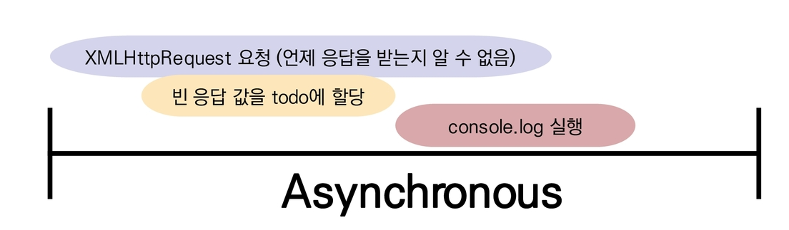
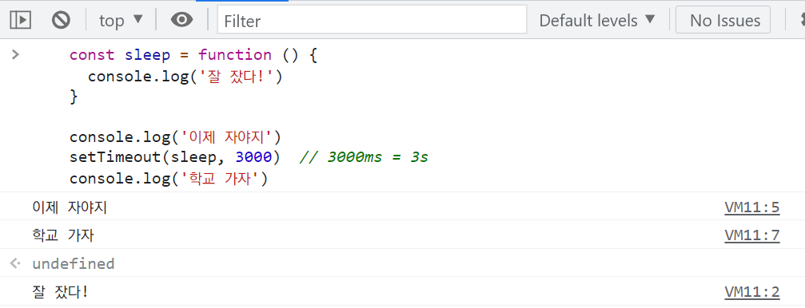

# AJAX

:::info 목차

- AJAX (Asynchronous JavaScript And XML)
- Asynchronous JavaScript
  - callback Function
  - Async callbacks
  - Promise
- Axios

:::


<br/>

## AJAX

### AJAX란

- Asynchronous JavaScript And XML (비동기식 JavaScript와 XML)
- 서버와 통신하기 위해 `XMLHttpRequest` 객체를 활용
- JSON, XML, HTML, 그리고 일반 텍스트 형식 등을 포함한 다양한 포맷을 주고 받을 수 있음


:::tip 참고

AJAX의 X가 XML을 의미하긴 하지만, 요즘은 더 가벼운 용량과 JavaScript의 일부라는 장점 때문에 JSON을 더 많이 사용함.

:::

<br/>

### 특징

- 페이지 전체를 reload(새로고침)를 하지 않고서도 수행되는 "**비동기성**"
  - 사용자의 event가 있으면 전체 페이지가 아닌 일부분만을 업데이트 할 수 있음
- AJAX의 주요 두가지 특징은 아래의 작업을 할 수 있게 해줌
  1. 페이지 새로고침 없이 서버에 요청
  2. 서버로부터 데이터를 받고 작업을 수행

<br/>

:::tip [참고] AJAX 배경

- 2005년 Google Maps & Gmail 등에 활용되는 기술을 설명하기 위해 AJAX라는 용어를 최초로 사용
- AJAX는 특정 기술이 아닌 기존의 여러 기술을 사용하는 새로운 접근법을 설명하는 용어
  - 기존 기술을 잘 활용할 수 있는 방식으로 구성 및 재조합한 새로운 접근법


- <b>Google 사용 예시</b>
  - Gmail
    - 메일 전송 요청이 모두 처리되기 전 다른 페이지로 넘어가더라도 메일은 전송 됨
  - Google Maps
    - 스크롤 행위 하나하나가 모두 요청이지만 페이지는 갱신되지 않음.

:::

<br/>

### XMLHttpRequest 객체

- 서버와 상호작용하기위해 사용되며 전체 페이지의 새로고침 없이 데이터를 받아올 수 있음
- 사용자의 작업을 방해하지 않으면서 페이지 일부를 업데이트 할 수 있음
- 주로 AJAX 프로그래밍에 사용
- 이름과 달리 XML 뿐만 아니라 모든 종류의 데이터를 받아올 수 있음
- 생성자
  - `XMLHttpRequest()`

<br/>

- 예시
  - console에 todo 데이터가 출력되지 않음
  - 데이터 응답을 기다리지 않고 `console.log()`를 먼저 실행했기 때문

```javascript
const request = new XMLHttpRequest()
const URL = 'http://jsonplaceholder.typicode.com/todos/1/'

request.open('GET', URL)
request.send()

const todo = request.response
console.log(`data: ${todo}`)
```

<br/>

## Asynchronous JavaScript


<br/>

### 동기식

- 순차적, 직렬적 Task 수행
- 요청을 보낸 후 응답을 받아야만 다음 동작이 이루어짐 (blocking)

```javascript
const btn = document.querySelector('button')

btn.addEventListener('click', function () {
  alert('You clicked me!')
  const pElem = document.createElement('p')
  pElem.innerText = 'sample text'
  document.body.appendChild(pElem)
})
```

<br/>

- 버튼 클릭 후 alert 메세지의 확인 버튼을 누를 때까지 문장이 만들어지지 않음

- 즉, alert 이후의 코드는 alert의 처리가 끝날 때까지 실행되지 않음

- 왜 이런 현상이 발생할까?

  -> **"JavaScript는 single threaded"**

<br/>

### 비동기식

- 병렬적 Task 수행
- 요청을 보낸 후 응답을 기다리지 않고 다음 동작이 이루어짐 (non-blocking)

- 요청을 보내고 응답을 기다리지 않고 다음 코드가 실행됨

```javascript
const request = new XMLHttpRequest()
const URL = 'http://jsonplaceholder.typicode.com/todos/1/'

request.open('GET', URL)
request.send()                      // XMLHttpRequest 요청 (언제 응답을 받는지 알 수 없음)

const todo = request.response       // 빈 응답 값을 todo에 할당
console.log(`data: ${todo}`)        // console.log 실행
```



- 결과적으로 변수 todo에는 응답 데이터가 할당되지 않고 빈 문자열이 출력

- 그렇다면 JS는 왜 기다려주지 않는 방식으로 동작하는가?

  -> "JavaScript는 single threaded"

<br/>

### 왜 비동기(Asynchronous)를 사용하는가?

- **"사용자 경험"**
  - 매우 큰 데이터를 동반하는 앱이 있다고 가정
  - 동기식 코드라면 데이터를 모두 불러온 뒤 앱이 실행됨
    - 즉, 데이터를 모두 불러올 때 까지는 앱이 모두 멈춘 것처럼 보임
    - 코드 실행을 차단하여 화면이 멈추고 응답하지 않는 것 같은 사용자 경험을 제공
  - 비동기식 코드라면 데이터를 요청하고 응답 받는 동안, 앱 실행을 함께 진행함
    - 데이터를 불러오는 동안 지속적으로 응답하는 화면을 보여줌으로써 더욱 쾌적한 사용자 경험을 제공
  - 때문에 많은 웹 API 기능은 현재 비동기 코드를 사용하여 실행됨

<br/>

:::tip [참고] Threads

- 프로그램이 작업을 완료하기 위해 사용할 수 있는 단일 프로세스
- 각 thread(스레드)는 한 번에 하나의 작업만 수행할 수 있음
- 예시) Task A -> Task B -> Task C
  - 다음 작업을 시작하려면 반드시 앞의 작업이 완료되어야 함
  - 컴퓨터 CPU는 여러 코어를 가지고 있기 때문에 한 번에 여러 가지 일을 처리할 수 있음

:::

<br/>

### Blocking vs Non-Blocking

- Blocking

```python
# 1. sleep

from time import sleep


def sleep_3_seconds():
    sleep(3)
    print('잘 잤다!')

print('이제 자야지')
sleep_3_seconds()
print('학교 가자')


# 2. requests

import requests

response = requests.get('https://jsonplaceholder.typicode.com/todos/1/')
todo = response.json()

print(todo)
```

<br/>

- Non-Blocking

```javascript
// 1. sleep

const sleep = function () {
  console.log('잘 잤다!')
}

console.log('이제 자야지')
setTimeout(sleep, 3000)  // 3000ms = 3s
console.log('학교 가자')

// 2. requests

const request = new XMLHttpRequest()
const URL = 'http://jsonplaceholder.typicode.com/todos/1/'

request.open('GET', URL)
request.send()                      // XMLHttpRequest 요청 (언제 응답을 받는지 알 수 없음)

const todo = request.response       // 빈 응답 값을 todo에 할당
console.log(`data: ${todo}`)        // console.log 실행
```



- JavaScript는 Blocking 되지 않음

<br/>

### "JavaScript는 single threaded 이다."

> 엄밀하게 말하면 브라우저가 single threaded

<br/>

- 컴퓨터가 여러 개의 CPU를 가지고 있어도 main thread라 불리는 단일 스레드에서만 작업 수행
- 즉, 이벤트를 처리하는 **Call Stack**이 하나인 언어라는 의미

<br/>

- 이 문제를 해결하기 위해 JavaScript는
  - 즉시 처리하지 못하는 이벤트들을 **다른 곳(Web API)**으로 보내서 처리하도록 하고,
  - 처리된 이벤트들은 처리된 순서대로 **대기실(Task queue)**에 줄을 세워 높고
  - Call Stack이 비면 **담당자(Event Loop)**가 대기줄에서 가장 오래된(제일 앞의) 이벤트를 Call Stack으로 보냄.

<br/>

### Concurrency model

- Event loop를 기반으로 하는 동시성 모델(Concurrency model)

1. **Call Stack**
   - 요청이 들어올 때마다 해당 요청을 순차적으로 처리하는 Stack(LIFO) 형태의 자료 구조
2. **WebAPI (Browser API)**
   - JavaScript 엔진이 아닌 브라우저 영역에서 제공하는 API
   - **`setTimeout()`, DOM events 그리고 AJAX로 데이터를 가져오는 시간이 소요되는 일들을 처리**
3. **TaskQueue (Event Queue, Message Queue)**
   - 비동기 처리된 callback 함수가 대기하는 Queue (FIFO) 형태의 자료 구조
   - main thread가 끝난 후 실행되어 후속 JavaScript 코드가 차단되는 것을 방지
4. **Event Loop**
   - Call Stack이 비어 있는지 확인
   - 비어 있는 경우 Task Queue에서 실행 대기 중인 callback 함수가 있는지 확인
   - Task Queue에 대기 중인 callback 함수가 있다면 가장 앞에 있는 callback 함수를 Call Stack으로 push

<br/>

### Zero delays

- 실제로 0ms 후에 callback 함수가 시작된다는 의미가 아님
- 실행은 Task Queue에 대기 중인 작업 수에 따라 다르며 해당 예시에서는 callback 함수의 메세지가 처리되기 전에 'Hi'와 'Bye'가 먼저 출력됨
- 왜냐하면 delay(지연)는 JavaScript가 요청을 처리하는 데 필요한 최소 시간이기 때문 (보장된 시간이 아님)
- 기본적으로 `setTimeout` 함수에 특정 시간제한을 설정했더라도 대기 중인 메세지의 모든 코드가 완료될 때까지 대기해야 함.

<br/>

### 순차적인 비동기 처리하기

- Web API로 들어오는 순서는 중요하지 않고, 어떤 이벤트가 **먼저** 처리되느냐가 중요 (즉, 실행 순서 불명확)
- 이를 해결하기 위해 순차적인 비동기 처리를 위한 2가지 작성 방식

1. **Async callbacks**
   - 백그라운드에서 실행을 시작할 함수를 호출할 때 인자로 지정된 함수
   - 예시) `addEventListener()`의 두 번째 인자
2. **promise-style**
   - Modern Web APIs에서의 새로운 코드 스타일
   - XMLHttpRequest 객체를 사용하는 구조보다 조금 더 현대적인 버전

<br/>

## Callback Fuction

### Callback function

- 다른 함수에 인자로 전달된 함수
- 외부 함수 내에서 호출되어 일종의 루틴 또는 작업을 완료함
- 동기식, 비동기식 모두 사용됨
  - 그러나 비동기 작업이 완료된 후 코드 실행을 계속하는 데 주로 사용됨
- 비동기 작업이 완료된 후 코드 실행을 계속하는 데 사용되는 경우를 비동기 콜백(asynchronous callback)이라고 함

<br/>

### JavaScript 함수는 "일급 객체 (First Class Object)다."

- **일급 객체 (일급 함수)**
  - 다른 객체들에 적용할 수 있는 연산을 모두 지원하는 객체 (함수)
- **일급 객체의 조건**
  - 인자로 넘길 수 있어야 함
  - 함수의 반환 값으로 사용할 수 있어야 함
  - 변수에 할당할 수 있어야 함.

<br/>

### Callback function 사용 예시 (JavaScript, Python, Django)

```python
# Python

# 1. Pass function to argument
def my_func(func):
    return func

def my_argument_func():
    return 'Hello My func!'

result = my_func(my_argument_func)
print(result())


# 2. map
numbers = [0, 9, 99]

def plus_one(number):
    return number + 1

print(list(map(plus_one, numbers)))
```

```python
# Django

from django.urls import path
from . import views

urlpatterns = [
    path('', vews.index),
]
```

```javascript
// 1. My Custom Callback Function
const myFunc = function (func) {
  return func
}

const myArgumentfunc = function () {
  return 'Hello'
}

const result = myFunc(myArgumentfunc)
console.log(result())


// 2. map
const nums = [1, 2, 3]
const doubleNums = nums.map(function (num) {
  return num * 2
})

console.log(doubleNums)


// 3. Array Helper Method 
const numbers = [1, 2, 3]
const newNumbers = []

numbers.forEach(num => {
  newNumbers.push(num + 1)
})

console.log(newNumbers)


// 4. setTimeout
const helloWorld = function () {
  console.log('happy coding!')
}
setTimeout(helloWorld, 3000)
console.log('unhappy coding!')


// 5. addEventListener
const myButton = document.querySelector('button')

myButton.addEventListener('click', function () {
  console.log('button clicked!')
})
```

<br/>

### Async callbacks

- 백그라운드에서 코드 실행을 시작할 함수를 호출할 때 인자로 지정된 함수
- 백그라운드 코드 실행이 끝나면 callback 함수를 호출하여 작업이 완료되었음을 알리거나, 다음 작업을 실행하게 할 수 있음
  - 사용 예시) `addEventListener()`의  두 번째 매개변수
- callback 함수를 다른 함수의 인자로 전달할 때 함수의 참조를 인수로 전달할 뿐이지 즉시 실행되지 않고, 함수의 body에서 "called back"됨.
- 정의된 함수는 때가 되면 callback 함수를 실행하는 역할을 함

<br/>

### Why use callback?

- callback 함수는 명시적인 호출이 아닌 특정 루틴 혹은 action에 의해 호출되는 함수
- Django의 경우 "요청이 들어오면", event의 경우 "특정 이벤트가 발생하면"이라는 조건으로 함수를 호출할 수 있었던 건 'Callback function'개념 떄문에 가능
- 비동기 로직을 수행할 때 callback 함수는 필수
  - 명시적인 호출이 아니라 다른 함수의 매개변수로 전달하여 해당 함수 내에서 특정 시점에 호출

<br/>

### callback Hell

- 순차적인 연쇄 비동기 작업을 처리하기 위해 "callback 함수를 호출하고, 그 다음 callback 함수를 호출하고, 또 그 함수의 callback 함수를 호출하고..."의 패턴이 지속적으로 반복됨
- 즉, 여러 개의 연쇄 비동기 작업을 할 때 마주하는 상황
- 이를 callback Hell(콜백 지옥) 혹은 pyramid of doom(파멸의 피라미드)이라 함
- 위와 같은 상황이 벌어질 경우 아래 사항들을 통제하기 어려움
  - 디버깅
  - 코드 가독성

<br/>

### callback Hell 해결하기

1. Keey your code shallow (코드의 깊이를 얕게 유지)
2. Modularize (모듈화)
3. Handle every single error (모든 단일 오류 처리)
4. **Promise callbacks (Promise 콜백 방식 사용)**

<br/>

## Promise

### Promise object

- 비동기 작업의 최종 완료 또는 실패를 나타내는 객체
  - 미래의 완료 또는 실패와 그 결과 값을 나타냄
  - 미래의 어떤 상황에 대한 약속

- 성공(이행)에 대한 약속
  - `.then()`
- 실패(거절)에 대한 약속
  - `.catch()`

```javascript
const myPromise = axios.get(URL)
// console.log(myPromise) // Promise Object

myPromise
  .then(response => {
    return response.data
})

// Chaining
axios.get(URL)
  .then(response => {
    return response.data
  })
  .then(response => {
    return response.title
  })
  .catch(error => {
    console.log(error)  // 실패에 대한 약속
  })
  .finally(function () {
    console.log('나는 마지막에 시행!')
  })
```

<br/>

###  Promise methods

- `.then(callback)`
  - 이전 작업(promise)이 성공했을 때 (이행했을 때) 수행할 작업을 나타내는 callback 함수
  - 그리고 각 callback 함수는 이전 작업의 성공 결과를 인자로 전달받음
  - 따라서 성공했을 때의 코드를 callback 함수 안에 작성
- `.catch(callback)`
  - `.then`이 하나라도 실패하면(거부 되면) 동작 (동기식의 'try - except' 구문과 유사)
  - 이전 작업의 실패로 인해 생성된 error 객체는 catch 블록 안에서 사용할 수 있음

<br/>

- 각각의 `.then()`블록은 서로 다른 promise를 반환
  - 즉, `.then()`을 여러 개 사용(chaining)하여 연쇄적인 작업을 수행할 수 있음
  - 결국 여러 비동기 작업을 차례대로 수행할 수 있다는 뜻
- `.then()`과 `.catch()` 메서드는 모두 promise를 반환하기 때문에 chaining 가능

:::warning 주의

- <b>반환 값이 반드시 있어야 함</b>
- 없다면 callback 함수가 이전의 promise 결과를 받을 수 없음.

:::

<br/>

- `.finally(callback)`
  - Promise 객체를 반환
  - 결과와 상관없이 무조건 지정된 callback 함수가 실행
  - 어떠한 인자도 전달받지 않음
    - Promise가 성공되었는지 거절되었는지 판단할 수 없기 때문
  - 무조건 실행되어야 하는 절에서 활용
    - `.then()`과 `.catch()` 블록에서의 코드 중복을 방지

<br/>

### callback Hell -> Promise

```javascript
work1(function(result1) {
  work2(result1, function(result2) {
    work3(result2, function(result3) {
      console.log('최종 결과: ' + result3)
    })
  })
})
```

```javascript
work1().then(function(result1) {
    return work2(result1)
})
.then(function(result2) {
    return work3(result2)
})
.then(function(result3) {
    console.log('최종 결과: ' + result3)
})
.catch(failureCallback)
```

<br/>

### Promise가 보장하는 것

- Async callback 작성 스타일과 달리 Promise가 보장하는 특징

1. callback 함수는 JavaScript의 Evnet Loop가 현재 실행 중인 Call Stack을 완료하기 이전에는 절대 호출되지 않음
   - Promise callback 함수는 Event Queue에 배치되는 엄격한 순서로 호출됨
2. 비동기 작업이 성공하거나 실패한 뒤에 `.then()` 메서드를 이용하여 추가한 경우에도 1번과 똑같이 동작
3. `.then()`을 여러 번 사용하여 여러 개의 callback 함수를 추가할 수 있음 (Chaining)
   - 각각의 callback은 주어진 순서대로 하나 하나 실행하게 됨
   - Chaining은 Promise의 가장 뛰어난 장점

<br/>

## Axios

### Axios

- "Promise based HTTP client for the browser and Node.js"
- 브라우저를 위한 Promise 기반의 클라이언트
- 원래는 "XHR"이라는 브라우저 내장 객체를 활용해 AJAX 요청을 처리하는데, 이보다 편리한 AJAX 요청이 가능하도록 도움을 줌
  - 확장 가능한 인터페이스와 함께 패키지로 사용이 간편한 라이브러리를 제공

```javascript
axios.get('https://jsonplaceholder.typicode.com/todos/1/') // Promise return
  .then(..)
  .catch(..)
```

<br/>

### XMLHttpRequest -> Axios 변경

```javascript
const request = new XMLHttpRequest()
const URL = 'http://jsonplaceholder.typicode.com/todos/1/'

request.open('GET', URL)
request.send()

const todo = request.response
console.log(`data: ${todo}`)
```

```javascript
const URL = 'http://jsonplaceholder.typicode.com/todos/1/'

axios.get(URL)
  .then(response => {
    console.log(response.data)
})
```

```javascript
const URL = 'http://jsonplaceholder.typicode.com/todos/1/'

axios.get(URL)
  .then(response => {
    return response.data
  })
  .then(response => {
    return response.title
  })
  .catch(error => {
    console.log(error)  // 실패에 대한 약속
  })
  .finally(function () {
    console.log('나는 마지막에 시행!')
  })
```

<br/>

## [부록] async & await

- 비동기 코드를 작성하는 새로운 방법
  - ECMAScript 2017 (ES8)에서 등장
- 기존 Promise 시스템 위에 구축된 syntactic sugar
  - Promise 구조의 then chaning을 제거
  - 비동기 코드를 조금 더 동기 코드처럼 표현
  - **Syntactic sugar**
    - 더 쉽게 읽고 표현할 수 있도록 설계된 프로그래밍 언어 내의 구문
    - 즉, 문법적 기능은 그대로 유지하되 사용자가 직관적으로 코드를 읽을 수 있게 만듦

<br/>

### Promise -> async & await 적용

```javascript
const breedList = 'https://dog.ceo/api/breeds/list/all'

axios.get(breedList)
  .then(res => {
    return Object.keys(res.data.message)[0]
  })
  .then(breed => {
    return axios.get(`https://dog.ceo/api/breeds/${breed}/images`)
  })
  .then(res => {
    console.log(res)
  })
  .catch(err => {
    console.log(err)
  })
```

```javascript
async function fetchDogImgae(URL) {
  const res = await axios.get(URL)
  const breed = Object.keys(res.data.message)[0]
  const dogImgaes = await axios.get(`https://dog.ceo/api/breeds/${breed}/images`)
  console.log(dogImages)
}

URL = 'https://dog.ceo/api/breeds/list/all'

fetchDogImage(URL)
.catch(err => {
  console.log(err)
})
```

<br/>

## 마무리

- AJAX (Asynchronous JavaScript And XML)
- Asynchronous JavaScript
  - callback Function
  - Async callbacks
  - Promise
- Axios


```python
# accounts/views.py

from django.http.response import JsonResponse

@require_POST
def follow(request, user_pk):
    if request.user.is_authenticated:
        # 팔로우 받는 사람
        you = get_object_or_404(get_user_model(), pk=user_pk)
        me = request.user

        # 나 자신은 팔로우 할 수 없다.
        if you != me:
            if you.followers.filter(pk=me.pk).exists():
            # if request.user in person.followers.all():
                # 팔로우 끊음
                you.followers.remove(me)
                is_follow = False
            else:
                # 팔로우 신청
                you.followers.add(me)
                is_follow = True
            followers_count = you.followers.count()
        return JsonResponse({
            'success': True,
            'isFollow': is_follow,
            'followersCount': followers_count,
        })
    return redirect('accounts:login')
```

```javascript
// accounts/profile.html

    const followBtn = document.querySelector('#followBtn')
    const followersCount = document.querySelector('#followersCount')
    followBtn.addEventListener('click', function (event) {
      const URI = 'http://127.0.0.1:8000/accounts/{{ person.pk }}/follow/'

      const reqConfig = {
        headers: {
          'X-CSRFToken': Cookies.get('csrftoken')
        }
      }

      axios.post(URI, {}, reqConfig)
        .then(res => {followersCount.innerText = res.data.followersCount
          if (res.data.isFollow) {
            // 현재 팔로우중. 언팔 버튼으로 만들어야 함
            event.target.innerText = '언팔로우'
            event.target.classList ='btn btn-danger'
          } else {
            // 현재 팔로우 상태 아님. 팔로우 버튼으로 만들어야 함
            event.target.innerText = '팔로우'
            event.target.classList = 'btn btn-primary'
            }
        })
        .catch(err => console.error(err))
    })
```

