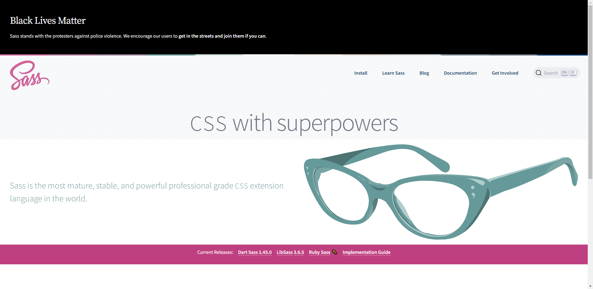

# SCSS

## 개요

- CSS Preprocessing
- https://sass-lang.com/



<br/>


```css
/* css */

body {
  font: 100% Helvetica, sans-serif;
  color: #333;
}
```

```scss
/* scss */

$font-stack: Helvetica, sans-serif;
$primary-color: #333;

body {
  font: 100% $font-stack;
  color: $primary-color;
}
```


<br/>


```css
/* css */

nav ul {
  margin: 0;
  padding: 0;
  list-style: none;
}
nav li {
  display: inline-block;
}
nav a {
  display: block;
  padding: 6px 12px;
  text-decoration: none;
}
```

```scss
/* scss */

nav {
  ul {
    margin: 0;
    padding: 0;
    list-style: none;
  }

  li { display: inline-block; }

  a {
    display: block;
    padding: 6px 12px;
    text-decoration: none;
  }
}
```


