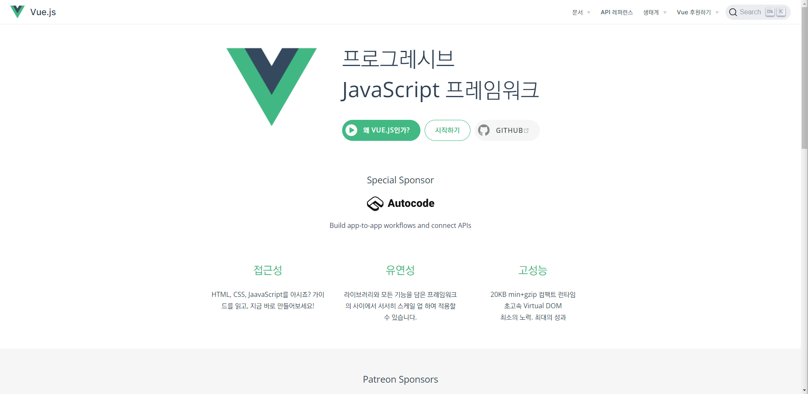
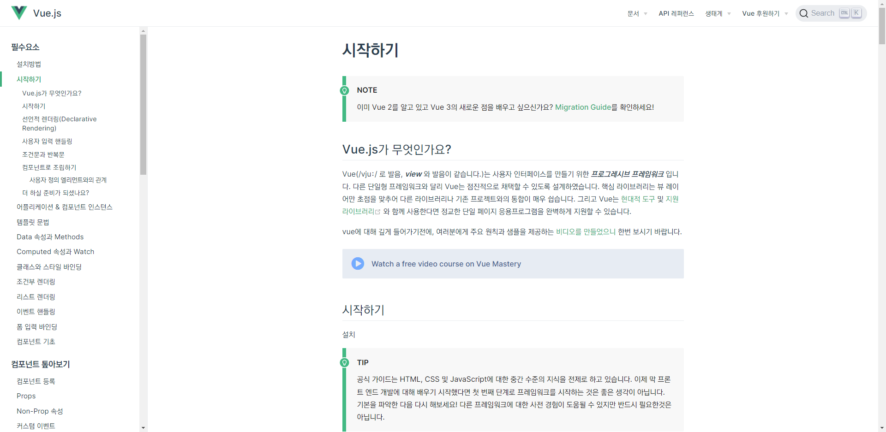

# Vue 시작하기






https://github.com/vuejs/vue-next/releases


<br/>


## CDN, Codepen

```html
<script src="https://unpkg.com/vue@next"></script>
```

<iframe height="300" width="100%" scrolling="no" title="Untitled" src="https://codepen.io/devpla/embed/VwMPQya?default-tab=html%2Cresult" frameborder="no" loading="lazy" allowtransparency="true" allowfullscreen="true">
  See the Pen <a href="https://codepen.io/devpla/pen/VwMPQya">
  Untitled</a> by YeonHee (<a href="https://codepen.io/devpla">@devpla</a>)
  on <a href="https://codepen.io">CodePen</a>.
</iframe>
