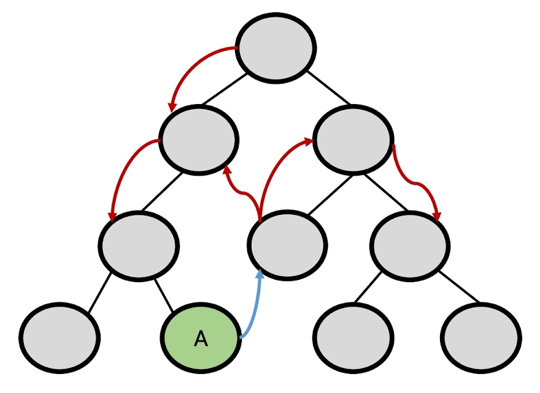
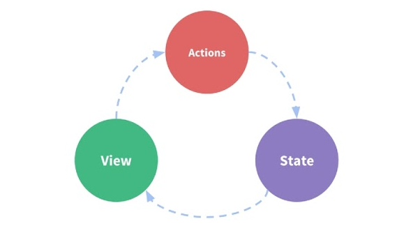
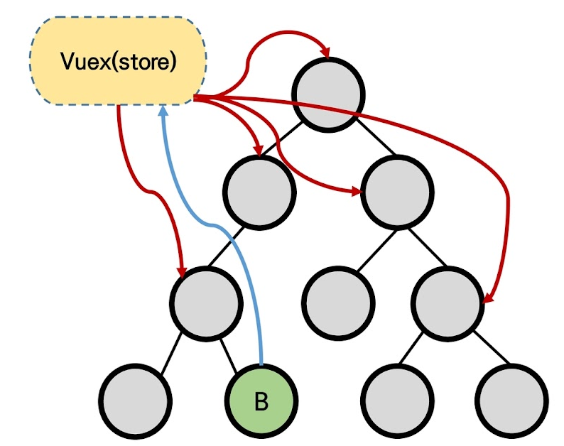
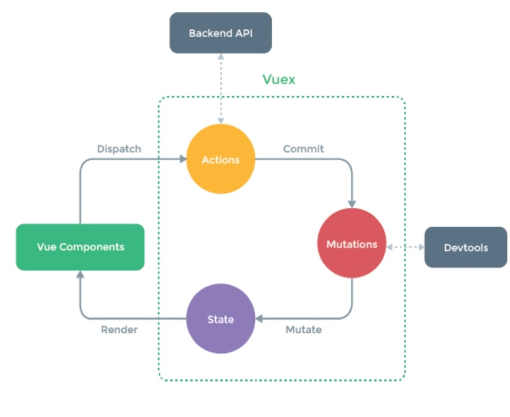
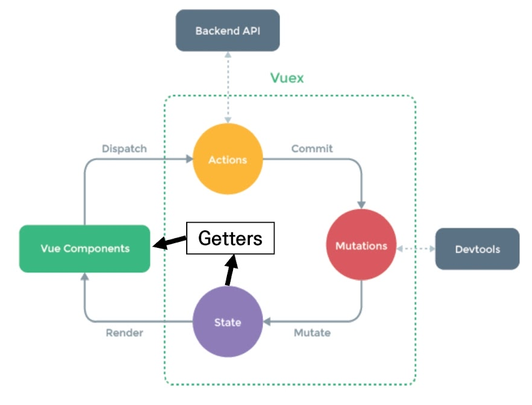
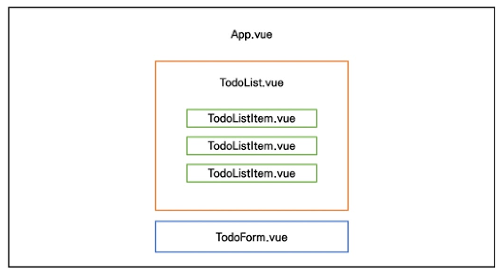
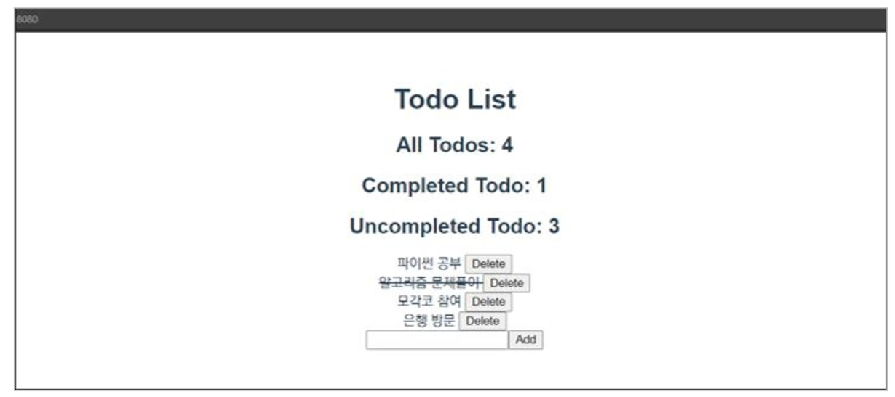
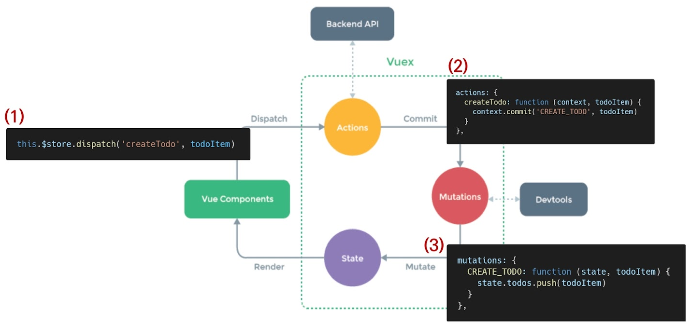

# Vuex

:::info 목차

- Vuex
- Vuex Core Concepts
- Todo app with Vuex

:::

<br/>

## Intro

- "Statement management pattern + Library" for vue.js
  - 상태 관리 패턴 + 라이브러리
- 상태(state)를 전역 저장소로 관리할 수 있도록 지원하는 라이브러리
  - 상태가 예측 가능한 방식으로만 변경될 수 있도록 보장하는 규칙 설정
  - 애플리케이션의 모든 컴포넌트에 대한 **중앙 집중식 저장소** 역할
- Vue의 공식 devtools와 통합되어 기타 고급 기능을 제공

<br/>

### State

- state는 곧 data이며 해당 애플리케이션의 핵심이 되는 요소
- 중앙에서 관리하는 모든 상태 정보
- 다음 챕터에서 상세히 다룰 예정

<br/>

### 상태 관리 패턴

- 컴포넌트의 공유된 상태를 추출하고 이를 전역에서 관리 하도록 함
- 컴포넌트는 커다란 view가 되며 모든 컴포넌트는 트리에 상관없이 상태에 액세스 하거나 동작을 트리거 할 수 있음
- 상태 관리 및 특정 규칙 적용과 관련된 개념을 정의하고 분리함으로써 코드의 구조와 유지 관리 기능 향상

<br/>

:::tip [참고] 트리거

- 특정한 동작에 반응해 자동으로 필요한 동작을 실행하는 것

:::

<br/>

### 기존 Pass props & Emit event

- 각 컴포넌트는 독립적으로 데이터를 관리
- 데이터는 단방향 흐름으로 부모 → 자식 간의 전달만 가능하며 반대의 경우 이벤트를 트리거
- **장점** : 데이터의 흐름을 직관적으로 파악 가능
- **단점** : 컴포넌트 중첩이 깊어지는 경우 동위 관계의 컴포넌트로의 데이터 전달이 불편해짐

<br/>



<br/>

- 공통의 상태를 공유하는 여러 컴포넌트가 있는 경우 데이터 전달 구조가 매우 복잡해짐
- 예를 들면, 지나치게 중첩된 컴포넌트를 통과하는 prop

<br/>

- **단방향 데이터 흐름**
  - state는 앱을 작동하는 원본 소스 (data)
  - view는 state 의 선언적 매핑
  - action은 view에서 사용자 입력에 대해 반응적으로 state를 바꾸는 방법 (methods)



<br/>

### Vuex management pattern

- 중앙 저장소(store)에 state를 모아놓고 관리
- 규모가 큰 (컴포넌트 중첩이 깊은) 프로젝트에서 매우 효율적
- 각 컴포넌트에서는 중앙 집중 저장소의 state만 신경 쓰면 됨
  - 동일한 state를 공유하는 다른 컴포넌트들도 동기화 됨

<br/>



<br/>

### 비교

#### 단방향 흐름에 의존한 state(상태) 관리

1. 부모 자식 간의 컴포넌트 관계가 단순하거나 depth가 깊지 않은 경우에는 문제가 없음
  - 몇 단계만 거치면 데이터를 쉽게 이동 시킬 수 있으며 훨씬 직관적으로 데이터 흐름을 파악할 수 있음
2. 하지만 규모가 커졌을 경우의 상태 관리가 어려워짐
  - 상태를 공유하는 컴포넌트의 상태 동기화 관리가 어려움
  - 상태를 전달할 때 상 → 하로만 가능
3. 3.A 컴포넌트의 상태를 공유하는 다른 컴포넌트에 pass props & emit event 를 통해 동기화해야 함

<br/>

#### Vuex를 활용한 state(상태) 관리
1. 상태의 변화에 따른 여러 흐름을 모두 관리해야 하는 불편함을 해소 할 필요가 있음
   - 상태는 데이터를 주고 받는 컴포넌트 사이의 관계도 충분히 고려해야 하기 때문에 상태 흐름 관리가 매우 중요해짐
2. 결국 이러한 상태를 '올바르게 관리하는 저장소'의 필요성을 느끼게 됨
  - 상태를 한 곳(store)에 모두 모아 놓고 관리하자
  - 상태의 변화는 모든 컴포넌트에서 공유
  - 상태의 변화는 오로지 Vuex가 관리하여 해당 상태를 공유하고 있는 모든 컴포넌트는 변화에 '반응’
3. A 컴포넌트와 같은 상태를 공유하는 다른 컴포넌트는 신경 쓰지 않고, 오로지 상태의 변화를 Vuex에 알림

<br/>

## Vuex Core Concepts

### Vuex 핵심 컨셉

1. State
2. Mutations
3. Actions
4. Getters

<br/>



<br/>

### 1. State

- “중앙에서 관리하는 모든 상태 정보 (data)"
  - Vuex는 single state tree를 사용
  - 즉, 이 단일 객체는 모든 애플리케이션 상태를 포함하는 "원본 소스(single source of truth)”의 역할을 함
  - 이는 각 애플리케이션마다 하나의 저장소만 갖게 된다는 것을 의미함
- https://vuex.vuejs.org/guide/state.html#state

<br/>

- 여러 컴포넌트 내부에 있는 특정 state를 중앙에서 관리하게 됨
  - 이전의 방식은 state를 찾기 위해 각 컴포넌트를 직접 확인해야 했음
  - Vuex를 활용하는 방식은 Vuex Store에서 각 컴포넌트에서 사용하는 state를 한 눈에 파악 가능
- State가 변화하면 해당 state를 공유하는 여러 컴포넌트의 DOM은 (알아서) 렌더링
- 각 컴포넌트는 이제 Vuex Store에서 state 정보를 가져와 사용

<br/>

### 2. Mutations

- “실제로 state를 변경하는 유일한 방법”

- mutation의 handler(핸들러 함수)는 반드시 동기적이어야 함
  - 비동기적 로직 (ex. 콜백함수)은 state가 변화하는 시점이 의도한 것과 달라질 수 있으며, 콜백이 실제로 호출 될 시기를 알 수 있는 방법이 없음 (추적 할 수 없음)
- 첫번째 인자로 항상 `state`를 받음
- Actions에서 `commit()` 메서드에 의해 호출됨
- https://vuex.vuejs.org/guide/mutations.html

<br/>

### 3. Actions
- Mutations와 유사하지만 다음과 같은 차이점이 있음
  1. state를 변경하는 대신 mutations를 `commit()`메서드로 호출해서 실행
  2. mutations와 달리 비동기 작업이 포함될 수 있음 (Backend API와 통신하여 Data Fetching 등의 작업 수행)
- context 객체 인자를 받음
  - context 객체를 통해 store.js 파일 내에 있는 모든 요소의 속성 접근 & 메서드 호출이 가능
  - 단, (가능하지만) state를 직접 변경하지 않음
- 컴포넌트에서 `dispatch()`메서드에 의해 호출됨
- https://vuex.vuejs.org/guide/actions.html

<br/>

- “Actions를 통해 state를 조작 할 수 있지만, state는 오로지 Mutations를 통해서만 조작 해야함"
  - 명확한 역할 분담을 통해 서비스 규모가 커져도 state를 올바르게 관리하기 위함

<br/>

### 4. Getters
- `state`를 변경하지 않고 활용하여 계산을 수행 (`computed` 속성과 유사)
  - 실제 계산된 값을 사용하는 것처럼 getters는 저장소의 상태(state)를 기준으로 계산
  - 예를 들어, state에 todoList라는 해야 할 일의 목록의 경우 완료된 todo 목록만을 필터링해서 출력해야 하는 경우가 있음
  - 이때 getters에 completed(완료 여부 변수)의 값이 true인 요소를 필터링 해서 계산된 값을 담아 놓을 수 있음
- https://vuex.vuejs.org/guide/getters.html

<br/>

- computed 속성과 마찬가지로 getters의 결과는 state 종속성에 따라 캐시(cached)되고, 종속성이 변경된 경우에만 다시 재계산 됨
- getters 자체가 state를 변경하지는 않음
  - `state`를 특정한 조건에 따라 구분(계산)만 함
  - 즉, 계산된 값을 가져옴

<br/>

### Vuex Core Concepts 정리
- **State**

  - 중앙에서 관리하는 모든 상태 정보 (data)
  - Mutations에 의해 변경됨

- **Mutations**

  - state를 변경하는 유일한 방법
  - 반드시 동기적 로직이어야 함
  - 첫번째 인자로 항상 state를 받고, Actions의 `commit()`에 의해 호출됨

- **Actions**

  - Mutations를 `commit()`으로 호출
  - 비동기 로직 작성 가능
  - 항상 context 객체를 받기 때문에 모든 속성에 접근 할 수 있으나 state를 변경해서는 안됨
  - 컴포넌트에서 dispatch()에의해 호출됨

- **Getters**

  - store의 상태를 기반하는 계산 값

  - 실제 상태를 변경하지 않음

  - computed 속성과 유사



<br/>

## Vuex Todo App

1. Set project & components
2. Create Todo
3. Delete Todo
4. Update Todo
5. Getters
6. Vuex component binding helper
7. Local storage

<br/>

### Vuex Todo App 소개

- 컴포넌트 구성



- 결과 예시



<br/>

### Set project & Components

#### Init project

1. Create Project

```bash
$ vue create todo-vuex-app
$ cd todo-vuex-app
```

<br/>

2. Add Vuex plugin in Vue CLI

```bash
$ vue add vuex
```

3. commit 여부 (Yes)

```bash
WARN  There are uncommitted changes in the current repository, it's recommended to commit or stash them first.
? Still proceed? Yes
```

<br/>

#### Vuex로 인한 변화

1. store 디렉토리 생성
2. index.js 생성

<br/>

- `index.js` : Vuex core concepts가 작성되는 곳

```js
// index.js

import Vue from 'vue'
import Vuex from 'vuex'

Vue.use(Vuex)

export default new Vuex.Store({
  state: {
  },
  mutations: {
  },
  actions: {
  },
  modules: {
  }
})
```

<br/>

#### 컴포넌트 작성

- `TodoListItem.vue`
  - 개별 `todo` 컴포넌트
  - TodoList 컴포넌트의 자식 컴포넌트

```html
<!-- components/TodoListItem.vue -->

<template>
  <div>Todo</div>
</template>

<script>
export default {
  name: "TodoListItem",
};
</script>

<style></style>
```

<br/>

- `TodoList.vue`
  - todo 목록 컴포넌트
  - TodoListItem 컴포넌트의 부모 컴포넌트

```html
<!-- components/TodoList.vue -->

<template>
  <div>
    <todo-list-item></todo-list-item>
  </div>
</template>

<script>
import TodoListItem from '@/components/TodoListItem'

export default {
  name: 'TodoList',
  components: {
    TodoListItem,
  }
}
</script>
```

<br/>

- `TodoForm.vue`
  - todo 데이터를 입력 받는 컴포넌트

```html
<!-- components/TodoForm -->

<template>
  <div>Todo Form</div>
</template>

<script>
export default {
  name: 'TodoForm',
}
</script>
```

<br/>

- `App.vue`
  - 최상위 컴포넌트
  - `TodoList`, `TodoForm` 컴포넌트의 부모 컴포넌트

```html
<!-- App.vue -->

<template>
  <div id="app">
    <h1>TodoList</h1>
    <todo-list></todo-list>
    <todo-form></todo-form>
  </div>
</template>

<script>
import TodoList from "@/components/TodoList";
import TodoForm from "@/components/TodoForm";

export default {
  name: "App",
  components: {
    TodoList,
    TodoForm,
  },
};
</script>
```

<br/>

### Create Todo

#### State 작성

- state에 2개의 todo 작성

```js
// index.js

import Vue from "vue";
import Vuex from "vuex";

Vue.use(Vuex);

export default new Vuex.Store({
  state: {
    todos: [
      {
        title: "할 일1",
        isCompleted: false,
        date: new Date().getTime(),
      },
      {
        title: "할 일2",
        isCompleted: false,
        date: new Date().getTime(),
      },
    ],
  },
  mutations: {},
  actions: {},
  modules: {},
});
```

<br/>

:::warning 주의

- Vuex를 사용한다고 해서 Vuex Store에 모든 상태를 넣어야 하는 것은 아님

:::

<br/>

#### TodoList 데이터 가져오기

- 컴포넌트에서 Vuex Store state에 접근
  - `$store.state`

```html
<!-- components/TodoList.vue -->

<template>
  <div>
    <todo-list-item v-for="todo in $store.state.todos" :key="todo.date"></todo-list-item>
  </div>
</template>
```

<br/>

#### Computed로 변경

- 현재 state의 todo는 값이 변화하는 것은 아님
- store에 저장된 todo 목록을 가져오는 것이기 때문에 매번 새로 호출하는 것은 비효율적
- 대신 todo가 추가 되는 등의 변경 사항이 있을 때만 새로 계산한 값을 반환하는 방향으로 변경 (`computed`)
- `this`를 사용해 (Vue Instance) 접근

```html
<!-- components/TodoList.vue -->

<template>
  <div>
    <todo-list-item v-for="todo in $store.state.todos" :key="todo.date"> </todo-list-item>
  </div>
</template>

<script>
import TodoListItem from "@/components/TodoListItem";

export default {
  name: "TodoList",
  components: {
    TodoListItem,
  },
  computed: {
    todos: function () {
      return this.$store.state.todos;
    },
  },
};
</script>
```

<br/>

#### Pass Props (TodoList -> Todo)

```html
<!-- components/TodoList.vue -->

<template>
  <div>
    <todo-list-item v-for="todo in $store.state.todos" :key="todo.date" :todo="todo"> </todo-list-item>
  </div>
</template>
```

```html
<!-- components/TodoListItem.vue -->

<template>
  <div>
    {{ todo.title }}
  </div>
</template>

<script>
export default {
  name: "TodoListItem",
  props: {
    todo: {
      type: Object,
    },
  },
};
</script>
```

<br/>

#### Actions & Mutations

- `createTodo` 메서드를 통해 `createTodo Action` 함수 호출 (`dispatch()`)

```html
<!-- components/TodoForm -->

<template>
  <div>
    <input type="text" v-model.trim="todoTitle" @keyup.enter="createTodo" />
    <button @click="createTodo">Add</button>
  </div>
</template>

<script>
export default {
  name: "TodoForm",
  data: function () {
    return {
      todoTitle: null,
    };
  },
  methods: {
    createTodo: function () {
      const todoItem = {
        title: this.todoTitle,
        isCompleted: false,
        date: new Date().getTime(),
      };
      if (todoItem.title) {
        this.$store.dispatch("createTodo", todoItem);
      }
      this.todoTitle = null;
    },
  },
};
</script>
```

<br/>

- `Actions`
  - `createTodo` 함수
  - `CREATE_TODO` `mutation` 함수 호출
- `Mutations`
  - `CREATE_TODO` 함수
  - `State`의 `todo` 데이터 조작

```js
// index.js

import Vue from "vue";
import Vuex from "vuex";

Vue.use(Vuex);

export default new Vuex.Store({
  state: {
    todos: [],
  },
  mutations: {
    CREATE_TODO: function (state, todoItem) {
      state.todos.push(todoItem);
    },
  },
  actions: {
    createTodo: function (context, todoItem) {
      context.commit("CREATE_TODO", todoItem);
    },
  },
  modules: {},
});
```

<br/>

#### Actions의 "context" 객체

- Vuex store의 전반적인 맥락 속성을 모두 포함하고 있음
- 그래서 `context.commit`을 호출하여 `mutation`을 호출하거나, `context.state context.getters`를 통해 state와 getters에 접근할 수 있음
  - `dispatch( )`로 다른 `actions`도 호출 가능
- **“할 수 있지만 actions에서 state를 조작하지 말 것”**

```js
actions: {
  createTodo: function (context, todoItem) {
    console.log(context);
    console.log(context.state);
    console.log(context.getters);
    context.commit("CREATE_TODO", todoItem);
  },
},
```

<br/>

#### Vuex 상태 관리 흐름



<br/>

#### Mutations handler name
- Mutations 함수(핸들러 함수)의 이름은 상수로 작성하는 것을 권장
- linter와 같은 tool에서 디버깅하기에 유용하며, 전체 애플리케이션에서 어떤 것이 mutation인지 한눈에 파악할 수 있음
- https://vuex.vuejs.org/guide/mutations.html#using-constants-for-mutation-types

<br/>

#### Javascript Destructuring assignment

- 배열의 값이나 객체의 속성을 고유한 변수로 압축 해제(unpack)할 수 있는 JavaScript 표현식
- https://developer.mozilla.org/en-US/docs/Web/JavaScript/Reference/Operators/Destructuring_assignment#object_destructuring

```js
const context = {
  commit: function () {
    console.log("안녕하세요 commit!");
  },
  state: {
    todo: "할 일 1",
  },
  getters: {},
  mutations: {},
};

// 1. 하나 하나 할당
const commit = context.commit;
const state = context.state;

console.log(commit()); // 안녕하세요 commit!
console.log(state); // { todo: '할 일 1' }

// Destructuring assignment
// 2. 이름으로 가져온다.
// 2.1 순서가 필요없고,
const { state, commit } = context;
console.log(commit()); // 안녕하세요 commit!
console.log(state);

// 2.2 한 개만 가져와도 상관없다.
const { commit } = context;
console.log(commit());
```

<br/>

- actions 변경

```js
// index.js

import Vue from "vue";
import Vuex from "vuex";

Vue.use(Vuex);

export default new Vuex.Store({
  ...,
  actions: {
    // 변경 전 : function (context, todoItem)
    createTodo: function ({ commit }, todoItem) {
      // 변경 전 : context.commit("CREATE_TODO, todoItem")
      commit("CREATE_TODO", todoItem);
    },
  },
  modules: {},
});
```

<br/>

### Delete Todo

#### TodoListItem 컴포넌트

- `deleteTodo` action 함수 호출

```html
<!-- components/TodoListItem.vue -->

<template>
  <div>
    <span>{{ todo.title }} </span>
    <button @click="deleteTodo">Delete</button>
  </div>
</template>

<script>
export default {
  name: "TodoListItem",
  props: {
    todo: {
      type: Object,
    },
  },
  methods: {
    deleteTodo: function () {
      this.$store.dispatch("deleteTodo", this.todo);
    },
  },
};
</script>
```

<br/>

#### Actions & Mutations

```js
// index.js

import Vue from "vue";
import Vuex from "vuex";

Vue.use(Vuex);

export default new Vuex.Store({
  state: {
    todos: [],
  },
  mutations: {
    CREATE_TODO: function (state, todoItem) {
      state.todos.push(todoItem);
    },
    DELETE_TODO: function (state, todoItem) {
      // 1. todoItem이 첫 번째로 만나는 요소의 index를 가져옴
      const index = state.todos.indexOf(todoItem);

      // 2. 해당 index 1개만 삭제하고 나머지 요소를 토대로 새로운 배열 생성
      state.todos.splice(index, 1);
    },
  },
  actions: {
    createTodo: function ({ commit }, todoItem) {
      commit("CREATE_TODO", todoItem);
    },
    deleteTodo: function ({ commit }, todoItem) {
      commit("DELETE_TODO", todoItem);
    },
  },
  modules: {},
});
```

<br/>

### Update Todo

#### TodoListItem 컴포넌트

- `updateTodoStatus` action 함수 호출

```html
<!-- components/TodoListItem.vue -->

<template>
  <div>
    <span @click="updateTodoStatus">{{ todo.title }} </span>
    <button @click="deleteTodo">Delete</button>
  </div>
</template>

<script>
export default {
  name: "TodoListItem",
  ,...,
  methods: {
    ...
    updateTodoStatus: function () {
      this.$store.dispatch("updateTodoStatue", this.todo);
    },
  },
};
</script>
```

```js
// index.js

export default new Vuex.Store({
  state: {
    todos: [],
  },
  mutations: {
    ...,
    UPDATE_TODO_STATUS: function (state, todoItem) {
      state.todos = state.todos.map((todo) => {
        if (todo === todoItem) {
          return {
            title: todoItem.title,
            isCompleted: !todo.isCompleted,
          };
        } else {
          return todo;
        }
      });
    },
  },
  actions: {
    ...,
    updateTodoStatus: function ({ commit }, todoItem) {
      commit("UPDATE_TODO_STATUS", todoItem);
    },
  },
  modules: {},
});
```

<br/>

#### Javascript Spread Syntax

- “전개 구문”
- 배열이나 문자열과 같이 반복 가능한(iterable) 문자를 요소(배열 리터럴의 경우)로 확장하여, 0개 이상의 key-value의 쌍으로 된 객체로 확장 시킬 수 있음
- ‘..…’을 붙여서 요소 또는 키가 0개 이상의 iterable object를 하나의 object로 간단하게 표현하는 법
- ECMAScript2015에서 추가 됨
- Spread Syntax의 대상은 반드시 iterable 객체여야 함
- https://developer.mozilla.org/en-US/docs/Web/JavaScript/Reference/Operators/Spread_syntax

<br/>

- **주 사용처**
  1. 함수 호출
     - 배열의 목록을 함수의 인수로 활용 시
  2. 배열
     - 배열 연결
     - 배열 복사
  3. 객체
     - 객체 복사

<br/>

- **객체에서의 전개 구분**
  - 객체 복사 (shallow copy)

```js
const todoItem = {
  todo: '첫 번째 할 일',
  dueDate: '1999-12-12',
  importance: 'high',
  isCompleted: false,
}

// isCompleted 값만 변경한다고 가정
// 1. 첫 번째 방법
const myUpdateTodo = {
  todo: '첫 번째 할 일',
  duteDate: '1999-12-12',
  importance: 'high',
  isCompleted: true,
}

console.log(myUpdateTodo)

// 2. 두 번째 방법
const myUpdateTodo2 = {
  ...todoItem,
  isCompleted: true
}

console.log(myUpdateTodo2)
```

<br/>

- Mutations 변경
- 변경 전 : `title: todoItem.title,`
- 변경 후 : `...todo,`

```js
// index.js

UPDATE_TODO_STATUS: function (state, todoItem) {
  state.todos = state.todos.map((todo) => {
    if (todo === todoItem) {
      return {
        ...todo,
        isCompleted: !todo.isCompleted,
      };
    } else {
      return todo;
    }
  });
},
```

<br/>

#### 취소선 긋기

- v-bind를 사용한 class binding

```html
<!-- components/TodoListItem.vue -->

<template>
  <div>
    <span @click="updateTodoStatus(todo)" :class="{ 'is-completed': todo.isCompleted }">{{ todo.title }} </span>
    <button @click="deleteTodo">Delete</button>
  </div>
</template>

<style scoped>
.is-completed {
  text-decoration: line-through;
}
</style>
```

<br/>

### Getters

#### Getters 정의 및 활용

- 완료된 todo 개수 계산

```js
// index.js

getters: {
  completedTodosCount: function (state) {
    return state.todos.filter((todo) => {
      return todo.isCompleted === true;
    }).length;
  },
},
```

<br/>

- 완료되지 않은 todo 개수 계산

```js
// index.js

getters: {
  ...,
  uncompletedTodosCount: function (state) {
    return state.todos.filter((todo) => {
      return todo.isCompleted === false;
    }).length;
  },
},
```

<br/>

- 전체 todo 개수 계산

```js
// index.js

getters: {
  ...,
  allTodosCount: function (state) {
    return state.todos.length;
  },
},
```

<br/>

- getters 사용
- computed 반환 값으로 사용

```html
<!-- App.vue -->

<template>
  <div id="app">
    <h1>TodoList</h1>
    <h2>All Todos: {{ allTodosCount }}</h2>
    <h2>Completed Todo: {{ completedTodosCount }}</h2>
    <h2>Uncompleted Todo: {{ uncompletedTodosCount }}</h2>
    <todo-list></todo-list>
    <todo-form></todo-form>
  </div>
</template>

<script>
import TodoList from "@/components/TodoList";
import TodoForm from "@/components/TodoForm";

export default {
  name: "App",
  components: {
    TodoList,
    TodoForm,
  },
  computed: {
    completedTodosCount: function () {
      return this.$store.getters.completedTodosCount;
    },
    uncompletedTodosCount: function () {
      return this.$store.getters.uncompletedTodosCount;
    },
    allTodosCount: function () {
      return this.$store.getters.allTodosCount;
    },
  },
};
</script>
```

<br/>

### Component Binding Helper

#### Component Binding Helper

- JS Array Helper Method를 통해 배열 조작을 편하게 하는 것과 유사
- 논리적인 코드 자체가 변하는 것이 아니라 “쉽게” 사용할 수 있도록 되어 있음에 초점
- 종류
  - mapState
  - mapGetters
  - mapActions
  - mapMutations
  - createNamespacedHelpers
- https://vuex.vuejs.org/api/#component-binding-helpers

<br/>

#### `mapState`

- Computed와 State를 매핑
- state를 객체 전개 연산자(Object Spread Operator)로 계산하여 추가
  - mapState는 객체를 반환하고 그 객체를 “..." 연산자를 활용해 풀어서 새로운 object에 매핑
  - `this.$store.state.todos`
    - 이 로직을 state에 정의된 'todos' 라는 이름에 매핑하여 활용
- https://vuex.vuejs.org/api/#mapstate

```html
<!-- components/TodoList.vue -->

<script>
import { mapState } from "vuex";

import TodoListItem from "@/components/TodoListItem";

export default {
  name: "TodoList",
  components: {
    TodoListItem,
  },
  computed: {
    /*
    todos: function () {
      return this.$store.state.todos;
    },
    */
    ...mapState(["todos"]),
  },
};
</script>
```

<br/>

#### `mapGetters`

- Computed와 Getters를 매핑
- getters를 객체 전개 연산자(Object Spread Operator)로 계산하여 추가
- 해당 컴포넌트 내에서 매핑하고자 하는 이름이 index.js에 정의해 놓은 getters의 이름과 동일하면 배열의 형태로 해당 이름만 문자열로 추가
- https://vuex.vuejs.org/api/#mapgetters

```html
<!-- App.vue -->

<script>
import { mapGetters } from "vuex";

import TodoList from "@/components/TodoList";
import TodoForm from "@/components/TodoForm";

export default {
  name: "App",
  components: {
    TodoList,
    TodoForm,
  },
  computed: {
    /*
    completedTodosCount: function () {
      return this.$store.getters.completedTodosCount;
    },
    uncompletedTodosCount: function () {
      return this.$store.getters.uncompletedTodosCount;
    },
    allTodosCount: function () {
      return this.$store.getters.allTodosCount;
    },
    */
    ...mapGetters(["completedTodosCount", "uncompletedTodosCount", "allTodosCount"]),
  },
};
</script>
```

<br/>

#### `mapActions`

- actions를 객체 전개 연산자(Object Spread Operator)로 계산하여 추가
- https://vuex.vuejs.org/api/#mapactions

<br/>

- 현재 로직에서는 `dispatch()`로 호출했을 때 payload로 넘겨줬던 `this.todo`를 pass prop으로 변경해서 전달해야 함

```html
<!-- components/TodoListItem.vue -->

<script>
import { mapActions } from "vuex";

export default {
  name: "TodoListItem",
  props: {
    todo: {
      type: Object,
    },
  },
  methods: {
    /*
    deleteTodo: function () {
      this.$store.dispatch("deleteTodo", this.todo);
    },
    updateTodoStatus: function () {
      this.$store.dispatch("updateTodoStatus", this.todo);
    },
    */
    ...mapActions(["deleteTodo", "updateTodoStatus"]),
  },
};
</script>
```

<br/>

### Local Storage

#### vuex-persistedstate

- Vuex state를 자동으로 브라우저의 LocalStorage에 저장해주는 라이브러리 중 하나
- 페이지가 새로고침 되어도 Vuex state를 유지시킴
- 설치

```bash
$ npm i vuex-persisted state
```

- 
  https://github.com/robinvdvleuten/vuex-persistedstate

<br/>

- 라이브러리 사용

```js
// index.js

import Vue from "vue";
import Vuex from "vuex";

import createPersistedState from "vuex-persistedstate";

Vue.use(Vuex);

export default new Vuex.Store({
  plugins: [
    createPersistedState()
  ],
  ...,
});
```

<br/>

- 개발자도구 - Application - Local Storage에 저장된 데이터 확인


<br/>

## 마무리

- Vuex
  - 상태 관리 라이브러리
  - 중앙 집중식 저장소
- Vuex Core Concepts
  - State
  - Mutations
  - Actions
  - Getters

<br/>

- **그냥 mutations으로만 state를 변경하면 안될까?**
  - “가능하다”
    - 단, 저장소의 각 컨셉(state, getters, mutations, actions)은 각자의 역할이 존재하도록 설계 되어있음
  - 물론 우리가 작성한 todo app처럼 actions의 로직이 특별한 작업 없이 단순히 mutations만을 호출하는 경우도 있으나
    - 이 경우는 Vuex 도입의 적절성을 판단해 볼 필요가 있음

<br/>

- **Vuex, 그럼 언제 사용해야 할까?**
  - Vuex는 공유된 상태 관리를 처리하는 데 유용하지만, 개념에 대한 이해와 시작하는 비용이 큼
  - 앱이 단순하다면 Vuex가 없는 것이 더 적절할 수 있음
  - 그러나 중대형 규모의 SPA를 구축하는 경우 Vuex는 자연스럽게 선택할 수 있는 단계가 오게 됨
  - 결과적으로 역할에 적절한 상황에서 활용 했을 때 Vuex 라이브러리 효용을 극대화 할 수 있음
  - 즉, 필요한 순간이 왔을 때 사용하는 것을 권장

> “Flux 라이브러리는 안경과 같습니다. 필요할 때 알아볼 수 있습니다." -- Dan Abramov (author of Redux)

