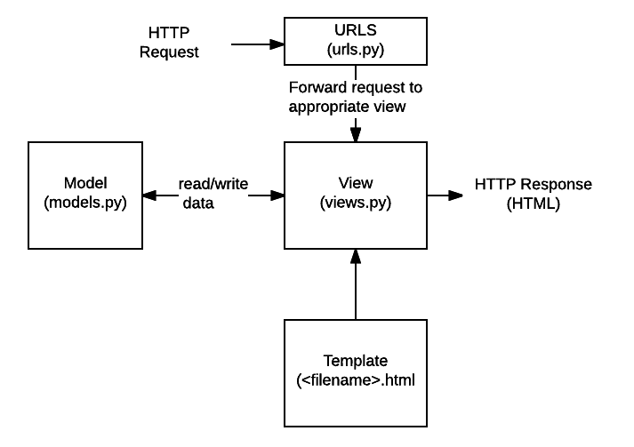
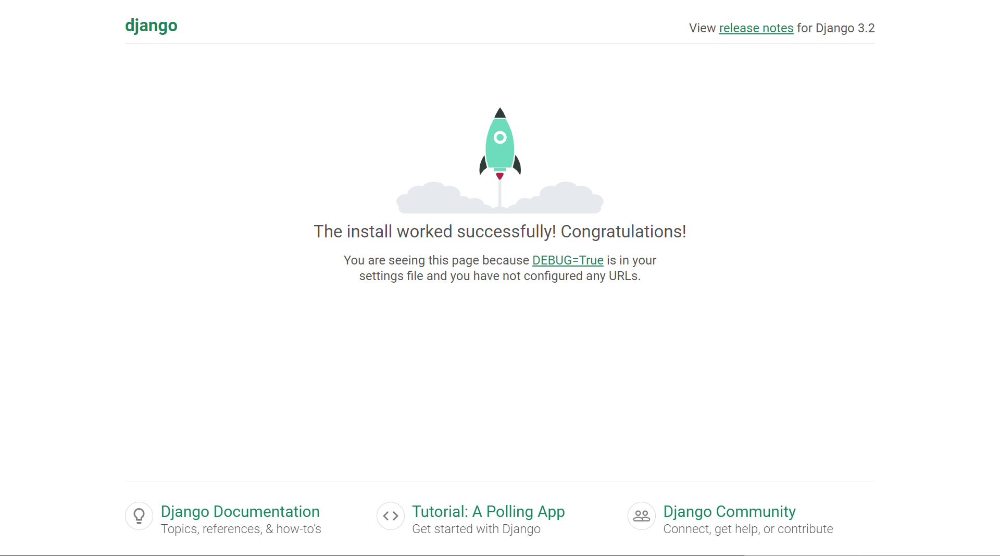

# Intro

:::info Django : The Web Framework

- Web Framework
- Django Intro
- 요청과 응답
- Template
- HTML Form
- URL
- Namespace

:::

<br/>

## Web framework

### Django


> Django is a high-level **Python Web framework** that encourages rapid development and clean, pragmatic design.
>
> 
>
> It takes care of much of the hassle of Web development, so **you can focus on writing your app without needing to reinvent the wheel**.

- https://www.djangoproject.com/

<br/>

### Web (World Wide Web)

- 인터넷에 연결된 컴퓨터를 통해 정보를 공유할 수 있는 전 세계적인 정보 공간


<br/>


### Static web page (정적 웹 페이지)

- 서버에 미리 저장된 파일이 사용자에게 그대로 전달되는 웹 페이지
- 서버가 정적 웹 페이지에 대한 요청을 받은 경우 서버는 추가적인 처리 과정 없이 클라이언트에게 응답을 보냄
- 모든 상황에서 모든 사용자에게 동일한 정보를 표시
- 일반적으로 HTML, CSS, JavaScript 로 작성됨
- flat page 라고도 함


<br/>


### Dynamic web page (동적 웹 페이지)

- 웹 페이지에 대한 요청을 받은 경우 서버는 추가적인 처리 과정 이후 클라이언트에게 응답을 보냄
- 동적 페이지는 방문자와 상호작용하기 때문에 페이지 내용은 그때그때 다름
- 서버 사이드 프로그래밍 언어(python, java, c++ 등)가 사용되며 파일을 처리하고 데이터베이스와의 상호작용이 이루어짐


<br/>


### Framework

- 프로그래밍에서 특정 운영 체제를 위한 응용 프로그램 표준 구조를 구현하는 클래스와 라이브러리 모임
- 재사용할 수 있는 수많은 코드를 프레임워크로 통합함으로써 개발자가 새로운 애플리케이션을 위한 표준 코드를 다시 작성하지 않아도 같이 사용할 수 있도록 도움
- Application Framework 라고도 함


<br/>


### Web framework

- **웹 페이지를 개발하는 과정에서 겪는 어려움을 줄이는 것이 주 목적**으로 데이터베이스 연동, 템플릿 형태의 표준, 세션 관리, 코드 재사용 등의 기능을 포함
- 동적인 웹 페이지나, 웹 애플리케이션, 웹 서비스 개발 보조용으로 만들어지는 Application Framework의 일종


<br/>


### Django를 사용해야 하는 이유

- 검증된 Python 언어 기반 Web framework
- 대규모 서비스에도 안정적이며 오랫동안 세계적인 기업들에 의해 사용됨 (ex. Spotify, Instagram, Dropbox, Delivery Hero)
- 처음 서버를 구축할 때 빠르게 시작할 수 있다. (애자일 방법론에 적합하다.)


<br/>


### Framework Architecture

- MVC Design Pattern (model - view - controller)
- 소프트웨어 공학에서 사용되는 디자인 패턴 중 하나
- 사용자 인터페이스로부터 프로그램 로직을 분리하여 애플리케이션의 시각적 요소나 이면에서 실행되는 부분을 서로 영향 없이 쉽게 고칠 수 있는 애플리케이션을 만들 수 있음
- Django는 **MTV Pattern**이라고 함


<br/>


### MTV Pattern

- **Model** : DB
  - 응용프로그램의 데이터 구조를 정의하고 데이터베이스의 기록을 관리(추가, 수정, 삭제)

- **Template** : HTML
  - 파일의 구조나 레이아웃을 정의
  - 실제 내용을 보여주는 데 사용(presentation)

- **View** : 중간 관리자 (controller)

  - HTTP 요청을 수신하고 HTTP 응답을 반환
  - Model을 통해 요청을 충족시키는데 필요한 데이터에 접근
  - template에게 응답의 서식 설정을 맡김

<br/>

| MVC Pattern | MTV (Django) |
| :---------: | :----------: |
|    Model    |    Model     |
|    View     |   Template   |
| Controller  |     View     |

<br/>



<br/>

## Django 시작하기

- Django 설치 전 가상환경 생성 및 활성화
- 프로젝트 이름 주의사항
  - Python이나 Django에서 사용 중인 키워드 및 `-`(하이픈) 사용 불가

```bash
# django 설치(최신버전)
$ pip install django

# 현재 환경에 설치된 패키지 목록 확인
$ pip list

# 프로젝트 생성
$ django-admin startproject firstpjt .

# django 서버 실행
$ python manage.py runserver
```

```
<!-- 접속 로그 -->
[31/Aug/2021 10:24:15] "GET / HTTP/1.1" 200 10697
[31/Aug/2021 10:24:16] "GET /static/admin/css/fonts.css HTTP/1.1" 200 423
[31/Aug/2021 10:24:16] "GET /static/admin/fonts/Roboto-Bold-webfont.woff HTTP/1.1" 200 86184
[31/Aug/2021 10:24:16] "GET /static/admin/fonts/Roboto-Regular-webfont.woff HTTP/1.1" 200 85876
[31/Aug/2021 10:24:16] "GET /static/admin/fonts/Roboto-Light-webfont.woff HTTP/1.1" 200 85692
Not Found: /favicon.ico
[31/Aug/2021 10:24:16] "GET /favicon.ico HTTP/1.1" 404 2117
```

<br/>

- 메인 페이지 로켓 확인



<br/>

### 프로젝트 구조

```
firstpjt              -- 프로젝트 폴더 (프로젝트 루트 : manage.py와 같은 위치)
│
├── firstpjt        -- master app
│   ├──__init__.py
│   ├──asgi.py
│   ├──settings.py
│   ├──urls.py
│   └──wsgi.py
│
├──db.sqlite3
└──manage.py        -- python manage.py runserver
```


- `__init__.py` : Python에게 이 디렉토리를 하나의 Python 패키지로 다루도록 지시
- `asgi.py` : Asynchronous Server Gateway Interface
  - django 애플리케이션이 비동기식 웹 서버와 연결 및 소통하는 것을 도움


- `settings.py` : 애플리케이션의 모든 설정을 포함
- `urls.py` : 사이트의 url과 적절한 views의 연결을 지정
- `wsgi.py` : Web Server Gateway Interface
  - django 애플리케이션이 웹서버와 연결 및 소통하는 것을 도움


- `manage.py` : Django 프로젝트와 다양한 방법으로 상호작용 하는 커맨드라인 유틸리티


```bash
# manage.py Usage
$ python manage.py <command> [options]
```

<br/>

### Application 생성

일반적으로 Application 명은 **복수형**으로 하는 것을 권장

```bash
$ python manage.py startapp articles
```

<br/>

### Application 구조

```
firstpjt
│
├── articles
│   ├──migrations
│   ├──__init__.py
│   ├──admin.py
│   ├──apps.py
│   ├──models.py
│   ├──tests.py
│   └──views.py
│
├── firstpjt
├──db.sqlite3
└──manage.py
```

- `admin.py` : 관리자용 페이지를 설정 하는 곳
- `apps.py` : 앱의 정보가 작성된 곳
- `models.py` : 앱에서 사용하는 Model을 정의하는 곳
- `tests.py` : 프로젝트의 테스트 코드를 작성하는 곳
- `views.py` : view 함수들이 정의 되는 곳

<br/>

### Project & Application

#### Project

- Project(이하 프로젝트)는 Application(이하 앱)의 집합 (collection of apps)
- 프로젝트에는 여러 앱이 포함될 수 있음
- 앱은 여러 프로젝트에 있을 수 있음

<br/>

#### Application

- 앱은 실제 요청을 처리하고 페이지를 보여주고 하는 등의 역할을 담당
- 하나의 프로젝트는 여러 앱을 가짐
- 일반적으로 앱은 하나의 역할 및 기능 단위로 작성함

<br/>

### 앱 등록

프로젝트에서 앱을 사용하기 위해서는 반드시 INSTALLED_APPS 리스트에 추가해야 함

- `INSTALLED_APPS` : Django installation에 활성화 된 모든 앱을 지정하는 문자열 목록

```python
# settings.py

INSTALLED_APPS = [
    'django.contrib.admin',
    'django.contrib.auth',
    'django.contrib.contenttypes',
    'django.contrib.sessions',
    'django.contrib.messages',
    'django.contrib.staticfiles',
]
```

<br/>

:::danger 반드시 생성 후 등록

- INSTALLED_APPS에 먼저 작성(등록)하고 생성하려면 앱이 생성되지 않음

:::

<br/>

:::caution

```python
# Application definition

INSTALLED_APPS = [
    # Local apps
    'articles',
    
    # Third Party apps
    'djangorestframework',
    
    # Django apps
    'django.contrib.admin',
    'django.contrib.auth',
    'django.contrib.contenttypes',
    'django.contrib.sessions',
    'django.contrib.messages',
    'django.contrib.staticfiles',
]
```
해당 순서를 지키지 않아도 수업 과정에서는 문제가 없지만, 추후 advanced 한 내용을 대비하기 위해 지키는 것을 권장

:::

<br/>

## 요청과 응답

### URLS

- HTTP 요청(request)을 알맞은 view로 전달

```python
# urls.py

from django.contrib import admin
from django.urls import path
from articles import views

urlpatterns = [
    path('admin/', admin.site.urls),
    path('index/', views.index),
]
```

<br/>

### View

- HTTP 요청을 수신하고 HTTP 응답을 반환하는 함수 작성
- Model을 통해 요청에 맞는 필요 데이터에 접근
- Template에게 HTTP 응답 서식을 맡김

```python
# articles/views.py

from django.shortcuts import render


def index(request):
    return render(request, 'index.html')
```

<br/>

### Templates

- 실제 내용을 보여주는데 사용되는 파일
- 파일의 구조나 레이아웃을 정의 (ex. HTML)
- Template 파일 경로의 기본 값은 **app 폴더 안의 templates 폴더**로 지정되어 있음

```html
<!-- articles/templates/index.html -->

<h1>만나서 반가워요!</h1>
```

<br/>

### 추가 설정

- `settings.py`

```{tip}
변수를 다 대문자로 썼다는 것은 한 번 할당하면 바꾸지 않겠다는 의미
```

<br/>

- **LANGUAGE_CODE**
  - 모든 사용자에게 제공되는 번역을 결정
  - 이 설정이 적용 되려면 USE_I18N이 활성화되어 있어야 함

<br/>

- **ΤΙME_ZONΕ**
  - 데이터베이스 연결의 시간대를 나타내는 문자열 지정
  - USE_TZ가 True이고 이 옵션이 설정된 경우 데이터베이스에서 날짜 시간을 읽으면, UTC 대신 새로 설정한 시간대의 인식 날짜&시간이 반환 됨
  - USE_TZ이 False인 상태로 이 값을 설정하는 것은 error가 발생하므로 주의

```python
# settings.py

LANGUAGE_CODE = 'ko-kr'

TIME_ZONE = 'Asia/Seoul'
```

<br/>

- **USE_I18N**
  - 국제화 (Internationalization : I와 n 사이에 18글자가 있다.)
  - Django의 번역 시스템을 활성화해야 하는지 여부를 지정

<br/>

- **USE_L10N**
  - 현지화 (Localization : L과 n 사이에 10글자가 있다.)
  - 데이터의 지역화 된 형식(localized formatting)을 기본적으로 활성화할지 여부를 지정
  - True일 경우, Django는 현재 locale의 형식을 사용하여 숫자와 날짜를 표시

<br/>

- **USE_TZ**
  - datetimes가 기본적으로 시간대를 인식하는지 여부를 지정
  - True일 경우 Django는 내부적으로 시간대 인식 날짜 / 시간을 사용


