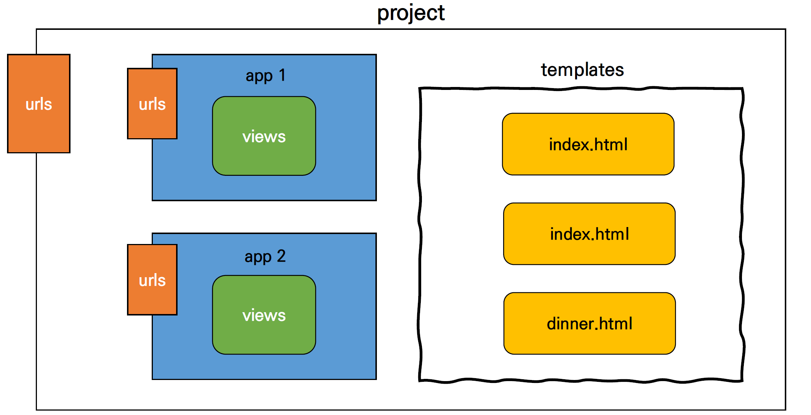
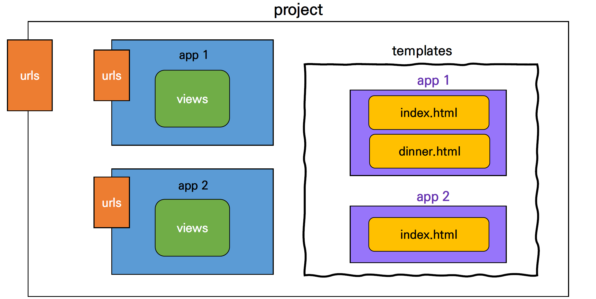
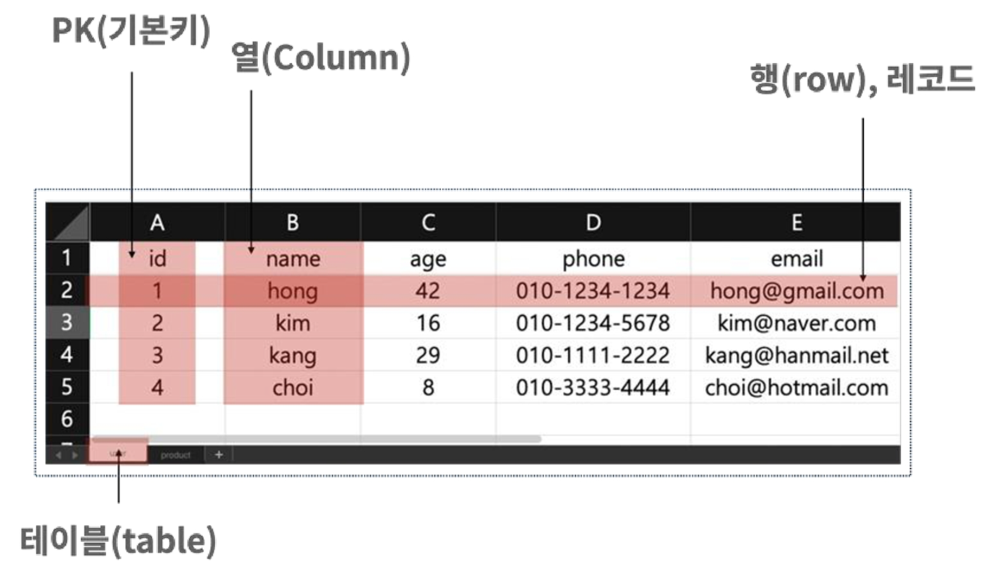
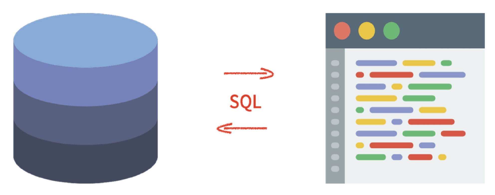
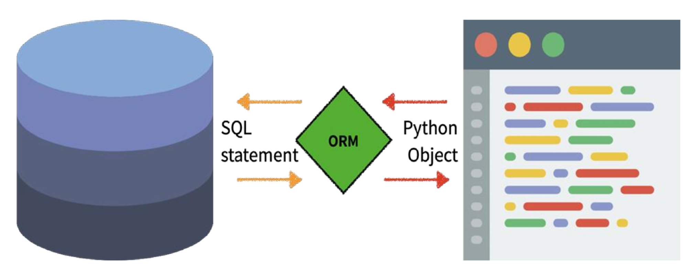
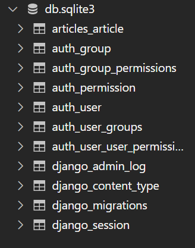
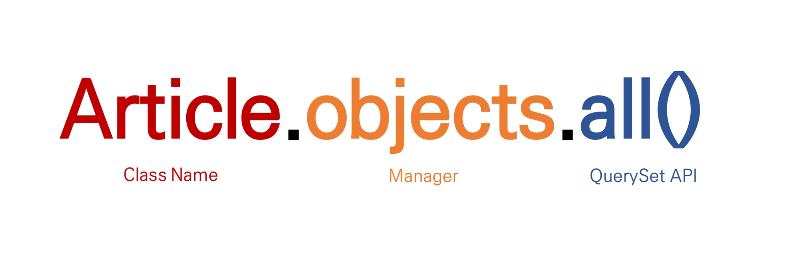
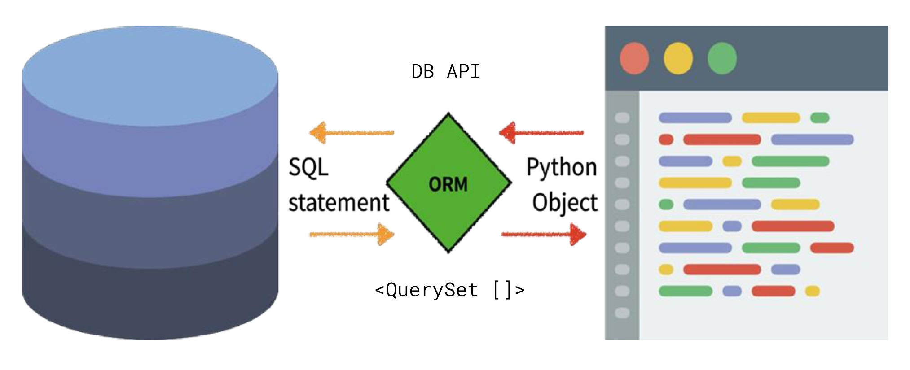

# MTV Pattern

:::info Django : The Web Framework

- Template
- HTML Form
- URL
- Namespace
- Model
- ORM
- Migrations
- Database API
- CRUD
- Admin Site

:::


## 1. Template

### Django Template

- "데이터 표현을 제어하는 도구이자 표현에 관련된 로직"
- 사용하는 built-in system
  - Django template language

<br/>

### Django Template Language (DTL)

- django template에서 사용하는 built-in template system
- 조건, 반복, 변수 치환, 필터 등의 기능을 제공
- 단순히 Python이 HTML에 포함 된 것이 아니며, 프로그래밍적 로직이 아니라 **프레젠테이션을 표현하기 위한 것**
- Python처럼 일부 프로그래밍 구조(if, for 등)를 사용할 수 있지만, 이것은 해당 Python 코드로 실행되는 것이 아님

<br/>

#### DTL Syntax

1. Variable
2. Filters
3. Tags
4. Comments

<br/>

:::note Django Template Language (DTL)

- `{{　}}` : print
- `` : 논리 표현

:::


<br/>

#### 1. Variable

```django
{{ variable }}
```

- `render()`를 사용하여 `views.py`에서 정의한 변수를 template 파일로 넘겨 사용하는 것
- 변수명은 영어, 숫자와 밑줄(`_`)의 조합으로 구성될 수 있으나 밑줄로는 시작 할 수 없음
  - 공백이나 구두점 문자 또한 사용할 수 없음
- dot(`.`)를 사용하여 변수 속성에 접근할 수 있음
- `render()`의 세번째 인자로 `{'key':　value}` 와 같이 딕셔너리 형태로 넘겨주며, 여기서 정의한 key에 해당하는 문자열이 template에서 사용 가능한 변수명이 됨

<br/>

#### 2. Filters

```django
{{ variable|filter }}
```

- 표시할 변수를 수정할 때 사용

- 예시)

  - name 변수를 모두 소문자로 출력

    ```django
    {{ name|lower }}
    ```

- 60개의 built-in template filters를 제공

- chained가 가능하며 일부 필터는 인자를 받기도 함

  ```django
  {{ variable|truncatewords:30 }}
  ```

<br/>

#### 3. Tags

```django

```

- 출력 텍스트를 만들거나, 반복 또는 논리를 수행하여 제어 흐름을 만드는 등 변수보다 복잡한 일들을 수행

- 일부 태그는 시작과 종료 태그가 필요

  ```django
  
  ```

- 약 24개의 built-in template tags를 제공

<br/>

#### 4. Comments

```django
{# #}
```

- django template에서 라인의 주석을 표현하기 위해 사용

- 아래처럼 유효하지 않은 템플릿 코드가 포함될 수 있음

  ```django
  {#  text  #}
  ```

- 한줄 주석에만 사용할 수 있음 (줄 바꿈이 허용되지 않음)

- 여러 줄 주석은 ``와 ` `사이에 입력

  ```django
  
    주석
    주석
  
  ```

<br/>

### 코드 작성 순서

데이터의 흐름에 맞추어 작성
1. urls.py
2. views.py
3. templates

<br/>

#### [실습] DTL Syntax

##### Variable

```python
# urls.py

urlpatterns = [
    path('admin/', admin.site.urls),
    path('index/', views.index),
    path('greeting/', views.greeting),
]
```

```python
# views.py

def greeting(request):
    return render(request, 'greetings.html', {'name': 'Alice'})
```

```django
<!-- greetings.html -->

<p>안녕하세요 저는 {{ name }} 입니다.</p>
```

```{admonition} render
- **SSR** (Server Side Rendering) : Django
- CSR (Client Side Rendering) : Vue, React
```

<br/>

```python
# views.py

def greeting(request):
    foods = ['apple', 'banana', 'coconut', ]
    info = {
        'name': 'Alice'
    }
    context = {
        'foods': foods,
        'info': info,
    }
    return render(request, 'greeting.html', context)
```

```django
<!-- greetings.html -->

<p>안녕하세요 저는 {{ info.name }} 입니다.</p>
<p>제가 좋아하는 음식은 {{ foods }} 입니다.</p>
<p>{{ foods.0 }}을 가장 좋아합니다.</p>

<a href="/index/">뒤로</a>
```

<br/>

```python
# urls.py

urlpatterns = [
    path('admin/', admin.site.urls),
    path('index/', views.index),
    path('greeting/', views.greeting),
    path('dinner/', views.dinner),
]
```

```python
# views.py

import random


def dinner(request):
    foods = ['족발', '햄버거', '치킨', '초밥']
    pick = random.choice(foods)
    context = {
        'pick': pick,
    }
    return render(request, 'dinner.html', context)
```

```django
<!-- dinner.html -->

<h1>오늘 저녁은 {{ pick }}!</h1>
<a href="/index/">뒤로</a>
```

<br/>

##### Filters

```python
# views.py

def dinner(request):
    foods = ['족발', '피자', '햄버거', '초밥',]
    pick = random.choice(foods)
    context = {
        'pick': pick,
        'foods': foods,
    }
    return render(request, 'articles/dinner.html', context)
```

```django
<!-- dinner.html -->

<h1>오늘 저녁은 {{ pick }}!</h1>
<p>{{ pick }}은 {{ pick|length }}글자</p>
<p>{{ foods|join:", " }}</p>
<a href="">뒤로</a>
```

<br/>

##### Tags

```django
<!-- dinner.html -->

<h1>오늘 저녁은 {{ pick }}!</h1>
<p>{{ pick }}은 {{ pick|length }}글자</p>
<p>메뉴판</p>
<ul>
  
    <li>{{ food }}</li>
  
</ul>
<a href="">뒤로</a>
```

<br/>

##### Comments

```django
  {# 이것은 주석입니다 #}

  
    <p>1</p>
    <p>2</p>
    <p>3</p>
  
```

<br/>

### Template inheritance (템플릿 상속)

- 템플릿 상속은 기본적으로 코드의 재사용성에 초점을 맞춤
- 템플릿 상속을 사용하면 사이트의 모든 공통 요소를 포함하고, 하위 템플릿이 재정의(override) 할 수 있는 블록을 정의하는 기본 "skeleton" 템플릿을 만들 수 있음

<br/>

#### Tags

```django

```

- 자식(하위) 템플릿이 부모 템플릿을 확장한다는 것을 알림
- 반드시 템플릿 최상 단에 작성 되어야 함

<br/>

```django
 
```

- 하위 템플릿에서 재지정(overriden)할 수 있는 블록을 정의
- 즉, 하위 템플릿이 채울 수 있는 공간

<br/>

#### `settings.py` 추가 경로 설정

app_name/templates 디렉토리 외 템플릿 추가 경로 설정

```python
# settings.py

TEMPLATES = [
	{
		...,
		"DIRS': [BASE_DIR / 'templates'], # 어떤 디렉토리 안에서 템플릿을 찾을 것인가
        "APP_DIRS": True,  # App 안의 templates 폴더는 자동으로 찾습니다.
		...,
    }
]
```

<br/>

#### bootstrap 및 간단한 navbar 작성

```django
<!-- base.html -->

<!DOCTYPE html>
<html lang="en">
<head>
  <meta charset="UTF-8">
  <meta http-equiv="X-UA-Compatible" content="IE=edge">
  <meta name="viewport" content="width=device-width, initial-scale=1.0">
  <link href="https://cdn.jsdelivr.net/npm/bootstrap@5.1.0/dist/css/bootstrap.min.css" rel="stylesheet" integrity="sha384-KyZXEAg3QhqLMpG8r+8fhAXLRk2vvoC2f3B09zVXn8CA5QIVfZOJ3BCsw2P0p/We" crossorigin="anonymous">
  <title>Document</title>
</head>
<body>
  <nav class="navbar navbar-light bg-light">
    <div class="container-fluid">
      <a class="navbar-brand" href="#">Navbar</a>
    </div>
  </nav>
  <div class="container">
    
    
  </div>
  <script src="https://cdn.jsdelivr.net/npm/bootstrap@5.1.0/dist/js/bootstrap.bundle.min.js" integrity="sha384-U1DAWAznBHeqEIlVSCgzq+c9gqGAJn5c/t99JyeKa9xxaYpSvHU5awsuZVVFIhvj" crossorigin="anonymous"></script>
</body>
</html>
```

```django
<!-- index.html -->




  <h1>만나서 반가워요!!!</h1>
  <a href="">greeting</a>
  <a href="">dinner</a>
  <a href="">throw</a>
  <a href="">dtl_practice</a>

  <a href="">두번째 앱의 인덱스</a>

```

<br/>

### Django template system (feat. django 설계 철학)

- **표현과 로직(view)을 분리**
  - 템플릿 시스템은 표현을 제어하는 도구이자 표현에 관련된 로직일 뿐이라고 생각한다.
  - 즉, 템플릿 시스템은 이러한 기본 목표를 넘어서는 기능을 지원하지 말아야 한다.
- **중복을 배제**
  - 대다수의 동적 웹사이트는 공통 header, footer, navbar 같은 사이트 공통 디자인을 갖는다.
  - Django 템플릿 시스템은 이러한 요소를 한 곳에 저장하기 쉽게 하여 중복 코드를 없애야 한다.
  - 이것이 템플릿 상속의 기초가 되는 철학이다.
- https://docs.djangoproject.com/ko/3.2/misc/design=philosophies/#template-system

<br/>

### Form

#### HTML Form

##### form

- 웹에서 사용자 정보를 입력하는 여러 방식(text, button, checkbox, file, hidden, image, password, radio, reset, submit)을 제공하고, 사용자로부터 할당된 데이터를 서버로 전송하는 역할을 담당
- **핵심 속성**(attribute)
  - action : 입력 데이터가 전송될 URL 지정
  - method : 입력 데이터 전달 방식 지정


- https://developer.mozilla.org/en-US/docs/Web/HTML/Element/form

<br/>

##### input

- 사용자로부터 데이터를 입력 받기 위해 사용
- type 속성에 따라 동작 방식이 달라짐
- 핵심 속성(attribute)
  - name
  - 중복 가능, 양식을 제출했을 때 name이라는 이름에 설정된 값을 넘겨서 값을 가져올 수 있음
  - 주요 용도는 GET/POST 방식으로 서버에 전달하는 파라미터(name은 key, value는 value)로 `?key=value&key=value` 형태로 전달됨.
- https://developer.mozilla.org/en-US/docs/Web/HTML/Element/input

<br/>

:::tip

- 일반적으로 button 태그는 아무 기능이 없는 버튼이지만
- form 태그 안에서 button은 자동으로 submit 기능을 갖게 된다.

:::

<br/>

##### label

- 사용자 인터페이스 항목에 대한 설명(caption)을 나타냄
- **label을 input 요소와 연결하기**
  1. input에 id 속성 부여
  2. label에는 input의 id와 동일한 값의 for 속성이 필요

- https://developer.mozilla.org/en-US/docs/Web/HTML/Element/label

<br/>

- **label과 input 요소 연결의 주요 이점**
  - 시각적인 기능 뿐만 아니라 화면 리더기에서 label을 읽어서 사용자가 입력해야 하는 텍스트가 무엇인지 더 쉽게 이해할 수 있도록 돕는 프로그래밍적 이점도 있음
  - label을 클릭해서 input에 초점(focus)를 맞추거나 활성화(activate) 시킬 수 있음
- https://developer.mozilla.org/en-US/docs/Web/HTML/Element/label

<br/>

##### for

- for 속성의 값과 일치하는 id를 가진 문서의 첫 번째 요소를 제어
  - 연결 된 요소가 labelable elements인 경우 이 요소에 대한 labeled control이 됨
- **labelable elements**
  - label 요소와 연결할 수 있는 요소
  - button, input(not hidden type), select, textarea ...
- https://developer.mozilla.org/en-US/docs/Web/HTML/Element/label#attr-for
- https://html.spec.whatwg.org/multipage/forms.html#category-label

<br/>

##### id

- 전체 문서에서 고유(must unique)해야 하는 식별자를 정의
- 사용 목적
  - linking, scripting, styling 시 요소를 식별
- https://developer.mozilla.org/en-US/docs/Web/HTML/Global_attributes#attr-id

<br/>

### HTTP

- **HyperText Transfer Protocol**
- 웹에서 이루어지는 모든 데이터 교환의 기초
- 주어진 리소스가 수행 할 원하는 작업을 나타내는 request methods를 정의
- HTTP request method 종류
  - GET, POST, PUT, DELETE …

<br/>

#### HTTP request method - GET

- 서버로부터 정보를 조회하는 데 사용
- 데이터를 가져올 때만 사용해야 함
- 데이터를 서버로 전송할 때 body가 아닌 Query String Parameters를 통해 전송
- 우리는 서버에 요청을 하면 HTML 문서 파일 한 장을 받는데, 이때 사용하는 요청의 방식이 GET

<br/>

#### [실습] Throw & Catch

```python
# urls.py

urlpatterns = [
    ...,
    path('throw/', views.throw, name='throw'),
    path('catch/', views.catch, name='catch'),
    ...,
]
```

```python
# views.py

def throw(request):
    return render(request, 'articles/throw.html')


def catch(request):
    message = request.GET.get('message')
    # print(message)
    context = {
        'message': message,
    }
    return render(request, 'articles/catch.html', context)
```

```html
<!-- throw.html -->




  <h1>THROW</h1>
  <form action="" method="GET">
    <label for="message">Throw: </label>
    <input type="text" name="message" id="message">
    <input type="submit">
  </form>

  <a href="">뒤로</a>

```

```html
<!-- catch.html -->




  <h1>CATCH</h1>
  <h2>여기서 {{ message }}를 받았어 !!!</h2>

  <a href="">다시 던지러!!</a>

```


## 2. URL & Namespace

### Django URLS

- Dispatcher(발송자, 운항 관리자)로서의 URL
- 웹 애플리케이션은 URL을 통한 클라이언트의 요청에서부터 시작 됨

<br/>

#### Variable Routing

- URL 주소를 변수로 사용하는 것
- URL의 일부를 변수로 지정하여 view 함수의 인자로 넘길 수 있음
- 즉, 변수 값에 따라 하나의 path)에 여러 페이지를 연결 시킬 수 있음
  - `path('/accounts/user/<int:user_pk>/',　...)`
    - `accounts/user/1` → (1번 user 관련 페이지)
    - `accounts/user/2` → (2번 user 관련 페이지)

<br/>

#### URL Path converters

- **str**

  - `/`를 제외하고 비어 있지 않은 모든 문자열과 매치
  - 작성하지 않을 경우 기본 값

- **int**

  - 0 또는 양의 정수와 매치

- **slug**

  - ASCII 문자 또는 숫자, 하이픈 및 밑줄 문자로 구성된 모든 슬러그 문자열과 매치
  - ex) 'building-your-1st-django-site'

- uuid

- path


- https://docs.djangoproject.com/en/3.2/topics/http/urls/#path-converters

<br/>

#### [실습] Variable Routing

```python
# urls.py

urlpatterns = [
    ...,
    # path('hello/<str:name>/', views.hello, name='hello'),
    path('hello/<name>/', views.hello, name='hello'),
    ...,
]
```

```python
# views.py

def hello(request, name):
    context = {
        'name': name,
    }
    return render(request, 'articles/hello.html', context)
```

```html
<!-- hello.html -->




  <h1>Hello</h1>
  <h2>만나서 반가워요 {{ name }}님!!!</h2>

  <a href="">뒤로</a>

```

<br/>

#### App URL mapping

- app의 view 함수가 많아지면서 사용하는 path() 또한 많아지고,
- app 또한 더 많이 작성되기 때문에 프로젝트의 urls.py에서 모두 관리하는 것은 프로젝트 유지보수에 좋지 않음
- 이제는 각 app에 urls.py를 작성하게 됨

```python
# firstpjt/urls.py

from django.contrib import admin
from django.urls import path, include

# urlpattern은 언제든지 다른 URLconf 모듈을 포함(include)할 수 있음
urlpatterns = [
    path('admin/', admin.site.urls),
    path('articles/', include('articles.urls')),
    path('pages/', include('pages.urls')),
]
```

<br/>

- 각각의 앱 안에 urls.py을 생성하고 프로젝트 urls.py에서 각 앱의 urls.py 파일로 URL 매핑을 위탁

```python
# articles/urls.py

from django.urls import path
from . import views


app_name = 'articles'
urlpatterns = [
    path('index/', views.index),
    path('greeting/', views.greeting),
    path('dinner/', views.dinner),
    path('throw/', views.throw),
    path('catch/', views.catch),
    path('hello/<name>/', views.hello),
    path('dtl-practice/', views.dtl_practice),
]
```

```python
# pages/urls.py

from django.urls import path
from . import views


app_name = 'pages'
urlpatterns = [
    path('index/', views.index),
]
```

<br/>

##### `include()`

- 다른 URLconf(app1/urls.py)들을 참조할 수 있도록 도움
- 함수 include(를 만나게 되면, URL의 그 시점까지 일치하는 부분을 잘라내고, 남은 문자열 부분을 후속 처리를 위해 include된 URLconf로 전달
- django는 **명시적 상대경로**(`from . module import ...`)를 권장

 <br/>

#### Naming URL patterns

- 이제는 링크에 url을 직접 작성하는 것이 아니라 path() 함수의 name 인자를 정의해서 사용
- Django Template Tag 중 하나인 url 태그를 사용해서 path() 함수에 작성한 name을 사용할 수 있음
- url 설정에 정의된 특정한 경로들의 의존성을 제거할 수 있음

```python
# pages/urls.py

from django.urls import path
from . import views


app_name = 'pages'
urlpatterns = [
    path('index/', views.index, name='index'),
]
```

```django
<a href="">뒤로</a>
```

<br/>

- the 'name' value as called by the `` template tag

```python
# articles/urls.py

from django.urls import path
from . import views


app_name = 'articles'
urlpatterns = [
    path('index/', views.index, name='index'),
    path('greeting/', views.greeting, name='greeting'),
    path('dinner/', views.dinner, name='dinner'),
    path('throw/', views.throw, name='throw'),
    path('catch/', views.catch, name='catch'),
    # path('hello/<str:name>/', views.hello, name='hello'),
    path('hello/<name>/', views.hello, name='hello'),
    path('dtl-practice/', views.dtl_practice, name='dtl_practice'),
]
```

<br/>

##### url template tag

```django

```

- 주어진 URL 패턴 이름 및 선택적 매개 변수와 일치하는 절대 경로 주소를 반환
- 템플릿에 URL을 하드 코딩하지 않고도
- DRY 원칙을 위반하지 않으면서 링크를 출력하는 방법

<br/>

### Namespace

#### namespace (이름공간)

- 이름공간 또는 네임스페이스(Namespace)는 객체를 구분할 수 있는 범위를 나타내는 말로 일반적으로 하나의 이름 공간에서는 하나의 이름이 단 하나의 객체만을 가리키게 된다. [위키백과]
- 프로그래밍을 하다 보면 모든 변수명과 함수명 등 이들 모두를 겹치지 않게 정의 하는 것은 매우 어려운 일
- 그래서 django에서는
  1. 서로 다른 app의 같은 이름을 가진 url name은 이름공간을 설정해서 구분
  2. templates, static 등 django는 정해진 경로 하나로 모아서 보기 때문에 중간에 폴더를 임의로 만들어 줌으로써 이름공간을 설정

<br/>

##### [실습] 2번째 앱의 메인 페이지 작성

```python
# pages/urls.py

from django.urls import path
from . import views


app_name = 'pages'
urlpatterns = [
    path('index/', views.index, name='index'),
]
```

```python
# pages/views.py

from django.shortcuts import render


def index(request):
    return render(request, 'pages/index.html')
```

```html
<!-- pages/templates/index.html -->




  <h1>두번째 앱의 INDEX</h1>

```

```html
<!-- articles/templates/index.html -->



  <h1>만나서 반가워요!!!</h1>
  <a href="">greeting</a>
  <a href="">dinner</a>
  <a href="">throw</a>
  <a href="">dtl_practice</a>

  <a href="">두번째 앱의 인덱스</a>

```

- 2번째 앱의 index로 이동하는 링크 작성

<br/>

##### 2가지 문제 발생

1. articles 앱의 index 페이지에서 두번째 앱 pages의 index로 이동하는 하이퍼 링크를 클릭 시 현재 페이지로 이동됨

  - URL namespace

2. pages 앱 index url로 이동해도 articles 앱의 index 페이지가 출력됨
   - Template namespace

<br/>

#### URL namespace

- URL namespace를 사용하면 서로 다른 앱에서 동일한 URL 이름을 사용하는 경우에도 이름이 지정된 URL을 고유하게 사용 할 수 있음
- urls.py에 “app_name" attribute 값 작성


- 참조
  - `:` 연산자를 사용하여 지정

```python
# app_name attribute 작성

app_name = 'articles'
urlpatterns = [
    path( 'admin/', admin.site.urls),
    path('index/', views.index, name='index'),
]
```

```django
<a href="">메인 페이지</a>
```

<br/>

##### URL Tag 변경

```html
<!-- catch.html -->
<a href="">다시 던지러!!</a>

<!-- greeting, dtl_practice, dinner.html, throw.html -->
<a href="">뒤로</a>
```

```html
<!-- articles/templates/index.html -->



  <h1>만나서 반가워요!!!</h1>
  <a href="">greeting</a>
  <a href="">dinner</a>
  <a href="">throw</a>
  <a href="">dtl_practice</a>

  <a href="">두번째 앱의 인덱스</a>

```

<br/>

##### Templates namespace

- Django는 기본적으로 `app_name/templates/` 경로에 있는 templates 파일들만 찾을 수 있으며, INSTALLED_APPS에 작성한 app 순서로 tamplate을 검색 후 렌더링 함

  - render 함수는 templates 폴더 안에 있는 .html 파일이라면 알아서 찾아온다.
  - 그런데 다른 앱을 만들고 기존에 만든 html 파일을 복사, 붙여넣기 하면 views가 다르게 작성되었어도 기존에 만든 페이지만 노출된다.
  - 이유는 장고 서버가 켜지면 장고는 모든 `INSTALLED_APPS` 안에 적혀있는 앱들을 방문하면서 templates 폴더를 하나의 바구니에 담기 때문이다.
  - 이 때 처음에 담긴 템플릿이 우선순위
  - 만약 `INSTALLED_APPS` 순서를 바꾸면, 반대의 결과가 나온다.


- 그래서 임의로 templates의 폴더 구조를 app_name/templates/app_name 형태로 변경해 임의로 이름 공간을 생성 후 변경된 추가 경로로 수정

```python
def index(request):
    return render(request, 'articles/index.html')
```





<br/>

### Framework의 성격

- **Opinionated** (독선적) vs. **Unopinionated** (관용적)
- Django는 다소 독선적이다.

<br/>

:::tip

- `urls.py` 파일을 만들자마자 기본으로 타이핑하고 시작하자.

```python
from django.urls import path
from . import views

app_name = 'app_name'

urlpatterns = [
    path('', views.index),
]
```

- View에서 궁금한게 있을 때 함수 안에 불필요한 코드를 넣어 의도적으로 에러를 발생시켜보자.

:::

<br/>

:::note

- 서버로 Request → master `urls.py` → app `urls.py` → View 함수 호출 → html 리턴
- → 데이터 입력 → 제출 → form action으로 request → master `url.py` → app `urls.py` → View 함수 호출 → request 객체 안에서 데이터 꺼내기

:::


## 3. Model

:::info Django Model

- Model
- ORM
- Migrations
- Database API
- CRUD
- Admin Site

:::

<br/>


<br/>

### Model

- 단일한 데이터에 대한 정보를 가짐
- 사용자가 저장하는 데이터들의 필수적인 필드들과 동작들을 포함
  - 저장된 데이터베이스의 구조(layout)
- django는 model을 통해 데이터에 접속하고 관리
- 일반적으로 각각의 model은 하나의 데이터베이스 테이블에 매핑

<br/>

#### Database

- **데이터베이스**(DB)
  - 체계화된 데이터의 모임
- **쿼리**(Query)
  - 데이터를 조회하기 위한 명령어
  - 조건에 맞는 데이터를 추출하거나 조작하는 명령어

<br/>

#### Database의 기본 구조

- **스키마**(Schema)
  - 데이터베이스에서 자료의 구조, 표현방법, 관계 등을 정의한 구조
- **테이블**(Table)
  - 필드(field) / 컬럼(column) / 속성
  - 레코드(record) / 행(row) / 튜플

<br/>

|  id  | name | age  |     phone     |      email       |
| :--: | :--: | :--: | :-----------: | :--------------: |
|  1   | hong |  42  | 010-1234-1234 |  hong@gmail.com  |
|  2   | kim  |  16  | 010-1234-5678 |  kim@naver.com   |
|  3   | kang |  29  | 010-1111-2222 | kang@hanmail.net |
|  4   | choi |  8   | 010-3333-4444 | choi@hotmail.com |

<br/>

##### (1) 스키마(schema)

데이터베이스의 구조와 제약 조건(자료의 구조, 표현 방법, 관계)에 관련한 전반적인 명세를 기술한 것.

| column | datatype |
| :----: | :------: |
|   id   |   INT    |
|  name  |   TEXT   |
|  age   |   INT    |
| phone  |   TEXT   |
| email  |   TEXT   |

<br/>

##### (2) 테이블(table)

열(컬럼/필드)과 행(레코드/값)의 모델을 사용해 조직된 데이터 요소들의 집합. SQL 데이터베이스에서는 테이블을 관계 라고도 한다.

<br/>

##### (3) 열(Column), 컬럼

각 열에는 고유한 데이터 형식이 지정된다. (INTEGER, TEXT, NULL 등)

<br/>

##### (4) 행(row), 레코드

테이블의 데이터는 행에 저장된다. 즉, user 테이블에 4명의 고객정보가 저장되어 있으며, 행은 4개가 존재한다.

<br/>

##### (5) PK(기본키)

각 행(레코드)의 고유값으로 Primary Key로 불린다. 반드시 설정하여야하며, 데이터베이스 관리 및 관계 설정시 주요하게 활용된다. (id)




<br/>

#### Model

웹 애플리케이션의 데이터를 **구조화**하고 **조작**하기 위한 도구

<br/>

### ORM

- **Object - Relational - Mapping** (객체 - 관계 - 연결)
  - Object : Python
  - Relational : DB (RDBMS : Relational DataBase Management System)
  - Mapping : 연결
- 객체 지향 프로그래밍 언어를 사용하여 호환되지 않는 유형의 시스템 간에(Django-SQL)데이터를 변환하는 프로그래밍 기술
- OOP 프로그래밍에서 RDBMS을 연동할 때, 데이터베이스와 객체 지향 프로그래밍 언어 간의 호환되지 않는 데이터를 변환하는 프로그래밍 기법
- Django는 내장 Django ORM을 사용
  - `models.py`에 정의되어 있는 model class가 ORM 역할을 한다.


<br/>


- **ORM 예시**





<br/>

#### ORM의 장점과 단점

##### 장점

- SQL을 잘 알지 못해도 DB 조작이 가능
- SQL의 절차적 접근이 아닌 객제 지향적 접근으로 인한 높은 생산성

<br/>

##### 단점

- ORM 만으로 완전한 서비스를 구현하기 어려운 경우가 있음

<br/>

**현대 웹 프레임워크의 요점은 웹 개발의 속도를 높이는 것.** (생산성) 즉, 위 단점은 큰 문제가 아니다.

<br/>

#### 왜 ORM을 사용할까

> "우리는 DB를 객체(object)로 조작하기 위해 ORM을 사용한다."

<br/>

### Django Model

#### 프로젝트 및 앱 생성 후 등록

```bash
$ mkdir 01_django_model
$ cd 01_django_model
$ django-admin startproject crud
$ python manage.py startapp articles
```

<br/>

#### 가상환경 생성 및 활성화

```bash
$ python -m venv venv

$ source venv/Scripts/activate

$ pip list
Package    Version
---------- -------
pip        21.1.3
setuptools 56.0.0

$ pip install -r requirements.txt

$ pip list
Package    Version
---------- -------
asgiref    3.4.1
Django     3.2.6
pip        21.1.3
pytz       2021.1
setuptools 56.0.0
sqlparse   0.4.1
WARNING: You are using pip version 21.1.3; however, version 21.2.4 is available.
You should consider upgrading via the 'c:\users\user\github-private\ssafy\04_django\01_django_model\venv\scripts\python.exe -m pip install --upgr
ade pip' command.

```

<br/>

#### models.py 작성

```python
# articles/models.py

class Article(models.Model):
    title = models.CharField(max_length=10)
    content = models.TextField()
```

- DB 컬럼과 어떠한 타입으로 정의할 것인지에 대해 `django.db` 라는 모듈의 `models` 를 상속
  - 각 모델은 `django.db.models.Model` 클래스의 서브 클래스로 표현
- title과 content은 모델의 **필드**(컬럼, 열)를 나타냄
  - 각 필드는 클래스 속성으로 지정되어 있으며, 각 속성은 각 데이터베이스의 열에 매핑
- 즉,  스키마를 결정하는 코드
  - 이 때 PK(기본키)는 자동으로 생성되므로 PK 외의 다른 필드를 정의해주면 된다.

<br/>

:::note models

1. 모델명 (클래스명) : 명사형 단수로 의미 있게 작성
2. 1 모델 : DB 1 테이블과 대응
3. 모델 클래스 내부의 클래스 변수 : 컬럼 이름에 해당

:::

<br/>

#### 사용 모델 필드

- `CharField(max_length=None,　**options)`
  - 길이의 제한이 있는 문자열을 넣을 때 사용
  - `CharField`의 `max_length`는 필수 인자
  - **필드의 최대 길이(문자)**, 데이터베이스 레벨과 Django의 유효성 검사(값을 검증하는 것)에서 활용

<br/>

- `TextField(**options)`
  - 글자의 수가 많을 때 사용
  - max_length 옵션 작성시 자동 양식 필드인 textarea 위젯에 반영은 되지만 모델과 데이터베이스 수준에는 적용되지 않음 (CharField 를 사용)

<br/>

- https://docs.djangoproject.com/en/3.2/ref/models/fields/

<br/>

### Migrations

- **django가 model에 생긴 변화**(필드 추가, 모델 삭제등)**를 DB에 반영하는 방법**
- Migration(이하 마이그레이션) 실행 및 DB 스키마를 다루기 위한 몇가지 명령어
  - `makemigrations` ⭐
  - `migrate` ⭐
  - `sqlmigrate`
  - `showmigrations`

<br/>

#### Migration Commands

- **makemigrations**
  - model을 변경한 것에 기반한 새로운 마이그레이션 (like 설계도)을 만들 때 사용

<br/>

- **migrate**
  - 마이그레이션을 DB에 반영하기 위해 사용
  - 설계도를 실제 DB에 반영하는 과정
  - 모델에서의 변경 사항들과 DB의 스키마가 동기화를 이룸

<br/>

- **sqlmigrate**
  - 마이그레이션에 대한 SQL 구문을 보기 위해 사용
  - 마이그레이션이 SQL 문으로 어떻게 해석되어서 동작할지 미리 확인 할 수 있음

<br/>

- **showmigrations**
  - 프로젝트 전체의 마이그레이션 상태를 확인하기 위해 사용
  - 마이그레이션 파일들이 migrate 됐는지 안됐는지 여부를 확인 할 수 있음

<br/>

#### [실습]

##### makemigrations

```bash
$ python manage.py makemigrations
```

```
Migrations for 'articles':
  articles\migrations\0001_initial.py
    - Create model Article
```

<br/>

- 일부 앱에서만 할 수도 있다.

```bash
$ python manage.py makemigrations articles
```

<br/>

`migrations/0001_initial.py` 생성 확인 (버전 관리)

```python
# 0001_initial.py
# Generated by Django 3.2.6 on 2021-09-01 01:17

from django.db import migrations, models


class Migration(migrations.Migration):

    initial = True

    dependencies = [
    ]

    operations = [
        migrations.CreateModel(
            name='Article',
            fields=[
                ('id', models.BigAutoField(auto_created=True, primary_key=True, serialize=False, verbose_name='ID')),
                ('title', models.CharField(max_length=10)),
                ('content', models.TextField()),
            ],
        ),
    ]
```

- 이 코드는 ORM에 의해서 SQL로 해석되어 DB에 반영될 것.
- 반영 기록은 (django_migrations 테이블에 쌓임)

<br/>

##### migrate

```bash
$ python manage.py migrate
```

```
Operations to perform:
  Apply all migrations: admin, articles, auth, contenttypes, sessions
Running migrations:
  Applying contenttypes.0001_initial... OK
  Applying auth.0001_initial... OK
  Applying admin.0001_initial... OK
  Applying admin.0002_logentry_remove_auto_add... OK
  Applying admin.0003_logentry_add_action_flag_choices... OK
  Applying articles.0001_initial... OK
  Applying contenttypes.0002_remove_content_type_name... OK
  Applying auth.0002_alter_permission_name_max_length... OK
  Applying auth.0003_alter_user_email_max_length... OK
  Applying auth.0004_alter_user_username_opts... OK
  Applying auth.0005_alter_user_last_login_null... OK
  Applying auth.0006_require_contenttypes_0002... OK
  Applying auth.0007_alter_validators_add_error_messages... OK
  Applying auth.0008_alter_user_username_max_length... OK
  Applying auth.0009_alter_user_last_name_max_length... OK
  Applying auth.0010_alter_group_name_max_length... OK
  Applying auth.0011_update_proxy_permissions... OK
  Applying auth.0012_alter_user_first_name_max_length... OK
  Applying sessions.0001_initial... OK
```

- `0001_initial.py` 설계도를 실제 DB에 반영
- 기본 내장 설계도도 함께 반영

<br/>

##### 실제 DB table 확인




- 앱이름 + 테이블 이름 자동으로 연결해서 만듬

<br/>

##### sqlmigrate

```bash
$ python manage.py sqlmigrate app_name 0001
```

```bash
$ python manage.py sqlmigrate articles 0001
```

<br/>

해당 migrations 설계도가 SQL 문으로 어떻게 해석되어서 동작할지 미리 확인 할 수 있음

```sql
BEGIN;
--
-- Create model Article
--
CREATE TABLE "articles_article" ("id" integer NOT NULL PRIMARY KEY AUTOINCREMENT, "title" varchar(10) NOT NULL, "
content" text NOT NULL);
COMMIT;
```

실제 DB로 넘어가는 SQL 문

<br/>

##### showmigrations

```bash
$ python manage.py showmigrations
```

migrations 설계도들이 migrate 됐는지 안됐는지 여부를 확인 할 수 있음

```
admin
 [X] 0001_initial
 [X] 0002_logentry_remove_auto_add
 [X] 0003_logentry_add_action_flag_choices
articles
 [X] 0001_initial
auth
 [X] 0001_initial
 [X] 0002_alter_permission_name_max_length
 [X] 0003_alter_user_email_max_length
 [X] 0004_alter_user_username_opts
 [X] 0005_alter_user_last_login_null
 [X] 0006_require_contenttypes_0002
 [X] 0007_alter_validators_add_error_messages
 [X] 0008_alter_user_username_max_length
 [X] 0009_alter_user_last_name_max_length
 [X] 0010_alter_group_name_max_length
 [X] 0011_update_proxy_permissions
 [X] 0012_alter_user_first_name_max_length
contenttypes
 [X] 0001_initial
 [X] 0002_remove_content_type_name
sessions
 [X] 0001_initial
```

showmigrations 결과

<br/>

##### model 수정

```python
# articles/models.py

class Article(models.Model):
    title = models.CharField(max_length=10)
    content = models.TextField()
    created_at = models.DateTimeField(auto_now_add=True)
    updated_at = models.DateTimeField(auto_now=True)
```

추가 모델 필드 작성 후 makemigrations 진행

```bash
$ python manage.py makemigrations
```

```
You are trying to add the field 'created_at' with 'auto_now_add=True' to article without a default; the database needs something to populate existing rows.

1) Provide a one-off default now (will be set on all existing rows)
2) Quit, and let me add a default in models.py
Select an option: 1
```

created_at 필드에 대한 default 값 설정 → 1 입력 후 enter

```
Please enter the default value now, as valid Python
You can accept the default 'timezone.now' by pressing 'Enter' or you can provide another value.
The datetime and django.utils.timezone modules are available, so you can do e.g. timezone.noW
Type 'exit' to exit this prompt
[default: timezone.now] >>>
```

timezone.now 함수 값 자동 설정 → 빈 값으로 enter → migrate를 통해 models.py 수정사항 반영

```
Migrations for 'articles':
  articles\migrations\0002_auto_20210901_1048.py
    - Add field created_at to article
    - Add field updated_at to article
```

<br/>

```python
# 0002_auto_20210901_1048.py

# Generated by Django 3.2.6 on 2021-09-01 01:48

from django.db import migrations, models
import django.utils.timezone


class Migration(migrations.Migration):
	
    # 앞에 있는 설계도를 의존한 상태로, 변경사항 만큼만 설계도가 만들어짐.
    dependencies = [
        ('articles', '0001_initial'),
    ]

    operations = [
        migrations.AddField(
            model_name='article',
            name='created_at',
            field=models.DateTimeField(auto_now_add=True, default=django.utils.timezone.now),
            preserve_default=False,
        ),
        migrations.AddField(
            model_name='article',
            name='updated_at',
            field=models.DateTimeField(auto_now=True),
        ),
    ]
```

```bash
$ python manage.py migrate
```

```
Operations to perform:
  Apply all migrations: admin, articles, auth, contenttypes, sessions
Running migrations:
  Applying articles.0002_auto_20210901_1048... OK
```

데이터베이스 새로고침하여 추가된 필드 확인

<br/>

#### DateTimeField's options ​⭐​

- **auto_now_add**
  - 최초 생성 일자
  - django ORM이 최초 insert(테이블에 데이터 입력)시에만 현재 날짜와 시간으로 갱신
    (테이블에 어떤 값을 최초로 넣을 때)

<br/>

- **auto_now**
  - 최종 수정 일자
  - jango ORM이 save를 할 때마다 현재 날짜와 시간으로 갱신


그래서 다음과 같이 작성했다.

```python
created_at = models.DateTimeField(auto_now_add=True)
updated_at = models.DateTimeField(auto_now=True)
```

<br/>

#### 반드시 기억해야 할 migration 3단계

1. `models.py`

  - model 변경사항 발생

2. `$　python　manage.py　makemigrations`

  - migrations 파일 생성

3. `$　python　manage.py　migrate`

  - DB 적용

<br/>

### Database API

#### DB API

-  "DB를 조작하기 위한 도구"
-  django가 기본적으로 ORM을 제공함에 따른 것으로 DB를 편하게 조작할 수 있도록 도움
-  Model을 만들면 django는 객체들을 만들고 읽고 수정하고 지울 수 있는 database-abstract API를 자동으로 만듦
-  database-abstract API 혹은 database-access API 라고도 함

<br/>

#### DB API 구문 - Making Queries

Article 클래스의 모든 게시글을 조회하는 쿼리



- **Manager**
  - django 모델에 데이터베이스 query 작업이 제공되는 인터페이스
  - 기본적으로 모든 django 모델 클래스에 objects라는 Manager를 추가
  - 즉, `objects`는 명령어를 쓰기 위한 manager이다.

<br/>

- **QuerySet**
  - 데이터베이스로부터 전달받은 객체 목록
  - queryset 안의 객체는 0개, 1개 혹은 여러 개일 수 있음
  - 데이터베이스로부터 조회, 필터, 정렬 등을 수행 할 수 있음




<br/>

#### Django shell

- 일반 파이썬 쉘을 통해서는 장고 프로젝트 환경에 접근할 수 없음
- 그래서 장고 프로젝트 설정이 로드 된 파이썬 쉘(+shell_plus)을 활용해 DB API 구문 테스트 진행
- 기본 Django shell 보다 더 많은 기능을 제공하는 [shell_plus](https://django-extensions.readthedocs.io/en/latest/shell_plus.html) 설치 후 진행
  - [django-extensions](https://django-extensions.readthedocs.io/en/latest/) 라이브러리 중 하나

<br/>

#### [실습]

##### 라이브러리 설치

More powerful interactive shell을 위한 2가지 라이브러리 설치

```bash
$ pip install ipython  # shell highlight를 위함
$ pip install django-extensions
```

가상환경에 필요 라이브러리 업데이트

```bash
$ pip freeze > requirements.txt
```

<br/>

##### 라이브러리 등록

```bash
# settings.py

INSTALLED_APPS = [
	...,
	'django-extensions',
	...,
]
```

```bash
$ python manage.py shell_plus
```

<br/>

앱 등록 후 shell_plus 실행

```python
# Shell Plus Model Imports
from articles.models import Article  # local model도 자동으로 불러옴
from django.contrib.admin.models import LogEntry
from django.contrib.auth.models import Group, Permission, User
from django.contrib.contenttypes.models import ContentType
from django.contrib.sessions.models import Session

# Shell Plus Django Imports
from django.core.cache import cache
from django.conf import settings
from django.contrib.auth import get_user_model
from django.db import transaction
from django.db.models import Avg, Case, Count, F, Max, Min, Prefetch, Q, Sum, When
from django.utils import timezone
from django.urls import reverse
from django.db.models import Exists, OuterRef, Subquery

Python 3.9.6 (tags/v3.9.6:db3ff76, Jun 28 2021, 15:26:21) [MSC v.1929 64 bit (AMD64)]
Type 'copyright', 'credits' or 'license' for more information
IPython 7.27.0 -- An enhanced Interactive Python. Type '?' for help.

In [1]: 
```

<br/>

## 4. CRUD

- 대부분의 컴퓨터 소프트웨어가 가지는 기본적인 데이터 처리 기능인
- Create(생성), Read(읽기), Update(갱신), Delete(삭제)를 묶어서 일컫는 말

<br/>

#### [실습]

#### 조회 (READ)

```python
# DB에 인스턴스 객체를 얻기 위한 쿼리문 날리기
# 이때, 레코드가 하나만 있으면 인스턴스 객체로, 두 개 이상이면 쿼리셋으로 리턴

In [1]: Article.objects.all()
Out[1]: <QuerySet []>
```

전체 article 객체 조회

<br/>

#### CREATE

- **CREATE 첫번째 방법**

```python
# 특정 테이블에 새로운 행을 추가하여 데이터 추가
In [2]: article = Article()  # Article(class)로부터 article(instance)

In [3]: article
Out[3]: <Article: Article object (None)>

In [4]: article.title = 'first'  # 인스턴스 변수(title)에 값을 할당

In [5]: article.content = 'django!'  # 인스턴스 변수(content)에 값을 할당
    
# save 를 하지 않으면 아직 DB에 값이 저장되지 않음
In [6]: Article.objects.all()
Out[6]: <QuerySet []>

# save 를 하고 확인하면 저장된 것을 확인할 수 있다
In [7]: article.save()

# 레코드 한 줄이 추가되었다.
In [8]: Article.objects.all()
Out[8]: <QuerySet [<Article: Article object (1)>]>

# 인스턴스인 article을 활용하여 변수에 접근해보자(저장된걸 확인)
In [9]: article.title
Out[9]: 'first'

In [10]: article.content
Out[10]: 'django!'
    
In [11]: article.id
Out[11]: 1

In [12]: article.pk  # 장고는 id 조회 시 pk 사용을 권장
Out[12]: 1

In [14]: article.created_at
Out[14]: datetime.datetime(2021, 9, 1, 5, 11, 32, 288461, tzinfo=<UTC>)
```

<br/>

- 데이터베이스 확인

|    # |   id | title | content |         created_at         | updated_at                 |
| ---: | ---: | :---- | :------ | :------------------------: | :------------------------- |
|    1 |    1 | first | django! | 2021-09-01 05:11:32.288461 | 2021-09-01 05:11:32.288461 |

<br/>

- **CREATE 두번째 방법**

```python
In [15]: article = Article(title='second', content='django!!')

In [16]: article
Out[16]: <Article: Article object (None)>  # 데이터베이스에 아직 저장되지 않았다.

# save를 해주면 저장이 됨
In [17]: article.save()
        
In [18]: article
Out[18]: <Article: Article object (2)>
```

<br/>

- **CREATE 세번째 방법**

```python
# 위의 2개의 방식과는 다르게 바로 쿼리 표현식 리턴
In [19]: Article.objects.create(title='third', content='django!!!')
Out[19]: <Article: Article object (3)>
```

<br/>

#### 테이블 확인

|    # |   id | title  | content   | created_at                 | updated_at                 |
| ---: | ---: | :----- | :-------- | :------------------------- | :------------------------- |
|    1 |    1 | first  | django!   | 2021-09-01 05:11:32.288461 | 2021-09-01 05:11:32.288461 |
|    2 |    2 | second | django!!  | 2021-09-01 05:23:22.169741 | 2021-09-01 05:23:22.169741 |
|    3 |    3 | third  | django!!! | 2021-09-01 05:24:22.691304 | 2021-09-01 05:24:22.691304 |

<br/>

### CREATE

- `save()` method
  - Saving objects
  - 객체를 데이터베이스에 저장함
  - 데이터 생성 시 save()를 호출하기 전에는 객체의 ID 값이 무엇인지 알 수 없음
    - ID 값은 django가 아니라 DB에서 계산되기 때문
  - 단순히 모델을 인스턴스화 하는 것은 DB에 영향을 미치지 않기 때문에 반드시 save()가 필요

<br/>

#### str method

- 표준 파이썬 클래스의 메소드인 str() 을 정의하여 각각의 object가 사람이 읽을 수 있는 문자열을 반환(return)하도록 할 수 있음.
- **작성 후 반드시 shell_plus 재시작**

```python
class Article(models.Model):
    title = models.CharField(max_length=10 )
    content = models.TextField()
    created_at = models.DateTimeField(auto_now_add=True)
    updated_at = models.DateTimeField(auto_now=True)
    
	def __str__( self):
		return self.title
```

```python
In [1]: Article.objects.all()
Out[1]: <QuerySet [<Article: first>, <Article: second>, <Article: third>]>
```

<br/>

### READ

- QuerySet API method를 사용한 다양한 조회를 하는 것이 중요
- QuerySet API method는 크게 2가지로 분류
  1. Methods that **return new querysets **(ex. `all()`)
  2. Methods that **do not return querysets** (ex. `create()` : 생성한 객체를 반환)

<br/>

#### READ - all()

- QuerySet return
- 리스트는 아니지만 리스트와 거의 비슷하게 동작
- 현재 QuerySet의 복사본을 반환

```python
>>> Article.objects.all()
<QuerySet [<Article: Article object (1)>, <Article: Article object (2)>, <Article: Article object (3)>]>
```

```python
In [2]: for article in Article.objects.all():
   ...:     print(article.title)
   ...: 
first
second
third
```

<br/>

#### READ - get()

- 주어진 lookup 매개변수와 일치하는 객체를 반환
- 객체를 찾을 수 없으면 DoesNotExist 예외를 발생시키고, 둘 이상의 객체를 찾으면 MultipleObjectReturned 예외를 발생 시킴. 즉, 유일한 1개일 때 예외가 발생하지 않는다.
- 위와 같은 특징을 가지고 있기 때문에 primary key와 같이 고유(unique)성을 보장하는 조회에서 사용해야 함. (ex. `id(pk)`)

```python
>>> article = Article.objects.get(pk=100)
DoesNotExist: Article matching query does not exist.
    
>>> Article.objects.get(content='django!')  # get method의 목적에 부합하지 않는다.
MultipleObjectsReturned: get() returned more than one Article -- it returned 2!
```

```python
In [2]: Article.objects.get(pk=1)
Out[2]: <Article: first>

In [3]: Article.objects.get(pk=100)
---------------------------------------------------------------------------
DoesNotExist: Article matching query does not exist.
```

<br/>

#### READ - filter()

- 지정된 조회 매개 변수와 일치하는 객체를 포함하는 새 QuerySet을 반환

```python
>>> Article.objects.filter(content='django!')
<QuerySet [<Article: first>, <Article: third>]>

>> Article.objects.filter(title='first')
<QuerySet [<Article: first>]>
```

- 찾고자 하는 객체가 없으면 비어있는 새 QuerySet 반환

```python
In [4]: Article.objects.filter(title='aaaa')
Out[4]: <QuerySet []>
```

<br/>

### UPDATE

- article 인스턴스 객체의 인스턴스 변수의 값을 변경 후 저장

```python
# UPDATE articles SET title='byebye' WHERE id=1;
In [5]: article = Article.objects.get(pk=1)

In [6]: article
Out[6]: <Article: first>

In [7]: article.title = 'byebye'

In [8]: article.save()
```

|    # |   id | title      | content   | created_at                 | updated_at                     |
| ---: | ---: | :--------- | :-------- | :------------------------- | :----------------------------- |
|    1 |    1 | **byebye** | django!   | 2021-09-01 05:11:32.288461 | **2021-09-01 05:43:37.115951** |
|    2 |    2 | second     | django!!  | 2021-09-01 05:23:22.169741 | 2021-09-01 05:23:22.169741     |
|    3 |    3 | third      | django!!! | 2021-09-01 05:24:22.691304 | 2021-09-01 05:24:22.691304     |

<br/>

### DELETE

- QuerySet의 모든 행에 대해 SQL 삭제 쿼리를 수행하고, 삭제된 객체 수와 객체 유형 당 삭제 수가 포함된 딕셔너리를 반환

```python
In [12]: article = Article.objects.get(pk=1)

In [13]: article
Out[13]: <Article: byebye>

In [14]: article.delete()  # save() 하지 않아도 delete() 하면 끝
Out[14]: (1, {'articles.Article': 1})

In [15]: Article.objects.all()
Out[15]: <QuerySet [<Article: second>, <Article: third>]>
```

|    # |   id | title  | content   | created_at                 | updated_at                 |
| ---: | ---: | :----- | :-------- | :------------------------- | :------------------------- |
|    2 |    2 | second | django!!  | 2021-09-01 05:23:22.169741 | 2021-09-01 05:23:22.169741 |
|    3 |    3 | third  | django!!! | 2021-09-01 05:24:22.691304 | 2021-09-01 05:24:22.691304 |

```python
In [16]: Article.objects.get(pk=1)
---------------------------------------------------------------------------
DoesNotExist: Article matching query does not exist.
```

<br/>

- 삭제 후에 새 객체를 데이터베이스에 저장했을 때?

```python
In [16]: Article.objects.create(title='aaa', content='django!')
Out[16]: <Article: aaa>
```

|    # |   id | title  | content   | created_at                 | updated_at                 |
| ---: | ---: | :----- | :-------- | :------------------------- | :------------------------- |
|    1 |    2 | second | django!!  | 2021-09-01 05:23:22.169741 | 2021-09-01 05:23:22.169741 |
|    2 |    3 | third  | django!!! | 2021-09-01 05:24:22.691304 | 2021-09-01 05:24:22.691304 |
|    3 |    4 | aaa    | django!   | 2021-09-01 05:49:34.898294 | 2021-09-01 05:49:34.898294 |

<br/>

#### Field lookups

- SQL WHERE 절을 지정하는 방법
- 조회 시 특정 조건을 적용시키기 위해 사용
- QuerySet 메서드 filter0, exclude0 및 get)에 대한 키워드 인수로 지정
  - ex) Article.objects.filter(pk**__gt=2**)
  - Article.objects.filter(content**__contains= 'ja'**)

<br/>

### QuerySet API

데이터베이스 조작을 위한 다양한 QuerySet API method들은
해당 공식문서를 반드시 참고
https://docs.djangoproject.com/en/3.2/ref/models/querysets/#queryset-api-reference


## 5. Admin Site

### Automatic admin interface

- 사용자가 아닌 서버의 관리자가 활용하기 위한 페이지
- Article class를 admin.py에 등록하고 관리
- django.contrib.auth 모듈에서 제공
- record 생성 여부 확인에 매우 유용하며 직접 record를 삽입할 수도 있음


<br/>


### admin 생성

```bash
$ python manage.py createsuperuser
```

- 관리자 계정 생성 후 서버를 실행한 다음 '/admin'으로 가서 관리자 페이지 로그인
  - 계정만 만든 경우 Django 관리자 화면에서 아무 것도 보이지 않음
- 내가 만든 record를 보기 위해서는 admin.py에 작성하여 Django 서버에 등록
- [주의] auth에 관련된 기본 테이블이 생성되지 않으면 관리자 계정을 생성할 수 없음


<br/>


### admin 등록

```python
# articles/admin.py

from django.contrib import admin
from .models import Article

# admin site에 register 하겠다.

admin.site.register(Article)
```

- admin.py는 관리자 사이트에 Article 객체가 관리 인터페이스를 가지고 있다는 것을 알려주는 것
- models.py에 정의한 `__str__`의 형태로 객체가 표현됨


<br/>


### ModelAdmin options

```python
# articles/admin.py
from django.contrib import admin
from .models import Article
class ArticleAdmin(admin.ModelAdmin):
list_display = ('pk', 'title', 'content', 'created_at', 'updated_at',)
%3D
admin.site.register(Article, ArticleAdmin)
```

- list_display
  - admin 페이지에서 우리가 models.py 정의한 각각의 속성(컬럼)들의 값(레코드)를 출력

- list_filter, list_display_links 등 다양한 ModelAdmin options 참고
- https://docs.djangoproject.com/en/3.2/ref/contrib/admin/#modeladmin-options


