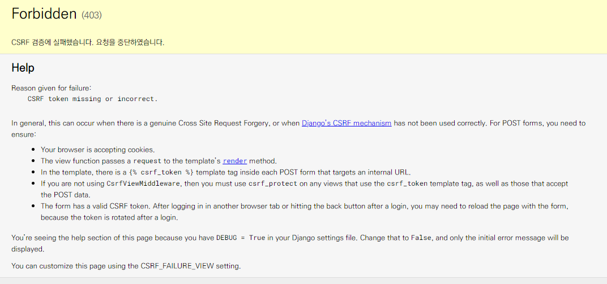
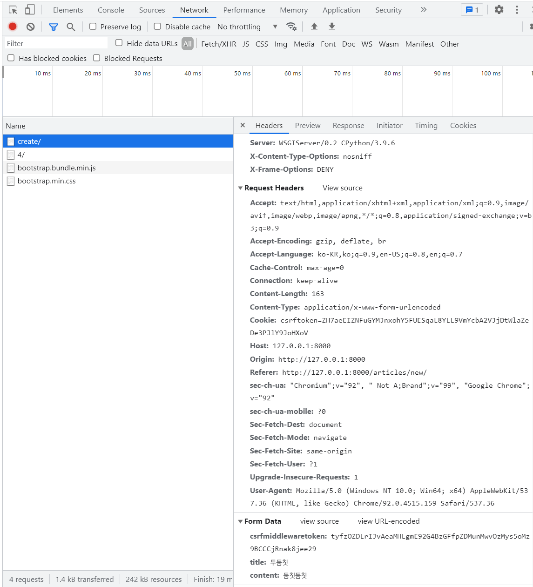

# CRUD with views


:::info CRUD

<b>CRUD</b>는 대부분의 컴퓨터 소프트웨어가 가지는 기본적인 데이터 처리 기능인 Create(생성), Read(읽기), Update(갱신), Delete(삭제)를 묶어서 일컫는 말이다.

:::


## CRUD 직접 작성해보기

1. 프로젝트 이름
   - crud
2. 앱 이름
   - articles
3. 앱 등록


<br/>


### skeleton 코드

```python
# urls.py

from django.contrib import admin
from django.urls import path, include

urlpatterns = [
    path('admin/', admin.site.urls),
    path('articles/', include('articles.urls')),
]
```

```python
# articles/urls.py

from django.urls import path
from . import views


app_name = 'articles'
urlpatterns = [
    path('', views.index, name='index'),
    path('new/', views.new, name='new'),
    path('create/', views.create, name='create'),
    path('<int:pk>/', views.detail, name='detail'),
    path('<int:pk>/delete/', views.delete, name='delete'),
    path('<int:pk>/edit/', views.edit, name='edit'),
    path('<int:pk>/update/', views.update, name='update'),
]
```

```python
# articles/views.py

from django.shortcuts import render, redirect

# Create your views here.
def index(request):
    pass


def new(request):
    pass


def create(request):
    pass


def detail(request, pk):
    pass


def delete(request, pk):
    pass


def edit(request, pk):
    pass


def update(request, pk):
    pass
```


<br/>


### base template

base 템플릿 작성 및 추가 템플릿 경로 등록

```html
<!-- crud/templates/base.html -->
<!DOCTYPE html>
<html lang="en">
<head>
  <meta charset="UTF-8">
  <meta http-equiv="X-UA-Compatible" content="IE=edge">
  <meta name="viewport" content="width=device-width, initial-scale=1.0">
  <link href="https://cdn.jsdelivr.net/npm/bootstrap@5.1.0/dist/css/bootstrap.min.css" rel="stylesheet" integrity="sha384-KyZXEAg3QhqLMpG8r+8fhAXLRk2vvoC2f3B09zVXn8CA5QIVfZOJ3BCsw2P0p/We" crossorigin="anonymous">
  <title>Document</title>
</head>
<body>
  <div class="container">
    
    
  </div>
  <script src="https://cdn.jsdelivr.net/npm/bootstrap@5.1.0/dist/js/bootstrap.bundle.min.js" integrity="sha384-U1DAWAznBHeqEIlVSCgzq+c9gqGAJn5c/t99JyeKa9xxaYpSvHU5awsuZVVFIhvj" crossorigin="anonymous"></script>
</body>
</html>
```

```python
TEMPLATES = [
    {
		...,
        'DIRS': [BASE_DIR, 'templates'],
        ...,
    },
]
```


<br/>


- 앱 템플릿 기본 형식

```html



  <h1>INDEX</h1>

```


<br/>


### READ (index)

- index 페이지 작성
- READ - 전체 게시글 조회

```python
# articles/urls.py

from django.urls import path
from . import views


app_name = 'articles'
urlpatterns = [
    path('', views.index, name='index'),
]
```

```python
# articles/views.py
from django.shortcuts import render
from .models import Article  # 장고는 명시적인 상대 경로 사용


def index(request):
    # 작성된 모든 게시글을 출력
    # 1. 모든 게시글 조회
    articles = Article.objects.all()
    context = {
        'articles': articles,
    }
    
    # 2. 게시글 정렬 순서 변경
    # articles = Article.objects.all()[::-1]  # python이 조작
    # 혹은
    # articles = Article.objects.order_by('-pk')  # DB가 조작
    return render(request, 'articles/index.html', context)
```

```html
<!-- templates/articles/index.html -->



  <h1>INDEX</h1>
  <hr>
  
    <p><b>제목</b> : {{ article.title }}</p>
    <p><b>내용</b> : {{ article.content }}</p>
    <hr>
  

```


<br/>


### CREATE

- CREATE - New views

```python
# articles/urls.py

urlpatterns = [
    ...,
    path('new/', views.new, name='new'),
    path('create/', views.create, name='create'),
    ...,
]
```

```python
# articles/views.py

def new(request):
    return render(request, 'articles/new.html')


def create(request):
    # new로 부터 title과 content를 받아서 저장
    title = request.GET.get('title')
    content = request.GET.get('content')

    # 1
    # article = Article()
    # article.title = title
    # article.content = content
    # article.save()

    # 2 우리는 앞으로 2번을 쓸 것. save 전에 추가 코드를 작성하여 유효성 검증을 할 수 있다.
    article = Article(title=title, content=content)
    article.save()

    # 3 유효성 검증을 할 틈이 없다.
    # Article.objects.create(title=title, content=content)

    return render(request, 'articles/create.html')
```

```html
<!-- templates/articles/new.html -->



  <h1>NEW</h1>
  <form action="" method="GET">
    <label for="title">Title: </label>
    <input type="text" id="title" name="title">
    <label for="content">Content: </label>
    <textarea name="content" id="content" cols="30" rows="10"></textarea>
    <input type="submit">
  </form>
  <hr>
  <a href="">back</a>

```

```html
<!-- templates/articles/index.html -->



  <h1>CREATE</h1>

```


<br/>


#### HTTP method

- **GET**
  - 특정 리소스를 가져오도록 요청할 때 사용
  - 반드시 데이터를 가져올 때만 사용해야 함
  - DB에 변화를 주지 않음
  - CRUD에서 R 역할을 담당

- **POST**
  - 서버로 데이터를 전송할 때 사용
  - 리소스를 생성/변경하기 위해 데이터를 HTTP body에 담아 전송
  - 서버에 변경사항을 만듦
  - CRUD에서 C/U/D 역할을 담당


- 위 CREATE 코드에서 GET을 모두 POST로 바꾼다면?




<br/>


#### 사이트 간 요청 위조 (Cross-Site-Request-Forgery)

- 웹 애플리케이션 취약점 중 하나로 사용자가 자신의 의지와 무관하게 공격자가 의도한 행동을 하여 특정 웹페이지를 보안에 취약하게 한다거나 수정, 삭제 등의 작업을 하게 만드는 공격 방법
- django는 CSRF에 대항하여 middleware와 template tag를 제공


<br/>


#### CSRF 공격 방어

- Security Token 18 4 (CSRF Token)
  - 사용자의 데이터에 임의의 난수 값을 부여해 매 요청마다 해당 난수 값을 포함시켜 전송 시키도록 함
  - 이후 서버에서 요청을 받을 때마다 전달된 token 값이 유효한지 검증
- 일반적으로 데이터 변경이 가능한 POST, PATCH, DELETE Method 등에 적용(GET 제외)
- django는 csrf token 템플릿 태그를 제공


<br/>


##### csrf token in Django

```django

```

- input type이 hidden으로 작성되며 value는 django에서 생성한 hash 값이 들어있음
- 해당 태그가 없다면 Django 서버는 403 forbidden을 응답


<br/>


- 태그 입력 후 페이지에 접속하면, 해당 위치에 다음과 같은 코드를 볼 수 있다.

```html
<input type="hidden" name="csrfmiddlewaretoken" value="hXoopBuGTEFWmCNLx3zDlHX9PcrHGdY4rbDcn8mJ1IuTRMpyZTVTjRMQVV0kfcBe">
```


<br/>


##### CsrfViewMiddleware

```python
# settings.py

MIDDLEWARE = [
    'django.middleware.security.SecurityMiddleware',
    'django.contrib.sessions.middleware.SessionMiddleware',
    'django.middleware.common.CommonMiddleware',
    'django.middleware.csrf. CsrfViewMiddleware',
    'django.contrib.auth.middleware.AuthenticationMiddleware',
    'django.contrib.messages.middleware.MessageMiddleware',
    'django.middleware.clickjacking.XFrameOptionsMiddleware',
]
```

- 해당 csrf attack 보안과 관련된 설정은 settings.py에서 MIDDLEWARE 에 되어있음
- 실제로 요청 과정에서 urls.py 이전에 Middleware의 설정 사항들을 순차적으로 거치며 응답은 반대로 하단에서 상단으로 미들웨어를 적용시킴


<br/>


:::tip [참고] Middleware

- 공통 서비스 및 기능을 애플리케이션에 제공하는 소프트웨어
- 데이터 관리, 애플리케이션 서비스, 메시징, 인증 및 API 관리를 주로 미들웨어를 통해 처리
- 개발자들이 애플리케이션을 보다 효율적으로 구축할 수 있도록 지원하며 애플리케이션, 데이터 및 사용자 사이를 연결하는 요소처럼 작동

:::


<br/>


#### CREATE 로직 수정

```python
# articles/views.py

def create(request):
    # new로 부터 title과 content를 받아서 저장
    title = request.POST.get('title')
    content = request.POST.get('content')

    article = Article(title=title, content=content)
    article.save()

    return render(request, 'articles/create.html')
```

```html
<!-- templates/articles/new.html -->



  <h1>NEW</h1>
  <form action="" method="POST">
    
    <label for="title">Title: </label>
    <input type="text" id="title" name="title">
    <label for="content">Content: </label>
    <textarea name="content" id="content" cols="30" rows="10"></textarea>
    <input type="submit">
  </form>
  <hr>
  <a href="">back</a>

```


<br/>


- POST 데이터 확인




```bash
$ pip install django-seed
```

```python
# settings.py

INSTALLED_APPS = (
    ...
    'django_seed',
)
```


<br/>


### INDEX 페이지로 돌아가기

```python
# articles/views.py

def create(request):
    ...
    return render(request, 'articles/index.html')
```

1. 글을 작성 후 index 페이지가 출력되지만 게시글이 조회되지 않음
2. URL은 여전이 create에 머물러 있음
   - 단순히 index 페이지만 render 되었을 뿐이고 url이 돌아가지 못했기 때문


<br/>


#### Django shortcut function – `redirect()`

- 새 URL로 되돌림
- 인자에 따라 HttpResponse Redirect를 반환
- 브라우저는 현재 경로에 따라 전체 URL 자체를 재구성(reconstruct)
- 사용 가능한 인자
  1. **model**
  2. **view name**: viewname can be URL pattern name or callable view object.
  3. absolute or relative URL


<br/>


- **redirect 함수 적용**

```python
def create(request):
    # new로 부터 title과 content를 받아서 저장
    title = request.POST.get('title')
    content = request.POST.get('content')

    article = Article(title=title, content=content)
    article.save()
	# return redirect('/articles/')
    return redirect('articles:index')
```


<br/>


### Detail

- 개별 게시글 상세 페이지
- 글의 번호(pk)를 활용해서 각각의 페이지를 따로 구현해야 함
- 무엇을 활용할 수 있을까?→ Variable Routing

```python
# articles/views.py
def detail(request, pk):
	article = Article.objects.get(pk=pk)
	context = {
		'article': article,
	}
	return render(request, 'articles/detail.html', context)
```

- 오른쪽 pk는 variable routing을 통해 받은 pk
- 왼쪽 pk는 DB에 저장된 레코드의 pk (id)


<br/>


- Detail 페이지 및 링크 작성

```html
<!-- templates/articles/detail.html -->




  <h2>DETAIL</h2>
  <h3>{{ article.pk }} 번째 글</h3>
  <hr>
  <p>제목 : {{ article.title }}</p>
  <p>내용 : {{ article.content }}</p>
  <p>작성시각 : {{ article.created_at }}</p>
  <p>수정시각 : {{ article.updated_at }}</p>
  <hr>
  <a href="">[back]</a>

```

```html
<!-- templates/articles/index.html -->




  <h1>Articles</h1>
  <a href="">[NEW]</a>
  <hr>
  
    <p>글 번호 : {{ article.pk }}</p>
    <p>글 제목 : {{ article.title }}</p>
    <p>글 내용 : {{ article.content }}</p>
    <a href="">[DETAIL]</a>
    <hr>
  

```


<br/>


- redirect 인자 변경

```python
# articles/views.py

def create(request):
    ...
    return redirect('articles:detail', article.pk)
```


<br/>


### DELETE

모든 글을 삭제하는 것이 아니라 삭제하고자 하는 특정 글을 삭제

```python
# articles/views.py

def delete(request, pk):
    article = Article.objects.get(pk=pk)
    article.delete()
    return redirect('articles:index')
```

```python
# articles/urls.py

...

urlpatterns = [
    ...
    path('<int:pk>/delete/', views.delete, name='delete'),
    ...
]
```


<br/>


- FORM 태그로 작성한다.
  - 데이터베이스에 영향을 주는 중요한 작업이기 때문에

```django
<!-- templates/articles/detail.html -->




  ...
  <form action="" method="POST">
    
    <button class="btn btn-danger">DELETE</button>
  </form>
  <a href="">[back]</a>

```


<br/>


:::tip 삭제 전 확인

브라우저를 조작하는 것은 JavaScript

```html
<button onclick="return confirm('삭제하시겠습니까?')" class="btn btn-danger">삭제</button>
```

:::


<br/>


- HTTP Method POST에서만 삭제될 수 있도록 조건 작성

```python
# articles/views.py
def delete(request, pk):
    article = Article.objects.get(pk=pk)
    if request.method == 'POST':  # request method가 POST일 때만 지우겠다.
        article.delete()
        return redirect('articles:index')
    else:
        return redirect('articles:detail', article.pk)
```


<br/>


### EDIT

수정은 기존에 입력 되어 있던 데이터를 보여주는 것이 좋기 때문에 html 태그의 value 속성을 사용

(textarea 태그는 value 속성이 없으므로 태그 내부 값으로 작성)


```python
# articles/views.py

def edit(request, pk):
    article = Article.objects.get(pk=pk)
    context = {
        'article': article,
    }
    return render(request, 'articles/edit.html', context)
```

```python
# articles/urls.py

...

urlpatterns = [
    ...
    path('<int:pk>/edit/', views.edit, name='edit'),
    ...
]
```


<br/>


- 수정은 기존에 입력되어 있는 데이터를 보여주는 것이 좋기 때문에 html 태그의 value 속성을 사용
  - textarea 태그는 value 속성이 없으므로 태그 내부 값으로 작성

```django
<!-- templates/articles/edit.html -->




  <h1>EDIT</h1>
  <form action="" method="POST">
    
    <label for="title">Title: </label>
    <input type="text" name="title" id="title" value="{{ article.title }}"><br>
    <label for="content">Content: </label>
    <textarea name="content" id="content" cols="30" rows="5">{{ article.content }}</textarea><br>
    <input type="submit">
  </form>
  <hr>
  <a href="">[back]</a>

```


<br/>


- detail.html에 edit 링크 작성

```html
<! -- articles/detail.html -->



  <h2_class='text-center'>DETAIL</h2>
  ...
  <a href="" class="btn btn-primary">EDIT</a><br>
  <form action="" method="POST">
    
    <button class="btn btn-danger">DELETE</button>
  </form><br/>
  <a href="">[back]</a>

```


<br/>


### UPDATE

```python
# articles/views.py

def update(request, pk):
    article = Article.objects.get(pk=pk)

    article.title = request.POST.get('title')
    article.content = request.POST.get('content')
    article.save()

    return redirect('articles:detail', article.pk)
```

```python
# articles/urls.py

...

urlpatterns = [
    ...
    path('<int:pk>/update/', views.update, name='update'),
    ...
]
```


<br/>


- create와 마찬가지로 별도의 '글이 수정되었습니다' 라는 메시지를 보여줄 문서가 필요하지 않음

```html
<!-- templates/articles/edit.html -->




  ...
  <form action="" method="POST">
    ...
  </form>

```


<br/>


## 마무리


- Model
  - 웹 애플리케이션의 데이터를 구조화하고 조작하기 위한 도구
- Database
  - 체계화 된 데이터의 모임(집합)
- Migrations
  - django가 model에 생긴 변화 (필드를 추가했다던가 모델을 삭제했다던가 등)를 반영하는 방법


- ORM
  - OOP 언어를 사용하여 데이터베이스와 OOP 언어 간의 호환되지 않는 데이터를 변환하는 프로그래밍 기법
- Database API
  - DB를 조작하기 위한 도구 (QuerySet API, CRUD)
- Admin Site
  - 사용자가 아닌 서버의 관리자가 활용하기 위한 페이지
