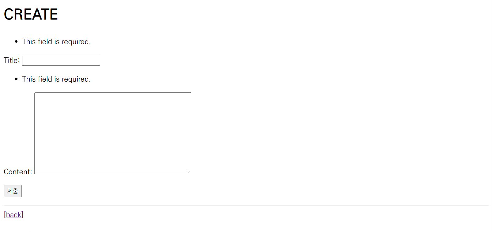
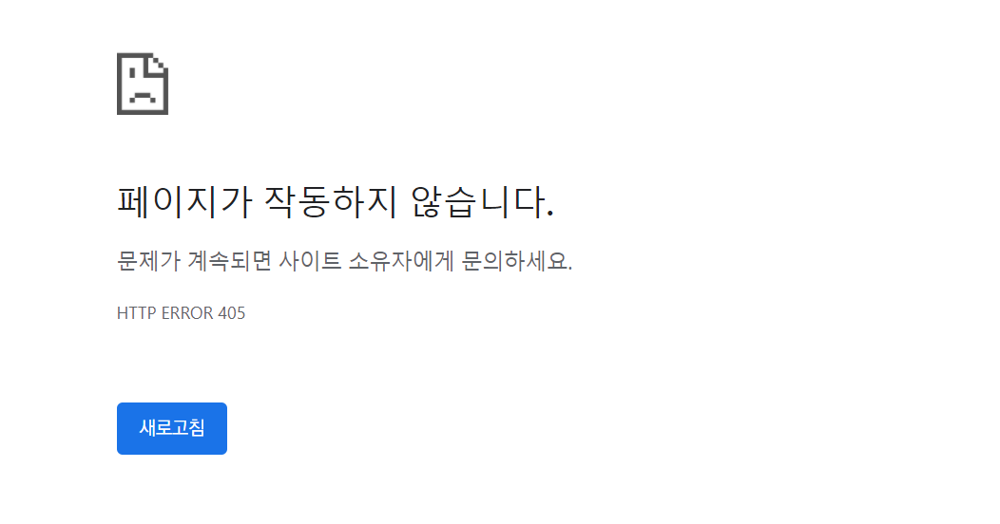

# Form & ModelForm


:::info Form
- Form Class
- ModelForm
- Rendering fields manually
- Handling HTTP requests

:::

<br/>

## Form

- 우리는 지금까지 HTML form, input을 통해서 사용자로부터 데이터를 받음
- 이렇게 직접 사용자의 데이터를 받으면 입력된 데이터의 유효성을 검증하고, 필요시에 입력된 데이터를 검증 결과와 함께 다시 표시하며, 유효한 데이터에 대해 요구되는 동작을 수행하는 것을 **올바르게** 하기 위해서는 꽤나 많은 노력이 필요한 작업임
- Django는 일부 과중한 작업과 반복 코드를 줄여줌으로써, 이 작업을 훨씬 쉽게 만들어 줌 : **Django Form**

<br/>

:::note Django Form을 사용하는 이유
1. Validation
2. 귀찮은 HTML 생성

:::

<br/>

### Django's Forms

- Form은 Django 프로젝트의 주요 **유효성 검사 도구**들 중 하나이며, 공격 및 우연한 데이터 손상에 대한 중요한 방어수단
- Django는 위와 같은 form 기능의 방대한 부분을 단순화하고 자동화 할 수 있으며, 프로그래머가 직접 작성한 코드에서 수행할 수 있는 것보다 **더 안전하게 수행**할 수 있음


- Django는 Form에 관련된 작업의 아래 세 부분을 처리해 줌
  1. 렌더링을 위한 데이터 준비 및 재구성
  2. 데이터에 대한 HTML forms 생성
  3. 클라이언트로부터 받은 데이터 수신 및 처리

- https://docs.djangoproject.com/en/3.2/topics/forms/#django-s-role-in-forms

<br/>

### Form Class

- **Django Form 관리 시스템의 핵심**
- form 내 field, field 배치, 디스플레이 widget, label, 초기값, 유효하지 않는 field에 관련된 에러 메세지를 결정


- Django는 사용자의 데이터를 받을 때 해야 할 **과중한 작업**(데이터 유효성 검증, 필요 시 입력된 데이터 검증 결과 재출력, 유효한 데이터에 대해 요구되는 동작 수행 등)**과 반복 코드를 줄여 줌**
- https://docs.djangoproject.com/en/3.2/topics/forms/#the-django-form-class

  

<br/>

#### Form 선언하기

```python
# articles/forms.py
# form은 model과 상관 없는 form일 뿐
from django import forms

class ArticleForm(forms.Form):
    # attrs, widget 옵션은 HTML을 만들기 위해 존재함
	title = forms.CharField(max_length=10)
	content = forms.CharField()
    
"""
class ArticleForm(forms.Form):
    # attrs, widget 옵션은 HTML을 만들기 위해 존재함
	title = forms.CharField(max_length=10)
	content = forms.CharField(widget=forms.Textarea(attrs={
        'class': 'form-control',
        'placeholder': '내용을 입력하세요.'
    }))
"""
```

- Model을 선언하는 것과 유사하며 같은 필드타입을 사용 (또한, 일부 매개변수도 유사함)
- **forms 라이브러리에서 파생된 Form 클래스를 상속**받음

<br/>

### New view 수정

```python
# articles/view.py

def new(request):
    form = ArticleForm()
    context = {
        'form': form,
    }
    return render(request, 'articles/new.html', context)
```

```html
<!-- new.html -->




  <h1>NEW</h1>
  <form action="" method="POST">
    
    {{ form.as_p }}
    <input type="submit">
  </form>
  <hr>
  <a href="">[back]</a>

```

<br/>

#### From rendering options

`<label>` & `<input>` 쌍에 대한 3가지 출력 옵션


1. `as_p()`
   - 각 필드가 단락(`<p>` 태그)으로 감싸져서 렌더링 됨
2. `as_ul()`
   - 각 필드가 목록 항목(`<li>` 태그)으로 감싸져서 렌더링 됨
   - `<ul>` 태그는 직접 작성해야 함
3. `as_table()`
   - 각 필드가 테이블(`<tr>` 태그) 행으로 감싸져서 렌더링 됨
   - ` <table>`태그는 직접 작성해야 함

- https://docs.djangoproject.com/en/3.2/topics/forms/#form-rendering-options

<br/>

:::info Django의 HTML input 요소 표현 방법 2가지

1. <b>Form fields</b>

   - input에 대한 유효성 검사 로직을 처리하며 템플릿에서 직접 사용 됨

2. <b>Widgets</b>

   - 웹 페이지의 HTML input 요소 렌더링
   - GET/POST 딕셔너리에서 데이터 추출
   - 하지만 <b>widgets은 반드시 form fields에 할당 됨</b>

:::

<br/>

### Widgets

- Django의 HTML input element 표현
- HTML 렌더링을 처리
- https://docs.djangoproject.com/en/3.2/ref/forms/widgets/

<br/>

:::warning 주의사항

- Form Fields와 혼동되어서는 안됨
- Form Fields는 input 유효성 검사를 처리
- Widgets은 웹페이지에서 input element의 단순 raw한 렌더링 처리

:::

<br/>

```python
# articles/forms.py

from django import forms

class ArticleForm(forms.Form):
    title = forms.CharField(max_length=10)
    content = forms.CharField(widget=forms.Textarea)
```

<br/>

####  Form field 및 widget 응용

```python
# articles/forms.py

from django import forms


class ArticleForm(forms.Form):
    REGION_A = 'sl'
    REGION_B = 'dj'
    REGION_C = 'gj'
    REGION_D = 'gm'
    REGION_E = 'bs'
    REGION_CHOICES = [
        (REGION_A, '서울'),
        (REGION_B, '대전'),
        (REGION_C, '광주'),
        (REGION_D, '구미'),
        (REGION_E, '부산'),
    ]

    title = forms.CharField(max_length=10)
    content = forms.CharField(widget=forms.Textarea)
    region = forms.ChoiceField(choices=REGION_CHOICES, widget=forms.Select())
```

- https://docs.djangoproject.com/en/3.2/ref/forms/widgets/#selector-and-checkbox-widgets
- https://docs.djangoproject.com/en/3.2/internals/contributing/writing-code/coding-style/#model-style


<br/>

## ModelForm

### Introduction

- Article **모델이 있고 사용자가 게시글을 제출할 수 있는 양식을 만들고 싶은 경우**
- 이미 모델에서 필드를 정의했기 때문에 form에서 필드를 재정의 하는 중복된 행위 발생
- 그래서 Django는 Model을 통해 Form Class를 만들 수 있는 Helper를 제공 : **ModelForm**

<br/>

### ModelForm Class

- Model을 통해 Form Class를 만들 수 있는 Helper
- 일반 Form Class와 완전히 같은 방식(객체 생성)으로 view에서 사용 가능

<br/>

#### ModelForm 선언하기

```python
# articles/forms.py

from django import forms
from .models import Article

class ArticleForm(forms.ModelForm):

    class Meta:
		model = Article
        # fields, exclude는 모델의 필드에만 적용됨.
		fields = '__all__'
		# exclude = ('title', )
```

- forms 라이브러리에서 파생된 ModelForm 클래스를 상속받음
- **정의한 클래스 안에 Meta 클래스를 선언하고, 어떤 모델을 기반으로 form을 작성할 것인지에 대한 정보를 Meta클래스에 지정**
- https://docs.djangoproject.com/en/3.2/topics/forms/modelforms/#creating-forms-from-models
- https://docs.djangoproject.com/en/3.2/topics/forms/modelforms/#selecting-the-fields-to-use

<br/>

#### Meta class

- Model의 정보를 작성하는 곳
- ModelForm을 사용할 경우 사용할 모델이 있어야 하는데 Meta class가 이를 구성함
  - 해당 model에 정의한 field 정보를 Form에 적용하기 위함

<br/>

:::note 참고 : Inner class (Nested class)

- 클래스 내에 선언된 다른 클래스
- 관련 클래스를 함께 그룹화 하여 가독성 및 프로그램 유지 관리를 지원 (논리적으로 묶어서 표현)
- 외부에서 내부 클래스에 접근할 수 없으므로 코드의 복잡성을 줄일 수 있음

:::

:::note 참고 : Meta 데이터

- "데이터에 대한 데이터"
- ex) 사진 촬영 - 사진 데이터 - 사진의 메타 데이터 (촬영 시각, 렌즈, 조리개 값 등)

:::

<br/>

### Create view 수정

```python
# articles/views.py

def create(request):
    # 데이터 검증 (+ HTML)
	form = ArticleForm(request.POST)
	if form.is_valid():
		article = form.save()
		return redirect('articles:detail', article.pk)
    # 빈 form으로 render (에러 메세지가 없다.)
    return redirect('articles:new')
```

```python
# articles/views.py

def create(request):
    # 검증 (+ HTML)
	form = ArticleForm(request.POST)
	if form.is_valid():
		article = form.save()
		return redirect('articles:detail', article.pk)
    else:
        # 에러메세지
        context = {'form': form}
    	return render(request, 'articles/new.html', context)
```



<br/>

#### `is_valid( )` method

- 유효성 검사를 실행하고, 데이터가 유효한지 여부를 boolean으로 반환
- 데이터 유효성 검사를 보장하기 위한 많은 테스트에 대해 django는 `is_valid()`를 제공
- https://docs.djangoproject.com/en/3.2/ref/forms/api/#django.forms.Form.is_valid

<br/>

:::note 참고: 유효성 검사

- 요청한 데이터가 특정 조건에 충족하는지 확인하는 작업
- 데이터베이스 각 필드 조건에 올바르지 않은 데이터가 서버로 전송되거나, 저장되지 않도록 하는 것

:::

<br/>

#### The `save()` method

- form에 바인딩 된 데이터에서 **데이터베이스 객체를 만들고 저장**
- ModelForm의 하위(sub) 클래스는 기존 모델 인스턴스를 **키워드 인자 instance**로 받아 들일 수 있음
  - 이것이 제공되면 save()는 해당 인스턴스를 업데이트 (UPDATE)
  - 제공되지 않은 경우 save()는 지정된 모델의 새 인스턴스를 만듦 (CREATE)
- form 의 유효성이 확인되지 않은 경우(hasn't been validated) `save()`를 호출하면 form.errors를 확인하여 에러 확인 가능
- https://docs.djangoproject.com/en/3.2/topics/forms/modelforms/#the-save-method


```python
# Create a form instance from POST data
form = ArticleForm(request.POST)

# CREATE
# Save a new Article object from the form's data.
new_article = f.save()

# UPDATE
# Create a form to edit an existing Article, but use POST data to populate the form.
article = Article.objects.get(pk=1)
form = ArticleForm(request.POST, instance=article)
form.save()
```

<br/>

#### Create view 함수 구조 변경 ⭐

- new view 함수, url path 삭제

```python
# articles/views.py

def create(request):
    if request.method == 'POST':
        form = ArticleForm(request.POST)
        if form.is_valid():
            article = form.save()
            return redirect('ariticles:detail', article.pk)
    else:
        form = ArticleForm()
    context = {
        'form': form
    }
    return render(request, 'articles/create.html', context)
```

```python
#  구조 이해하기

def create(request):
    # 5. 사용자가 데이터를 입력 & POST /articles/create/ => invalid data
    # 10. 사용자가 데이터를 입력 & POST /articles/create/ => valid data
    if request.method == 'POST':
        # 6. 데이터를 검증할 ArticleForm 인스턴스 초기화 => 내용 있음
        # 11. 데이터를 검증할 ArticleForm 인스턴스 초기화 => 내용 있음
        form = ArticleForm(request.POST)
        # 7. 검증 => 실패
        # 12. 검증 => 성공
        if form.is_valid():
            # 13. form 을 통해 데이터 저장
            article = form.save()  
            # 14. /articles/<pk>/ 로 redirect 하도록 응답
            return redirect('articles:detail', article.pk)
    # 1. GET /articles/create/ => 빈 form 요청
    else:
        # 2. 비어있는 ArticleForm 인스턴스를 초기화 => 빈 form 생성
        form = ArticleForm()

    # 3. 빈 form 을 context에 담음
    # 8. 에러 메시지를 담은 form을 context에 담음
    context = {'form': form}

    # 4. 사용자에게 빈 form 제공
    # 9. 에러 미시지를 포함한 form 제공
    return render(request, 'articles/new.html', context)
```

<br/>

- `new.html` →  `create.html` 이름 변경
- 이제는 action 값이 없어도 동작

```html
<!-- create.html -->



  <h1>CREATE</h1>
  <form action="" method="POST">
    
    {{ form.as_p }}
    <input type="submit">
  </form>
  <hr>
  <a href="">[back]</a>

```

<br/>

- input 태그에 공백 데이터를 넣어보고 글 작성 → 에러 메세지 출력 확인


<br/>

- create 페이지 링크 작성

```html
<!-- index.html -->



  <h1>Articles</h1>
  <a href="">[CREATE]</a>
  <hr>
  
    <p>글 번호 : {{ article.pk }}</p>
    <p>글 제목 : {{ article.title }}</p>
    <p>글 내용 : {{ article.content }}</p>
    <a href="">[DETAIL]</a>
    <hr>
  

```

<br/>

### Widgets

- django의 HTML input element 표현
- HTML 렌더링을 처리
- 2가지 작성 방식을 가짐

<br/>

#### Widgets - 첫 번째 방식

```python
# articles/forms.py
class ArticleForm(forms.ModelForm):

    class Meta:
        model = Article
        fields = '__all__'
        widget= {
            'title': forms.TextInput(attrs={
                'class': 'my-title',
                'placeholder': 'Enter the title',
                'maxlength': 10,
            	}
            )

        }
```

<br/>

#### Widgets - 두 번째 방식 (권장)

```python
# articles/forms.py
class ArticleForm(forms.ModelForm):
    title = forms.CharField(
        label='제목',
        widget=forms.TextInput(
            attrs={
                'class': 'my-title',
                'placeholder': 'Enter the title',
            }
        )
    )

    class Meta:
        model = Article
        fields = '__all__'
```

<br/>

#### Widgets 적용하기


```python
# articles/forms.py
class ArticleForm(forms.ModelForm):
    title = forms.CharField(
        label='제목',
        widget=forms.TextInput(
            attrs={
                'class': 'my-title',
                'placeholder': 'Enter the title',
                'maxlength': 10,
            }
        )
    )
    content = forms.CharField(
        label='제목',
        widget=forms.Textarea(
            attrs={
                'class': 'my-content',
                'placeholder': 'Enter the content',
                'rows': 5,
                'cols': 50,
            }
        )
    )

    class Meta:
        model = Article
        fields = '__all__'
```

<br/>

### Delete view 작성

```python
# articles/views.py

def delete(request, pk):
    article = Article.objects.get(pk=pk)
    if request.method == 'POST':
        article.delete()
        return redirect('articles:index')
    else:
        return redirect('articles:detail', article.pk)
```

```html
<form action="" method="POST">
  
  <button>DELETE</button>
</form>
```


### Update view 수정

- update view 함수 작성
- edit path & edit view 함수 삭제

```python
# articles/views.py

def update(request, pk):
    # article = Article.objects.get(pk=pk)
    article = get_object_or_404(Article, pk=pk)
    # update
    if request.method == 'POST':
        # Create a form to edit an existing Article,
        # but use POST data to populate the form.
        form = ArticleForm(request.POST, instance=article)
        if form.is_valid():
            form.save()
            return redirect('articles:detail', article.pk)
    # edit
    else:
        # Creating a form to change an existing article.
        form = ArticleForm(instance=article)
    context = {
        'article': article,
        'form': form,
    }
    return render(request, 'articles/update.html', context)
```

```html
<!-- update.html -->




  <h1>UPDATE</h1>
  <form action="" method="POST">
    
    {{ form.as_p }}
    <input type="submit">
  </form>
  <hr>
  <a href="">[back]</a>

```

```html
<!-- detail.html -->

<a href="">[UPDATE]</a>
```

<br/>

:::note Form & ModelForm

- **Form**
  - 어떤 model에 저장해야 하는지 알 수 없으므로 유효성 검사 이후 cleaned_data 딕셔너리를 생성
  - cleaned_data 딕셔너리에서 데이터를 가져온 후 .save() 호출해야 함
  - model에 연관되지 않은 데이터를 받을 때 사용
- **Model Form**
  - django가 해당 model에서 양식에 필요한 대부분의 정보를 이미 정의
  - 어떤 레코드를 만들어야 할 지 알고 있으므로 바로 .save() 호출 가능

:::

<br/>

## Rendering fields manually

:::note 수동으로 Form 작성하기

1. Rendering fields manually
2. Looping over the form's fields (``)

:::

<br/>

### 1. Rendering fields manually

```html
<!-- articles/create.html -->

<h1>CREATE</h1>
...
<hr>

<form action="" method="POST">
  
  <div>
    {{ form.title.errors }}
    {{ form.title.label_tag }}
    {{ form.title}}
  </div>
  <div>
    {{ form.content.errors }}
    {{ form.content.label_tag }}
    {{ form.content }}
  </div>
  <button class="btn btn-primary">작성</button>
</form>
```

<br/>

### 2. Looping over the form's fields

```html
<!-- articles/create.html -->

...

<hr>

<form action="" method="POST">
  
  
    {{ field.errors }}
    {{ field.label_tag }}
    {{ field }}
  
  <button class="btn btn-primary">작성</button>
</form>
```

<br/>

### Bootstrap과 함께 사용하기

1. Bootstrap class with widgets
2. Django Bootstrap 5 Library

<br/>

#### Bootstrap Form class

- Bootstrap Form을 사용해 적용
- https://getbootstrap.com/docs/5.1/forms/overview/
- 핵심 클래스: **form-control**

<br/>

- Bootstrap Form의 핵심 class를 widget에 작성

```python
# forms.py

class ArticleForm (forms.ModelForm):
	title= forms.CharField(
		label='제목',
		widget=forms.TextInput(
			attrs={
				'class': 'my-title form-control',
				'placeholder': 'Enter the title',
		}),
	)
	content = forms.CharField(
		label='내용',
		widget=forms.Textarea(
			attrs={
				'class': 'my-content form-control',
				'placeholder': 'Enter the content',
				'rows': 5,
				'cols': 50,
		}),
		error_messages={
			'required': '내용을 입력하세요.',
		}
    )
```

<br/>

- 에러 메시지 with bootstrap alert 컴포넌트

```html
<!-- articles/create.html -->

<form action="" method="POST">
	
	
		
			
				<div class="alert alert-warning" role="alert">{{ error|escape }}</div>
			
		
		<div class="form-group">
			{{ field.label_tag }}
			{{ field }}
		</div>
	
	<button class="btn btn-primary"></button>
</form>
```

<br/>

#### Django Bootstrap Library

- django-bootstrap v5
  - form class에 bootstrap을 적용시켜주는 라이브러리

```bash
$ pip install django-bootstrap-v5
```

```python
# settings.py

INSTALLED_APPS = [
    ...,
    'bootstrap5',
    ...,
]
```

<br/>

- 설치한 라이브러리 적용해보기

```html
<!-- articles/base.html -->



<!DOCTYPE html>
<html lang="ko">
<head>
  <meta charset="UTF-8">
  <meta name="viewport" content="width=device-width, initial-scale=1.0">
  
  <title>Document</title>
</head>
<body>
  <div class="container">
    
    
  </div>
  
</body>
</html>
```

```html
<!-- article/update.html -->





  <h1>UPDATE</h1>
  <form action="" method="POST">
    
    
     
  </form>
  <hr>
  <a href="">[back]</a>

```

<br/>

## Handling HTTP requests

- Django에서 HTTP 요청을 처리하는 방법
  1. Django shortcut functions
  2. View decorators

<br/>

### 1. Django shortcuts functions

- `django.shortcuts` 패키지는 개발에 도움 될 수 있는 여러 함수와 클래스를 제공

  

- **shortcuts function 종류**

  - `render()`
  - `redirect()`
  - `get_object_or_404()`
  - `get_list_or_404()`

- https://docs.djangoproject.com/en/3.2/topics/http/shortcuts/

<br/>

#### `get_object_or_404()`

- 모델 manager objects에서 `get()`을 호출하지만, 해당 객체가 없을 경우 `DoesNotExist` 예외 대신 Http 404 를 raise
- `get()` 메서드의 경우 조건에 맞는 데이터가 없을 경우에 에러를 발생 시킴
  - 코드 실행 단계에서 발생한 에러에 대해서 브라우저는 http status code 500으로 인식함
- 상황에 따라 적절한 예외처리를 하고 클라이언트에게 올바른 에러를 전달하는 것 또한 개발의 중요한 요소 중 하나
- https://docs.djangoproject.com/en/3.2/topics/http/shortcuts/#get-object-or-404

<br/>

- `get_object_or_404()` 작성 전: 존재하지 않는 게시글 조회 시

```
[06/Sep/2021 15:56:04] "GET /articles/100/ HTTP/1.1" 500 78822
```

- `get_object_or_404()` 작성 후: 존재하지 않는 게시글 조회 시

```python
# views.py
from django.shortcuts import get_object_or_404

def detail(request, pk):
    article = get_object_or_404(Article, pk=pk)
    
def update(request, pk):
    article = get_object_or_404(Article, pk=pk)
    
def delete(request, pk):
    article = get_object_or_404(Article, pk=pk)
    
"""
from django.http.response import Http404, HttpResponse

try:
    article = Article.objects.get(pk=pk)
except Article.DoesNotExist:
    raise Http404('존재하지 않는 게시물입니다.')
"""
```

```
[06/Sep/20211 15:56:49] "GET /articles/100/ HTTP/1.1" 404 1739
```

<br/>

### 2. Django View decorators

- Django는 다양한 HTTP 기능을 지원하기 위해 뷰에 적용할 수 있는 여러 데코레이터를 제공
- https://docs.djangoproject.com/en/3.2/topics/http/decorators/#module-djangoviews.decorators.http

<br/>

:::note 참고: Decorator (데코레이터)

- 어떤 함수에 기능을 추가하고 싶을 때, 해당 함수를 수정하지 않고 기능을 연장 해주는 함수
- django는 다양한 기능을 지원하기 위해 view 함수에 적용 할 수 있는 여러 데코레이터를 제공

:::

<br/>

- **Allowed HTTP methods**
  - 요청 메서드에 따라 view 함수에 대한 엑세스를 제한
  - 요청이 조건을 충족시키지 못하면 `HttpResponseNotAllowed`을 return (405 Method Not Allowed)
  - `require_http_methods()`, `require_POST()`, `require_safe()`, `require_GET()`

```python
def delete(request, pk):
    article = get_object_or_404(Article, pk=pk)
    if request.method == 'POST':
        article.delete()
        return redirect('articles:index')
    else:
        from django.http.response import HttpResponseNotAllowed
        return HttpResponseNotAllowed('POST')
```



<br/>

- `require_http_methods()`
  - view 함수가 특정한 method 요청에 대해서만 허용하도록 하는 데코레이터


- `require_POST()`
  - view 함수가 POST method 요청만 승인하도록 하는 데코레이터

<br/>

#### View decorators 작성

```python
# views.py

from django.shortcuts import render, redirect, get_object_or_404
from django.views.decorators.http import require_http_methods, require_POST, require_safe
from .models import Article
from .forms import ArticleForm

"""
require_safe == require_http_methods(['GET', 'HEAD'])
require_POST == require_http_methods(['POST'])
"""


# Create your views here.
@require_safe
def index(request):
    articles = Article.objects.order_by('-pk')
    
    context = {
        'articles': articles,
    }
    return render(request, 'articles/index.html', context)


@require_http_methods(['GET', 'POST'])
def create(request):
    # create
    if request.method == 'POST':
        form = ArticleForm(data=request.POST)
        if form.is_valid():
            article = form.save()
            return redirect('articles:detail', article.pk)
    else:
    # new
        form = ArticleForm()
    context = {
        'form': form,
    }
    return render(request, 'articles/create.html', context)


@require_safe
def detail(request, pk):
    # article = Article.objects.get(pk=pk)
    article = get_object_or_404(Article, pk=pk)
    context = {
        'article': article,
    }
    return render(request, 'articles/detail.html', context)


@require_POST
def delete(request, pk):
    # article = Article.objects.get(pk=pk)
    article = get_object_or_404(Article, pk=pk)
    article.delete()
    return redirect('articles:index')


@require_http_methods(['GET', 'POST'])
def update(request, pk):
    # article = Article.objects.get(pk=pk)
    article = get_object_or_404(Article, pk=pk)
    # update
    if request.method == 'POST':
        form = ArticleForm(request.POST, instance=article)
        if form.is_valid():
            form.save()
            return redirect('articles:detail', article.pk)
    # edit
    else:
        form = ArticleForm(instance=article)
    context = {
        'article': article,
        'form': form,
    }
    return render(request, 'articles/update.html', context)
```

<br/>

#### 데코레이터 동작 확인

- url 로 delete 시도 후 405 http status code 확인

```
Method Not Allowed (GET): /articles/3/delete/
[06/Sep/2021 16:52:10] "GET /articles/3/delete/ HTTP/1.1" 405 0
```

<br/>


### Create와 Update의 template이 같아진다.

- template 하나만 설정

```html
<!-- templates/form.html -->

<form method="POST">
  

  <!-- form 은 input 관련해서만 생성 -->
  {{ form.as_p }}

  <button>제출</button>
</form>
```

```python
@require_http_methods(['GET', 'POST'])
def create(request):
    ...
    return render(request, 'articles/form.html', context)

@require_http_methods(['GET', 'POST'])
def update(request, article_pk):
    ...
    return render(request, 'articles/form.html', context)
```


## 결론

- HTTP 요청에 따라 적절한 예외처리, 데코레이터를 통해 서버를 보호하고 클라이언트에게 정확한 상황을 제공하는 것의 중요성


