# Authentication System

:::info Authentication System

- The Django Authentication System
- 쿠키와 세션
- 로그인
- 로그아웃
- 로그인 사용자에 대한 접근 제한
- 회원가입
- 회원탈퇴
- 회원정보 수정
- 비밀번호 변경

:::

<br/>


## The Django Authentication System

- Django 인증 시스템은 `django.contrib.auth`에 Django contrib module로 제공
- 필수 구성은 settings.py에 이미 포함되어 있으며 `INSTALLED_APPS `설정에 나열된 아래 두 항목으로 구성됨
  1. `django.contrib.auth`
     - 인증 프레임워크의 핵심과 기본 모델을 포함
  2. `django.contrib.contenttypes`
     - 사용자가 생성한 모델과 권한을 연결할 수 있음

```python
# settings.py
INSTALLED_APPS [
   'django.contrib.admin',
   'django.contrib.auth',
   'django.contrib.contenttypes',
   'django.contrib.sessions',
   'django.contrib.messages',
   'django.contrib.staticfiles',
]
```

<br/>

- Django 인증 시스템은 **인증(Authentication)**과 **권한(Authorization)** 부여를 함께 제공(처리)하며, 이러한 기능이 어느 정도 결합되어 일반적으로 인증 시스템이라고 함
- [공식문서](https://docs.djangoproject.com/en/3.2/topics/auth/default/#using-the-django-authentication-system)
- [공식문서](https://docs.djangoproject.com/en/3.2/topics/auth/#user-authentication-in-django)


<br/>

### Authentication & Authorization

- **Authentication** (인증)
  - 신원 확인
  - 사용자가 자신이 누구인지 확인하는 것
- **Authorization** (권한, 허가)
  - 권한 부여
  - 인증된 사용자가 수행할 수 있는 작업을 결정

<br/>

### 두번째 앱 (accounts) 생성하기

```bash
$ python manage.py startapp accounts
```

- app 이름이 반드시 accounts 일 필요는 없음
- 단, auth와 관련해 django 내부적으로 accounts라는 이름으로 사용되고 있기 때문에 되도록 accounts로 지정하는 것을 권장

<br/>

```python
# settings.py

INSTALLED_APPS = [
    'articles',
    'accounts',
    ...
]
```

```python
# crud/urls.py

urlpatterns = [
    ...,
    path('accounts/', include('accounts.urls')),
]
```

```python
# accounts/urls.py

from django.urls import path
from . import views

app_name = 'accounts'
urlpatterns = [

]
```

<br/>

## 쿠키와 세션

### HTTP

- **Hyper Text Transfer Protocol**
  - HTML 문서와 같은 리소스(자원, 데이터)들을 가져올 수 있도록 해주는 프로토콜(규칙, 규약)
  - 웹에서 이루어지는 모든 데이터 교환의 기초
  - 클라이언트-서버 프로토콜이기도 함
- [참고](https://developer.mozilla.org/en-US/docs/Web/HTTP/Overview#http_is_stateless_but_not_sessionless)

<br/>

#### HTTP 특징
- **비연결지향** (connectionless)
  - 서버는 요청에 대한 응답을 보낸 후 연결을 끊음
- **무상태** (stateless)
  - 연결을 끊는 순간 클라이언트와 서버 간의 통신이 끝나며 상태 정보가 유지되지 않음
  - 클라이언트와 서버가 주고 받는 메시지들은 서로 완전히 독립적임
- **클라이언트와 서버의 지속적인 관계를 유지하기 위해 쿠키와 세션이 존재**

<br/>

### 쿠키(Cookie)

- 서버가 사용자의 웹 브라우저에 전송하는 작은 데이터 조각
- 사용자가 웹사이트를 방문할 경우 해당 웹사이트의 서버를 통해 사용자의 컴퓨터에 설치되는 작은 기록 정보 파일
  - 브라우저(클라이언트)는 쿠키를 로컬에 KEY-VALUE의 데이터 형식으로 저장
  - 이렇게 쿠키를 저장해 놓았다가, 동일한 서버에 재요청 시 저장된 쿠키를 함께 전송

<br/>

:::note 참고

소프트웨어가 아니기 때문에 프로그램처럼 실행 될 수 없으며 악성코드를 설치 할 수 없지만, 사용자의 행동을 추적하거나 쿠키를 훔쳐서 해당 사용자의 계정 접근권한을 획득 할 수도 있음


- https://en.wikipedia.org/wiki/HTTP_cookie
- https://developer.mozilla.org/ko/docs/Web/HTTP/Cookies

:::

<br/>

- HTTP 쿠키는 상태가 있는 세션을 만들어 줌
- 쿠키는 두 요청이 동일한 브라우저에서 들어왔는지 아닌지를 판단할 때 주로 사용
  - 이를 이용해 사용자의 로그인 상태를 유지할 수 있음
  - 상태가 없는(stateless) HTTP 프로토콜에서 상태 정보를 기억 시켜주기 때문
- **웹 페이지에 접속하면 요청한 웹 페이지를 받으며 쿠키를 저장하고, 클라이언트가 같은 서버에 재요청 시 요청과 함께 쿠키도 함께 전송**

<br/>

#### 요청과 응답

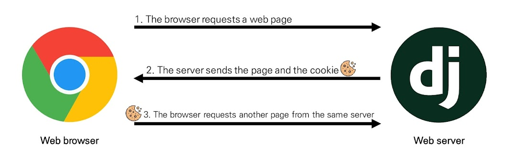

<br/>

#### 쿠키의 사용 목적

1. **세션 관리** (Session management)
   - 로그인, 아이디 자동 완성, 공지 하루 안보기, 팝업 체크, 장바구니 등의 정보 관리
2. **개인화** (Personalization)
   - 사용자 선호, 테마 등의 설정
3. **트래킹** (Tracking)
   - 사용자 행동을 기록 및 분석


#### 쿠키를 이용한 장바구니 예시

- 장바구니에 상품 담기

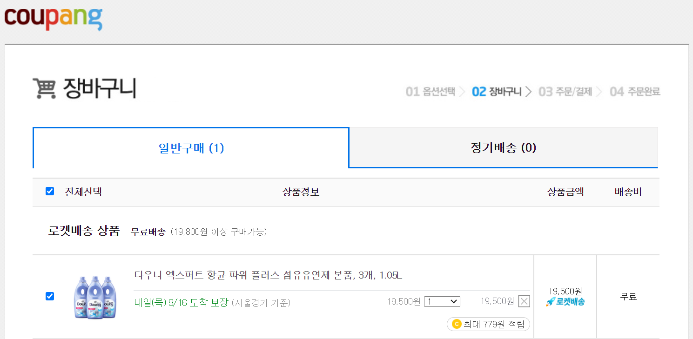


<br/>

- 개발자 도구 - Network 탭 - cartView.pang 확인
- 서버는 응답과 함께 Set-Cookie 응답 헤더를 브라우저에게 전송 이 헤더는 클라이언트에게 쿠키를 저장하라고 전달

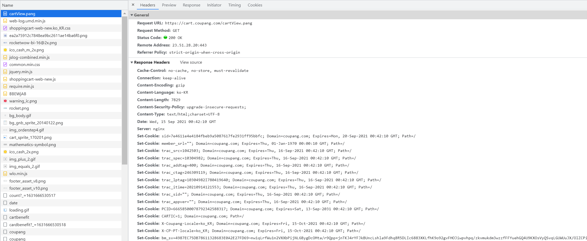

<br/>

- Cookie 데이터 자세히 확인

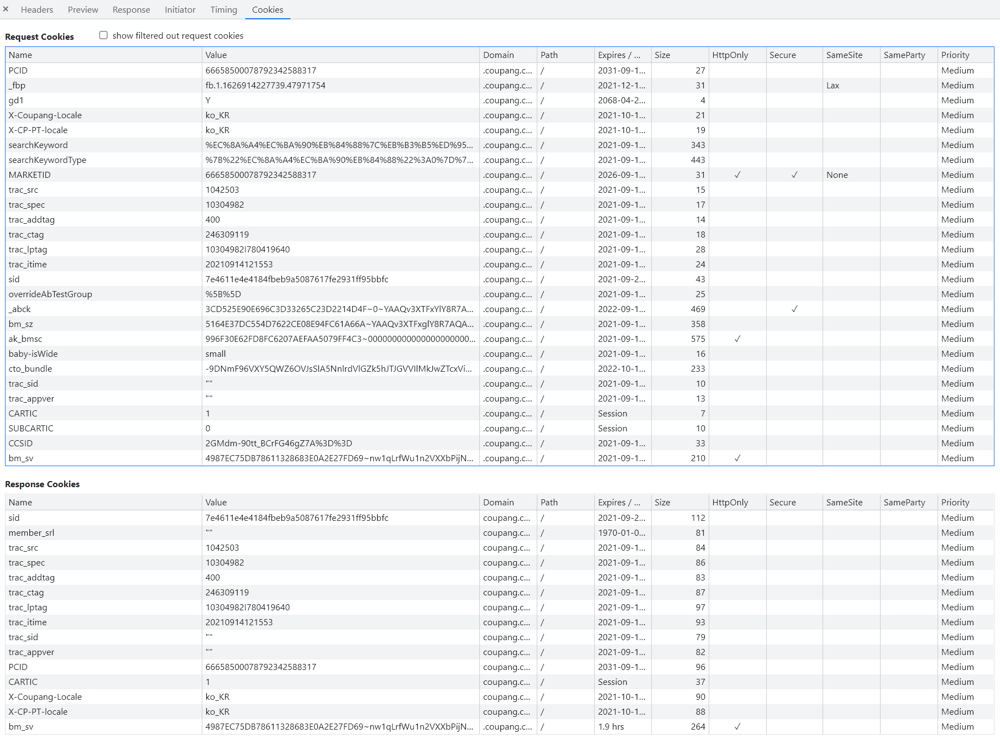

<br/>

- 메인 페이지 이동 - 장바구니 유지 상태 확인 이제 서버로 전송되는 모든 요청과 함께, 브라우저는 **Cookie** HTTP 헤더를 사용해 서버로 이전에 저장했던 모든 쿠키들을 함께 전송
- 개발자 도구 - Application 탭 - Cookies 마우스 우측 버튼 - Clear 후 새로고침

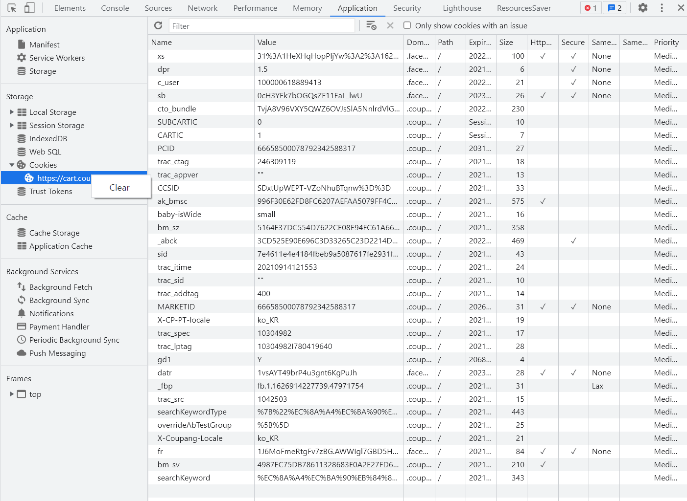

- 빈 장바구니로 변경 확인

<br/>

### 세션(Session)

- 사이트와 특정 브라우저 사이의 "상태(state)"를 유지시키는 것
- 클라이언트가 서버에 접속하면 서버가 특정 session id를 발급하고, 클라이언트는 발급 받은 **session id**를 쿠키에 저장
  - 클라이언트가 다시 서버에 접속하면 요청과 함께 쿠키(session id가 저장된)를 서버에 전달
  - 쿠키는 요청 때마다 서버에 함께 전송되므로 서버에서 session id를 확인해 알맞은 로직을 처리
- ID는 세션을 구별하기 위해 필요하며, 쿠키에는 ID만 저장함

<br/>

#### 세션을 이용한 Gitlab 예시

- Gitlab 로그인 - 개발자 도구 - Application 탭 : gitlab 서버로부터 받아 저장된 session 쿠키 확인
- session 삭제 후 새로고침 - 로그아웃 상태 변경 확인

<br/>

### 쿠키 lifetime (수명)
쿠키의 수명은 두 가지 방법으로 정의할 수 있음

1. **Session cookies**
   - 현재 세션이 종료되면 삭제됨
   - 브라우저가 “현재 세션(current session)”이 종료되는 시기를 정의


:::note 참고
일부 브라우저는 다시 시작할 때 세션 복원(session restoring)을 사용해 세션 쿠키가 오래 지속 될 수 있도록 함
:::


  <br/>


2. **Persistent cookies** (or Permanent cookies)
   - Expires 속성에 지정된 날짜 혹은 Max-Age 속성에 지정된 기간이 지나면 삭제


  <br/>

### Session in Django

- Django의 세션은 미들웨어를 통해 구현됨
- Django는 database-backed sessions 저장 방식을 기본 값으로 사용


:::note 참고
설정을 통해 cached, file-based, cookie-based 방식으로 변경 가능
:::

<br/>

- Django는 특정 session id를 포함하는 쿠키를 사용해서 각각의 브라우저와 사이트가 연결된 세션을 알아냄
  - 세션 정보는 Django DB의 `django_session` 테이블에 저장됨
- 모든 것을 세션으로 사용하려고 하면 사용자가 많을 때 서버에 부하가 걸릴 수 있음
- [공식문서](https://docs.djangoproject.com/en/3.2/topics/http/sessions/#module-django.contrib.sessions)


  <br/>

### Authentication System in MIDDLEWARE

- `SessionMiddleware` : 요청 전반에 걸쳐 세션을 관리
- `Authentication Middleware` : 세션을 사용하여 사용자를 요청과 연결

```python
# settings.py

MIDDLEWARE = [
	'django.middleware.security.SecurityMiddleware',
	...
    'django.contrib.auth.middleware.AuthenticationMiddleware',
    ...
]
```

  <br/>


:::note 참고: MIDDLEWARE (미들웨어)

- http 요청과 응답 처리 중간에서 작동하는 시스템(hooks)
- django는 http 요청이 들어오면 미들웨어를 거쳐 해당 URL에 등록되어 있는 view로 연결해주고, http 응답 역시 미들웨어를 거쳐서 내보냄
- 주로 데이터 관리, 애플리케이션 서비스, 메시징, 인증 및 API 관리를 담당
- [공식문서](https://docs.djangoproject.com/en/3.2/topics/auth/#installation)

:::

  <br/>

## 로그인


- 로그인은 Session을 Create하는 로직과 같음
- Django는 우리가 session의 메커니즘에 생각하지 않게끔 도움을 줌
- 이를 위해 인증에 관한 built-in forms를 제공


  <br/>

### Authentication Form


- 사용자 로그인을 위한 form
- request를 첫번째 인자로 취함
- [공식문서](https://docs.djangoproject.com/en/3.2/topics/auth/default/#django.contrib.auth.forms.AuthenticationForm)


  <br/>

### login 함수

#### `login(request, user, backend=None)`


- 현재 세션에 연결하려는 인증 된 사용자가 있는 경우 login() 함수가 필요
- 사용자를 로그인하며 view 함수에서 사용 됨
- HttpRequest 객체와 User 객체가 필요
- django의 session framework를 사용하여 세션에 user의 ID를 저장(== 로그인)
- [공식문서](https://docs.djangoproject.com/en/3.2/topics/auth/default/#how-to-log-a-user-in)


  <br/>

```python
# accounts/urls.py

from django.urls import path
from . import views

app_name = 'accounts'
urlpatterns = [
    path('login/', views.login, name='login'),
]
```

```python
# accounts/views.py

from django.shortcuts import render, redirect
from django.contrib.auth.forms import AuthenticationForm
from django.contrib.auth import login as auth_login
from django.views.decorators.http import require_http_methods


@require_http_methods(['GET', 'POST'])
def login(request):
    if request.method == 'POST':
        form = AuthenticationForm(request, request.POST)
        if form.is_valid():
            auth_login(request, form.get_user())
            return redirect('articles:index')
    else:
        form = AuthenticationForm()
    context = {
        'form': form
    }
    return render(request, 'accounts/login.html', context)
```

```html
<!-- accounts/login.html -->




  <h1>Login</h1>
  <form action="" method="POST">
    
    {{ form.as_p }}
    <input type="submit">
  </form>

```

  <br/>

- admin 계정 만들고 accounts에 로그인
- 브라우저와 django DB에서 django로부터 발급 받은 `sessionid` 확인

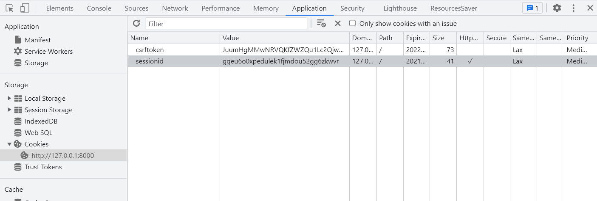

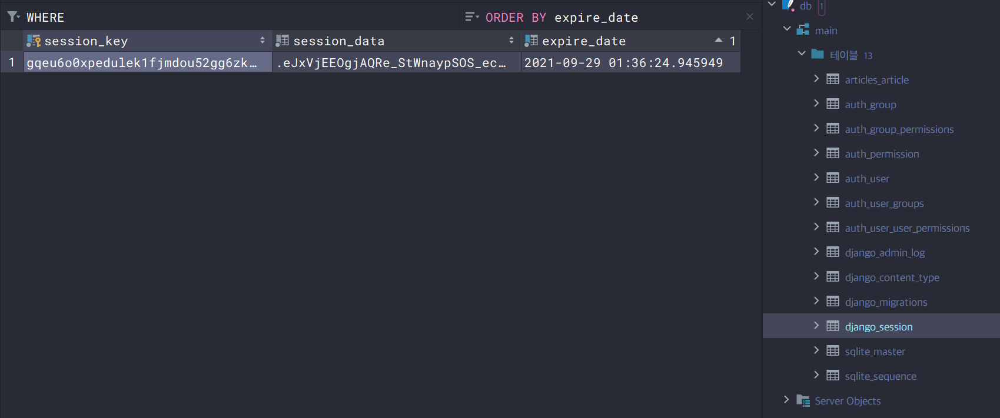

  <br/>

#### `get_user()`


- AuthenticationForm의 인스턴스 메서드
- `user_cache`는 인스턴스 생성 시에 None으로 할당되며, 유효성 검사를 통과했을 경우 로그인 한 사용자 객체로 할당 됨
- 인스턴스의 유효성을 먼저 확인하고, 인스턴스가 유효할 때만 user를 제공하려는 구조


```python
class Authentication Form(forms. Form):
    """
    Base class for authenticating users. Extend this to get a form that accepts
    username/password logins.
    """
    
	def get_user(self):
        return self.user_cache
```

- [Github](https://github.com/django/django/blob/main/django/contrib/auth/forms.py#L163)

 <br/>

### Authentication data in templates

- 로그인 링크 작성
- 현재 로그인 되어 있는 유저 정보 출력

```html
  <div class="container">
    <h3>Hello, {{ user }}</h3>
    <a href="">Login</a>
    
    
  </div>
```

- admin 로그인 전

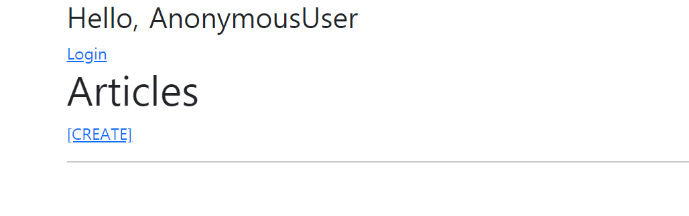

- admin 로그인 후

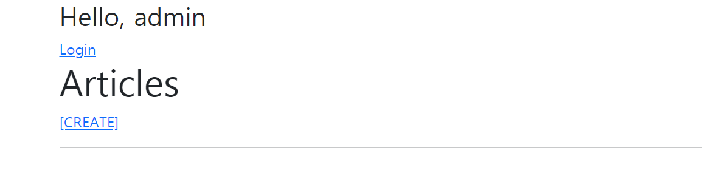

 <br/>

#### `context processors`

- 템플릿이 렌더링 될 때 자동으로 호출 가능한 컨텍스트 데이터 목록
- 작성된 프로세서는 RequestContext에서 사용 가능한 변수로 포함됨

```python
# settings.py

TEMPLATES = [
    {
		...
        'OPTIONS': {
            'context_processors': [
                'django.template.context_processors.debug',
                'django.template.context_processors.request',
                'django.contrib.auth.context_processors.auth',
                'django.contrib.messages.context_processors.messages',
            ],
        },
    },
]
```

 <br/>

#### Users


- 템플릿 `RequestContext`를 렌더링할 때, 현재 로그인한 사용자를 나타내는 `auth.User` 인스턴스 (또는 클라이언트가 로그인하지 않은 경우 `AnonymousUser` 인스턴스)는 템플릿 변수 `{{ user }}`에 저장됨
- `'django.contrib.auth.context_processors.auth'`


 <br/>


## 로그아웃

- 로그아웃은 Session을 Delete 하는 로직과 같음

 <br/>

###  logout 함수

#### `logout(request)`


- HttpRequest 객체를 인자로 받고 반환 값이 없음
- 사용자가 로그인하지 않은 경우 오류를 발생시키지 않음
- 현재 요청에 대한 session data를 DB에서 완전히 삭제하고, 클라이언트의 쿠키에서도 sessionid 가 삭제됨
- 이는 다른 사람이 동일한 웹 브라우저를 사용하여 로그인하고, **이전 사용자의 세션 데이터에 액세스하는 것을 방지하기 위함**
- [공식문서](https://docs.djangoproject.com/en/3.2/topics/auth/default/#how-to-log-a-user-out)


 <br/>

```python
# accounts/urls.py

from django.urls import path
from . import views

app_name = 'accounts'
urlpatterns = [
    path('login/', views.login, name='login'),
    path('logout/', vies.logout, name='logout'),
]
```

```python
# accounts/urls.py

from django.contrib.auth import logout as auth_logout
from django.views.decorators.http import require_http_methods, require_POST

@require_POST
def logout(request):
    auth_logout(request)
    return redirect('articles:index')
```

```html
<!-- base.html -->

    <form action="" method="POST">
      
      <input type="submit" value="Logout">
    </form>
```

 <br/>

## 로그인 사용자에 대한 접근 제한

### Limiting access to logged-in users


- 로그인 사용자에 대한 엑세스 제한 2가지 방법
  1. The raw way
     - `is_authenticated` attribute
  2. The `login_required` decorator
- [공식문서](https://docs.djangoproject.com/en/3.2/topics/auth/default/#limiting-access-to-logged-in-users)


 <br/>

#### is_authenticated


- User model의 속성(attributes) 중 하나
- 모든 User 인스턴스에 대해 항상 True 인 읽기 전용 속성 (`AnonymousUser`에 대해서는 항상 False)
- 사용자가 인증 되었는지 여부를 알 수 있는 방법
- 일반적으로 request.user에서 이 속성을 사용하여, 미들웨어의 `django.contrib.auth.middleware.AuthenticationMiddleware`를 통과 했는지 확인
- 단, 권한(permission)과는 관련이 없으며, 사용자가 활성화 상태(active)이거나 유효한 세션(valid session)을 가지고 있는지도 확인하지 않음
- [공식문서](https://docs.djangoproject.com/en/3.2/ref/contrib/auth/#django.contrib.auth.models.User.is_authenticated)


 <br/>

- **적용** : 로그인과 비로그인 상태에서 출력되는 링크를 다르게 설정

```python
# views.py

@require_http_methods(['GET', 'POST'])
def login(request):
    if request.user.is_authenticated:
        return redirect('articles:index')
    
    if request.method == 'POST':
        form = AuthenticationForm(request, request.POST)
        if form.is_valid():
            auth_login(request, form.get_user())
            return redirect('articles:index')
    else:
        form = AuthenticationForm()
    context = {
        'form': form
    }
    return render(request, 'accounts/login.html', context)


@require_POST
def logout(request):
    if request.user.is_authenticated:        
        auth_logout(request)
    return redirect('articles:index')
```

```html
<!-- base.html -->

  <div class="container">
    
      <h3>Hello, {{ user }}</h3>
      <form action="" method="POST">
        
        <input type="submit" value="Logout">
      </form>
    
      <a href="">Login</a>
    
    
    
  </div>
```


```html
<!-- index.html -->
  
    <a href="">[CREATE]</a>
  
    <a href="">[새 글을 작성하려면 로그인하세요.]</a>
  
```

<br/>

#### `login_required` decorator

- 사용자가 로그인되어 있지 않으면, `settings.LOGIN_URL`에 설정된 문자열 기반 절대 경로로 redirect 함
  - LOGIN_URL의 기본 값은 '`/accounts/login/`'
  - 두번째 app 이름을 accounts 로 했던 이유 중 하나
- 사용자가 로그인되어 있으면 정상적으로 view 함수를 실행
- 인증 성공 시 사용자가 redirect 되어야하는 경로는 "next"라는 쿼리 문자열 매개 변수에 저장됨
  - 예시) /accounts/login/?next=/articles/create/
- [공식문서](https://docs.djangoproject.com/en/3.2/topics/auth/default/#the-login-required-decorator)
- [공식문서](https://docs.djangoproject.com/en/3.2/ref/settings/#std:setting-LOGIN_URL)

<br/>

```python
# articles/views.py

from django.contrib.auth.decorators import login_required

@login_required
@require_http_methods(['GET', 'POST'])
def create(request):
    ...

    
@login_required
@require_POST
def delete(request, pk):
    ...
    
    
@login_required
@require_http_methods(['GET', 'POST'])
def update(request, pk):
    ...
```

1. view 함수에 login_required 데코레이터 작성
2. 비로그인 상태에서 /accounts/create/ 경로로 요청 보내기
3. URL에 next 문자열 매개변수 확인

```
http://127.0.0.1:8000/accounts/login/?next=/articles/create/
```

<br/>

### `next` query string parameter

- 로그인이 정상적으로 진행되면 기존에 요청했던 주소로 redirect 하기 위해 마치 주소를 keep 해주는 것
- 단, 별도로 처리 해주지 않으면 우리가 view에 설정한 redirect 경로로 이동하게 됨

```python
# accounts/views.py

@require_http_methods(['GET', 'POST'])
def login(request):
    if request.user.is_authenticated:
        return redirect('articles:index')

    if request.method == 'POST':
        form = AuthenticationForm(request, request.POST)
        if form.is_valid():
            auth_login(request, form.get_user())
            return redirect(request.GET.get('next') or 'articles:index')  # next query
    else:
        form = AuthenticationForm()
    context = {
        'form': form
    }
    return render(request, 'accounts/login.html', context)
```

<br/>

- 현재 URL로 (next parameter가 있는) 요청을 보내기 위해 action 값 비우기

```html
<!-- accounts/login.html -->




  <h1>Login</h1>
  <form action="" method="POST">
    
    {{ form.as_p }}
    <input type="submit">
  </form>

```

<br/>

### 두 데코레이터로 인해 발생하는 구조적 문제와 해결


- 비로그인 상태에서 게시글 삭제 시도 → redirect로 이동한 로그인 페이지에서 로그인 시도 → 405(Method Not Allowed) status code 확인
- `@require_POST` 작성된 함수에 `@login_required`를 함께 사용하는 경우 **에러 발생**
- 로그인 이후 "next" 매개변수를 따라 해당 함수로 다시 redirect 되는데, 이 때 `@require_POST` 때문에 405 에러가 발생하게 됨
- 두 가지 문제 발생
  1. redirect 과정에서 POST 데이터의 손실
  2. redirect 요청은 POST 방식이 불가능하기 때문에 GET 방식으로 요청됨


<br/>

- 로그인 성공 후 next에 담긴 경로로 리다이렉트 될 때 에러 발생

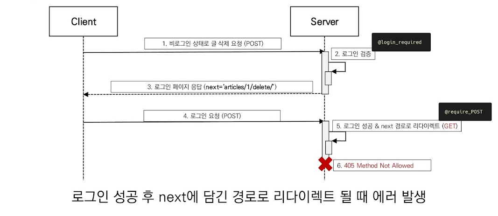

<br/>

- `login_required`는 GET method request를 처리할 수 있는 view 함수에서만 사용해야 함.

```python
"""
@login_required
@require_POST
def delete(request, pk):
    article = get_object_or_404(Article, pk=pk)
    article.delete()
    return redirect('articles:index')
"""

@require_POST
def delete(request, pk):
    if request.user.is_authenticated:
        article = get_object_or_404(Article, pk=pk)
        article.delete()
    return redirect('articles:index')
```

<br/>

## 회원가입

### UserCreationForm 

- 주어진 username과 password로 권한이 없는 새 user를 생성하는 `ModelForm`
- 3개의 필드를 가짐
   1. username (from the user model)
   2. password1
   3. password2
- [공식문서](https://docs.djangoproject.com/en/3.2/topics/auth/default/#django.contrib.auth.forms.UserCreationForm)
- [Github](https://github.com/django/django/blob/main/django/contrib/auth/forms.py#175)

```python
# UserCreationForm 확인해보기

class UserCreationForm(forms.ModelForm):
    """
    A form that creates a user, with no privileges, from the given username and
    password.
    """
    error_messages = {
        'password_mismatch': _('The two password fields didn’t match.'),
    }
    password1 = forms.CharField(
        label=_("Password"),
        strip=False,
        widget=forms.PasswordInput(attrs={'autocomplete': 'new-password'}),
        help_text=password_validation.password_validators_help_text_html(),
    )
    password2 = forms.CharField(
        label=_("Password confirmation"),
        widget=forms.PasswordInput(attrs={'autocomplete': 'new-password'}),
        strip=False,
        help_text=_("Enter the same password as before, for verification."),
    )
    ...
```

<br/>

```python
# accounts/urls.py

app_name = 'accounts'
urlpatterns = [
    ...
    path('signup/', views.signup, name='signup'),
]
```

```python
# accounts/views.py

from django.contrib.auth.forms import AuthenticationForm, UserCreationForm


def signup(request):
    if request.method == 'POST':
        form = UserCreationForm(request.POST)
        if form.is_valid():
            form.save()
            return redirect('articles:index')
    else:
        form = UserCreationForm()
    context = {
        'form': form,
    }
    return render(request, 'accounts/signup.html', context)
```

```html
<!-- accounts/signup.html -->




  <h1>회원가입</h1>
  <form action="" method="POST">
    
    {{ form.as_p }}
    <input type="submit">
  </form>

```

<br/>

- 회원가입 후 admin 페이지에서 새로운 계정이 생겼는지 확인

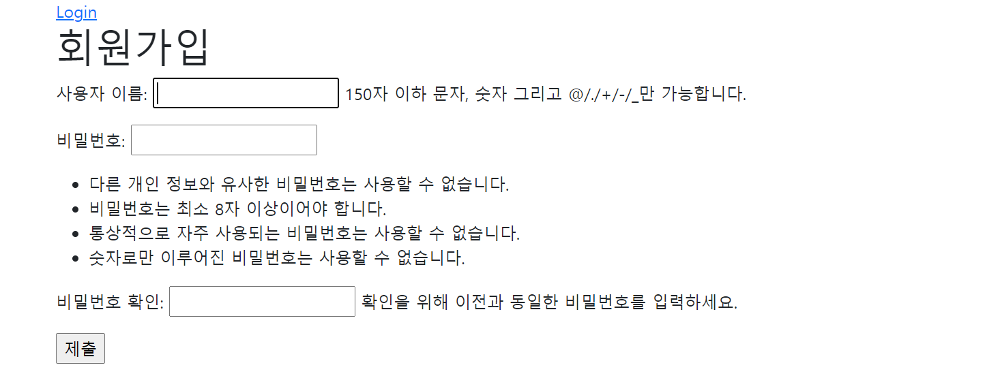

<br/>

```python
@require_http_methods(['GET', 'POST'])
def signup(request):
    if request.method == 'POST':
        form = UserCreationForm(request.POST)
        if form.is_valid():
            user = form.save()
            auth_login(request, user)
            return redirect('articles:index')
    else:
        form = UserCreationForm()
    context = {
        'form': form,
    }
    return render(request, 'accounts/signup.html', context)
```

```python
# UserCreationForm의 save 메서드
    def save(self, commit=True):
        user = super().save(commit=False)
        user.set_password(self.cleaned_data["password1"])
        if commit:
            user.save()
        return user
```

<br/>

- 회원가입 링크 작성

```html
<!-- base.html -->

  <div class="container">
    
      <h3>Hello, {{ user }}</h3>
      <form action="" method="POST">
        
        <input type="submit" value="Logout">
      </form>
    
      <a href="">Login</a>
      <a href="">Signup</a>
    
    
    
  </div>
```

<br/>

## 회원탈퇴

- 회원탈퇴는 DB에서 사용자를 삭제하는 것과 같음

```python
# accounts/urls.py

app_name = 'accounts'
urlpatterns = [
    ...
    path('delete/', views.delete, name='delete'),
]
```

```python
# accounts/views.py

@require_POST
def delete(request):
    if request.user.is_authenticated:
        request.user.delete()
    return redirect('articles:index')
```

```html
<!-- base.html -->

  <div class="container">
    
      <h3>Hello, {{ user }}</h3>
      <form action="" method="POST">
        
        <input type="submit" value="Logout">
      </form>
      <form action="" method="POST">
        
        <input type="submit" value="회원탈퇴">
      </form>
    
      <a href="">Login</a>
      <a href="">Signup</a>
    
    
    
  </div>
```

- 회원탈퇴 진행 후 sqlite 확장 프로그램이나 admin 페이지에서 유저가 삭제 되었는지 확인

<br/>

- 탈퇴 하면서 해당 유저의 세션 데이터도 함께 지울 경우 (단, 반드시 탈퇴 후 로그아웃 순으로 처리해야 함)

```python
# accounts/views.py

@require_POST
def delete(request):
    if request.user.is_authenticated:
        request.user.delete()
        auth_logout(request)
    return redirect('articles:index')
```

<br/>

## 회원정보 수정

### `UserChangeForm`

- 사용자의 정보 및 권한을 변경하기 위해 admin 인터페이스에서 사용되는 ModelForm
- [공식문서](https://docs.djangoproject.com/en/3.2/topics/auth/default/#django.contrib.auth.forms.UserChangeForm)

```python
class UserChangeForm(forms.ModelForm):
    password = ReadOnlyPasswordHashField(
        label=_("Password"),
        help_text=_(
            'Raw passwords are not stored, so there is no way to see this '
            'user’s password, but you can change the password using '
            '<a href="{}">this form</a>.'
        ),
    )

    class Meta:
        model = User
        fields = '__all__'
        field_classes = {'username': UsernameField}
    ...
```

<br/>

```python
# accounts/urls.py

app_name = 'accounts'
urlpatterns = [
    ...
    path('update/', views.update, name='update'),
]
```

```python
# accounts/views.py

from django.contrib.auth.forms import AuthenticationForm, UserCreationForm, UserChangeForm


@require_http_methods(['GET', 'POST'])
def update(request):
    if request.method == 'POST':
        pass
    else:
        form = UserChangeForm(instance=request.user)
    context = {
        'form': form,
    }
    return render(request, 'accounts/update.html', context)
```

```html
<!-- accounts/update.html -->




  <h1>회원 정보 수정</h1>
  <form action="" method="POST">
    
    {{ form.as_p }}
    <input type="submit">
  </form>

```
<br/>

- 회원정보 수정 페이지 확인

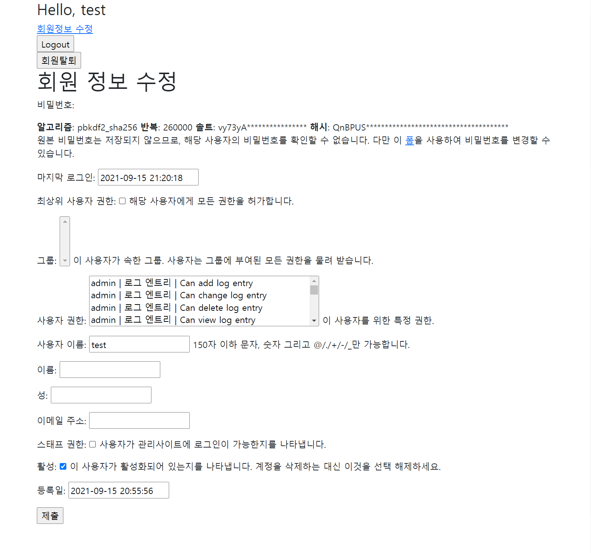

<br/>

- 회원정보 수정 페이지 링크 작성
```html
<!-- base.html -->

  <div class="container">
    
      <h3>Hello, {{ user }}</h3>
      <a href="">회원정보 수정</a>
      <form action="" method="POST">
        
        <input type="submit" value="Logout">
      </form>
      <form action="" method="POST">
        
        <input type="submit" value="회원탈퇴">
      </form>
    
      <a href="">Login</a>
      <a href="">Signup</a>
    
    
    
  </div>
```

<br/>

### `UserChangeForm` 사용 시 문제점

- 일반 사용자가 접근해서는 안될 정보들(fields)까지 모두 수정이 가능해짐
- 따라서 `UserChangeForm`을 상속받아 `CustomUserChangeForm`이라는 서브클래스를 작성해 접근 가능한 필드를 조정해야 함

<br/>

### `CustomUserChangeForm` 작성

1. `get_user_model()`
2. User 모델의 fields

```python
# accounts/forms.py

from django.contrib.auth.forms import UserChangeForm
from django.contrib.auth import get_user_model


class CustomUserChangeForm(UserChangeForm):

    class Meta:
        model = get_user_model()
        fields = ()
```

<br/>

#### `get_user_model()`

- 현재 프로젝트에서 활성화된 사용자 모델(active user model)을 반환
- django는 User 클래스를 직접 참조하는 대신 `django.contrib.auth.get_user_model()` 을 사용하여 참조해야 한다고 강조
- User model 참조에 대한 자세한 내용은 추후 모델 관계 수업에서 다룸
- [공식문서](https://docs.djangoproject.com/en/3.2/topics/auth/customizing/#referencing-the-user-model)
- [Github](https://github.com/django/django/blob/main/django/contrib/auth/__init__.py#L155)

<br/>

#### User 클래스 상속 구조 살펴보기


1. `UserChangeForm` 클래스 구조 확인
   - Meta 클래스를 보면 User라는 model을 참조하는 ModelForm이라는 것을 확인할 수 있음
   - [UserChangeForm](https://github.com/django/django/blob/main/django/contrib/auth/forms.py#L135)
2. `User` 클래스 구조 확인
   - 실제로 User 클래스는 Meta 클래스를 제외한 코드가 없고 AbstractUser 클래스를 상속받고 있음
   - [User](https://github.com/django/django/blob/main/django/contrib/auth/models.py#L389)
3. `AbstractUser` 클래스 구조 확인
   - 클래스 변수명들을 확인해보면 회원수정 페이지에서 봤던 필드들과 일치한다는 것을 확인할 수 있음
   - [AbstractUser](https://github.com/django/django/blob/main/django/contrib/auth/models.py#L321)
4. 마지막으로 공식문서의 User 모델 Fields 확인
   - [공식문서](https://docs.djangoproject.com/en/3.2/ref/contrib/auth/#user-model)


<br/>

- 수정 시 필요한 필드만 선택해서 작성

```python
# accounts/forms.py

from django.contrib.auth.forms import UserChangeForm
from django.contrib.auth import get_user_model


class CustomUserChangeForm(UserChangeForm):

    class Meta:
        model = get_user_model()
        fields = ('email', 'first_name', 'last_name',)
```

<br/>
- `CustomUserChangeForm`으로 변경

```python
# accounts/views.py

from django.contrib.auth.decorators import login_required
from .forms import CustomUserChangeForm


@login_required
@require_http_methods(['GET', 'POST'])
def update(request):
    if request.method == 'POST':
        form = CustomUserChangeForm(request.POST, instance=request.user)
        if form.is_valid():
            form.save()
            return redirect('articles:index')
    else:
        form = CustomUserChangeForm(instance=request.user)
    context = {
        'form': form,
    }
    return render(request, 'accounts/update.html', context)
```

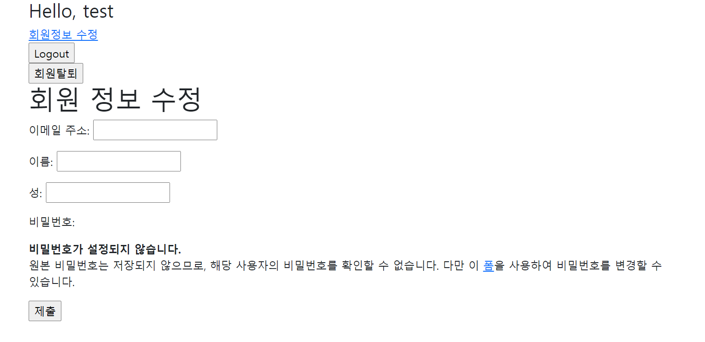

<br/>

## 비밀번호 변경

### PasswordChangeForm

- 사용자가 비밀번호를 변경할 수 있도록 하는 Form
- 이전 비밀번호를 입력하여 비밀번호를 변경할 수 있도록 함
- 이전 비밀번호를 입력하지 않고 비밀번호를 설정할 수 있는 `SetPasswordForm`을 상속받는 서브 클래스
- [공식문서](https://docs.djangoproject.com/en/3.2/topics/auth/default/#django.contrib.auth.forms.PasswordChangeForm)
- [Github](https://github.com/django/django/blob/main/django/contrib/auth/forms.py#1363)

<br/>

```python
# accounts/urls.py

app_name = 'accounts'
urlpatterns = [
    ...
    path('password/', views.change_password, name='change_password'),
]
```

```python
# accounts/views.py

from django.contrib.auth.forms import (
    AuthenticationForm,
    UserCreationForm,
    PasswordChangeForm
)


@login_required
@require_http_methods(['GET', 'POST'])
def change_password(request):
    if request.method == 'POST':
        form = PasswordChangeForm(request.user, request.POST)
        if form.is_valid():
            form.save()
            return redirect('articles:index')
    else:
        form = PasswordChangeForm(request.user)
    context = {
        'form': form,
    }
    return render(request, 'accounts/change_password.html', context)
```

```html
<!-- accounts/change_password.html -->




  <h1>비밀번호 변경</h1>
  <form action="" method="POST">
    
    {{ form.as_p }}
    <input type="submit">
  </form>

```

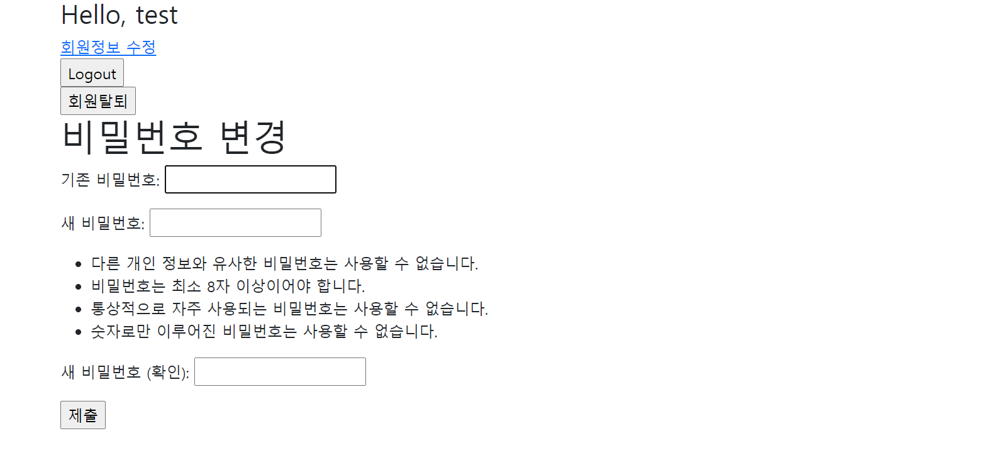

<br/>

#### `SetPasswordForm`

- PasswordChangeForm의 첫번째 인자가 user인 이유

```python
class SetPasswordForm(forms.Form):
    """
    A form that lets a user change set their password without entering the old
    password
    """
    error_messages = {
        'password_mismatch': _('The two password fields didn’t match.'),
    }
    new_password1 = forms.CharField(
        label=_("New password"),
        widget=forms.PasswordInput(attrs={'autocomplete': 'new-password'}),
        strip=False,
        help_text=password_validation.password_validators_help_text_html(),
    )
    new_password2 = forms.CharField(
        label=_("New password confirmation"),
        strip=False,
        widget=forms.PasswordInput(attrs={'autocomplete': 'new-password'}),
    )

    def __init__(self, user, *args, **kwargs):
        self.user = user
        super().__init__(*args, **kwargs)
    ...
```

<br/>

### 암호 변경 시 세션 무효화 방지

#### `update_session_auth_hash(request, user)`

- 현재 요청(current request)과 새 session hash가 파생 될 업데이트 된 사용자 객체를 가져오고, session hash를 적절하게 업데이트
- 비밀번호가 변경되면 기존 세션과의 회원 인증 정보가 일치하지 않게 되어 로그인 상태를 유지할 수 없기 때문
- 암호가 변경되어도 로그아웃되지 않도록 새로운 password hash로 session을 업데이트 함
- [공식문서](https://docs.djangoproject.com/en/3.2/topics/auth/default/#django.contrib.auth.update_session_auth_hash)

```python
# accounts/views.py

from django.contrib.auth import update_session_auth_hash


@login_required
@require_http_methods(['GET', 'POST'])
def change_password(request):
    if request.method == 'POST':
        form = PasswordChangeForm(request.user, request.POST)
        if form.is_valid():
            form.save()
            update_session_auth_hash(request, form.user)
            return redirect('articles:index')
    else:
        form = PasswordChangeForm(request.user)
    context = {
        'form': form,
    }
    return render(request, 'accounts/change_password.html', context)
```

<br/>


## 마무리

- The Django Authentication System
- 쿠키와 세션
- 로그인
- 로그아웃
- 로그인 사용자에 대한 접근 제한
- 회원가입
- 회원탈퇴
- 회원정보 수정
- 비밀번호 변경

