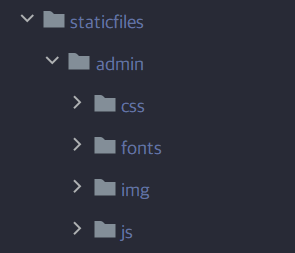
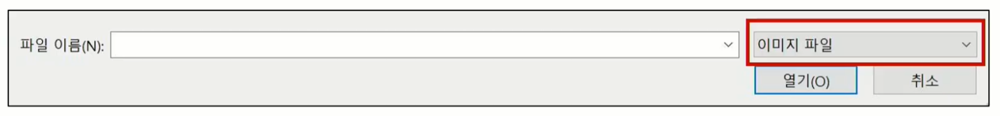
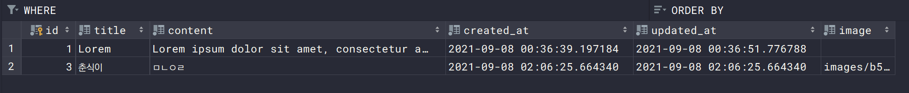

# Static & Media Files

:::info Managing Static Files

- Static files
- Media files
  - Image Upload
  - Image Resizing

:::

<br/>

## Static Files

### Static file (정적 파일)

- 응답할 때 별도의 처리 없이 파일 내용을 그대로 보여주면 되는 파일
  - 즉, 사용자의 요청에 따라 내용이 바뀌는 것이 아니라 요청한 것을 그대로 보여주는 파일
- 예를 들어, 웹 사이트는 일반적으로 **이미지, 자바 스크립트 또는 CSS**와 같은 미리 준비된 추가 파일(움직이지 않는)을 제공해야함
- Django에서는 이러한 파일들을 **static file(정적 파일)**이라 함

<br/>

#### Static file 구성

1. `django.contrib.staticfiles`가 `INSTALLED_APPS`에 포함되어 있는지 확인
2. `settings.py`에서 `STATIC_URL`을 정의
3. 템플릿에서 **static 템플릿 태그**를 사용하여 지정된 상대경로에 대한 URL을 빌드

```html



```

4. 앱의 static 폴더에 정적 파일을 저장
   - 예시) `my_app/static/my_app/example.jpg`

<br/>

#### Django template tag

- `load`
  - 사용자 정의 템플릿 태그 세트를 로드
  - 로드하는 라이브러리, 패키지에 등록된 모든 태그와 필터를 로드
- `static`
  - STATIC_ROOT에 저장된 정적 파일에 연결

```html



```

<br/>

### The staticfiles app

#### `STATIC_ROOT`

- `collectstatic`이 배포를 위해 정적 파일을 수집하는 디렉토리의 절대 경로
- django 프로젝트에서 사용하는 모든 정적 파일을 한 곳에 모아 넣는 경로
- 개발 과정에서 `settings.py`의 `DEBUG`값이 `True`로 설정되어 있으면 해당 값은 작용되지 않음
  - 직접 작성하지 않으면 django 프로젝트에서는 `settings.py`에 작성되어 있지 않음.
- 실 서비스 환경(배포 환경)에서 django의 모든 정적 파일을 다른 웹 서버가 직접 제공하기 위함

<br/>

##### [참고] collectstatic

- STATIC_ROOT에 정적 파일을 수집
  - STATIC_ROOT 작성

```python
# app 별로 흩어져있는 static 파일(css, js, images 등)을 모아둘 (collectstatic) 폴더명 지정
STATIC_ROOT = BASE_DIR / 'staticfiles'
```

- collectstatic 명령어

```bash
$ python manage.py collectstatic
```



<br/>

#### `STATIC_URL`

```python
STATIC_URL = '/static/'
```

- `STATIC_ROOT`*에 있는 정적 파일을 참조 할 때 사용할 URL
  - (참고) 개발 단계에서는 실제 정적 파일들이 저장되어 있는 각 앱의 static/폴더 및 `STATICFILES_DIRS`에 정의된 추가 경로들을 탐색함
- 실제 파일이나 디렉토리가 아니며, URL로만 존재
- **비어 있지 않은 값으로 설정 한다면 반드시 slash(`/`)로 끝나야 함**

<br/>

#### `STATICFILES_DIRS`

- `app/static/` 디렉토리 경로를 사용하는 것(기본 경로) 외에 **추가적인 정적 파일 경로 목록을 정의하는 리스트**
-  추가 파일 디렉토리에 대한 전체 경로를 포함하는 문자열 목록으로 작성되어야 함.
- settings.py에서 설정 가능

```python
# settings.py

# Static files (CSS, JavaScript, Images)
# https://docs.djangoproject.com/en/3.2/howto/static-files/

# django static 시스템이 자동으로 찾는 폴더
STATIC_URL = '/static/'  # 기본값

# 추가로 static 시스템이 검색하게 하려면, 아래와 같이 등록
STATICFILES_DIRS = [
	BASE_DIR / 'static',
]
```

<br/>

### 정적 파일 사용하기

#### 기본 경로

- 정적 파일 경로 : `app/static/app/`

```
articles
├─ migrations
├─ static
│  └─ articles
│      └─ img.png
├─ templates
└─ ...
```

- template에서 경로 참조

```html




  
  <h2>DETAIL</h2>
   ...

```

<br/>

#### 추가 경로

- BASE_DIR에 static/images 폴더 만들기

- 추가 경로 작성

```python
STATICFILES_DIRS = [
    BASE_DIR / 'static',
]
```

```html
<!-- base.html -->



<!DOCTYPE html>
<html lang="en">
<head>
  ...
</head>
<body>
  
   ...
</body>
</html>
```

<br/>

## Media Files

### Media file (미디어 파일)

- 미디어 파일
- 사용자가 **웹에서 업로드하는 정적 파일**(user-uploaded)
- 유저가 업로드 한 모든 정적 파일

<br/>

### 이미지 업로드

#### 1. 기본 설정

##### (1) `ImageField` 

- 이미지 업로드에 사용하는 모델 필드
- FileField를 상속받는 서브 클래스이기 때문에 FileField의 모든 속성 및 메서드를 사용 가능하며 더해서 사용자에 의해 업로드된 객체가 유효한 이미지인지 검사함
- ImageField 인스턴스는 최대 길이가 100자인 문자열로 DB에 생성되며, `max_length` 인자를 사용하여 최대 길이를 변경할 수 있음

:::warning 주의

- 사용하려면 반드시 [Pillow](https://pillow.readthedocs.io/en/stable/) 라이브러리가 필요

:::

<br/>

##### (2) `FileField`

- 파일 업로드에 사용하는 모델 필드
- 2개의 선택 인자를 가지고 있음
  1. `upload_to`
  2. `storage`

<br/>

##### (3) `upload_to` argument

- 업로드 디렉토리와 파일 이름을 성정하는 2가지 방법을 제공
  1. 문자열 값이나 경로 지정
  2. 함수 호출

<br/>

##### (4) 문자열 경로 지정 방식

- 파이썬의 `strftime()` 형식이 포함될 수 있으며, 이는 파일 업로드 날짜/시간으로 대체 됨

```python
# models.py

class MyModel(models.Model):
    # MEDIA_ROOT/uploads/ 경로로 파일 업로드
    upload = models.FileField(upload_to='uploads/')
    # or
    # MEDIA_ROOT/uploads/2021/01/01/ 경로로 파일 업로드
    upload = models.FileField(upload_to='upload/%Y/%m/%d/')
```

<br/>

##### (5) 함수 호출 방식

- 반드시 2개의 인자(`instance`, `filename`)를 사용함
  1. **instance**
     - FileField가 정의된 모델의 인스턴스
     - 대부분 이 객체는 아직 데이터베이스에 저장되지 않았으므로 PK값이 아직 없을 수 있음
  2. **filename**
     - 기존 파일에 제공된 파일 이름

```python
# models.py

def articles_image_path(instance, filenane):
    # MEDIA_ROOT/user_<pk>/ 경로로 <filename> 이름으로 업로드
    return f'user_{instance.user.pk}/{filename}'


class Article(models.Model):
	image = models.ImageField(upload_to=articles_image_path)
```


##### (6) ImageField (or FileField)를 사용하기 위한 몇 가지 단계

1. setting.py에 `MEDIA_ROOT`, `MEDIA_URL` 설정
2. upload_to 속성을 정의하여 업로드 된 파일에 사용할 `MEDIA_ROOT`의 하위 경로를 지정
   - upload_tooptional argument
3. 업로드 된 파일의 상대 URL은 django가 제공하는 `url` 속성을 통해 얻을 수 있음

```html

```

<br/>

##### (7) `MEDIA_ROOT`

- **사용자가 업로드 한 파일(미디어 파일)들을 보관할 디렉토리의 절대 경로**
- django는 성능을 위해 업로드 파일은 데이터베이스에 저장하지 않음
  - 실제 데이터베이스에 저장되는 것은 **파일 경로**

:::warning 주의

- MEDIA_ROOT는 `STATIC_ROOT` 와 다른 경로로 지정을 해야 함

:::

```python
# settings.py

MEDIA_ROOT = BASE_DIR / 'media'
```

<br/>

##### (8) `MEDIA_URL`

- `MEDIA_ROOT`에서 제공되는 미디어를 처리하는 URL

- **업로드 된 파일의 주소(URL)를 만들어 주는 역할**
  - 웹 서버 사용자가 사용하는 public URL
- 비어 있지 않은 값으로 설정 한다면 반드시 slash(`/`)로 끝나야 함

:::warning 주의

- `MEDIA_URL`도 `STATIC_URL`과 경로가 달라야 함

:::

```python
# settings.py

MEDIA_URL = '/media/'
```

<br/>

##### (9) 개발 단계에서 사용자가 업로드한 미디어 파일 제공하기

- 사용자로부터 업로드된 파일이 우리 프로젝트에 업로드 되지만, 실제로 사용자에게 제공하기 위해서는 업로드된 파일의 url이 필요

- [django 공식문서](https://docs.djangoproject.com/ko/3.2/howto/static-files/#serving-files-uploaded-by-a-user-during-development)에서 가져오기

```python
# crud/urls.py

from django.conf import settings
from django.conf.urls.static import static

urlpatterns = [
    # ... the rest of your URLconf goes here ...
] + static(settings.MEDIA_URL, document_root=settings.MEDIA_ROOT)
```

```python
# crud/urls.py

from django.contrib import admin
from django.urls import path, include
from django.conf import settings
from django.conf.urls.static import static

urlpatterns = [
    path('admin/', admin.site.urls),
    path('articles/', include('articles.urls')),
] + static(settings.MEDIA_URL, document_root=settings.MEDIA_ROOT)

# 업로드 된 파일의 URL == settings.MEDIA_URL
# 위 URL을 통해 참조하는 파일의 실제 위치 == settings.MEDIA_ROOT
```

- 업로드할 준비 완료

<br/>

:::note 이미지 업로드 기본 설정 정리

```python
# settings.py

MEDIA_ROOT = BASE_DIR / 'media'

MEDIA_URL = '/media/'
```

```python
# crud/urls.py

from django.conf import settings
from django.conf.urls.static import static

urlpatterns = [
    # ... the rest of your URLconf goes here ...
] + static(settings.MEDIA_URL, document_root=settings.MEDIA_ROOT)
```

:::

<br/>

#### 2. CREATE

##### (1) ImageField 작성

- `upload_to='images/'`
  - 실제 이미지가 저장되는 경로를 지정
- `blank=True`
  - 이미지 필드에 빈 값 (빈 문자열)이 허용되도록 설정 (이미지를 선택적으로 업로드할 수 있도록)

```python
# articles/models.py

from django.db import models


class Article(models.Model):
    title = models.CharField(max_length=10)
    content = models.TextField()
    # saved to 'MEDIA_ROOT/images'
    image = models.ImageField(blank=True, upload_to='images/')
    created_at = models.DateTimeField(auto_now_add=True)
    updated_at = models.DateTimeField(auto_now=True)

    def __str__(self):
        return self.title
```

<br/>

##### (2) FileField attribute - `upload_to`

- 미디어 파일의 업로드 디렉토리 경로 및 파일 이름을 설정할 수 있도록 도와줌

<br/>

##### (3) Model field option - `blank`

- 기본 값 : False
- True일 경우 필드를 비워둘 수 있음. (사용자가 이미지를 선택적으로 업로드 할 수 있도록)
  - DB에는 빈 문자(`""`)가 저장됨
- 유효성 검사에서 사용 됨 (`is_valid`)
  - 필드에 `blank=True`가 있으면 form 유효성 검사에서 빈 값을 입력할 수 있음.

<br/>

##### (4) Model field option - `null`

- 기본 값 : False
- True면 django는 빈 값을 DB에 NULL로 저장
- **주의 사항**
  - CharField, TextField와 같은 **문자열 기반 필드에는 사용하는 것을 피해야 함**
  - 문자열 기반 필드에 True로 설정 시 '데이터 없음(no data)'에 '빈 문자열(1)'과 'NULL(2)'의 2 가지 가능한 값이 있음을 의미하게 됨
  - 대부분의 경우 '데이터 없음'에 대해 두 개의 가능한 값을 갖는 것은 중복되며, django는 NULL이 아닌 빈 문자열을 사용하는 것이 규칙

<br/>

:::note blank & null 비교

- `blank`: Validation-related
- `null`: Database-related

- 문자열 기반 및 비문자열 기반 필드 모두에 대해 null option은 DB에만 영향을 미치므로, form에서 빈 값을 허용하려면 `blank=True`를 설정해야함.

```python
# models.py

class Person(models.Model):
    model = models.CharField(max_length=10)
    
    # null=True 금지
    bio = models.TextField(max_length=50, blank=True)
    
    # null, blank 모두 설정 가능 -> 문자열 기반 필드가 아니기 때문
    birth_date = models.DataField(null=True, blank=True)
```

:::

<br/>

##### (5)  migration

- 마이그레이션 실행 (단, ImageField를 사용하기 위해서는 **Pillow 라이브러리 설치 필요**)

```bash
$ python manage.py makemigrations  # 오류

$ pip install Pillow

$ python manage.py makemigrations
$ python manage.py migrate

$ pip freeze > requirements.txt
```

<br/>

- 게시글 작성 form에서 enctype* 지정

```html
<!-- create.html -->

<form action="" method="POST" enctype="multipart/form-data">
  
  {{ form.as_p }}
  <input type="submit" value="작성">
</form>
```

<br/>

:::note form 태그 – enctype(인코딩) 속성

- `multipart/form-data` ⭐
  - 파일/이미지 업로드시에 반드시 사용해야 함 (전송되는 데이터의 형식을 지정)
  - `<input type="file">`을 사용할 경우 사용


- `aplication/x-www-form-urlencoded`
  - (기본값) 모든 문자 인코딩


- `text/plain`
  - 인코딩을 하지 않은 문자 상태로 전송
  - 공백은 '+' 기호로 변환하지만, 특수 문자는 인코딩 하지 않음

:::

<br/>

- 업로드된 파일은 request.FILES 객체로 전달됨. 이미지 업로드 후 테이블 & 파일 트리 확인하기

```python
# views.py

@require_http_methods(['GET', 'POST'])
def create(request):
    if request.method == 'POST':
        # form = ArticleForm(data=request.POST,files=request.FILES)
        form = ArticleForm(request.POST, request.FILES)
        if form.is_valid():
            article = form.save()
            return redirect('articles:detail', article.pk)
    else:
        form = ArticleForm()
    context = {
        'form': form,
    }
    return render(request, 'articles/create.html', context)
```

<br/>

- `input` 태그 – `accept` 속성
  - **입력 허용할 파일 유형을 나타내는 문자열**
  - 쉼표로 구분된 고유 파일 유형 지정자(unique file type specifiers)
  - 하지만 파일 검증은 하지 못함 (이미지만 accept 해 놓더라도 비디오나 오디오 파일을 제출할 수 있음)


- **고유 파일 유형 지정자**
  - `<input type="file">`에서 선택할 수 있는 파일의 종류를 설명하는 문자열
  - 파일 업로드 시 허용할 파일 형식에 대해 자동으로 필터링 (이미지 파일, pdf 파일 등)



<br/>

##### (6) DB 및 파일 트리 확인

- 실제 파일 위치 : `MEDIA_ROOT/images/`
- DB에 저장되는 것은 파일의 경로



<br/>

#### 3. READ

- `article.image.url` == 업로드 파일의 상대 URL
- `article.image` == 업로드 파일의 파일 이름

```html
<!-- detail.html -->




  <h2 class='text-center'>DETAIL</h2>
  <h3>{{ article.pk }} 번 글</h3>
  
  <hr>
  ...

```

<br/>

- 개발자 도구에서 `MEDIA_URL` 확인하기

<br/>

#### 4. UPDATE

- 이미지 수정하기
  - 이미지는 바이너리 데이터(하나의 덩어리)이기 때문에 텍스트처럼 일부만 수정 하는 것은 불가능
  - 때문에 새로운 사진으로 덮어 씌우는 방식을 사용
- 코드 수정 후 게시글 수정 시도해보기

```html
<!-- update.html -->

  <h1 class="text-center">UPDATE</h1>
    <form action="" method="POST" enctype="multipart/form-data">
      
       
       
    </form>
  <hr>
  <a href="">[back]</a>

```

```python
# views.py

@require_http_methods(['GET', 'POST'])
def update(request, pk):
    article Article.objects.get(pk=pk)
	if request.method 'POST':
		form = ArticleForm (request. POST, request.FILES, instance-article)
        if form.is_valid:
        	form.save()
        	return redirect('articles: detail', article.pk)
	else:
		form = ArticleForm (instance=article)
	context = {
		'form': form,
		'article': article,
    }
	return render(request, 'articles/update.html', context)
```

<br/>

- detail 페이지를 출력하지 못하는 문제 해결 (image가 없는 게시글의 경우 에러 발생)

```html
<!-- detail.html -->





  <h1>DETAIL</h1>
  <h2>{{ article.pk }} 번 글</h2>
  
    
  
```

<br/>

### 이미지 Resizing

#### 이미지 크기 변경하기

- 실제 원본 이미지를 서버에 그대로 로드 하는 것은 여러 이유로 부담이 큼
- html img 태그에서 직접 사이즈를 조정할 수도 있지만(width 와 height 로 조정), 용량 문제도 있기 때문에 업로드 될 때의 이미지 자체를 resizing 해야 함
- [django-imagekit](https://django-imagekit.readthedocs.io/en/1.1.0/) 모듈 활용

<br/>

- `pilkit`, `django-imagekit` 설치 → `INSTALLED_APPS`에 추가

```bash
$ pip install pilkit
$ pip install django-imagekit

$ pip freeze > requirements.txt
```

```python
# settings.py

INSTALLED_APP = [
    ...
	'imagekit',
    ...
]
```

<br/>

- 원본 이미지를 재가공하여 저장 (원본x, 썸네일o) 필드 변경 후 마이그레이션
  - `ProcessedImageField()`의 parameter로 작성된 값들은 makemigrations 후에 변경이 되더라도 **다시 makemigrations 를 해줄 필요없이 즉시 반영 됨**

```python
# models.py

from imagekit.models import ProcessedImageField 
from imagekit.processors import Thumbnail


class Article(models.Model):
	...
    image = ProcessedImageField(
				blank=True,
        		processors=[Thumbnail(200,300)],
        		format='JPEG',
        		options={'quality': 90},
    		)
```

```bash
$ python manage.py makemigrations
$ python manage.py migrate
```

<br/>

- 원본을 유지하는 방식
  - 썸네일을 미리 만드는 것이 아니라, cache를 이용해 필요할 때마다 만든다. 
  - `media/CACHE/images/origins/default/...`

```python
# models.py

from imagekit.models import ProcessedImageField 
from imagekit.processors import Thumbnail


class Article(models.Model):
	...    
    image = models.ImageField(blank=True, upload_to='origins/')
    image_thumbnail = ProcessedImageField(
        		source='image'
        		processors=[Thumbnail(100,50)],
        		format='JPEG',
        		options={'quality': 90},
    		)
```

```bash
$ python manage.py makemigrations
$ python manage.py migrate
```

```html

```


<br/>

## 마무리

- Static files (STATIC_URL, STATICFILES_DIRS)
- Media files (MEDIA_ROOT, MEDIA_URL)
- Image Upload (ImageField, form enctype)
- Image Resizing (django-imagekit)

