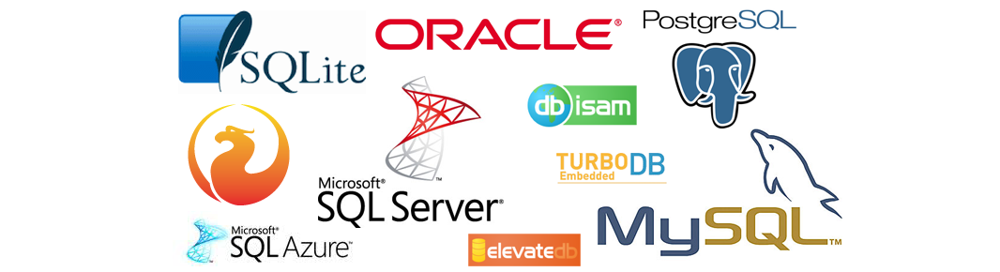

# SQL & ORM


## Database

- 데이터베이스는 **체계화된 데이터**의 모임이다.
- 여러 사람이 공유하고 사용할 목적으로 통합 관리되는 정보의 집합이다.
- 논리적으로 연관된 (하나 이상의) 자료의 모음으로 그 내용을 고도로 구조화 검색과 생신의 효율화를 꾀한 것이다.
- 즉, **몇 개의 자료 파일을 조직적으로 통합하여 자료 항목의 중복을 없애고 자료를 구조화하여 기억시켜 놓은 자료의 집합체**
- https://en.wikipedia.org/wiki/Database


<br/>


### 데이터베이스로 얻는 장점들

- 데이터 중복 최소와
- 데이터 무결성 (정확한 정보를 보장)
- 데이터 일관성
- 데이터 독립성 (물리적 / 논리적)
- 데이터 표준화
- 데이터 보안 유지


<br/>


## RDB

### 관계형 데이터베이스 (RDB)

- Relational Database
- 키(key)와 값(value)들의 간단한 관계 (relation)를 표(table) 형태로 정리한 데이터베이스
- 관계형 모델에 기반


<br/>


### 관계형 데이터베이스 용어 정리

- **스키마** (schema): 데이터베이스에서 자료의 구조, 표현방법, 관계 등 전반적인 **명세를 기술**한 것

| column  | datatype |
| ------- | -------- |
| id      | INT      |
| name    | TEXT     |
| address | TEXT     |
| age     | INT      |


<br/>


- **테이블** (table) : 열(컬럼/필드)과 행(레코드/값)의 모델을 사용해 조직된 데이터 요소들의 집합

|  id  |  name  | address | age  |
| :--: | :----: | :-----: | :--: |
|  1   | 홍길동 |  제주   |  20  |
|  2   | 김길동 |  서울   |  30  |
|  3   | 박길동 |  독도   |  40  |


<br/>


- **열** (Column) : 각 열에는 고유한 데이터 형식이 지정됨.
  - 위 예시에서는 name이란 필드에 고객의 이름(TEXT) 정보가 저장됨.


- **행** (row) : 실제 데이터가 저장되는 형태
  - 행, 로우, 레코드 등의 이름으로 불림
  - 위 예시에서는 총 3명의 고객정보가 저장되어 있음(레코드가 3개)


- **기본키** (Primary Key) : 각 행(레코드)의 고유 값
  - 반드시 설정해야 하며, 데이터베이스 관리 및 관계 설정 시 주요하게 활용 됨.
  - 위 예시에서는 고유번호 (id)


<br/>


## RDBMS

### 관계형 데이터베이스 관리 시스템 (RDBMS)

- Relational Database Management System
- 관계형 모델을 기반으로 하는 데이터베이스 관리시스템을 의미
- 예시)
  - MYSQL
  - SQLite
  - PostgreSQL
  - ORACLE
  - MS SQL


<br/>





<br/>


### SQLite

- 서버 형태가 아닌 파일 형식으로 응용 프로그램에 넣어서 사용하는 **비교적 가벼운 데이터베이스**
- 구글 안드로이드 운영체제에 기본적으로 탑재된 데이터베이스이며, 임베디드 소프트웨어에도 많이 활용됨
- 로컬에서 간단한 DB 구성을 할 수 있으며, 오픈소스 프로젝트이기 때문에 자유롭게 사용가능


<br/>


### SQLite 설치하기

- https://www.sqlite.org/download.html


<br/>


## SQL

### SQL (Structured Query Language)

- 관계형 데이터베이스 관리시스템의 **데이터 관리**를 위해 설계된 **특수 목적 프로그래밍 언어**
- 데이터베이스 스키마 생성 및 수정
- 자료의 검색 및 관리
- 데이터베이스 객체 접근 조정 관리


<br/>


### SQL 분류

| 분류                                                   | 개념                                                         | 예시                                     |
| ------------------------------------------------------ | ------------------------------------------------------------ | ---------------------------------------- |
| DDL- 데이터 정의 언어<br />(Data Definition Language)  | 관계형 데이터베이스 구조(테이블, 스키마)를<br />정의하기 위한 명령어 | CREATE<br/>DROP<br/>ALTER                |
| DML- 데이터 조작 언어<br/>(Data Manipulation Language) | 데이터를 저장, 조회, 수정, 삭제 등을 하기 위한 명령어        | INSERT<br/>SELECT<br/>UPDATE<br/>DELETE  |
| DCL- 데이터 제어 언어<br/>(Data Control Language)      | 데이터베이스 사용자의 권한 제어를 위해 사용하는 명령어       | GRANT<br/>REVOKE<br/>COMMIT<br/>ROLLBACK |


<br/>


### SQL Keywords - Data Manipulation Language

- INSERT : 새로운 데이터 삽입(추가)
- SELECT : 저장되어있는 데이터 조회
- UPDATE : 저장되어있는 데이터 갱신
- DELETE : 저장되어있는 데이터 삭제


<br/>


## 테이블 생성 및 삭제

### SQLite 시작

```sql
$ splite3 tutorial.sqlite3
sqlite> .database  # 데이터베이스 생성

# csv 파일을 table로 만들기
sqlite> .mode csv
sqlite> .import hellodb.csv examples
sqlite> .tables
examples

# 터미널 뷰 변경하기
sqlite> .headers on
sqlite> .mode column
```


<br/>


### 테이블 생성 및 삭제

```sql
-- 테이블 생성
CREATE TABLE classmates (
	name TEXT,
    age INT,
    address TEXT
);
```

```sql
# 스키마 조회
sqlite> .schema classmates
```

```sql
-- 테이블 삭제
DROP TABLE classmates;
```


<br/>


## CRUD

### CREATE

```sql
-- INSERT : 테이블에 단일 행 삽입
INSERT INTO classmates (name, age)
	 VALUES ('홍길동', 23);
	 
-- 모든 열에 데이터가 있는 경우
INSERT INTO classmates
	 VALUES ('홍길동', 30, '서울');
```


<br/>


- SQLite는 따로 PRIMARY KEY 속성의 컬럼을 작성하지 않으면 값이 자동으로 증가하는 PK 옵션을 가진 rowid 컬럼을 정의
- 꼭 필요한 정보라면 테이블 생성 시 `NOT NULL` 속성 정의

```sql
DROP TABLE classmates;

CREATE TABLE classmates (
	name TEXT NOT NULL,
    age INT NOT NULL,
    address TEXT NOT NULL
);

INSERT INTO classmates VALUES
	('홍길동', 30, '서울'),
	('김철수', 30, '대전'),
	('이싸피', 26, '광주'),
	('박삼성', 29, '구미'),
	('최전자', 28, '부산');
```


<br/>


### READ

```sql
-- SELECT : 테이블에서 데이터를 조회
SELECT *
  FROM users_user;
```

```sql
-- SELECT문은 SQLite에서 가장 복잡한 문이며 다양한 절(clause)와 함께 사용
-- ORDER BY, DISTICNT, WHERE, LIMIT, GROUP BY ...

-- LIMIT : 쿼리에서 반환되는 행 수를 제한
SELECT rowid,
	   name
  FROM classmates
 LIMIT 1
OFFSET 2; -- 세번째에 있는 하나만 조회

-- WHERE : 쿼리에서 반환된 행에 대한 특정 검색 조건을 지정
SELECT rowid,
	   name
  FROM classmates
 WHERE address='서울';

-- DISTICT : 조회 결과에서 중복 행을 제거, SELECT 키워드 바로 뒤에 작성
SELECT DISTINCT age
  FROM classmates;
```


<br/>


### DELETE

```sql
-- DELETE : 테이블에서 행을 제거
DELETE FROM classmates
      WHERE rowid = 5;

-- 이 때 데이터를 다시 추가하면 rowid 재사용
```


<br/>


- **AUTOINCREMENT**
  - Column attribute
  - 사용되지 않은 값이나 이전에 삭제된 행의 값을 재사용하는 것을 방지

```sqlite
CREATE TABLE 테이블이름 (
	id INTEGER PRIMARY KEY AUTOINCREMENT
)
```


<br/>


### UPDATE

```sql
-- UPDATE : 기존 행의 데이터를 수정
UPDATE classmates
   SET name='홍길동',
       address='제주도'
 WHERE rowid = 5;
```


<br/>

|          |   구문   |                             예시                             |
| :------: | :------: | :----------------------------------------------------------: |
| <b>C</b> | `INSERT` | `INSERT INTO 테이블이름 (컬럼1, 컬럼2, ...) VALUES (값1, 값2);` |
| <b>R</b> | `SELECT` |            `SELECT * FROM 테이블이름 WHERE 조건;`            |
| <b>U</b> | `UPDATE` |   `UPDATE 테이블이름 SET 컬럼1=값1, 컬럼2=값2 WHERE 조건;`   |
| <b>D</b> | `DELETE` |             `DELETE FROM 테이블이름 WHERE 조건;`             |


<br/>


## Query

### WHERE

```sql
CREATE TABLE users (
    first_name TEXT NOT NULL,
    last_name TEXT NOT NULL,
    age INTEGER NOT NULL,
    country TEXT NOT NULL,
    phone TEXT NOT NULL,
    balance INTEGER NOT NULL
);
```
```sql
sqlite> .mode csv
sqlite> .import users.csv users
sqlite> .tables
classmates  examples    users
```

```sql
SELECT age,
       last_name
  FROM users
 WHERE age >= 30 AND last_name = '김';
```


<br/>


#### LIKE

- 패턴일지를 기반으로 데이터를 조회하는 방법
  - `%` : 0개 이상의 문자
  - `_`: 임의의 단일 문자


| 와일드 카드 패턴 |                      의미                      |
| :--------------: | :--------------------------------------------: |
|       `2%`       |                2로 시작하는 값                 |
|       `%2`       |                 2로 끝나는 값                  |
|      `%2%`       |                2가 들어가는 값                 |
|      `_2%`       | 아무 값이 하나 있고 두번 째가 2 로 시작하는 값 |
|      `1___`      |          1로 시작하고 총 4 자리인 값           |
| `2_%_%` / `2__%` |        2로 시작하고 적어도 3 자리인 값         |


```sql
-- 나이가 20대인 사람만 조회
SELECT *
  FROM users
 WHERE age
  LIKE '2_';

-- 지역번호가 02인 사람만 조회
SELECT *
  FROM users
 WHERE phone
  LIKE '02-%';
  
-- 이름이 '준'으로 끝나는 사람만 조회
SELECT *
  FROM users
 WHERE first_name
  LIKE '%준';

-- 중간 번호가 5114인 사람만 조회
SELECT *
  FROM users
 WHERE phone
  LIKE '%-5114-%';
```


<br/>


### SQLite Aggregate Functions

```sql
SELECT COUNT(*)
  FROM users;

SELECT AVG(age)
  FROM users;

SELECT SUM(age)
  FROM users;

SELECT MIN(age)
  FROM users;

SELECT MAX(age)
  FROM users;
  
-- 30살 이상인 사람들의 평균 나이
SELECT AVG(age)
  FROM users
 WHERE age >= 30;

-- 계좌 잔액이 가장 높은 사람과 그 액수
SELECT last_name,
	   first_name,
	   MAX(balance)
  FROM users;
```


<br/>


#### GROUP BY

```sql
SELECT last_name,
       COUNT(*)
  FROM users
 GROUP BY last_name;

SELECT last_name,
       AVG(balance)
  FROM users
 GROUP BY last_name;
```


<br/>


#### ORDER BY

```sql
-- 나이 순으로 오름차순 정렬하여 상위 10개만 조회
SELECT *
  FROM users
 ORDER BY age ASC
 LIMIT 10;

SELECT *
  FROM users
 WHERE age >= 10 AND age < 20
 ORDER BY balance DESC,
          age
 LIMIT 10;
```


<br/>


### ALTER TABLE

```sql
-- table 이름 변경
ALTER TABLE countries
  RENAME TO hotels;

-- 새로운 컬럼 추가
ALTER TABLE news
 ADD COLUMN created_at TEXT;

ALTER TABLE news
 ADD COLUMN created_at TEXT NOT NULL DEFAULT '기본값';

-- column 이름 수정
ALTER TABLE tablename
RENAME COLUMN current_name TO new_name;
```


<br/>


## SQL & ORM

- shell 정리 및 종료
  - sqlite
    - `shell clear`
    - `.exit`
  - django_shell_plus
    - `clear`
    - `exit`


<br/>


### ORM

```sql
-- 모든 레코드 조회
User.objects.all()

SELECT * FROM users_user;


-- 특정 user 레코드 조회
User.objects.get(pk=102)

SELECT * FROM users_user WHERE id = 102;


-- 새로운 유저 정보 등록
User.objects.create(
	first_name='길동',
    last_name='홍',
    age=100,
    country='제주도',
    phone='010-1234-5678',
    balance=10000
)

INSERT INTO users_user VALUES (102, '길동', '김', 100, '경상북도', '010-1234-1234', 100);


-- 특정 user 레코드 수정
user = User.objects.get(pk=102)
user.last_name = '김'
user.save()

UPDATE users_user SET firest_name='철수' WHERE id=102;


-- 특정 user 레코드 삭제
User.objects.get(pk=102).delete()

DELETE FROM users_user WHERE id=101;
```

```sql
-- count
User.objects.count()

SELECT COUNT(*) FROM users_user;
  
  
-- 조건에 따른 쿼리문
User.objects.filter(age=30).values('first_name')

SELECT first_name FROM users_user WHERE age=30;


-- 쿼리문 확인 방법
print(User.objects.filter(age=30).values('first_name').query)


-- 대/소 관계 비교 조건
-- __gte, __gt, __lte, __lt
User.objects.filter(age__gte=30).count()

SELECT COUNT(*) FROM users_user WHERE age>=30;

User.object.filter(age__lte=20).count()

SELECT COUNT(*) FROM users_user WHERE age<=20;


-- 복수 조건 쿼리문
User.objects.filter(age=30, last_name='김').count()
User.objects.filter(age=30).filter(late_name='김').count()

SELECT COUNT(*) FROM users_user WHERE age=30 AND last_name='김';


-- OR을 활용하고 싶다면 Q object 활용
from django.db.models import Q
User.objects.filter(Q(age=30) | Q(last_name='김'))

SELECT * FROM users_user WHERE age=30 OR last_name='김';


-- LIKE
User.objects.filter(phone__startswith='02-').count()

SELECT COUNT(*) FROM users_user WHERE phone LIKE '02-%';


-- 주소가 강원도이면서 성이 황씨인 사람의 이름
User.objects.filter(country='강원도', last_name='황').values('first_name')

SELECT first_name FROM users_user WHERE country='강원도' AND last_name='황';


-- 나이가 많은 사람 순으로 10명만 조회
User.objects.order_by('-age')[:10]

SELECT * FROM users_user ORDER BY age DESC LIMIT 10;


-- 잔액이 적은 사람 순으로 10명 조회
User.objects.order_by('balance')[:10]

SELECT * FROM users_user ORDER BY balance ASC LIMIT 10;
 

-- 잔액이 적고, 나이가 많은 순으로 10명
User.objects.order_by('balance', '-age')[:10]

SELECT * FROM users_user ORDER BY balance, age DESC LIMIT 10;


-- 성, 이름 내림차순으로 5번쨰 있는 유저 정보 조회
User.objects.order_by('-last_name', '-first_name')[4]

SELECT * FROM users_user ORDER BY last_name DESC, first_name DESC LIMIT 1 OFFSET 4;
```


<br/>


### Django Aggregation

```sql
-- AVG
from django.ob.models import Avg
User.objects.aggregate(Avg('age'))

SELECT AVG(age) FROM users_user;


-- 성이 김씨인 유저들의 평균 나이
User.objects.filter(last_name='김').aggregate(Avg('age'))

SELECT AVG(age) FROM users_user WHERE last_name='김';


-- 지역이 강원도인 유저들의 평균 계좌 잔고
User.objects.filter(country='강원도').aggreage(Avg('balance'))

SELECT AVG(balance) FROM users_user WHERE country='강원도';


-- 계좌의 잔고 중 가장 높은 값
User.objects.aggregate(Max('balance'))

SELECT MAX(balance) FROM users_user;


-- 계좌 잔고의 총 합
User.objects.aggregate(Sum('balance'))

SELECT SUM(balance) FROM users_user;


-- annotate (컬럼 하나를 추가)
from django.db.models import Count
User.objects.values('country').annotate(Count('country'))
-- 컬럼명은 country__count

User.objects.values('country').annotate(num_countries=Count('country'))
-- 컬럼명은 num_countries

SELECT country, COUNT(country) FROM users_user GROUP BY country;

User.objects.values('country').annotate(Count('country'), avg_balance=Avg('balance'))
```


<br/>


:::tip django orm lazy loading

```sql
# django orm lazy loading
users = User.objects.all()  -- SQL이 실행되지 않음
users                       -- 이제서야 실행됨
```

:::


<br/>


## Homework 📝

### 1. SQL 용어 및 개념


<b>아래의 보기에서 각 문항의 설명에 맞는 용어를 고르시오.</b>


<br/>

<br/>


```
		기본키 	테이블 	스키마 	레코드 	컬럼
```


<br/>


1. 관계형 데이터베이스에서 구조와 제약조건에 관련한 전반적인 명세를 기술 한 것

   `스키마`

2. 열과 행의 모델을 사용해 조직된 데이터 요소들의 집합

   `테이블`

3. 고유한 데이터 형식이 지정되는 열

   `컬럼`

4. 단일 구조 데이터 항목을 가리키는 행

   `레코드`

5. 각 행의 고유값

   `기본키`


<br/>


### 2. SQL 문법

<b>아래의 보기 (1) ~ (4) 중에서, DML이 아닌 것을 고르시오.</b>


<br/>

<br/>


```
(1) CREATE
(2) UPDATE
(3) DELETE
(4) SELECT
```


<br/>


(1) CREATE : CREATE는 DDL (Data Definition Language)


<br/>


### 3. Relational DBMS

<b>RDBMS의 개념적 정의와 이를 기반으로 한 DB-Engine의 종류 세가지 이상 작성하시오.</b>


<br/>

<br/>


RDBMS는 관계형 모델을 기반으로 하는 데이터베이스 관리 시스템을 의미한다. MySQL, SQLite, ORACLE 등이 있다.


<br/>


### 4. INSERT INTO

<b>다음과 같은 스키마를 가지는 테이블이 있을 때, 아래의 보기 (1) ~ (4) 중 틀린 문장을 고르시오.</b>

```sql
CREATE TABLE classmates (
	name TEXT,
	age INT,
	address TEXT
);
```

```sql
(1) INSERT INTO classmates (name, age, address)
	VALUES(‘홍길동’, 20, ‘seoul’);
	
(2) INSERT INTO classmates VALUES(‘홍길동’, 20, ‘seoul’);

(3) insert into classmates
	values(address=‘seoul’, age=20, name=‘홍길동’);
	
(4) insert into classmates (address, age, name)
	values(‘seoul’, 20, ‘홍길동’);
```


<br/>


(3) SQL은 3과 같이 쓰지 않는다.


<br/>


### 5. 와일드카드 문자

<b>SQL에서 사용가능한 와일드카드 문자인 %와 _을 비교하여 작성하시오.</b>


<br/>

<br/>


`%`는 0개 이상의 문자를, `_`는 임의의 단일 문자를 의미한다. 즉, `%`는 문자열이 있을수도, 없을 수도 있는 반면 `_`는 이 자리에 반드시 한 개의 문자가 존재해야 한다.


<br/>


## Workshop 📖

table name : countries

|    name     | data type |
| :---------: | :-------: |
| `room_num`  |  `text`   |
| `check_in`  |  `text`   |
| `check_out` |  `text`   |
|   `grade`   |  `text`   |
|   `price`   | `integer` |

|  id  | room_num |   check_in   |  check_out   |   grade    | price |
| :--: | :------: | :----------: | :----------: | :--------: | :---: |
| `1`  |  `B203`  | `2019-12-31` | `2020-01-03` |  `suite`   | `900` |
| `2`  |  `1102`  | `2020-01-04` | `2020-01-08` |  `suite`   | `850` |
| `3`  |  `303`   | `2020-01-01` | `2020-01-03` |  `deluxe`  | `500` |
| `4`  |  `807`   | `2020-01-04` | `2020-01-07` | `superior` | `300` |


<br/>


### 1. SQL Query

<b>위 countries 테이블을 바탕으로 아래 문제에 해당하는 SQL query문을 작성하고 실행하시오.</b>


<br/>

<br/>


1. countries 테이블을 생성하시오.

   ```sql
   CREATE TABLE countries (
       room_num TEXT,
       check_in TEXT,
       check_out TEXT,
       grade TEXT,
       price INTEGER
   );
   ```

   

2. 데이터를 입력하시오.

   ```sql
   INSERT INTO countries
       VALUES ('B203', '2019-12-31', '2020-01-03', 'suite', 900),
              ('1102', '2020-01-04', '2020-01-08', 'suite', 850),
              ('303', '2020-01-01', '2020-01-03', 'deluxe', 500),
              ('807', '2020-01-04', '2020-01-07', 'superior', 300);
   ```

   

3. 테이블의 이름을 hotels로 변경하시오. 

   ```sql
   ALTER TABLE countries
     RENAME TO hotels;
   ```

   

4. 객실 가격을 내림차순으로 정렬하여 상위 2개의 room_num과 price를 조회하시오.

   ```sql
   SELECT room_num,
          price
     FROM hotels
    ORDER BY price DESC
    LIMIT 2;
   ```

   

5. grade 별로 분류하고 분류된 grade 개수를 내림차순으로 조회하시오.

   ```sql
   SELECT grade,
          COUNT(*)
     FROM hotels
    GROUP BY grade;
   ```

   

6. 객실의 위치가 지하 혹은 등급이 deluxe인 객실의 모든 정보를 조회하시오.

   ```sql
   SELECT *
     FROM hotels
    WHERE room_num LIKE 'B%'
       OR grade = 'deluxe';
   ```

   

7. 지상층 객실이면서 2020년 1월 4일에 체크인 한 객실의 목록을 price 오름차순으로 조회하시오.

   ```sql
   SELECT *
     FROM hotels
    WHERE room_num NOT LIKE 'B%'
      AND check_in = '2020-01-04'
    ORDER BY price;
   ```


<br/>


### 2. SQL ORM 비교하기

<b>주어진 정보를 활용하여 작성된 SQL문과 대응하는 ORM문을 작성하고 실행하시오.</b>


<br/>

<br/>


table name : users

|     name     |   data type   |
| :----------: | :-----------: |
|     `id`     | `integer(pk)` |
| `first_name` |    `text`     |
| `last_name`  |    `text`     |
|    `age`     |   `integer`   |
|  `country`   |    `text`     |
|   `phone`    |    `text`     |
|  `balance`   |   `integer`   |


<br/>


1. user 테이블 전체 데이터를 조회하시오.

   ```sql
   SELECT * FROM users_user;
   ```

   ```python
   User.objects.all()
   ```


   <br/>

2. id가 19인 사람의 age를 조회하시오.

   ```sql
   SELECT age FROM users_user WHERE id = 19;
   ```

   ```python
   User.objects.get(id=19)
   ```


   <br/>

3. 모든 사람의 age를 조회하시오.

   ```sql
   SELECT age FROM users_user;
   ```

   ```python
   User.objects.all().values('age')
   ```

   

   <br/>

   

4. age가 40 이하인 사림들의 id와 balance를 조회하시오.

   ```sql
   SELECT id, balance FROM users_user WHERE age <= 40;
   ```

   ```python
   User.objects.filter(age__lte=40).values('id','balance')
   ```


   <br/>

   

5. last_name이 ‘김’이고 balance가 500 이상인 사람들의 first_name을 조회하시오. 

   ```sql
   SELECT first_name FROM users_user
   WHERE last_name = '김' AND balance >= 500;
   ```

   ```python
   User.objects.filter(last_name='김', balance__gte=500).values('first_name')
   ```


   <br/>

   

6. first_name이 ‘수’로 끝나면서 행정구역이 경기도인 사람들의 balance를 조회하시오.

   ```sql
   SELECT balance FROM users_user
   WHERE first_name LIKE '%수' AND country = '경기도';
   ```

   ```python
   User.objects.filter(first_name__endswith='수', country='경기도').values('balance')
   ```


   <br/>

   

7. balance가 2000 이상이거나 age가 40 이하인 사람의 총 인원수를 구하시오.

   ```sql
   SELECT COUNT(*) FROM users_user
   WHERE balance >= 2000 OR age <= 40;
   ```

   ```python
   User.objects.filter(Q(balance__gte=2000)|Q(age__lte=40)).count()
   ```


   <br/>

   

8. phone 앞자리가 ‘010’으로 시작하는 사람의 총원을 구하시오.

   ```sql
   SELECT COUNT(*) FROM users_user
   WHERE phon LIKE '010%';
   ```

   ```python
   User.objects.filter(phone__startswith='010').count()
   ```

   

   <br/>

9. 이름이 ‘김옥자’인 사람의 행정구역을 경기도로 수정하시오. 

   ```sql
   UPDATE users_user SET country = '경기도'
   WHERE first_name = '옥자' AND last_name = '김';
   
   SELECT country FROM users_user
   WHERE first_name = '옥자' AND last_name = '김';
   ```

   ```python
   user = User.objects.filter(last_name='김', first_name='옥자').get()
   user.country='경기도'
   user.save()
   User.objects.filter(last_name='김', first_name='옥자').values('country')
   ```


   <br/>

   

10. 이름이 ‘백진호’인 사람을 삭제하시오.

    ```sql
    DELETE FROM users_user
    WHERE first_name = '진호' AND last_name = '백';
    
    SELECT * FROM users_user
    WHERE first_name = '진호' AND last_name = '백';
    ```

    ```python
    User.objects.filter(last_name='백', first_name='진호').get().delete()
    User.objects.filter(last_name='백', first_name='진호')
    ```


   <br/>

   


11. balance를 기준으로 상위 4명의 first_name, last_name, balance를 조회하시오.

    ```sql
    SELECT first_name, last_name, balance FROM users_user
    ORDER BY balance DESC LIMIT 4;
    ```

    ```python
    User.objects.order_by('-balance')[:10].values('first_name', 'last_name', 'balance')
    ```


   <br/>

   

12. phone에 ‘123’을 포함하고 age가 30미만인 정보를 조회하시오.

    ```sql
    SELECT * FROM users_user
    WHERE phone LIKE '%123%' AND age < 30;
    ```

    ```python
    User.objects.filter(phone__contains='123', age__lt=30)
    ```


   <br/>

   


13. phone이 ‘010’으로 시작하는 사람들의 행정 구역을 중복 없이 조회하시오.

    ```sql
    SELECT DISTINC country FROM users_user
    WHERE phone LIKE '010%';
    ```

    ```python
    User.objects.filter(phone__startswith='010').values('country').distinct()
    ```


   <br/>

   


14. 모든 인원의 평균 age를 구하시오.

    ```sql
    SELECT AVG(age) FROM users_user;
    ```

    ```python
    User.objects.all().aggregate(Avg('age'))
    ```


   <br/>

   

15. 박씨의 평균 balance를 구하시오.

    ```sql
    SELECT AVG(balance) FROM users_user
    WHERE last_name = '박';
    ```

    ```python
    User.objects.filter(last_name='박').aggregate(Avg('balance'))
    ```


   <br/>

   

16. 경상북도에 사는 사람 중 가장 많은 balance의 액수를 구하시오.

    ```sql
    SELECT MAX(balance) FROM users_user
    WHERE country = '경상북도';
    ```

    ```python
    User.objects.filter(country='경기도').aggregate(Max('balance'))
    ```


   <br/>

   


17. 제주특별자치도에 사는 사람 중 balance가 가장 많은 사람의 first_name을 구하시오. 

    ```sql
    SELECT first_name FROM users_user
    WHERE country = '제주특별자치도' ORDER BY balance DESC LIMIT 1;
    ```

    ```python
    User.objects.filter(country='제주특별자치도').order_by('-balance')[:1].values('first_name')
    ```

    

   <br/>

   


