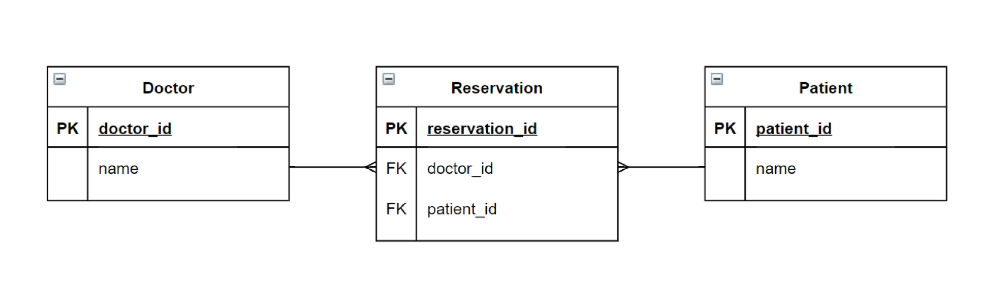
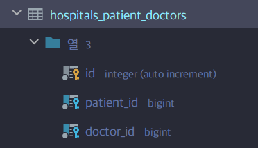
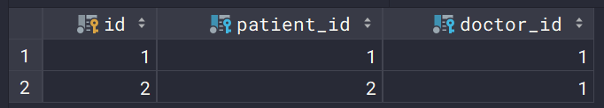
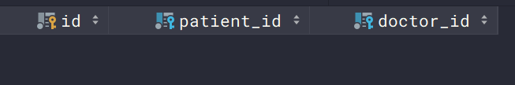
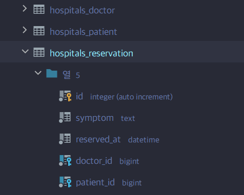
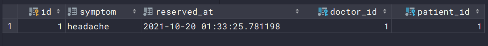
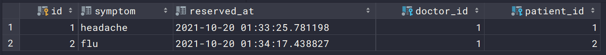
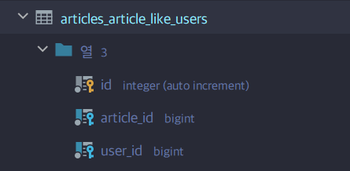

# Model Relationship - M:N

:::info 목차

- Intro
  - 병원 진료 기록 시스템
- ManyToManyField
  - 좋아요 기능 (Like)
  - Profile Page
  - 팔로우 기능 (Follow)

:::


<br/>


## Intro: 병원 진료 기록 시스템

### 병원 진료 기록 시스템을 통한 M:N 관계 학습


- 환자와 의사가 사용하는 병원 진료 기록 시스템 구축
   - 병원 시스템에서 가장 핵심이 되는 객체는 무엇일까? → 환자와 의사
   - 이 둘의 관계를 어떻게 표현할 수 있을까?


<br/>


- 시작하기 전
  - 모델링은 현실 세계를 최대한 유사하게 반영하기 위한 것
  - 우리 일상에 가까운 예시를 통해 DB를 모델링하고, 그 내부에서 일어나는 데이터의 흐름을 어떻게 제어할 수 있을지 고민해보기


<br/>


- 아래 링크에서 Django 프로젝트 다운로드
  - http://abit.ly/ssafy-mtm-practice


<br/>


- 1:N 모델 관계가 설정되어 있음

```python
from django.db import models

# Create your models here.
class Doctor(models.Model):
    name = models.TextField()

    def __str__(self):
        return f'{self.pk}번 의사 {self.name}'


class Patient(models.Model):
    name = models.TextField()
    doctor = models.ForeignKey(Doctor, on_delete=models.CASCADE)

    def __str__(self):
        return f'{self.pk}번 환자 {self.name}'
```


<br/>


- migration 후 shell_plus 실행
- 의사 2명과 환자 2명 생성

```bash
$ python manage.py makemigrations
$ python manage.py migrate
$ python manage.py shell_plus
```

```python
In [1]: doctor1 = Doctor.objects.create(name='justin')

In [2]: doctor2 = Doctor.objects.create(name='eric')

In [3]: patient1 = Patient.objects.create(name='tony', doctor=doctor1)

In [4]: patient2 = Patient.objects.create(name='harry', doctor=doctor2)

In [5]: doctor1
Out[5]: <Doctor: 1번 의사 justin>

In [6]: doctor2
Out[6]: <Doctor: 2번 의사 eric>

In [7]: patient1
Out[7]: <Patient: 1번 환자 tony>

In [8]: patient2
Out[8]: <Patient: 2번 환자 harry>
```


<br/>


### 1:N의 한계

- 1번 환자 (tony)가 1번 의사의 진ㅇ료를 마치고, 2번 의사에게도 방문하려고 한다면, 새로운 예약을 생성해야 한다.
- 기존의 예약을 유지한 상태로 새로운 예약을 생성
- 새로 생상한 3번 환자(tony)는 1번 환자(tony)와 다름

```python
In [10]: patient3 = Patient.objects.create(name='tony', doctor=doctor2)

In [11]: patient3
Out[11]: <Patient: 3번 환자 tony>

In [12]: patient3.doctor.name
Out[12]: 'eric'
```


<br/>


- 한 번에 두 의사에게 진료를 받고자 함
- 하나의 외래키에 2개의 의사 데이터를 넣을 수 없음.

```python
In [14]: patient4 = Patient.objects.create(name='harry', doctor=doctor1, doctor2)
  File "<ipython-input-14-6edaf3ffb4e6>", line 1
    patient4 = Patient.objects.create(name='harry', doctor=doctor1, doctor2)
                                                                           ^
SyntaxError: positional argument follows keyword argument
```


<br/>


- 새로운 예약을 생성하는 것이 불가능
  - 새로운 객체를 생성해야 함
- 여러 의사에게 진료 받은 기록을 환자 한명에 저장할 수 없음
  - 외래 키에 '1, 2' 형식의 데이터를 사용할 수 없음.


<br/>


### 중개 모델

- 중개 모델 (혹은 중개 테이블, Associate Table) 작성

```python
# hospitals/models.py

from django.db import models


class Doctor(models.Model):
    name = models.TextField()

    def __str__(self):
        return f'{self.pk}번 의사 {self.name}'


class Patient(models.Model):
    name = models.TextField()
    # 외래키 삭제

    def __str__(self):
        return f'{self.pk}번 환자 {self.name}'


# 중개모델 작성
class Reservation(models.Model):
    doctor = models.ForeignKey(Doctor, on_delete=models.CASCADE)
    patient = models.ForeignKey(Patient, on_delete=models.CASCADE)

    def __str__(self):
        return f'{self.doctor_id}번 의사의 {self.patient_id}번 환자'
```


<br/>


- 데이터베이스 초기화 / 마이그레이션 및 shell_plus 실행

```bash
$ python manage.py makemigrations
$ python manage.py migrate
$ python manage.py shell_plus
```


<br/>


- 중개 모델과의 모델 관계 확인




<br/>


- 의사 1명과 환자 1명 생성 및 예약 생성

```python
In [1]: doctor1 = Doctor.objects.create(name='justin')

In [2]: patient1 = Patient.objects.create(name='tony')

In [3]: Reservation.objects.create(doctor=doctor1, patient=patient1)
Out[3]: <Reservation: 1번 의사의 1번 환자>
```


<br/>


- 예약 내역 조회
- 의사의 예약 환자 조회

```python
In [4]: doctor1.reservation_set.all()
Out[4]: <QuerySet [<Reservation: 1번 의사의 1번 환자>]>
```


<br/>


- 환자의 담당 의사 조회

```python
In [5]: patient1.reservation_set.all()
Out[5]: <QuerySet [<Reservation: 1번 의사의 1번 환자>]>
```


<br/>


- 환자 1명 추가 생성 및 1번 의사에게 예약 생성

```python
In [6]: patient2 = Patient.objects.create(name='harry')

In [7]: Reservation.objects.create(doctor=doctor1, patient=patient2)
Out[7]: <Reservation: 1번 의사의 2번 환자>
```


<br/>


- 의사의 예약 환자 조회

```python
In [9]: doctor1.reservation_set.all()
Out[9]: <QuerySet [<Reservation: 1번 의사의 1번 환자>, <Reservation: 1번 의사의 2번 환자>]>

In [10]: for reservation in doctor1.reservation_set.all():
    ...:     print(reservation.patient.name)
    ...: 
tony
harry
```


<br/>


### ManyToManyField

- 다대다(M:N, many-to-many) 관계 설정 시 사용하는 모델 필드
- 하나의 필수 위치인자(M:N 관계로 설정할 모델 클래스)가 필요


<br/>


- ManyToManyField 작성 (중개 모델 삭제)
  - 필드 작성 위치는 Doctor 또는 Patient 모두 작성 가능

```python
from django.db import models


class Doctor(models.Model):
    name = models.TextField()

    def __str__(self):
        return f'{self.pk}번 의사 {self.name}'


class Patient(models.Model):
    name = models.TextField()
    # ManyToManyField 작성
    doctors = models.ManyToManyField(Doctor)

    def __str__(self):
        return f'{self.pk}번 환자 {self.name}'


# 중개모델 작성
class Reservation(models.Model):
    doctor = models.ForeignKey(Doctor, on_delete=models.CASCADE)
    patient = models.ForeignKey(Patient, on_delete=models.CASCADE)

    def __str__(self):
        return f'{self.doctor_id}번 의사의 {self.patient_id}번 환자'
```


<br/>


- 데이터베이스 초기화 / 마이그레이션 및 shell_plus 실행

```bash
$ python manage.py makemigrations
$ python manage.py migrate
$ python manage.py shell_plus
```


<br/>


- `ManyToManyField`로 인해 생성된 중개 테이블 확인




<br/>


- 의사 1명과 환자 2명 생성

```python
In [1]: doctor1 = Doctor.objects.create(name='justin')
In [2]: patient1 = Patient.objects.create(name='tony')
In [3]: patient2 = Patient.objects.create(name='harry')
```


<br/>


- **예약 생성 (참조)**
  1. patient1(tony)이 doctor1(justin)에게 예약
  2. patient1이 예약한 의사 목록 확인
  3. doctor1에게 예약된 환자 목록 확인

```python
In [4]: patient1.doctors.add(doctor1)

In [5]: patient1.doctors.all()     # 참조 : patient에 ManyToManyField를 작성했기 때문
Out[5]: <QuerySet [<Doctor: 1번 의사 justin>]>

In [6]: doctor1.patient_set.all()  # 역참조
Out[6]: <QuerySet [<Patient: 1번 환자 tony>]>
```


<br/>


- **예약 생성 (역참조)**
  1. doctor1(justin)이 patient2(harry)를 예약
  2. doctor1에게 예약된 환자 목록 확인
  3. patient2, patient1이 각각 예약한 의사 목록 확인

```python
In [10]: doctor1.patient_set.add(patient2)

In [11]: doctor1.patient_set.all()
Out[11]: <QuerySet [<Patient: 1번 환자 tony>, <Patient: 2번 환자 harry>]>

In [12]: patient2.doctors.all()
Out[12]: <QuerySet [<Doctor: 1번 의사 justin>]>
    
In [13]: patient1.doctors.all()
Out[13]: <QuerySet [<Doctor: 1번 의사 justin>]>
```


<br/>


- 중개 테이블 데이터 확인




<br/>


- **예약 취소 (역참조)**
  1. doctor1(justin)이 patient1(tony) 진료 예약 취소
  2. doctor1에게 예약된 환자 목록 확인
  3. patient1이 예약한 의사 목록 확인

```python
In [15]: doctor1.patient_set.remove(patient1)

In [16]: doctor1.patient_set.all()
Out[16]: <QuerySet [<Patient: 2번 환자 harry>]>

In [17]: patient1.doctors.all()
Out[17]: <QuerySet []>
```


<br/>


- **예약 취소 (참조)**
  1. patient2(harry)가 doctor1(justin) 진료 예약 취소
  2. patient2가 예약한 의사 목록 확인
  3. doctor1에게 예약된 환자 목록 확인

```python
In [18]: patient2.doctors.remove(doctor1)

In [19]: patient2.doctors.all()
Out[19]: <QuerySet []>

In [20]: doctor1.patient_set.all()
Out[20]: <QuerySet []>
```


<br/>


- 중개 테이블 데이터 확인




<br/>


### related_name

- target model(관계 필드를 가지지 않은 모델)이 source model(관계 필드를 가진 모델)을 참조할 때 사용할 manager의 이름을 설정
- 즉, 역참조 시에 사용하는 manager의 이름을 설정
- ForeignKey의 related_name과 동일

```python
from django.db import models


class Doctor(models.Model):
    name = models.TextField()

    def __str__(self):
        return f'{self.pk}번 의사 {self.name}'


class Patient(models.Model):
    name = models.TextField()
    # ManyToManyField - related_name 작성
    doctors = models.ManyToManyField(Doctor, related_name='patients')

    def __str__(self):
        return f'{self.pk}번 환자 {self.name}'


class Reservation(models.Model):
    doctor = models.ForeignKey(Doctor, on_delete=models.CASCADE)
    patient = models.ForeignKey(Patient, on_delete=models.CASCADE)

    def __str__(self):
        return f'{self.doctor_id}번 의사의 {self.patient_id}번 환자'
```


<br/>


- 마이그레이션 및 shell_plus 실행

```bash
$ python manage.py makemigrations
$ python manage.py migrate
$ python manage.py shell_plus
```


<br/>


- doctor1의 예약 환자 목록 확인 해보기 (역참조)
- related_name 설정 후 기존의 _set manager는 더 이상 사용할 수 없음.

```python
In [1]: doctor1 = Doctor.objects.get(pk=1)

In [2]: doctor1.patients.all()
Out[2]: <QuerySet []>

In [3]: doctor1.patient_set.all()
---------------------------------------------------------------------------
AttributeError                            Traceback (most recent call last)
<ipython-input-3-e81b89c43a95> in <module>
----> 1 doctor1.patient_set.all()

AttributeError: 'Doctor' object has no attribute 'patient_set'
```


<br/>


### 중개 모델(테이블) in Django

- django는 ManyToManyField를 통해 중개 테이블을 자동으로 생성
- 그렇다면 중개 테이블을 직접 작성하는 경우는 없을까?
  - 중개 테이블을 수동으로 지정하려는 경우 `through` 옵션을 사용하여, 중개 테이블을 나타내는 Django 모델을 지정할 수 있음 (다음 챕터에서 확인)
  - 가장 일반적인 용도는 중개 테이블에 추가 데이터를 사용해 다대다 관계로 연결하려는 경우에 사용


<br/>


### 요약

- 실제 Doctor와 Patient 테이블이 변하는 것은 없음.
- 1:N 관계는 완전한 종속의 관계이지만, **M:N 관계는 의사에게 진찰받는 환자, 환자를 진찰하는 의사의 두가지 형태로 모두 표현이 가능**


<br/>


## ManyToManyField

### 개념 및 특징

- 다대다 (M:N, many-to-many) 관계 설정 시 사용하는 모델 필드
- 하나의 필수 위치인자 (M:N 관계로 설정할 모델 클래스)가 필요
- 모델 필드의 RelatedManager를 사용하여 관련 개체를 추가, 제거 또는 만들 수 있음.
  - `add()`, `remove()`, `create()`, `clear()` ...


<br/>


:::tip [참고] RelatedManager

- 일대다 또는 다대다 관련 컨텍스트에서 사용되는 manager

:::


<br/>


### Arguments

#### 1. related_name

- target model (관계 필드를 가지지 않은 모델)이 source model(관계 필드를 가진 모델)을 참조할 때(역참조 시) 사용할 manager의 이름을 설정
- ForeignKey의 related_name과 동일


<br/>


#### 2. through

- 중개 테이블을 직접 작성하는 경우, through 옵션을 사용하여 중개 테이블을 나타내는 Django 모델을 지정할 수 있음
- 일반적으로 중개 테이블에 추가 데이터를 사용하는 다대다 관계와 연결하려는 경우 (extra data with a many-to-many relationship)에 주로 사용됨.


<br/>


#### 3. symmetrical

- ManyToManyField가 동일한 모델(on self)을 가리키는 정의에서만 사용
- symmetrical=True(기본값)일 경우 django는 person_set 매니저를 추가하지 않음
- source 모델의 인스턴스가 target 모델의 인스턴스를 참조하면, target 모델 인스턴스도 source 모델 인스턴스를 자동으로 참조하도록 함
  - 즉, 내가 당신의 침구라면 당신도 내 친구가 되는 것
  - 대칭을 원하지 않을 경우 False로 설정
  - Follow 기능 구현에서 다시 확인할 것


<br/>


### Related Manager

- 1:N 또는 M:N 관련 컨텍스트에서 사용되는 매니저
- 같은 이름의 메서드여도 각 관계(1:N, M:N)에 따라 다르게 사용 및 동작
  - 1:N에서는 target 모델 인스턴스만 사용 가능
  - M:N 관계에서는 관련된 두 객체에서 모두 사용 가능
- 메서드 종류
  - `add()`, `remove()`, `create()`, `clear()`, `set()` 등


<br/>


#### `add()`

- "지정된 객체를 관련 객체 집합에 추가"
- 이미 존재하는 관계에 사용하면 관계가 복제되지 않음

- 모델 인스턴스, 필드 값(PK)을 인자로 허용

```python
doctor1 = Doctor.objects.create(name='justin')
patient1 = Patient.objects.create(name='tony')

doctor1.patient_set.add(patient1)
# 또는
patient1.doctors.add(doctor1)
```


<br/>


#### `remove()`

- "관련 객체 집합에서 지정된 모델 객체를 제거"
- 내부적으로 QuerySet.delete()를 사용하여 관계가 삭제됨
- 모델 인스턴스, 필드 값(PK)을 인자로 허용

```python
doctor1 = Doctor.objects.get(pk=1)
patient1 = Patient.objects.get(pk=1)

doctor1.patient_set.remove(patient1)
# 또는
patient1.doctors.remove(doctor1)
```


<br/>


### through  예시

- 모델 관계 설정

```python
from django.db import models


class Doctor(models.Model):
    name = models.TextField()

    def __str__(self):
        return f'{self.pk}번 의사 {self.name}'

    
class Patient(models.Model):
    # through 옵션 작성
    doctors = models.ManyToManyField(Doctor, through='Reservation')
    name = models.TextField()

    def __str__(self):
        return f'{self.pk}번 환자 {self.name}'

    
class Reservation(models.Model):
    doctor = models.ForeignKey(Doctor, on_delete=models.CASCADE)
    patient = models.ForeignKey(Patient, on_delete=models.CASCADE)
    # 필드 추가
    symptom = models.TextField()
    reserved_at = models.DateTimeField(auto_now_add=True)

    def __str__(self):
        return f'{self.doctor.pk}번 의사의 {self.patient.pk}번 환자'
```


<br/>


- 데이터베이스 초기화 / 마이그레이션 및 shell_plus 실행

```bash
$ python manage.py makemigrations
$ python manage.py migrate
$ python manage.py shell_plus
```


<br/>


- 중개 테이블 확인




<br/>


- 의사 1명과 환자 2명 생성

```python
In [1]: doctor1 = Doctor.objects.create(name='justin')

In [2]: patient1 = Patient.objects.create(name='tony')

In [3]: patient2 = Patient.objects.create(name='harry')
```


<br/>


- 예약 생성 - 1

```python
In [4]: reservation1 = Reservation(doctor=doctor1, patient=patient1, symptom='headache')

In [5]: reservation1.save()

In [6]: doctor1.patient_set.all()
Out[6]: <QuerySet [<Patient: 1번 환자 tony>]>

In [7]: patient1.doctors.all()
Out[7]: <QuerySet [<Doctor: 1번 의사 justin>]>
```


<br/>


- 중개 테이블 확인



<br/>

- 예약 생성 - 2

```python
In [8]: patient2.doctors.add(doctor1, through_defaults={'symptom': 'flu'})

In [9]: doctor1.patient_set.all()
Out[9]: <QuerySet [<Patient: 1번 환자 tony>, <Patient: 2번 환자 harry>]>

In [10]: patient2.doctors.all()
Out[10]: <QuerySet [<Doctor: 1번 의사 justin>]>
```


<br/>


- 중개 테이블 확인




<br/>


- 예약 삭제

```python
In [11]: doctor1.patient_set.remove(patient1)

In [12]: patient2.doctors.remove(doctor1)
```


<br/>


### 데이터베이스에서의 표현

- django는 다대다 관계를 나타내는 중개 테이블을 만듦
- 테이블 이름은 다대다 필드의 이름과 이를 포함하는 모델의 테이블 이름을 조합하여 생성됨.


<br/>


### 중개 테이블의 필드 생성 규칙

1. source model 및 target model 모델이 다른 경우
   - `id`
   - `<containing_model>_id`
   - `<other_model>_id`
2. ManyToManyField가 동일한 모델을 가리키는 경우
   - `id`
   - `from_<model>_id`
   - `to_<model>_id`


<br/>


## Like

### Like 구현

- django_model_relationshop_II 프로젝트로 진행


<br/>


- ManyToManyField 작성 후 마이그레이션

```python
from django.db import models
from django.conf import settings


class Article(models.Model):
    user = models.ForeignKey(settings.AUTH_USER_MODEL, on_delete=models.CASCADE)
    # ManyToManyField 작성
    like_users = models.ManyToManyField(settings.AUTH_USER_MODEL)
    ...
```

```bash
$ python manage.py makemigrations
SystemCheckError: System check identified some issues:

ERRORS:
articles.Article.like_users: (fields.E304) Reverse accessor for 'articles.Article.like_users' clashes with reverse accessor for 'articles.Article.user'.
        HINT: Add or change a related_name argument to the definition for 'articles.Article.like_users' or 'articles.Article.user'.
articles.Article.user: (fields.E304) Reverse accessor for 'articles.Article.user' clashes with reverse accessor for 'articles.Article.like_users'.
        HINT: Add or change a related_name argument to the definition for 'articles.Article.user' or 'articles.Article.like_users'.
```


<br/>


- 에러 발생 원인
  - like_users 필드 생성 시 자동으로 역참조는 .article_set 매니저를 생성
  - 그러나 이전 1:N(User:Article) 관계에서 이미 해당 매니저 이름을 사용중이기 때문
  - User와 관계된 ForeignKey 또는 ManyToManyField 중 하나에 related_name 추가 필요


<br/>


- related_name 설정 후 마이그레이션 다시 진행

```python
from django.db import models
from django.conf import settings


class Article(models.Model):
    user = models.ForeignKey(settings.AUTH_USER_MODEL, on_delete=models.CASCADE)
    # ManyToMany, related_name 추가
    like_users = models.ManyToManyField(settings.AUTH_USER_MODEL, related_name='like_articles')
    title = models.CharField(max_length=10)
    content = models.TextField()
    created_at = models.DateTimeField(auto_now_add=True)
    updated_at = models.DateTimeField(auto_now=True)

    def __str__(self):
        return self.title


class Comment(models.Model):
    article = models.ForeignKey(Article, on_delete=models.CASCADE)
    user = models.ForeignKey(settings.AUTH_USER_MODEL, on_delete=models.CASCADE)
    content = models.CharField(max_length=200)
    created_at = models.DateTimeField(auto_now_add=True)
    updated_at = models.DateTimeField(auto_now=True)

    def __str__(self):
        return self.content
```

```bash
$ python manage.py makemigrations
$ python manage.py migrate
```


<br/>


- 생성된 중개 테이블 확인




<br/>


#### 현재 User-Article 간 사용 가능한 DB API

- `article.user`
  - 게시글을 작성한 유저 - 1:N
- `article.like_users`
  - 게시글을 좋아요한 유저 - M:N
- `user.article_set`
  - 유저가 작성한 게시글 (역참조) - 1:N
- `user.like_articles`
  - 유저가 좋아요한 게시글 (역참조) - M:N


<br/>


- url 작성

```python
# articles/urls.py

urlpatterns = [
    ...
    path('<int:article_pk>/likes/', views.likes, name='likes'),
]
```


<br/>


- like view 함수 작성

```python
# articles/views.py

@require_POST
def likes(request, article_pk):
    if request.user.is_authenticated:
        article = get_object_or_404(Article, pk=article_pk)

        # 현재 좋아요를 요청하는 회원(request.user)이
        # 해당 게시글의 좋아요를 누른 회원 목록에 이미 있다면,
        if article.like_users.filter(pk=request.user.pk).exists():
        # if request.user in article.like_users.all(): 
            # 좋아요 취소
            article.like_users.remove(request.user)
        else:
            # 좋아요 하기
            article.like_users.add(request.user)
        return redirect('articles:index')
    return redirect('accounts:login')
```


<br/>


#### QuerySet API - `exists()`

- QuerySet에 결과가 포함되어 있으면 True를 반환하고, 그렇지 않으면 False를 반환
- 특히 규모가 큰 QuerySet의 컨텍스트에서 특정 개체 존재 여부와 관련된 검색에 유용
- 고유한 필드 (예: primary key)가 있는 모델이 QuerySet의 구성원인지 여부를 찾는 가장 효율적인 방법

<br/>

- index 페이지에 like 출력 부분 작성

```html
<!-- articles/index.html -->




  ...
    <div>
      <form action="" method="POST">
        
        
          <input type="submit" value="좋아요 취소">
        
          <input type="submit" value="좋아요">
        
      </form>
    </div>
    <a href="">[DETAIL]</a>
    <hr>
  ...

```

<br/>


- 좋아요 버튼 클릭 후 확인


<br/>


## Profile Page

### Profile Page 작성

- 자연스로운 follow 흐름을 위한 회원 프로필 페이지 작성하기


<br/>


- url 작성

```python
# accounts/urls.py

urlpatterns = [
	...
    path('<username>/', views.profile, name='profile'),
]

```


<br/>


- profile view 함수 작성

```python
# accounts/views.py

from django.shortcuts import get_object_or_404, redirect, render
from django.contrib.auth import get_user_model

def profile(request, username):
    person = get_object_or_404(get_user_model(), username=username)
    context = {
        'person': person,
    }
    return render(request, 'accounts/profile.html', context)
```


<br/>


- profile 페이지 작성

```html
<!-- accounts/profile.html -->




  <h1>{{ person.username }}의 프로필 페이지</h1>
  <hr>

  <h2>{{ person.username }}가 작성한 게시글</h2>
  
    <div>{{ article.title }}</div>
  

  <hr>

  <h2>{{ person.username }}가 작성한 댓글</h2>
  
    <div>{{ comment.content }}</div>
  

  <hr>

  <h2>{{ person.username }}가 좋아요를 누른 게시글</h2>
  
    <div>{{ article.title }}</div>
  

  <a href="">[back]</a>
  

```


<br/>


- base 페이지에 프로필 링크 작성

```html
<!-- base.html --> 


<body>
  <div class="container">
    
      <h3>Hello, {{ user.username }}</h3>
      <a href="">내 프로필</a>
      ...
```


<br/>


- index 페이지에 프로필 링크 작성

```django
<!-- articles/index.html -->

<p>작성자 : 
  <a href="">{{ article.user }}</a>
</p>
```


<br/>


## Follow

### Follow 구현

- ManyToManyField 작성 후 마이그레이션

```python
# accounts/models.py

from django.db import models
from django.contrib.auth.models import AbstractUser


class User(AbstractUser):
    followings = models.ManyToManyField('self', symmetrical=False, related_name='followers')   
```

```bash
$ python manage.py makemigrations
$ python manage.py migrate
```


<br/>


- 생성된 중개 테이블 확인


<br/>


- url 작성

```python
# accounts/urls.py

urlpatterns = [
    ...
    path('<int:user_pk>/follow/', views.follow, name='follow'),
]
```


<br/>


- follow view 함수 작성

```python
# accounts/views.py

@require_POST
def follow(request, user_pk):
    if request.user.is_authenticated:
        person = get_object_or_404(get_user_model(), pk=user_pk)

        # 너와 내가 다른 사람이여야 팔로우를 진행할 수 있음
        if person != request.user:
            # 내가 상대방(person)의 팔로워 목록에 있다면
            if person.followers.filter(pk=request.user.pk).exists():
                person.followers.remove(request.user)
            else:
            # 팔로우
                person.followers.followers.add(request.user)
        return redirect('accounts:profile', you.username)
    return redirect('accounts:login')
```

```python
# 혹은

@require_POST
def follow(request, user_pk):
    if request.user.is_authenticated:
        me = request.user
        you = get_object_or_404(get_user_model(), pk=user_pk)

        # 너와 내가 다른 사람이여야 팔로우를 진행할 수 있음
        # 나 자신은 팔로우해서는 안됨
        if me != you:
            # 내가 상대방(person)의 팔로워 목록에 있다면
            if you.followers.filter(pk=me.pk).exists():
            # 언팔로우
                you.followers.remove(me)
            else:
            # 팔로우
                you.followers.add(me)
        return redirect('accounts:profile', you.username)
    return redirect('accounts:login')
```


<br/>


- profile 페이지에 팔로우와 언팔로우 버튼 작성
  1. 팔로잉 수 / 팔로워 수 출력
  2. 자기 자신을 팔로우할 수 없음

```html
<!-- accounts/profile.html -->




  <h1>{{ person.username }}의 프로필 페이지</h1>
  
    <div>
      <div>팔로잉 수 : {{ followings|length }} / 팔로워 수 : {{ followers|length }}</div>
    </div>
    
      <div>
        <form action="" method="POST">
          
          
            <input type="submit" value="언팔로우">
          
            <input type="submit" value="팔로우">
          
        </form>
      </div>
    
  
...
```


<br/>


- 좋아요 버튼 클릭 후 테이블 확인


<br/>

## 마무리

- ManyToManyField
  - 좋아요 기능 (Like)
  - Profile Page
  - 팔로우 기능 (Follow)


