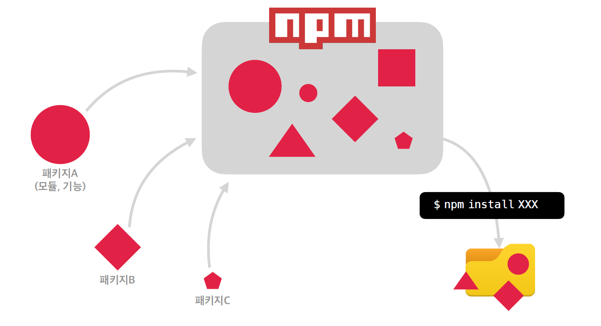

# Node.js

## 개요 및 설치

Node.js는 Chrome V8 JavaScript 엔진으로 빌드된 JavaScript 런타임

<br/>

:::note 런타임

프로그래밍 언어가 동작하는 환경

:::

<br/>

- **JavaScript가 동작할 수 있는 환경**
  - Node.js가 설치되어 있는 컴퓨터
    - 웹 페이지를 개발할 때 도움을 받기 위함
  - 웹 브라우저

<br/>

- **웹 개발을 도와주는 모듈들**
  - stylus, Sass, EJS, BABEL, ...
  - HTML, CSS, JavaScipt로 변환하기 위한 환경 : Node.js

<br/>

### Node.js 설치


- LTS (Lont Term Supported)는 장기적으로 안정되고 신뢰도가 높은 지원이 보장되는 버전. 유지/보수와 보안(서버 운영 등)에 초점을 맞춰 대부분 사용자에게 추천되는 버전 (짝수 버전)

- 홀수 버전 : 여러가지 최신 기능을 사용할 수 있는 장점이 있지만 비교적 안정적이지 못하다는 단점

<br/>

## Node Version Manager : NVM

- Node.js의 버전을 바꿀 수 있도록 도와주는 매니저

- https://github.com/coreybutler/nvm-windows

```bash
$ nvm --version         # nvm 버전 확인
$ nvm --help            # 도움말
$ nvm ls                # 설치되어있는 Node.js 목록 확인
$ nvm install 12.14.1   # node.js 설치
$ nvm use 12.14.1       # 사용할 버전 선택
$ nvm ls

    16.8.0
    12.21.0
  * 12.14.1 (Currently using 64-bit executable)
```

```bash
$ node --version        # node.js 버전 확인
v12.14.1
```

<br/>

## NPM (Node Package Manager)

- NPM (Node Package Manager)은 전 세계의 개발자들이 만든 다양한 기능 (패키지, 모듈) 등을 관리



```bash
$ npm init -y  # npm 패키지 관리 시작
```

```json
{
  "name": "frontend",
  "version": "1.0.0",
  "description": "",
  "main": "index.js",
  "scripts": {
    "test": "echo \"Error: no test specified\" && exit 1"
  },
  "keywords": [],
  "author": "",
  "license": "ISC"
}
```

```bash
$ npm install parcel-bundler -D  # 개발용 의존성 패키지 설치 (-D, --save-dev)
```

```bash
$ npm install lodash  # 일반 의존성 설치
```

```json
{
  "name": "frontend",
  "version": "1.0.0",
  "description": "",
  "main": "index.js",
  "scripts": {
    "test": "echo \"Error: no test specified\" && exit 1"
  },
  "keywords": [],
  "author": "",
  "license": "ISC",
  "devDependencies": {
    "parcel-bundler": "^1.12.5"
  },
  "dependencies": {
    "lodash": "^4.17.21"
  }
}
```

<br/>

- node_modules 폴더 삭제 후

```bash
$ npm i  # 혹은 install
```

- package.json에 명시되어 있는 모듈들 설치

<br/>

- package.json은 직접 관리하는 파일

- package-lock.json 파일은 자동으로 관리되는 파일

<br/>

## 개발 서버 실행과 빌드

### 개발 서버 실행

```json
{
  "scripts": {
    "dev": "parcel index.html"
  },
}
```

```bash
$ npm run dev
```

<br/>

### 빌드

```javascript
// main.js
import _ from "lodash"; // lodash.js

console.log("hello world");
console.log(_.camelCase("hello world"));
```

```json
{ 
  "scripts": {
    "dev": "parcel index.html",
    "build": "parcel build index.html"
  },
}
```

```bash
$ npm run build
```

<br/>

- `dist/index.html` 

```html
<!DOCTYPE html><html lang="en"><head><meta charset="UTF-8"><meta http-equiv="X-UA-Compatible" content="IE=edge"><meta name="viewport" content="width=device-width, initial-scale=1.0"><title>Document</title><script src="/main.a4336085.js"></script></head><body></body></html>
```

<br/>

:::note 코드 난독화

**코드 난독화**는 작성된 코드를 읽기 어렵게 만드는 작업을 말한다. 빌드된 결과(제품)는 브라우저에서 해석되는 용도로, 용량을 축소하고 읽기 어렵게 만드는 등의 최적화를 거치는 것이 좋다.

:::

:::note 번들

**번들**(Bundle)은 우리가 프로젝트 개발에 사용한 여러 모듈(패키지)을 하나로 묶어내는 작업을 말한다.

:::

<br/>

## 유의적 버전

### 유의적 버전 (Sementic Versioning, SemVer)

>  Major.Minor.Patch (ex. 12.14.1)


- **Major** : 기존 버전과 호환되지 않는 새로운 버전
- **Minor** : 기존 버전과 호환되는 새로운 기능이 추가된 버전
- **Patch** : 기존 버전과 호환되는 버그 및 오타 등이 수정된 버전

<br/>

- `^Major.Minor.Patch` : Major 버전 안에서 가장 최신 버전으로 업데이트 가능

```bash
$ npm info lodash             # 모듈의 버전,정보 확인
$ npm install lodash@4.17.20  # 패치 버전 지정해서 설치
$ npm update lodash           # 최신 버전으로 업데이트

# package.json에서 ^를 지우면 update를 하더라도 최신 버전이 설치되지 않음.
```

<br/>

## npm 프로젝트의 버전 관리

```
# gitignore

.cache/
dist/
node_modules/
```


