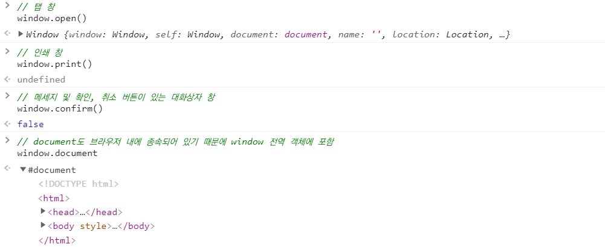
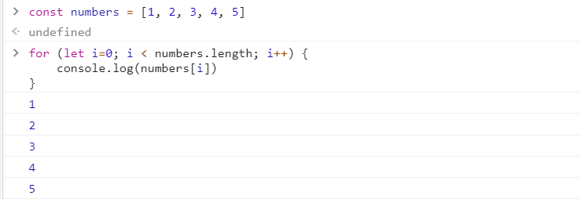

# Intro

:::info 목차


- Intro to JavaScript
- Event Listener


:::

<br/>

:::note

- <b>API Server</b>
   - Request & Response
   - 데이터 응답 (JSON)


- <b>RESTful</b>

   - <b>자원</b> (URI)

      - 자원의 표현
      - 계층 구조

  - <b>행위</b> (HTTP Method)
  
     - GET, POST, PUT/PATCH, DELETE

  - <b>표현</b> (Representations)

     - Data, Metadata of data
     - 응답 데이터 (JSON)


- <b>JSON</b> (JavaScript Object Notation)

   - JavaScript의 자료 구조 중 하나인 object의 표기법을 따른 데이터 교환 포맷
   - Key와 value의 조합 : `{"key": "value"}`
   - 데이터를 교환할 때 사용하는 양식 (약속)
   - 단순 문자열
   - 개발 환경에 맞는 자료형으로 변환 후 활용
:::

<br/>

## Intro

- 동작 방식
  - 서버 -> response -> 브라우저

<br/>

### 브라우저 (browser)

- 웹 서버에서 이동하며 클라이언트와 서버 간 양방향으로 통신하고, HTML 문서나 파일을 출력하는 GUI 기반의 소프트웨어
- 인터넷의 컨텐츠를 검색 및 열람하도록 함
- "웹 브라우저"라고도 함
- **주요 브라우저**
  - Google Chrome, Mozilla Firefox, Microsoft Edge, Opera, Safari

<br/>

### JavaScript 필요성

- 브라우저 화면을 '동적'으로 만들기 위함
- 브라우저를 조작할 수 있는 유일한 언어

<br/>

## History of JavaScript

- <b>핵심 키워드</b>

  - 핵심 인물
  - JavaScript의 탄생
  - 브라우저 전쟁
  - 파편화와 표준화
  - JavaScript ES6+

<br/>

### 핵심 인물

- **팀 버너스리** (Tim Berners-Lee)
  - WWW, URL, HTTP, HTML 최초 설계자
  - 웹의 아버지

<br/>

- **브랜던 아이크** (Brendan Eich)
  - JavaScript 최초 설계자
  - 모질라 재단 공동 설립자
  - 코드네임 피닉스 프로젝트 진행
  - 파이어폭스의 전신

<br/>

### JavaScript의 탄생

- 1994년 당시 넷스케이프 커뮤니케이션스사의 Netscape Navigator(NN) 브라우저가 전 세계 점유율을 80% 이상 독점하며 브라우저의 표준 역할을 함
- 당시 넷스케이프에 재직 중이던 브랜던 아이크가 HTML을 동적으로 동작하기 위한 회사 내부 프로젝트를 진행 중 JS를 개발
- JavaScript 이름 변천사
  - Mocha -> LiveScript -> JavaScript (1995)
- 그러나 1995년 경쟁사 마이크로소프트에서 이를 채택하여 커스터마이징한 JScript를 만듦
- 이를, IE 1.0에 탑재 -> 1차 브라우저 전쟁의 시작

<br/>

### 제 1차 브라우저 전쟁 (1996 ~ 2008)

- 넷스케이프 vs 마이크로소프트 (이하 MS)
- 빌 게이츠 주도 하에 MS는 1997년 IE 4를 발표하면서 시장을 장악하기 시작
  - 당시 윈도우 OS의 시장 점유율은 90%
  - 글로벌 기업 MS의 공격적인 마케팅
- MS의 승리로 끝나면 2001년부터 IE의 점유율은 90%를 상회
- 1998년 넷스케이프에서 나온 브랜던 아이크 외 후계자들은 모질라 재단을 성립
  - 파이어폭스를 통해 IE에 대항하며 꾸준히 점유율을 올려 나감

<br/>

- MS의 폭발적 성장, IE3에서 자체적인 JScript를 지원, 호환성 문제로 크로스 브라우징 등의 이슈 발생
- 이후 넷스케이프 후계자들은 모질라 재단 기반의 파이어폭스를 개발

<br/>

### 제 2차 브라우저 전쟁 (2009 ~)

- MS vs Google
- 2008년 Google의 Chrome (이하 크롬) 브라우저 발표
- 2011년 3년 만에 파이어폭스의 점유율을 돌파 후 2012년 전 세계 점유율 1위 탈환
- 크롬의 승리 요인
  - 압도적인 속도
  - 강력한 개발자 도구 제공
  - 웹 표준

<br/>

### 파편화와 표준화

- 제 1차 브라우저 전쟁 이후 수많은 브라우저에서 자체 자바스크립트 언어를 사용하게 됨
- 결국 서로 다른 자바스크립트가 만들어지면서 크로스 브라우징 이슈가 발생하여 웹 표준의 필요성이 제기
- **크로스 브라우징** (Cross Browsing)
  - W3C에서 채택된 표준 웹 기술을 채용하여 각각의 브라우저마다 다르게 구현되는 기술을 비슷하게 만들되, 어느 한쪽에 치우치지 않도록 웹 페이지를 제작하는 방법론 (동일성이 아닌 동등성)
  - 브라우저마다 렌더링에 사용하는 엔진이 다르기 때문

<br/>

- 1996년부터 넷스케이프는 표준 제정의 필요성을 주장
  - ECMA 인터네셔널 (정보와 통신 시스템을 위한 국제적 표준화 기구)에 표준 제정 요청
- 1997년 ECMAScript 1 (ES1) 탄생
- 제 1차 브라우저 전쟁 이후 제기된 언어의 파편화를 해결하기 위해 각 브라우저 회사와 재단은 표준화에 더욱 적극적으로 힘을 모으기 시작

<br/>

### JavaScript ES6+

- 2015년 ES2015 (ES6) 탄생
  - "Next-gen of JS"
  - JavaScript의 고질적인 문제들을 해결
  - JavaScript의 다음 시대라고 불릴 정도로 많은 혁신과 변화를 맞이한 버전
  - 이때부터 버전 순서가 아닌 출시 연도를 붙이는 것이 공식 명칭이나 통상적으로 ES6이라 부름
  - 현재는 표준 대부분이 ES6+로 넘어옴

<br/>

### Vanilla JavaScript

- 크로스 브라우징, 간편한 활용 등을 위해 많은 라이브러리 등장 (jQuery 등)
- ES6 이후, 다양한 도구의 등장으로 순수 자바 스크립트 활용의 증대

<br/>

### 정리

- History of JavaScript & Browser
  - 브라우저 전쟁
  - 파편화와 표준화의 투쟁
- 브라우저 전쟁의 여파
  - Cross Browsing Issue
  - 표준화(통합)를 위한 노력
  - Vanilla JavaScript

<br/>

## 브라우저에서 할 수 있는 일

- **DOM 조작** : JavaScript의 목적
  - 문서(HTML) 조작
- **BOM 조작** : JavaScript의 목적
  - navigator, screen, location, frames, history, XHR
- **JavaScript Core** (ECMAScript) : how?
  - Data Structure (Object, Array), Conditional Expression, Iteration

<br/>

### DOM(Document Object Model) 이란?

- HTML, XML과 같은 문서를 다루기 위한 문서 프로그래밍 인터페이스
- 문서를 구조화하고 구조화된 구성 요소를 하나의 객체로 취급하여 다루는 **논리적 트리 모델**
- 문서가 구조화되어 있으며 각 요소는 객체(object)로 취급
- 단순한 속성 접근, 메서드 활용 뿐만 아니라 프로그래밍 언어적 특성을 활용한 조작 가능
- 주요 객체
  - **window** : DOM을 표현하는 창, 가장 최상위 객체 (작성 시 생략 가능)
  - **document** : 페이지 컨텐츠의 Entry Point 역할을 하며, `<body>` 등과 같은 수많은 다른 요소들을 포함
  - navigator, location, history, screen


<br/>

####  DOM 해석

-  **파싱** (Pasing)
  - 구문 분석, 해석
  - 브라우저가 문자열을 해석하여 DOM Tree로 만드는 과정


<br/>

- DOM 조작

<br/>

### BOM 이란?


- Browser Object Model
- 자바스크립트가 브라우저와 소통하기 위한 모델
- 브라우저의 창이나 프레임을 추상화해서 프로그래밍적으로 제어할 수 있도록 제공하는 수단
  - 버튼, URL 입력창, 타이틀 바 등 브라우저 윈도우 및 웹 페이지 일부분을 제어 가능
- window 객체는 모든 브라우저로부터 지원받으며 브라우저의 창(window)를 지칭


<br/>

- BOM - 조작




<br/>

### JavaScript Core

- 프로그래밍 언어



<br/>

:::tip window 객체

- 전역객체라고도 불린다.
- DOM, BOM, JavaScript Core와 같은 모든 객체를 포함하고 있다. (모든 객체가 소속된 객체)
- 창이나 프레임을 의미한다.

:::

<br/>


## DOM 조작

### 개념


- Document는 문서 한 장 (HTML)에 해당하고 이를 조작
- DOM 조작 순서
  1. 선택 (Select)
  2. 변경 (Manipulation)


<br/>

### DOM 관련 객체의 상속 구조


- **EventTarget**
  - Event Listener를 가질 수 있는 객체가 구현하는 DOM 인터페이스
- **Node**
  - 여러 가지 DOM 타입들이 상속하는 인터페이스

<br/>

- **Element**
  - Document 안의 모든 객체가 상속하는 가장 범용적인 기반 클래스
  - 부모인 Node와 그 부모인 EventTarget의 속성을 상속
- **Document**
  - 브라우저가 불러온 웹 페이지를 나타냄
  - DOM 트리의 진입점 (entry point) 역할을 수행
- **HTMLElement**
  - 모든 종류를 HTML 요소
  - 부모 element의 속성 상속


<br/>

### DOM 선택

#### 선택 관련 메서드

- `Document.querySelector(selector)`
  - 제공한 선택자와 일치하는 element 하나 선택
  - 제공한 CSS selector를 만족하는 첫 번째 element 객체를 반환 (없다면 null)

<br/>

- `Document.querySelectorAll(selector)`
  - 제공한 선택자와 일치하는 여러 element를 선택
  - 매칭할 하나 이상의 셀렉터를 포함하는 유효한 CSS selector를 인자(문자열)로 받음
  - 지정된 셀렉터에 일치하는 **NodeList**를 반환

<br/>

- `getElementByID(id)`
- `getElementByTagName(name)`

- `getElementsByClassName(names)`

<br/>

- `querySelector()`, `querySelectorAll()`를 사용하는 이유
  - id, class 그리고 tag 선택자 등을 모두 사용 가능하므로, 더 구체적이고 유연하게 선택 가능
  - ex) `document.querySelector('#id')`, `document.querySelectAll('.name')`

<br/>

#### 선택 메서드별 반환 타입

1. 단일 element
   - `getElementById()`
   - `querySeletor()`
2. HTMLCollection
   - `getElementsByTagName()`
   - `getElementsByClassName()`
3. **NodeList**
   - `querySelectorAll()`

<br/>

#### HTMLCollection & NodeList

- 둘 다 배열과 같이 각 항목에 접근하기 위한 index를 제공 (유사 배열)
- **HTMLCollection**
  - name, id, index 속성으로 각 항목에 접근 가능
- **NodeList**
  - index로만 각 항목에 접근 가능
  - 단, HTMLCollection과 달리 배열에서 사용하는 forEach 함수 및 다양한 메서드 사용 가능 (array helper method)
- 둘 다 Live Collection으로 DOM의 변경사항을 실시간으로 반영하지만, `querySelectorAll()`에 의해 반환되는 NodeList는 Static Collection으로 실시간으로 반영되지 않음

<br/>

#### Collection

- **Live Collection**
  - 문서가 바뀔 때 실시간으로 업데이트 됨
  - DOM의 변경사항을 실시간으로 collection에 반영
  - ex) HTMLCollection, NodeList

<br/>

- **StaticCollection** (non-live)
  - DOM이 변경되어도 collection 내용에는 영향을 주지 않음
  - `querySelectorAll()`의 반환 NodeList만 static collection

<br/>

#### 실습

```javascript
// 1. Selection
// 1-1. window & document
console.log(window)
console.log(document)
console.log(window.document)


// 1-2. querySelector
const h1 = document.querySelector('h1')
// <h1>Hello</h1>

const h2 = document.querySelector('h2')
// <h2 id="location-header">Location</h2>

const secondH2 = document.querySelector('#location-header')
// <h2 id="location-header">Location</h2>

const selectUlTag = document.querySelector('div > ul')
/*
<ul>
  <li class="location">서울</li>
  <li class="location">대전</li>
  <li class="location">광주</li>
  <li class="location">구미</li>
  <li class="location">부울경</li>
</ul>
*/


// 1-3. querySelectorAll
const liTags = document.querySelectorAll('li')
// NodeList(5) [li.location, li.location, li.location, li.location, li.location]

const secondLiTags = document.querySelectorAll('.ssafy-location')
// NodeList(5) [li.location, li.location, li.location, li.location, li.location]


// 2. Creation & Append
// 2-1. createElement
const ulTag = document.querySelector('ul')
/*
<ul>
  <li class="location">서울</li>
  <li class="location">대전</li>
  <li class="location">광주</li>
  <li class="location">구미</li>
  <li class="location">부울경</li>
</ul>
*/

const newLiTag = document.createElement('li')
/*
<li class="location">서울</li>
<li class="location">대전</li>
<li class="location">광주</li>
<li class="location">구미</li>
<li class="location">부울경</li>
*/
```

<br/>

### DOM 요소 생성 (Creation)

- `Document.createElement()`
  - 작성한 태그 명의 HTML 요소를 생성하여 반환

<br/>

### DOM 변경

#### 변경 관련 메서드 (append DOM)

- `Element.append()`
  - 특정 부모 Node의 자식 NodeList 중 마지막 자식 다음에 Node 객체나 DOMString을 삽입
  - 여러 개의 Node 객체, DOMString을 추가 할 수 있음
  - 반환 값이 없음

```javascript
// 2-2. append
const ulTag = document.querySelector('ul')
const newLiTag = document.createElement('li')
newLiTag.innerText = '새로운 리스트 태그'
ulTag.append(newLiTag)
ulTag.append('문자열도 추가 가능')

const new1 = document.createElement('li')
new1.innerText = '리스트 1'
const new2 = document.createElement('li')
new2.innerText = '리스트 2'
const new3 = document.createElement('li')
new3.innerText = '리스트 3'
ulTag.append(new1, new2, new3)
```

<br/>

- `Node.appendChild()`
  - 한 Node를 특정 부모 Node의 자식 NodeList중 마지막 자식으로 삽입 (Node만 추가 가능)
  - 한번에 오직 하나의 Node만 추가할 수 있음
  - 만약 주어진 Node가 이미 문서에 존재하는 다른 Node를 참조한다면 새로운 위치로 이동

```javascript
// 2-3. appendChild
const ulTag = document.querySelector('ul')
const newLiTag = document.createElement('li')
newLiTag.innerText = '새로운 리스트 태그'
ulTag.appendChild(newLiTag)
ulTag.appendChild('문자열은 추가 불가')    // Error

const new1 = document.createElement('li')
new1.innerText = '리스트 1'
const new2 = document.createElement('li')
new2.innerText = '리스트 2'
ulTag.appendChild(new1, new2)          // 리스트 1만 추가된다.
```

<br/>

#### `PerentNode.append()` vs `Node.appendChild()`

- `append()`를 사용하면 DOMString 객체를 추가할 수도 있지만, `appendChild()`는 Node 객체만 허용
- `append()`는 반환 값이 없지만, `appendChild()`는 추가된 Node 객체를 반환
- append()는 여러 Node 객체와 문자열을 추가할 수 있지만, .appendChild()는 하나의 Node 객체만 추가할 수 있음

<br/>

#### 변경 관련 속성 (property)

- `Node.innerText`
  - Node 객체와 그 자손의 텍스트 컨텐츠 (DOMString)를 표현 (해당 요소 내부의 raw text)
    (사람이 읽을 수 있는 요소만 남김)
  - 즉, 줄 바꿈을 인식하고 숨겨진 내용을 무시하는 등 최종적으로 스타일링이 적용된 모습으로 표현
- `Element.innerHTML`
  - 요소(element) 내에 포함된 HTML 마크업을 반환
  - [참고] XSS 공격에 취약하므로 사용 시 주의

<br/>

```javascript
// 2-2. innerText & innerHTML
const ulTag = document.querySelector('ul')
const liTag1 = document.createElement('li')
liTag1.innerText = '<li>춘천</li>'               // <li>춘천</li>
const liTag2 = document.createElement('li')
liTag2.innerHTML = '<li>춘천</li>'               // 춘천
ulTag.append(liTag1, liTag2)                     
```

<br/>

#### XXS (Cross-site Scripting)

- 공격자가 웹 사이트 클라이언트 측 코드에 악성 스크립트를 삽입해 공격하는 방법
- 피해자 (사용자)의 브라우저가 악성 스크립트를 실행하며 공격자가 엑세스 제어를 우회하고 사용자를 가장할 수 있도록 함 (CSRF 공격과 유사)
- ex. 게시판이나 메일 등 악성 자바스크립트 코드를 삽입해 민감한 정보를 탈취할 수 있음.

```javascript
const ulTag = document.querySelector('ul')
ulTag.innerHTML = '<li><a href="javascript:alert(\'당신의 개인정보 유출\')">춘천</a></li>'
```

<br/>

### DOM 삭제

#### 삭제 관련 메서드

- `ChildeNode.remove()`
  - Node가 속한 트리에서 해당 Node를 제거

```javascript
// 3-1. remove
const header = document.querySelector('#location-header')
header.remove()
```

<br/>

- `Node.removeChild()`
  - DOM에서 자식 Node를 제거하고 제거된 Node를 반환
  - Node는 인자로 들어가는 자식 Node의 부모 Node

```javascript
// 3-2. removeChild
const parent = document.querySelector('ul')
const child = document.querySelector('ul > li')
const removedChild = parent.removeChild(child)
console.log(removedChild)
```

<br/>

### DOM 속성

#### 속성 관련 메서드

- `Element.setAttribute(name, value)`
  - 지정된 요소의 값을 설정
  - 속성이 이미 존재하면 값을 갱신, 존재하지 않으면 지정된 이름과 값으로 새 속성을 추가

```javascript
// 4-1. setAttribute
const header = document.querySelector('#location-header')
header.setAttribute('class', 'location')
```

<br/>

- `Element.getAttribute(attributeName)`
  - 해당 요소의 지정된 값(문자열)을 반환
  - 인자(attributeName)는 값을 얻고자 하는 속성의 이름

```javascript
// 4-2. getAttribute
const getAttr = document.querySelector('.location')
getAttr.getAttribute('class')
getAttr.getAttribute('style')
```

<br/>

### DOM 조작 - 정리

1. **선택한다**

```javascript
querySeletor()
querySelectorAll()
...
```

2. **변경한다**

```javascript
innerText
innerHTML
setAttribute()
getAttribute()
element.style.color
createElement()
appendChild()
...
```

<br/>

### DOM 조작 실습

```javascript
// 배경색 설정
const mainBackground = document.querySelector('body')
mainBackground.setAttribute('id', 'main')

// 요소 중앙 정렬
const nav = document.querySelector('nav')
const header = document.querySelector('header')
const section = document.querySelector('section')

nav.setAttribute('class', 'box-container')
header.setAttribute('class', 'box-container')
section.setAttribute('class', 'box-container')

// 테두리 설정
const inputTags = document.querySelectorAll('section div')

inputTags.forEach(function (div) {
  div.setAttribute('class', 'box-item')
})

// 버튼 변경
const myButton = document.querySelector('form > input')
myButton.setAttribute('class', 'button')

// 이미지 사이즈
const myImg = document.querySelector('nav > a > img')
myImg.width = '600'

// footer
const myFooter = document.createElement('footer')
myFooter.innerText = 'google 설문지를 통해 비밀번호를 제출하지 마시오.'

const parent = document.querySelector('body')
parent.appendChild(myFooter)

myFooter.setAttribute('class', 'box-container')

// input 요소 스타일링
const myInput = document.querySelector('#name')
myInput.style.marginTop = '50px'
```

<br/>

### liveNodes vs nonLiveNodes

```javascript
// 1
const liveNodes = document.getElementsByClassName('live')
// console.log(liveNodes)

for (let i = 0; i < liveNodes.length; i++) {
  liveNodes[i].className = 'red'
  console.log(liveNodes)
}

// 2
const nonLiveNodes = document.querySelectorAll('.non-live')

for (let i = 0; i < nonLiveNodes.length; i++) {
  nonLiveNodes[i].className = 'blue'
  console.log(nonLiveNodes)
}
```

<br/>

## Event

### 개념

- 네트워크 활동이나 사용자와의 상호작용 같은 사건의 발생을 알리기 위한 객체
- **이벤트 발생**
  - 마우스를 클릭하거나 키보드를 누르는 등 사용자 행동으로 발생할 수도 있음
  - 특정 메서드를 호출(`Element.click()`)하여 프로그래밍적으로도 만들어낼 수 있음

<br/>

### Event 기반 인터페이스

- AnimationEvent, ClipboardEvent, DragEvent 등
-  UIEvent
   - 간단한 사용자 인터페이스 이벤트
   - Event의 상속을 받음
   - MouseEvent, KeyboardEvent, InputEvent, FocusEvent 등의 부모 객체 역할을 함

<br/>

### Event의 역할

- "~ 하면 ~ 한다."
- "클릭하면, 경고창을 띄운다."
- "특정 이벤트가 발생하면, 할 일을 등록한다."

<br/>

### Event handler - addEventListener()

- `EventTarget.addEventListener()`
  - 지정한 이벤트가 대상에 전달될 때마다 호출할 함수를 설정
  - 이벤트를 지원하는 모든 객체 (Element, Document, Window 등)를 대상으로 지정 가능

<br/>

- `target.addEventListner(type, listener[, options])`
  - type
    - 반응할 이벤트 유형 (대소문자 구분 문자열)
  - listener
    - 지정된 타입의 이벤트가 발생했을 때 알림을 받은 객체
    - EventListener 인터페이스 혹은 JS function 객체 (콜백 함수)여야 함.

<br/>

:::tip EventTarget

Event Listener를 가질 수 있는 객체가 구현하는 DOM 인터페이스

:::

<br/>

- "대상에 특정 이벤트가 발생하면, 할 일을 등록하자."

```javascript
EventTarget.addEventListener(type, listener)
```

- 실습

```html
<body>
  <!-- 1. onclick -->
  <button onclick="alertMessage()">나를 눌러봐!</button>

  <!-- 2-1. addEventListener -->
  <button id="my-button">나를 눌러봐!!</button>
  <hr>

	<!-- 2-2. addEventListener -->
  <p id="my-paragraph"></p>

  <form action="#">
    <label for="my-text-input">내용을 입력하세요.</label>
    <input id="my-text-input" type="text">
  </form>
  <hr>

  <!-- 2-3. addEventListener -->
  <h2>Change My Color</h2>
  <label for="change-color-input">원하는 색상을 영어로 입력하세요.</label>
  <input id="change-color-input"></input>
  <hr>

  <script>
    // 1
    const alertMessage = function () {
      alert('메롱!!!')
    }

    // 2-1
    const myButton = document.querySelector('#my-button')
    myButton.addEventListener('click', alertMessage)

    // 2-2
    const myTextInput = document.querySelector('#my-text-input')
    myTextInput.addEventListener('input', function (event) {
      console.log(event)
      const myPtag = document.querySelector('#my-paragraph')
      myPtag.innerText = event.target.value
    })

    // 2-3
    const colorInput = document.querySelector('#change-color-input')
    
    const changeColor = function () {
      const h2Tag = document.querySelector('h2')
      h2Tag.style.color = event.target.value
    }

    colorInput.addEventListener('input', changeColor)
  </script>
</body>
```

<br/>

### Event 취소

- `Event.preventDefault()`
- 현재 이벤트의 기본 동작을 중단
- 태그의 기본 동작을 작동하지 않게 막음
  - ex) a 태그의 기본 동작은 클릭 시 링크로 이동 / form 태그의 기본 동작은 form 데이터 전송
- 이벤트를 취소할 수 있는 경우, 이벤트의 전파를 막지 않고 그 이벤트를 취소

<br/>

- 실습

```html
<body>
  <!-- 1. checkbox -->
  <input type="checkbox" id="my-checkbox" />
  <hr />

  <!-- 2. submit -->
  <form action="/articles/" id="my-form">
    <input type="text" />
    <input type="submit" value="제출!" />
  </form>
  <hr />

  <!-- 3. link -->
  <a href="https://google.com/" target="_blank" id="my-link">GoToGoogle</a>
  <hr />

  <script>
    // 1
    const checkBox = document.querySelector("#my-checkbox");

    checkBox.addEventListener("click", function (event) {
      event.preventDefault();
      console.log(event);
    });

    // 2
    const formTag = document.querySelector("#my-form");

    formTag.addEventListener("submit", function (event) {
      event.preventDefault();
      console.log(event);
      event.target.reset();
    });

    // 3
    const aTag = document.querySelector("#my-link");

    aTag.addEventListener("click", function (event) {
      event.preventDefault();
      console.log(event);
    });

    // 4
    document.addEventListener("scroll", function (event) {
      event.preventDefault();
      console.log(event);
    });
  </script>
</body>
```

<br/>

- 취소할 수 없는 이벤트도 존재
  - 이벤트의 취소 가능 여부는 `event.cancelable`을 사용해 확인할 수 있음.

<br/>

### Event 추가 학습

- 다양한 이벤트 유형 참고
- http://developer.mozilla.org/en-US/docs/Web/Events

<br/>

### Event 종합 실습

- CREATE, READ 기능을 충족하는 todo app 만들기

```html
<body>
  <form action="#">
    <input type="text">
    <button>Add</button>
  </form>
  <ul>
    
  </ul>

  <script>
    const form = document.querySelector('form')

    const addTodo = function (event) {
      event.preventDefault()

      console.log(event)

      const input = document.querySelector('input')
      const content = input.value
  
      if (content.trim()) {
        const liTag = document.createElement('li')
        liTag.innerText = content

        const ulTag = document.querySelector('ul')
        ulTag.appendChild(liTag)
      } else {
        alert('할 일을 입력해주세요!')
      }
      
      event.target.reset()
    }

    form.addEventListener('submit', addTodo)
  </script>
</body>
```


<br/>

## 마무리

- History of JavaScript & Browser

  - 브라우저 조작
  - 파편화와 표준화의 역사

- DOM (Document Object Model)

  - 문서를 다루기 위한 구조화된 문서의 모델 인터페이스
  - 구조화된 문서를 객체 (Object) 형태로 조작 (속성, 메서드)

  - DOM Manipulation
    - 선택
    - 변경

- Event & addEventListener

  - 브라우저 내에서 일어나는 일 (click, change, submit, load)
  - 특정 이벤트가 발생하면, 할 일을 등록
