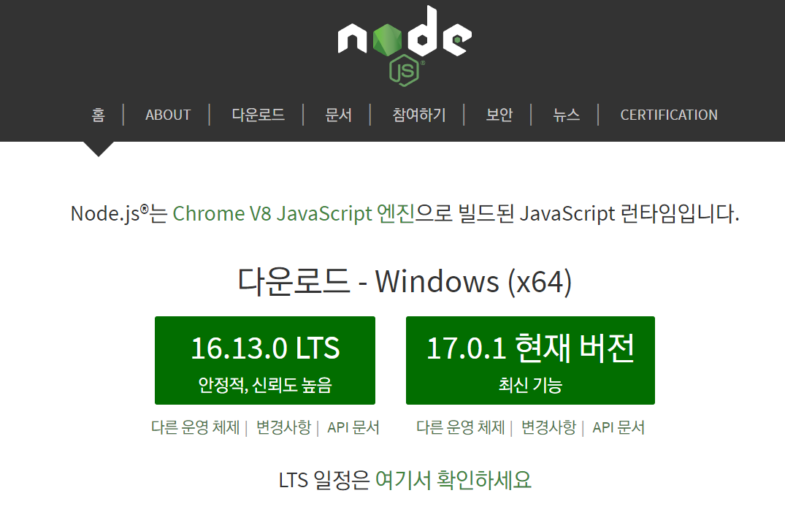

# JavaScript 기본

## Node.js

### 개요 및 설치

Node.js는 Chrome V8 JavaScript 엔진으로 빌드된 JavaScript 런타임

<br/>

:::note 런타임

프로그래밍 언어가 동작하는 환경

:::

<br/>

- **JavaScript가 동작할 수 있는 환경**
  - Node.js가 설치되어 있는 컴퓨터
    - 웹 페이지를 개발할 때 도움을 받기 위함
  - 웹 브라우저

<br/>

- **웹 개발을 도와주는 모듈들**
  - stylus, Sass, EJS, BABEL, ...
  - HTML, CSS, JavaScipt로 변환하기 위한 환경 : Node.js

<br/>

#### Node.js 설치



- LTS (Lont Term Supported)는 장기적으로 안정되고 신뢰도가 높은 지원이 보장되는 버전. 유지/보수와 보안(서버 운영 등)에 초점을 맞춰 대부분 사용자에게 추천되는 버전 (짝수 버전)

- 홀수 버전 : 여러가지 최신 기능을 사용할 수 있는 장점이 있지만 비교적 안정적이지 못하다는 단점

<br/>

### Node Version Manager : NVM

- Node.js의 버전을 바꿀 수 있도록 도와주는 매니저

- https://github.com/coreybutler/nvm-windows

```bash
$ nvm --version         # nvm 버전 확인
$ nvm --help            # 도움말
$ nvm ls                # 설치되어있는 Node.js 목록 확인
$ nvm install 12.14.1   # node.js 설치
$ nvm use 12.14.1       # 사용할 버전 선택
$ nvm ls

    16.8.0
    12.21.0
  * 12.14.1 (Currently using 64-bit executable)
```

```bash
$ node --version        # node.js 버전 확인
v12.14.1
```

<br/>

### NPM (Node Package Manager)

- NPM (Node Package Manager)은 전 세계의 개발자들이 만든 다양한 기능 (패키지, 모듈) 등을 관리


```bash
$ npm init -y  # npm 패키지 관리 시작
```

```json
{
  "name": "frontend",
  "version": "1.0.0",
  "description": "",
  "main": "index.js",
  "scripts": {
    "test": "echo \"Error: no test specified\" && exit 1"
  },
  "keywords": [],
  "author": "",
  "license": "ISC"
}
```

```bash
$ npm install parcel-bundler -D  # 개발용 의존성 패키지 설치 (-D, --save-dev)
```

```bash
$ npm install lodash  # 일반 의존성 설치
```

```json
{
  "name": "frontend",
  "version": "1.0.0",
  "description": "",
  "main": "index.js",
  "scripts": {
    "test": "echo \"Error: no test specified\" && exit 1"
  },
  "keywords": [],
  "author": "",
  "license": "ISC",
  "devDependencies": {
    "parcel-bundler": "^1.12.5"
  },
  "dependencies": {
    "lodash": "^4.17.21"
  }
}
```

<br/>

- node_modules 폴더 삭제 후

```bash
$ npm i  # 혹은 install
```

- package.json에 명시되어 있는 모듈들 설치

<br/>

- package.json은 직접 관리하는 파일

- package-lock.json 파일은 자동으로 관리되는 파일

<br/>

### 개발 서버 실행과 빌드

#### 개발 서버 실행

```json
{
  "scripts": {
    "dev": "parcel index.html"
  },
}
```

```bash
$ npm run dev
```

<br/>

#### 빌드

```javascript
// main.js
import _ from "lodash"; // lodash.js

console.log("hello world");
console.log(_.camelCase("hello world"));
```

```json
{ 
  "scripts": {
    "dev": "parcel index.html",
    "build": "parcel build index.html"
  },
}
```

```bash
$ npm run build
```

<br/>

- `dist/index.html` 

```html
<!DOCTYPE html><html lang="en"><head><meta charset="UTF-8"><meta http-equiv="X-UA-Compatible" content="IE=edge"><meta name="viewport" content="width=device-width, initial-scale=1.0"><title>Document</title><script src="/main.a4336085.js"></script></head><body></body></html>
```

<br/>

:::note 코드 난독화

**코드 난독화**는 작성된 코드를 읽기 어렵게 만드는 작업을 말한다. 빌드된 결과(제품)는 브라우저에서 해석되는 용도로, 용량을 축소하고 읽기 어렵게 만드는 등의 최적화를 거치는 것이 좋다.

:::

:::note 번들

**번들**(Bundle)은 우리가 프로젝트 개발에 사용한 여러 모듈(패키지)을 하나로 묶어내는 작업을 말한다.

:::

<br/>

### 유의적 버전

#### 유의적 버전 (Sementic Versioning, SemVer)

>  Major.Minor.Patch (ex. 12.14.1)


- **Major** : 기존 버전과 호환되지 않는 새로운 버전
- **Minor** : 기존 버전과 호환되는 새로운 기능이 추가된 버전
- **Patch** : 기존 버전과 호환되는 버그 및 오타 등이 수정된 버전

<br/>

- `^Major.Minor.Patch` : Major 버전 안에서 가장 최신 버전으로 업데이트 가능

```bash
$ npm info lodash             # 모듈의 버전,정보 확인
$ npm install lodash@4.17.20  # 패치 버전 지정해서 설치
$ npm update lodash           # 최신 버전으로 업데이트

# package.json에서 ^를 지우면 update를 하더라도 최신 버전이 설치되지 않음.
```

<br/>

### npm 프로젝트의 버전 관리

```
# gitignore

.cache/
dist/
node_modules/
```


<br/>


## JS 시작하기


### ECMAScript 개요

- **ECMA**: 자바스크립트 국제 표준화 기구
- 2015년에 ES6가 나오면서 JS의 전성기가 시작됨.
  - 5버전과 6버전의 차이점 주의깊게 살펴보기
  - 프로젝트가 어떤 버전을 적용하는지 확인하기
- Babel: 최신 JS를 구버전의 브라우저에서도 구동될 수 있도록 해줌.


<br/>


### 프로젝트 초기화

```bash
$ npm init -y
$ npm i parcel-bundler -D
```

```json
// package.json

{
  "name": "js-test",
  "version": "1.0.0",
  "description": "",
  "main": "index.js",
  "scripts": {
    "dev": "parcel index.html",
    "build": "parcel build index.html"
  },
  "keywords": [],
  "author": "",
  "license": "ISC",
  "devDependencies": {
    "parcel-bundler": "^1.12.5"
  }
}
```

```html
<!-- index.html -->
<!DOCTYPE html>
<html lang="en">
  <head>
    <meta charset="UTF-8" />
    <meta http-equiv="X-UA-Compatible" content="IE=edge" />
    <meta name="viewport" content="width=device-width, initial-scale=1.0" />
    <title>Document</title>
    <script src="./main.js"></script>
  </head>
  <body>
    <h1>Hello World!</h1>
  </body>
</html>
```

```js
// main.js

console.log("Hello World!");
```

```bash
$ npm run dev
```


<br/>


### 데이터 타입 확인

```js
// main.js

console.log(typeof "Hello World!");  // string
console.log(typeof 123);             // number
console.log(typeof true);            // boolean
console.log(typeof undefined);       // undefined

console.log(typeof null);            // object
console.log(typeof {});              // object
console.log(typeof []);              // object

// typeof 함수 만들기
function getType(data) {
  return Object.prototype.toString.call(data).slice(8, -1);
}

console.log(getType(123));           // Number
console.log(getType(false));         // Boolean
console.log(getType(null));          // Null
console.log(getType({}));            // Object
console.log(getType([]));            // Array
```


<br/>


#### 모듈화

```js
// getType.js
export default function getType(data) {
  return Object.prototype.toString.call(data).slice(8, -1);
}
```

```js
// main.js

import getType from './getType'

console.log(getType(123));           // Number
console.log(getType(false));         // Boolean
console.log(getType(null));          // Null
console.log(getType({}));            // Object
console.log(getType([]));            // Array
```


<br/>


### 산술, 할당 연산자

```js
// 산술 연산자 (aritnmetic operator)
console.log(1 + 2);
console.log(5 - 7);
console.log(3 * 4);
console.log(10 / 2);
console.log(7 % 5);
```

```js
// 할당 연산자 (assignment operator)
// const a = 2; // 재할당 불가능
let a = 2;

// a = a + 1;
a += 1;
a -= 1;
a *= 2;
a %= 2;

console.log(a);
```


<br/>


### 비교, 논리 연산자

```js
// 비교 연산자 (comparison operator)
const a = 1;
const b = 3;
console.log(a === b); // 일치 연산자. false

// 데이터 타입, 내용 비교 함수 만들기
function isEqual(x, y) {
  return x === y;
}

console.log(isEqual(1, 1));   // true
console.log(isEqual(2, "2")); // false

console.log(a !== b);         // true
console.log(a < b);           // true
console.log(a > b);           // false
console.log(a <= b);          // true
console.log(a >= b);          // false
```

```js
// 논리 연산자
const a = 1 === 1;
const b = "AB" === "AB";
const c = true;

console.log(a); // true
console.log(b); // true
console.log(c); // true

// &&: and 연산자
console.log("&&: ", a && b && c); // &&: true

// ||: or 연산자
console.log("||: ", a || b || c); // ||: true

// !: 부정연산자 : 반대값 반환
console.log("!: ", !a); // !: false
```


<br/>


### 삼항 연산자

```js
// 삼항 연산자(ternary operator)
const a = 1 < 2;

if (a) {
  console.log("참"); // 참
} else {
  console.log("거짓");
}

console.log(a ? "참" : "거짓"); // 참
```


<br/>


### 조건문 If Else

```js
import random from "./getRandom";

// 조건문 (If statement)
// console.log(random())

const a = random();

if (a === 0) {
  console.log("a is 0");
} else if (a === 2) {
  console.log("a is 2");
} else if (a === 4) {
  console.log("a is 4");
} else {
  console.log("rest...");
}
```


<br/>


### 조건문 Switch

```js
import random from "./getRandom";

// 조건문 (Switch)

const a = random();

switch (a) {
  case 0:
    console.log("a is 0");
    break; // 하나의 케이스가 끝나면 꼭 종료해주기!
  case 2:
    console.log("a is 2");
    break;
  case 4:
    console.log("a is 4");
    break;
  default:
    console.log("rest...");
}
```


<br/>


### 반복문 for

```js
// 반복문 (For statement)
// for 시작조건; 종료조건; 변화조건) {}

const ulEl = document.querySelector("ul");

for (let i = 0; i < 10; i += 1) {
  const li = document.createElement("li");
  li.textContent = `list-${i + 1}`; // 1부터 시작
  if ((i + 1) % 2 === 0) {
    li.addEventListener("click", function () {
      console.log(li.textContent);
    });
  }
  ulEl.appendChild(li);
}
```


<br/>


### 변수 유효범위

```js
// 변수 유효범위(Variable Scope)
// var, let, const

function scope() {
  console.log(a);
  if (true) {
    var a = 123;
  }
}

scope(); // undefined

// let, const 였다면 오류발생.
// var는 함수범위라서 변수는 있지만 값은 지정되지 않은 상태.
```


<br/>


### 형 변환

```js
// 형 변환(Type conversion)
const a = 1;
const b = "1";

// == : 동등 연산자
// 되도록이면 안쓰는 것 권장. 예외사황 발생(자동 형변환 발생)
// 웬만하면 일치연산자(===) 사용하기

console.log(a == b);  // true
console.log(a === b); // false

// Truthy(참 같은 값)
// true, {}, [], 1, 2, 'false', -12, '3.14' ...

// Falsy(거짓 같은 값)
// false, '', null, undefiend, 0, -0, NaN(Not a Number => 1 + undefined)

if ("false") {
  console.log(123);  // true
}
```


<br/>


## JS 함수

### 함수 기본

```js
// 함수 기본

function sum(x, y) {
  return x + y;
}

const a = sum(1, 3);
const b = sum(4, 12);

console.log(a);
console.log(b);
console.log(a + b);

console.log(sum(1, 3));
console.log(sum(4, 12));
console.log(sum(1, 3) + sum(4, 12));
```


<br/>


```js
// 함수 선언 (기명함수)
function sum(x, y) {
  return x + y;
}

// 함수 표현 (익명함수)
const sum = function (x, y) {
  return x + y;
};
```


<br/>


```js
// return : 내보내기, 종료

function sum(x, y) {
  if (x < 2) {
    return;
  }
  return x + y;
}

console.log(sum(1, 3));  // undefined
console.log(sum(7, 3));  // 10
```


<br/>


```js
// arguments

function sum() {
  console.log(arguments); // Arguments(2) [7, 3, callee: ƒ, Symbol(Symbol.iterator): ƒ]
  return arguments[0] + arguments[1];
}

console.log(sum(7, 3));  // 10
```


<br/>


### 화살표 함수

```js
// 화살표 함수
// () => {}    vs.   function () {}

const double = function (x) {
  return x * 2;
};

console.log("double: ", double(7));  // double:  14


const doubleArrow = x => x * 2;

console.log("doubleArrow: ", doubleArrow(7));  // doubleArrow:  14
```


<br/>


### IIFE (즉시 실행 함수)

```js
// 즉시 실행 함수 : 익명의 함수를 한번만 사용할 때
// IIFE, Immediately-Invoked Function Expression

(function () {
  console.log(a * 2);
})();
```


<br/>


### 호이스팅

```js
// 호이스팅 (Hoisting)
// 함수 선언부가 유효범위 최상단으로 끌어올려지는 현상

const a = 7;

double();  // Uncaught TypeError: double is not a function

const double = function () {
  console.log(a * 2);
};
```

```js
double();  // 14

function double() {
  console.log(a * 2);
}

// 코드를 위에서 부터 아래로 읽을 때 이름을 통해 이름 유추
// 해당 함수에 대한 실질적 로직은 맨 아래에 작성할 수 있다.
```


<br/>


### 타이머 함수

```js
// 타이머 함수
// setTimeout(함수, 시간): 일정 시간 후 함수 실행
// setInterval(함수, 시간): 시간 간격마다 함수 실행
// clearTimeout(): 설정된 Timeout 함수를 종료
// clearInterval(): 설정된 Interval 함수를 종료

const timer = setTimeout(() => {
  console.log("Hello!");
}, 3000);

const h1El = document.querySelector("h1");

h1El.addEventListener("click", () => {
  clearTimeout(timer);
});


const timer = setInterval(() => {
  console.log("Hello!");
}, 3000);

const h1El = document.querySelector("h1");

h1El.addEventListener("click", () => {
  clearInterval(timer);
});
```


<br/>


### 콜백

```js
// 콜백 (Callback)
// 함수의 인수로 사용되는 함수

// setTImeout(함수, 시간)

function timeout() {
  setTimeout(() => {
    console.log("Hello!");
  }, 3000);
}

timeout();

console.log("Done!");

// Done!
// Hello!


function timeout(cb) {
  setTimeout(() => {
    console.log("Hello!");
    cb();
  }, 3000);
}

timeout(() => {
  console.log("Done!");
});

// Hello!
// Done!
```


