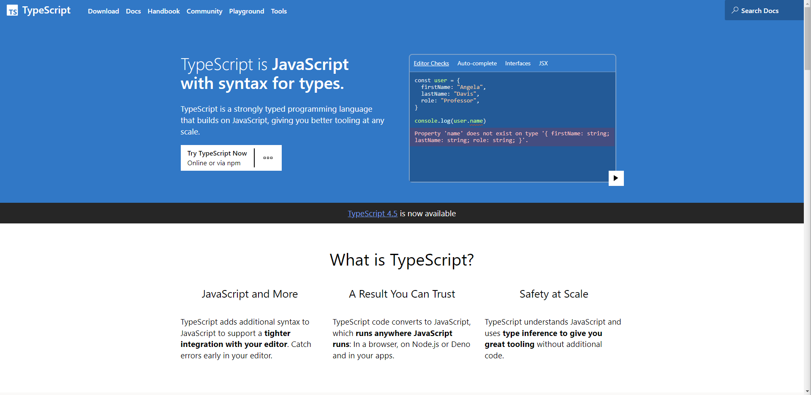
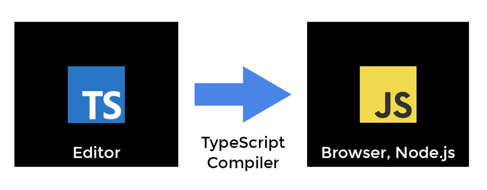

# Intro

## TypeScript란 무엇인가?

https://www.typescriptlang.org/



<br/>

### Typed JavaScript at any Scale

- TypeScript extends JavaScript by adding types.
- By understanding JavaScript, **TypeScript saves you time catching errors and providing fixes before you run code.**
- Any browser, any OS, anywhere JavaScript runs. Entirely Open Source.

<br/>

### TypeScript = Language

= Typed Superset JavaScript

= complies to plain JavaScript

<br/>

- 타입스크립트는 **'Programming Language'** 입니다.
- 타입스크립트는 **'Complied Language'** 입니다.
  - 전통적인 Complied Language 와는 다른 점이 많습니다.
  - 그래서 **'Transpile'** 이라는 용어를 사용하기도 합니다.
- 자바스크립트는 **'Interpreted Language'**입니다.

<br/>

### Compiled vs. Interpreted

|            Compiled             |           Interpreted           |
| :-----------------------------: | :-----------------------------: |
|         컴파일이 필요 O         |         컴파일이 필요 X         |
|        컴파일러가 필요 O        |        컴파일러가 필요 X        |
| 컴파일하는 시점 O (컴파일 타임) |        컴파일하는 시점 X        |
|     컴파일된 결과물을 실행      |        코드 자체를 실행         |
| 컴파일된 결과물을 실행하는 시점 | 코드를 실행하는 시점 O (런타임) |

<br/>

### TypeScript Compiler

TS(Editor) ⇒ JS(Browser, Node.js) 을 해주는 프로그램



<br/>

## ts.config.json

```json
{
  "compilerOptions": {
    "target": "es5", // 'es3', 'es5', 'es2015', 'es2016', 'es2017','es2018', 'esnext' 가능
    "module": "commonjs", //무슨 import 문법 쓸건지 'commonjs', 'amd', 'es2015', 'esnext'
    "allowJs": true, // js 파일들 ts에서 import해서 쓸 수 있는지
    "checkJs": true, // 일반 js 파일에서도 에러체크 여부
    "jsx": "preserve", // tsx 파일을 jsx로 어떻게 컴파일할 것인지 'preserve', 'react-native', 'react'
    "declaration": true, //컴파일시 .d.ts 파일도 자동으로 함께생성 (현재쓰는 모든 타입이 정의된 파일)
    "outFile": "./", //모든 ts파일을 js파일 하나로 컴파일해줌 (module이 none, amd, system일 때만 가능)
    "outDir": "./", //js파일 아웃풋 경로바꾸기
    "rootDir": "./", //루트경로 바꾸기 (js 파일 아웃풋 경로에 영향줌)
    "removeComments": true, //컴파일시 주석제거

    "strict": true, //strict 관련, noimplicit 어쩌구 관련 모드 전부 켜기
    "noImplicitAny": true, //any타입 금지 여부
    "strictNullChecks": true, //null, undefined 타입에 이상한 짓 할시 에러내기
    "strictFunctionTypes": true, //함수파라미터 타입체크 강하게
    "strictPropertyInitialization": true, //class constructor 작성시 타입체크 강하게
    "noImplicitThis": true, //this 키워드가 any 타입일 경우 에러내기
    "alwaysStrict": true, //자바스크립트 "use strict" 모드 켜기

    "noUnusedLocals": true, //쓰지않는 지역변수 있으면 에러내기
    "noUnusedParameters": true, //쓰지않는 파라미터 있으면 에러내기
    "noImplicitReturns": true, //함수에서 return 빼먹으면 에러내기
    "noFallthroughCasesInSwitch": true //switch문 이상하면 에러내기
  }
}
```
