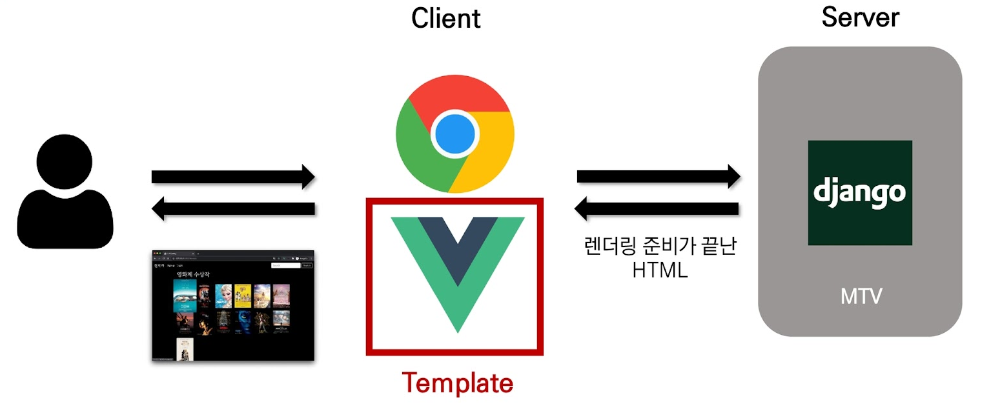
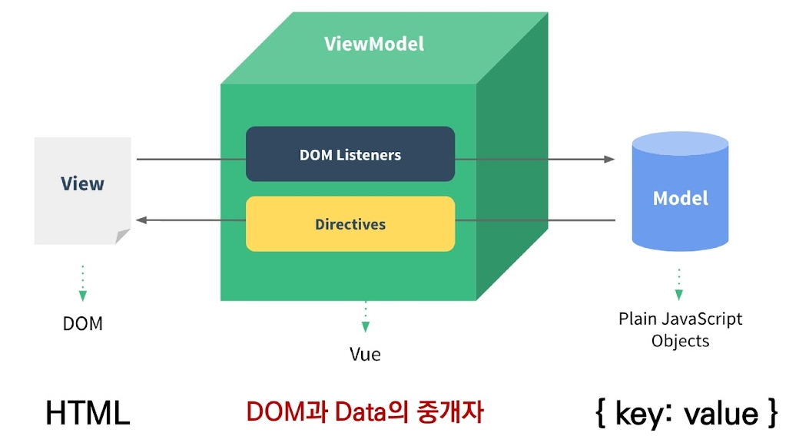

# Vue.js 기초

:::info 목차

- Intro
- Why Vue.js?
- Concepts of Vue.js
- Quick Start
- Basic Syntax

:::

<br/>

## Intro

### Front-End Development

- HTML, CSS 그리고 JavaScript를 활용해서 데이터를 볼 수 있게 만들어 줌
  - 이 작업을 통해 사용자는 데이터를 눈으로 볼 수 있고, 데이터와 상호작용 할 수 있음
- 대표적인 프론트엔드 프레임워크
  - Vue.js, React, Angular

<br/>

### Vue.js

- 사용자 인터페이스를 만들기 위한 진보적인 자바스크립트 프레임워크
- 현대적인 tool과 다양한 라이브러리를 통해 SPA(Single Page Application)를 완벽하게 지원

<br/>

:::tip [참고] Evan You 에 의해 발표 (2014)

- 구글의 Angular 개발자 출신
- 학사 미술, 미술사 전공/석사 디자인 & 테크놀로지 전공
- 구글 Angular보다 더 가볍고, 간편하게 사용할 수 있는 프레임워크를 만들기 위해 개발
- https://vuejs.org/

:::

<br/>

### SPA

- **Single Page Application** (단일 페이지 애플리케이션)
- 현재 페이지를 동적으로 렌더링함으로써 사용자와 소통하는 웹 애플리케이션

<br/>

- 단일 페이지로 구성되며 서버로부터 최초에만 페이지를 다운로드하고, 이후에는 동적으로 DOM을 구성
  - 처음 페이지를 받은 이후부터는 서버로부터 새로운 전체 페이지를 불러오는 것이 아닌, 현재 페이지 중 필요한 부분만 동적으로 다시 작성함
- 연속되는 페이지 간의 사용자 경험(UX)을 향상
  - 모바일 사용량이 증가하고 있는 현재 트래픽의 감소와 속도, 사용성, 반응성의 향상은 매우 중요하기 때문
- 동작 원리의 일부가 **CSR(Client Side Rendering)**의 구조를 따름
- https://en.wikipedia.org/wiki/Single-page_application

<br/>

### SPA 등장 배경

- 과거 웹 사이트들은 요청에 따라 매번 새로운 페이지를 응답하는 방식이었음
  - MPA (Multi Page Application)
- 스마트폰이 등장하면서 모바일 최적화의 필요성이 대두됨
  - 모바일 네이티브 앱과 같은 형태의 웹 페이지가 필요해짐
- 이러한 문제를 해결하기 위해 Vue.js와 같은 프론트엔드(Front-End) 프레임워크가 등장
  - CSR(Client Side Rendering), SPA(Single Page Application)의 등장
- **1개의 웹 페이지에서 여러 동작이 이루어지며 모바일 앱과 비슷한 형태의 사용자 경험을 제공**

<br/>

### CSR

- **Client Side Rendering**
- 서버에서 화면을 구성하는 SSR 방식과 달리 클라이언트에서 화면을 구성
- 최초 요청 시 HTML, CSS, JS 등 데이터를 제외한 각종 리소스를 응답받고 이후 클라이언트에서는 필요한 데이터만 요청해 JS로 DOM을 렌더링하는 방식
- 즉, 처음엔 뼈대만 받고 브라우저에서 동적으로 DOM을 그림
- SPA가 사용하는 렌더링 방식


**장점**

1. 서버와 클라이언트 간 트래픽 감소
   - 웹 애플리케이션에 필요한 모든 정적 리소스를 최초에 한 번 다운로드 후 필요한 데이터만 갱신
2. 사용자 경험(UX) 향상
   - 전체 페이지를 다시 렌더링하지 않고 변경되는 부분만을 갱신하기 때문

<br/>

**단점**

1. SSR에 비해 전체 페이지 렌더링 시점이 느림
2. SEO(검색 엔진 최적화)에 어려움이 있음 (최초 문서에 데이터가 없기 때문)

<br/>

### SSR

- **Server Side Rendering**
- 서버에서 클라이언트에게 보여줄 페이지를 모두 구성하여 전달하는 방식
- JS 웹 프레임워크 이전에 사용되던 전통적인 렌더링 방식
- https://d2.naver.com/helloworld/7804182


<br/>

**장점**

1. 초기 구동 속도가 빠름
   - 클라이언트가 빠르게 컨텐츠를 볼 수 있음
2. SEO(검색 엔진 최적화)에 적합
   - DOM에 이미 모든 데이터가 작성되어있기 때문

<br/>

**단점**

- 모든 요청마다 새로운 페이지를 구성하여 전달
  - 반복되는 전체 새로고침으로 인해 사용자 경험이 떨어짐
  - 상대적으로 트래픽이 많아 서버의 부담이 클 수 있음

<br/>

### SSR & CSR

- 두 방식의 차이는 렌더링의 주최가 누구인가에 따라 결정
- **즉, 화면을 그리는 것(렌더링)을 서버가 한다면 SSR / 클라이언트가 한다면 CSR**
- SSR과 CSR을 단순 비교하여 ‘어떤 것이 더 좋다’가 아니라, 내 서비스 또는 프로젝트 구성에 맞는 방법을 적절하게 선택하는 것이 중요 (하나 혹은 SSR, CSR을 섞어서 구성할 수도 있음)

<br/>

- 예를 들어, Django에서 Axios를 활용한 좋아요/팔로우 로직의 경우, 대부분은 Server에서 완성된 HTML을 제공하는 구조 (SSR)
- 단, 특정 요소(좋아요/팔로우)만 JS(AJAX & DOM조작)를 활용 (CSR)
  - AJAX를 활용해 비동기 요청으로 필요한 데이터를 클라이언트에서 서버로 직접 요청을 보내 받아오고 JS를 활용해 DOM을 조작

<br/>

:::tip [참고] SEO

- <b>Search Engine Optimization (검색 엔진 최적화)</b>
- 웹 페이지 검색엔진이 자료를 수집하고 순위를 매기는 방식에 맞게 웹 페이지를 구성해서 검색 결과의 상위에 노출될 수 있도록 하는 작업
- 인터넷 마케팅 방법 중 하나
- 구글의 등장 이후 검색엔진들이 컨텐츠의 신뢰도를 파악하는 기초 지표로 사용됨
  - 다른 웹 사이트에서 얼마나 인용되었나를 반영
  - 결국 타 사이트에 인용되는 횟수를 늘리는 방향으로 최적화
- https://en.wikipedia.org/wiki/Search_engine_optimization
- https://developers.google.com/search/docs/beginner/seo-starter-guide?hl=ko

:::

<br/>

:::tip [참고] SEO 대응

- Vue.js 또는 React 등의 SPA 프레임워크는 SSR을 지원하는 SEO 대응 기술이 이미 존재
  - SEO 대응이 필요한 페이지에 대해서는 선별적 SEO 대응 가능
- 혹은 추가로 별도의 프레임워크를 사용하기도 함
  - Nuxt.js
    - Vue.js 응용 프로그램을 만들기 위한 프레임워크
    - SSR 지원
  - Next.js
    - React 응용 프로그램을 만들기 위한 프레임워크
    - SSR 지원

:::

<br/>

### Vue.js 역할



<br/>

## Why Vue.js?

- 가장 인기있는 프론트엔드 프레임워크

<br/>

### 왜 사용할까?

- 현대 웹 페이지는 페이지 규모가 계속해서 커지고 있으며, 그만큼 사용하는 데이터도 늘어나고 사용자와의 상호작용도 많이 이루어짐
- 결국 Vanilla JS 만으로는 관리하기가 어려움
  - 예시) “페이스북 친구가 이름을 수정했을 경우, 화면상에서 변경되어야 하는 것들”
  - 타임라인의 이름, 페이스북 메시지 상의 이름, 내 주소록에서의 친구 이름 등
  - → 페이스북이 React를 개발한 이유

<br/>

### 비교

- **Vanilla JS**
  - 한 유저가 100만 개의 게시글을 작성했다고 가정
  - 이 유저가 닉네임을 변경하면, 게시글 100만 개의 작성자 이름이 모두 수정되어야 함
  - ‘모든 요소’를 선택해서 ‘이벤트’를 등록하고 값을 변경해야 함
- **Vue.js**
  - DOM과 Data가 연결되어 있으면
  - Data를 변경하면 이에 연결된 DOM은 알아서 변경
  - 즉, 우리가 신경 써야 할 것은 오직 **Data에 대한 관리**

<br/>

## Concept of Vue.js

### MVVM Pattern

- 애플리케이션 로직을 UI로부터 분리하기 위해 설계된 디자인 패턴
- 구성 요소
  1. Model
  2. View
  3. View Model
- https://en.wikipedia.org/wiki/Model%F2%80%93view%F2%80%93viewmodel

<br/>



<br/>

#### Model

- **“Vue에서 Model은 JavaScript Object다.”**
- JavaScript의 Object 자료 구조
- 이 Object는 Vue Instance 내부에서 data로 사용되는데, 이 값이 바뀌면 View(DOM)가 반응

<br/>

#### View

- **“Vue에서 View는 DOM(HTML)이다.”**
- Data의 변화에 따라서 바뀌는 대상

<br/>

#### ViewModel

- **“Vue에서 ViewModel은 모든 Vue Instance이다.”**
- View와 Model 사이에서 Data와 DOM에 관련된 모든 일을 처리
- ViewModel을 활용해 Data를 얼마만큼 잘 처리해서 보여줄 것인지(DOM)를 고민하는 것

<br/>

## Quick Start of Vue.js

### Django & Vue.js 코드 작성 순서

- **Django** : “데이터의 흐름”
  - url → views → template

<br/>

- **Vue.js** : “Data가 변화하면 DOM이 변경”
  1. Data 로직 작성
  2. DOM

<br/>

### 공식 문서 "시작하기" 따라하기

```html
<!DOCTYPE html>
<html lang="ko">
  <head>
    <meta charset="UTF-8" />
    <meta http-equiv="X-UA-Compatible" content="IE=edge" />
    <meta name="viewport" content="width=device-width, initial-scale=1.0" />
    <title>Vue Quick Start</title>
  </head>
  <body>
      
    <!-- 2. 선언적 렌더링 -->
    <h2>선언적 렌더링</h2>
    <div id="app">{{ message }}</div>
      
    <!-- 3. 엘리멘트 속성 바인딩 -->
    <h2>Element 속성 바인딩</h2>
    <div id="app-2">
      <span v-bind:title="message"> 내 위에 잠시 마우스를 올리면 동적으로 바인딩 된 title을 볼 수 있습니다! </span>
    </div>
      
    <!-- 4. 조건 -->
    <h2>조건</h2>
    <div id="app-3">
      <p v-if="seen">이제 나를 볼 수 있어요</p>
    </div>
      
    <!-- 5. 반복 -->
    <h2>반복</h2>
    <div id="app-4">
      <ol>
        <li v-for="todo in todos">{{ todo.text }}</li>
      </ol>
    </div>
      
    <!-- 6. 사용자 입력 핸들링 -->
    <h2>사용자 입력 핸들링</h2>
    <div id="app-5">
      <p>{{ message }}</p>
      <button v-on:click="reverseMessage">메시지 뒤집기</button>
    </div>
      
    <!-- 1. Vue CDN -->
    <script src="https://cdn.jsdelivr.net/npm/vue/dist/vue.js"></script>
    <script>
        
      // 2. 선언적 렌더링
      var app = new Vue({
        el: "#app",
        data: {
          message: "안녕하세요 Vue!",
        },
      });
        
      // 3. 엘리먼트 속성 바인딩
      var app2 = new Vue({
        el: "#app-2",
        data: {
          message: "이 페이지는 " + new Date() + " 에 로드 되었습니다",
        },
      });
        
      // 4. 조건
      var app3 = new Vue({
        el: "#app-3",
        data: {
          seen: true,
        },
      });
        
      // 5. 반복
      var app4 = new Vue({
        el: "#app-4",
        data: {
          todos: [{ text: "JavaScript 배우기" }, { text: "Vue 배우기" }, { text: "무언가 멋진 것을 만들기" }],
        },
      });
        
      // 6. 사용자 입력 핸들링
      var app5 = new Vue({
        el: "#app-5",
        data: {
          message: "안녕하세요! Vue.js!",
        },
        methods: {
          reverseMessage: function () {
            this.message = this.message.split("").reverse().join("");
          },
        },
      });
    </script>
  </body>
</html>
```


<br/>

## Basic syntax of Vue.js

### Vue instance

- 모든 Vue 앱은 Vue 함수로 새 인스턴스를 만드는 것부터 시작
- Vue 인스턴스를 생성할 때는 Options 객체를 전달해야 함
- 여러 Options들을 사용하여 원하는 동작을 구현
- Vue Instance === Vue Component

```javascript
const app = new Vue({
    
})
```

- https://kr.vuejs.org/v2/guide/instance.html

<br/>

### Option/DOM - `el`

- Vue 인스턴스에 연결(마운트) 할 기존 DOM 엘리먼트가 필요
- CSS 선택자 문자열 혹은 HTML Element로 작성
- new를 이용한 인스턴스 생성 때만 사용
- https://kr.vuejs.org/v2/api/#el

```javascript
const app = new Vue({
    el: '#app' }})
```

<br/>

### Options/Data - `data`

- Vue 인스턴스의 데이터 객체
- Vue 인스턴스의 상태 데이터를 정의하는 곳
- Vue template에서 interpolation을 통해 접근 가능
- v-bind, v-on과 같은 directive에서도 사용 가능
- Vue 객체 내 다른 함수에서 this 키워드를 통해 접근 가능

<br/>

:::warning 주의

- <b>화살표 함수를 data에서 사용하면 안 됨</b>
- 화살표 함수가 부모 컨텍스트를 바인딩하기 때문에, `this`는 예상과 달리 Vue 인스턴스를 가리키지 않음
- 일반 함수에서는 Vue 인스턴스를 가리키지만 화살표함수에서는 `[object Window]`를 가리킨다.

:::

<br/>

- https://kr.vuejs.org/v2/api/index.html#data

```javascript
const app = new Vue({
  el: '#app',
  data: {
    message: 'Hello',
  }
})
```

<br/>

### Options/Data - `methods`

- Vue 인스턴스에 추가할 메서드
- Vue template에서 interpolation을 통해 접근 가능
- v-on과 같은 directive에서도 사용 가능
- Vue 객체 내 다른 함수에서 this 키워드를 통해 접근 가능

:::warning 주의
- <b>화살표 함수를 메서드를 정의하는데 사용하면 안 됨</b>
- 화살표 함수가 부모 컨텍스트를 바인딩하기 때문에, `this`는 Vue 인스턴스가 아니며 `this.a`는 정의되지 않음
:::

```javascript
const app = new Vue({
  el: '#app',
  data: {
    message: 'Hello',
  },
  methods: {
    greeting: function () {
      console.log('hello')
    }
  }
})
```

<br/>

### `this` keyword in vue.js

- Vue 함수 객체 내에서 vue 인스턴스를 가리킴
- 단, JavaScript 함수에서의 this 키워드는 다른 언어와 조금 다르게 동작하는 경우가 있으니 제공되는 handout 참고


- **화살표 함수를 사용하면 안 되는 경우**
  1. data
  2. method
- https://developer.mozilla.org/ko/docs/Web/JavaScript/Reference/Operators/this

```html
<!DOCTYPE html>
<html lang="en">
<head>
  <meta charset="UTF-8">
  <meta http-equiv="X-UA-Compatible" content="IE=edge">
  <meta name="viewport" content="width=device-width, initial-scale=1.0">
  <title>Document</title>
</head>
<body>
  <div id="app">
    <button @click="myFunc">a</button>
    <button @click="yourFunc">b</button>
  </div>

  <script src="https://cdn.jsdelivr.net/npm/vue/dist/vue.js"></script>
  <script>
    const app = new Vue({
      el: '#app',
      data: {
        a: 1,
      },
      methods: {
        myFunc: function {
          console.log(this)  // Vue instance
        },
        yourFunc: () => {
          console.log(this)  // window
        }
      }
    })
  </script>
</body>
</html>
```


<br/>

## Template Syntax

### Template Syntax

- 렌더링 된 DOM을 기본 Vue 인스턴스의 데이터에 선언적으로 바인딩할 수 있는 HTML 기반 템플릿 구문을 사용
  1. Interpolation : `{{ }}`
  2. Directive : `"v-"`
- https://vuejs.org/v2/guide/syntax.html

<br/>

### Interpolation (보간법)

1. Text
   - `<span>메시지: {{ msg }}</span>`
2. Raw HTML
   - `<span v-html="rawHtml"></span>`
3. Attributes
    - `<div v-bind:id="dynamicId"></div>`
4. JS 표현식
    - `{{ number + 1 }}`
    - `{{ message.split('').reverse().join('') }}`

- https://vuejs.org/v2/guide/syntax.html

<br/>

### Directive (디렉티브)
- v- 접두사가 있는 특수 속성
- 속성 값은 단일 JS 표현식이 됨 (v-for는 예외)
- 표현식의 값이 변경될 때 반응적으로 DOM에 적용하는 역할을 함

<br/>

- **전달인자** (Arguments)
  - ` :`(콜론)을 통해 전달인자를 받을 수도 있음

```html
<a v-bind:href="url">...</a>
<a v-on:click="doSomething">...</a>
```

<br/>

- **수식어** (Modifiers)
  - `.`(점)으로 표시되는 특수 접미사
  - directive를 특별한 방법으로 바인딩 해야 함을 나타냄

```html
<form v-on:submit.prevent="onSubmit"> ... </form>
```

<br/>

- https://kr.vuejs.org/v2/api/index.html#%EB%94%94%EB%A0%89%ED%8B%B0%EB%B8%8C

<br/>

### v-text
- 엘리먼트의 textContent를 업데이트
- 내부적으로 interpolation 문법이 v-text로 컴파일 됨

```html
<body>
  <div id="app">
    <p v-text="message"></p>
    <!-- 같음 -->
    <p>{{ message }}</p>
  </div>

  <script src="https://cdn.jsdelivr.net/npm/vue/dist/vue.js"></script>
  <script>
    const app = new Vue({
      el: "#app",
      data: {
        message: "hello",
      },
    });
  </script>
</body>
```

<br/>

### v-html

- 엘리먼트의 innerHTML을 업데이트
  - XSS 공격에 취약할 수 있음
- 임의로 사용자로부터 입력 받은 내용은 v-html에 **'절대' 사용 금지**

```html
<body>
  <div id="app">
    <div>Hello</div>
    <div v-html="myHtml"></div>
  </div>

  <script src="https://cdn.jsdelivr.net/npm/vue/dist/vue.js"></script>
  <script>
    const app = new Vue({
      el: "#app",
      data: {
        myHtml: "<b>Hello</b>",
      },
    });
  </script>
</body>
```


<br/>

### v-show

- 조건부 렌더링 중 하나
- 엘리먼트는 항상 렌더링 되고 DOM에 남아있음
- 단순히 엘리먼트에 display CSS 속성을 토글하는 것

```html
<body>
  <div id="app">
    <p v-show="isTrue">true</p>
    <p v-show="isFalse">false</p>
  </div>

  <script src="https://cdn.jsdelivr.net/npm/vue/dist/vue.js"></script>
  <script>
    const app = new Vue({
      el: "#app",
      data: {
        isTrue: true,
        isFalse: false,
      },
    });
  </script>
</body>
```


<br/>

### v-if, v-else-if, v-else

- 조건부 렌더링 중 하나
- 조건에 따라 블록을 렌더링
- directive의 표현식이 true일 때만 렌더링
- 엘리먼트 및 포함된 directive는 토글하는 동안 삭제되고 다시 작성됨

```html
<body>
  <div id="app">
    <!-- 1 -->
    <div v-if="seen">seen이 true일때만 렌더링</div>

    <!-- 2 -->
    <div v-if="myType === 'A'">A</div>
    <div v-else-if="myType === 'B'">B</div>
    <div v-else-if="myType === 'C'">C</div>
    <div v-else>Not A/B/C</div>
  </div>

  <script src="https://cdn.jsdelivr.net/npm/vue/dist/vue.js"></script>
  <script>
    const app = new Vue({
      el: "#app",
      data: {
        seen: false,
        myType: "A",
      },
    });
  </script>
</body>
```


<br/>

### v-show 와 v-if
- **v-show** (Expensive initial load, cheap toggle)
  - CSS display 속성을 hidden으로 만들어 토글
  - 실제로 렌더링은 되지만 눈에서 보이지 않는 것이기 때문에 딱 한 번만 렌더링이 되는 경우라면 v-if에 비해 상대적으로 렌더링 비용이 높음
  - 하지만, 자주 변경되는 요소라면 한 번 렌더링 된 이후부터는 보여주는지에 대한 여부만 판단하면 되기 때문에 토글 비용이 적음

<br/>

- **v-if** (Cheap initial load, expensive toggle)
  - 전달인자가 false인 경우 렌더링 되지 않음
  - 화면에서 보이지 않을 뿐만 아니라 렌더링 자체가 되지 않기 때문에 렌더링 비용이 낮음
  - 하지만, 자주 변경되는 요소의 경우 다시 렌더링 해야 하므로 비용이 증가할 수 있음

<br/>

### v-for

- 원본 데이터를 기반으로 엘리먼트 또는 템플릿 블록을 여러 번 렌더링
- item in items 구문 사용
- item 위치의 변수를 각 요소에서 사용할 수 있음
  - 객체의 경우는 key
- v-for 사용 시 반드시 **key 속성을 각 요소에 작성**

:::tip [참고] v-for 작성법

```html
<ul>
  <li
    v-for="todo in todos"
    :key="todo.id"
  >
    {{ todo.text }}
  </li>
</ul>
```

:::

```html
<body>
  <div id="app">
    <h2>String</h2>
    <div v-for="char in myStr">{{ char }}</div>
    <div v-for="(char, index) in myStr" :key="index">{{ index }}: {{ char }}</div>
    <h2>Array</h2>
    <div v-for="fruit in fruits">{{ fruit }}</div>
    <div v-for="(fruit, index) in fruits" :key="`fruit-${index}`">{{ fruit }}</div>
    <div v-for="todo in todos" :key="todo.id">{{ todo.title }} - {{ todo.completed }}</div>
    <h2>Object</h2>
    <div v-for="value in myObj">{{ value }}</div>
    <div v-for="(value, key) in myObj" :key="key">{{ key }} : {{ value }}</div>
  </div>

  <script src="https://cdn.jsdelivr.net/npm/vue/dist/vue.js"></script>
  <script>
    const app = new Vue({
      el: "#app",
      data: {
        myStr: "Hello World!",
        fruits: ["apple", "banana", "coconut"],
        todos: [
          { id: 1, title: "todo1", completed: true },
          { id: 2, title: "todo2", completed: false },
          { id: 3, title: "todo3", completed: true },
        ],
        myObj: {
          name: "Kim",
          age: 50,
        },
      },
    });
  </script>
</body>
```


- v-if와 함께 사용하는 경우 v-for가 우선순위가 더 높음
  - 단, 가능하면 v-if와 v-for를 동시에 사용하지 말 것

```html
<body>
  <div id="app">
    <!-- bad 1 -->
    <ul>
      <li
        v-for="user in users"
        v-if="user.isActive"
        :key="user.id"
      >
        {{ user.name }}
      </li>
    </ul>

    <!-- good 1 -->
    <ul>
      <li
        v-for="user in activeUsers"
        :key="user.id"
      >
        {{ user.name }}
      </li>
    </ul>

    <!-- bad 2 -->
    <ul>
      <li
        v-for="user in users"
        v-if="shouldShowUsers"
        :key="user.id"
      >
        {{ user.name }}
      </li>
    </ul>

    <!-- good 2 -->
    <ul v-if="shouldShowUsers">
      <li
        v-for="user in users"
        :key="user.id"
      >
        {{ user.name }}
      </li>
    </ul>
  </div>
  
  <script src="https://cdn.jsdelivr.net/npm/vue/dist/vue.js"></script>
  <script>
    const app = new Vue({
      el: '#app',
      data: {
        users: [
          { id: 1, name: 'harry', isActive: false, },
          { id: 2, name: 'john', isActive: true, },
          { id: 3, name: 'tony', isActive: false, },
          { id: 4, name: 'eric', isActive: true, },
        ],
        shouldShowUsers: true,
      },
      computed: {
        activeUsers: function () {
          return this.users.filter(user => {
            return user.isActive
          })
        }
      },
    })
  </script>
</body>
```


<br/>

### v-bind

- HTML 요소의 속성에 Vue의 상태 데이터를 값으로 할당
- Object 형태로 사용하면 value가 true인 key가 class 바인딩 값으로 할당
- 약어 (Shorthand)
  - `:` (콜론)
  - `v-bind:href→:href`

```html
<!DOCTYPE html>
<html lang="en">
  <head>
    <meta charset="UTF-8" />
    <meta http-equiv="X-UA-Compatible" content="IE=edge" />
    <meta name="viewport" content="width=device-width, initial-scale=1.0" />
    <title>Document</title>
    <style>
      .active {
        color: red;
      }

      .my-background-color {
        background-color: yellow;
      }
    </style>
  </head>
  <body>
    <div id="app">
      <!-- 속성 바인딩 -->
      
      
      <hr />

      <!-- 클래스 바인딩 -->
      <div :class="{ active: isRed }">클래스 바인딩</div>

      <h2 :class="[activeRed, myBackground]">Hello Vue.js</h2>
      <hr />

      <!-- 스타일 바인딩 -->
      <ul>
        <li v-for="todo in todos" :class="{ active: todo.isActive }" :style="{ fontSize: fontSize + 'px' }">{{ todo }}</li>
      </ul>
    </div>

    <script src="https://cdn.jsdelivr.net/npm/vue/dist/vue.js"></script>
    <script>
      const app = new Vue({
        el: "#app",
        data: {
          imageSrc: "https://picsum.photos/200/300",
          isRed: true,
          activeRed: "active",
          myBackground: "my-background-color",
          todos: [
            { id: 1, title: "todo1", isActive: true },
            { id: 2, title: "todo2", isActive: false },
          ],
          fontSize: 30,
        },
      });
    </script>
  </body>
</html>
```


<br/>

### v-model

- HTML form 요소의 값과 data를 양방향 바인딩
- 수식어
  - `.lazy`
    - input 대신 change 이벤트 이후에 동기화
  - `.number`
    - 문자열을 숫자로 변경
  - `.trim`
    - 입력에 대한 trim 을 진행

```html
<body>
  <div id="app">
    <!-- 한, 중, 일 딜레이 -->
    <h2>1. Input -> Data</h2>
    <h3>{{ myMessage }}</h3>
    <input v-model="myMessage" type="text">

    <!-- 딜레이 없음 -->
    <h2>2. Input -> Data</h2>
    <h3>{{ myMessage2 }}</h3>
    <input v-on:input="onInputChange" type="text">

    <h2>3. Checkbox</h2>
    <input type="checkbox" id="checkbox" v-model="isChecked">
    <label for="checkbox">{{ isChecked }}</label>
  </div>

  <script src="https://cdn.jsdelivr.net/npm/vue/dist/vue.js"></script>
  <script>
    const app = new Vue({
      el: '#app',
      data: {
        myMessage: '',
        myMessage2: '',
        isChecked: true,
      },
      methods: {
        onInputChange: function (event) {
          // console.log(event)
          this.myMessage2 = event.target.value
        }
      }
    })
  </script>
</body>
```


<br/>

### Options/Data - `computed`

- 데이터를 기반으로 하는 계산된 속성
- 함수의 형태로 정의하지만 함수가 아닌 함수의 반환 값이 바인딩 됨
- 종속된 데이터에 따라 저장(캐싱)됨
- **종속된 데이터가 변경될 때만 함수를 실행**
- 즉, 어떤 데이터에도 의존하지 않는 computed 속성의 경우 절대로 업데이트되지 않음
- 반드시 반환 값이 있어야 함
- https://krvuejs.org/v2/guide/computed.html#computed-%EC%86%8D%EC%84%B1

```html
<body>
  <div id="app">
    <p>{{ num }}</p>
    <p>{{ doubleNum }}</p>
  </div>
  
  <script src="https://cdn.jsdelivr.net/npm/vue/dist/vue.js"></script>
  <script>
    const app = new Vue({
      el: '#app',
      data: {
        num: 2,
      },
      computed: {
        doubleNum: function () {
          return this.num * 2
        }
      },
    })
  </script>
</body>
```

```html
<body>
  <div id="app">
    <p>원본 메시지: "{{ message }}"</p>
    <p>computed: "{{ reversedMessageComputed }}"</p>
    <p>methods: "{{ reversedMessageMethod() }}"</p>
  </div>
  
  <script src="https://cdn.jsdelivr.net/npm/vue/dist/vue.js"></script>
  <script>
    const app = new Vue({
      el: '#app',
      data: {
        message: '안녕하세요'
      },
      computed: {
        reversedMessageComputed: function () {
          return this.message.split('').reverse().join('')
        }
      },
      methods: {
        reversedMessageMethod: function () {
          return this.message.split('').reverse().join('')
        }
      }
    })
  </script>
</body>
```


<br/>

### computed & methods

- computed 속성 대신 methods에 함수를 정의할 수도 있음
  - 최종 결과에 대해 두 가지 접근 방식은 서로 동일
- 차이점은 computed 속성은 종속 대상을 따라 저장(캐싱) 됨
- 즉, computed는 종속된 대상이 변경되지 않는 한 computed에 작성된 함수를 여러 번 호출해도 계산을 다시 하지 않고 계산되어 있던 결과를 반환
- 이에 비해 methods를 호출하면 렌더링을 다시 할 때마다 항상 함수를 실행

<br/>

### Options/Data - `watch`

- 데이터를 감시
- 데이터에 변화가 일어났을 때 실행되는 함수

```html
<body>
<div id="app">
  <p>{{ num }}</p>
  <button @click="num += 1">add 1</button>
</div>

<script src="https://cdn.jsdelivr.net/npm/vue/dist/vue.js"></script>
<script>
  const app = new Vue({
    el: '#app',
    data: {
      num: 2,
    },
    watch: {
      num: function () {
        console.log(`${this.num}이 변경되었습니다.`)
      }
    },
  })
</script>
</body>
```


<br/>

### computed & watch
- **computed**

  > "특정 값이 변동하면 해당 값을 다시 계산해서 보여준다."

  - 특정 데이터를 직접적으로 사용/가공하여 다른 값으로 만들 때 사용
  - 속성은 계산해야 하는 목표 데이터를 정의하는 방식으로 소프트웨어 공학에서 이야기하는 '선언형 프로그래밍' 방식

<br/>

- **watch**

  > "특정 값이 변동하면 다른 작업을 한다."
  >
  > 특정 대상이 변경되었을 때 콜백 함수를 실행시키기 위한 트리거

  - 특정 데이터의 변화 상황에 맞춰 다른 data 등이 바뀌어야 할 때 주로 사용
  - 감시할 데이터를 지정하고 그 데이터가 바뀌면 특정 함수를 실행하는 방식
  - 소프트웨어 공학에서 이야기하는 ‘명령형 프로그래밍' 방식

<br/>

- computed와 watch는 어떤 것이 더 우수한 것이 아닌 사용하는 목적과 상황이 다름

```html
<body>
  <div id="app">
    <p>a: {{ a }}</p>
    <p>Computed: a의 제곱은 {{ square }} 입니다.</p>
    <p>Watch: a는 {{ increase }} 만큼 증가했습니다.</p>
    <input type="number" v-model.number="delta">
    <button @click="a += delta">a 증가</button>
  </div>

  <script src="https://cdn.jsdelivr.net/npm/vue/dist/vue.js"></script>
  <script>
    const app = new Vue({
      el: '#app',
      data: {
        a: 0,
        delta: 0,
        increase: 0,
      },
      computed: {
        square: function () {
          console.log('Computed !')
          return this.a**2
        }
      },
      // a가 변경되면 변경된 값을 콜백함수의 첫번째 인자로 전달하고 이전 값을 두번째 인자로 전달
      // computed는 새 프로퍼티를 생성하지만 watch는 아무 프로퍼티도 생성하지 않고 익명함수는 단순히 콜백함수 역할만 함
      // watch에 명시된 프로퍼티는 감시할 대상을 의미할 뿐임
      watch: {
        a: function (newValue, oldValue) {
          console.log('Watch !')
          this.increase = newValue - oldValue
        }
      }
    })
  </script>
</body>
```


<br/>

### 선언형 & 명령형

- **선언형 프로그래밍**
  - "계산해야 하는 목표 데이터를 정의" (computed)
- **명령형 프로그래밍**
  - "데이터가 바뀌면 특정 함수를 실행해!" (watch)

<br/>

### Options/Assets - `filter`

- 텍스트 형식화를 적용할 수 있는 필터
- interpolation v-bind 이용할 때 사용 가능
- 필터는 자바스크립트 표현식 마지막에 “|”(파이프)와 함께 추가되어야 함
- 이어서 사용(chaining) 가능

```html
<body>
  <div id="app">
    <p>{{ numbers | getOddNums | getUnderTenNums }}</p>
  </div>

  <script src="https://cdn.jsdelivr.net/npm/vue/dist/vue.js"></script>
  <script>
    const app = new Vue({
      el: '#app',
      data: {
        numbers: [1, 2, 3, 4, 5, 6, 7, 8, 9, 10, 11, 12, 13, 14, 15],
      },
      filters: {
        getOddNums: function (nums) {
          const oddNums = nums.filter(num => {
            return num % 2
          })
          return oddNums
        },
        getUnderTenNums: function (nums) {
          const underTen = nums.filter(num => {
            return num < 10
          })
          return underTen
        }
      }
    })
  </script>
</body>
```


<br/>

## Lifecycle Hooks

- 각 Vue 인스턴스는 생성될 때 일련의 초기화 단계를 거침
  - 예를 들어 데이터 관찰 설정이 필요한 경우,
  - 인스턴스를 DOM에 마운트하는 경우,
  - 데이터가 변경되어 DOM를 업데이트하는 경우 등
- 그 과정에서 사용자 정의 로직을 실행할 수 있는 Lifecycle Hooks도 호출됨 공식문서를 통해 각 라이프사이클 훅의 상세 동작을 참고
- https://vuejs.org/v2/guide/instance.html#lifecycle-Diagram

<br/>

- 예를 들어 created hook은 vue 인스턴스가 생성된 후에 호출 됨

```javascript
new Vue({
  data: {
    a:1
  },
  created: function() {
    console.log('a is: ' + this.a)  // => 'a is: 1'
  }
})
```

<br/>

- created를 사용해 애플리케이션의 초기 데이터를 API 요청을 통해 불러올 수 있음

```html
<body>
  <div id="app">
    
  </div>

  <script src="https://cdn.jsdelivr.net/npm/axios/dist/axios.min.js"></script>
  <script src="https://cdn.jsdelivr.net/npm/vue/dist/vue.js"></script>
  <script>
    const API_URL = "https://dog.ceo/api/breeds/image/random";
    const app = new Vue({
      el: "#app",
      data: {
        imgSrc: "",
      },
      methods: {
        getImg: function () {
          axios.get(API_URL).then((response) => {
            this.imgSrc = response.data.message;
          });
        },
      },
      // vue의 인스턴스가 생성된 직후
      created: function () {
        this.getImg();
      },
    });
  </script>
</body>
```

<br/>


<br/>

## lodash library

- 모듈성, 성능 및 추가 기능을 제공하는 JavaScript 유틸리티 라이브러리
- array, object등 자료구조를 다룰 때 사용하는 유용하고 간편한 유틸리티 함수들을 제공
- 함수 예시
  - reverse, sortBy, range, random
- https://lodash.com/docs/4.17.15

```html
<body>
  <script src="https://cdn.jsdelivr.net/npm/lodash@4.17.21/lodash.min.js"></script>
  <script>
    console.log("-----------------1. reverse---------------");
    //1. reverse - Vanilla O
    // Vanilla
    const array1 = [1, 2, 3, 4];
    const reversedArray = array1.reverse();
    console.log(reversedArray);

    // Lodash
    const array2 = [1, 2, 3, 4];
    const reversedArray2 = _.reverse(array2);
    console.log(reversedArray2);

    console.log("-----------------2. sort---------------");
    //2. sort - Weird Operation in Vanilla
    // Vanilla
    const numbers1 = [10, 1, 3, 7, 4];
    numbers1.sort();
    console.log(numbers1); // 사전순

    // Lodash
    const numbers2 = [10, 1, 3, 7, 4];
    const sortedNums = _.sortBy(numbers2);
    console.log(sortedNums);

    console.log("-----------------3-1. range---------------");
    //3. range - Vanilla X
    // Lodash
    const num1 = _.range(4);
    console.log(num1);

    console.log("-----------------3-2. random---------------");
    //3-2. random - Vanilla ?
    const randomNums = _.random(0, 5);
    console.log(randomNums);

    console.log("-----------------3-3. sampleSize---------------");
    //3-3. sampleSize - Vanilla ?
    const result = _.sampleSize([1, 2, 3, 4, 5, 6, 7, 8], 3);
    console.log(result);
  </script>
</body>
```


<br/>

## 마무리

- Things of Vue.js
  - Front-End Framework
  - SPA (Single Page Application)
  - MVVM Pattern (Model, View, ViewModel)
- Basic syntax of Vue.js
  - Vue Instance
  - Template Syntax
  - Life cycle hooks
- lodash library

