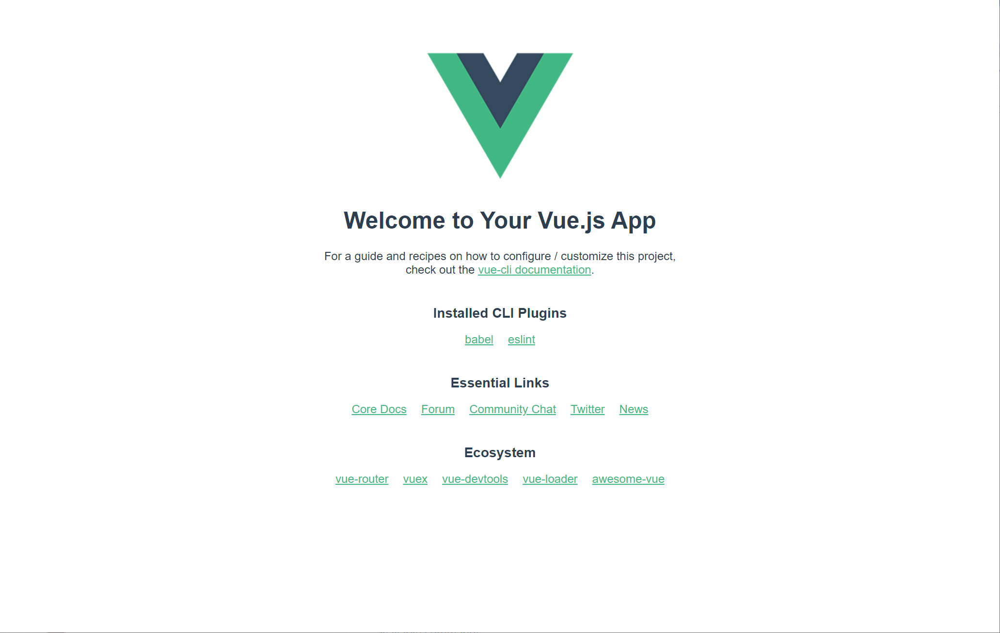
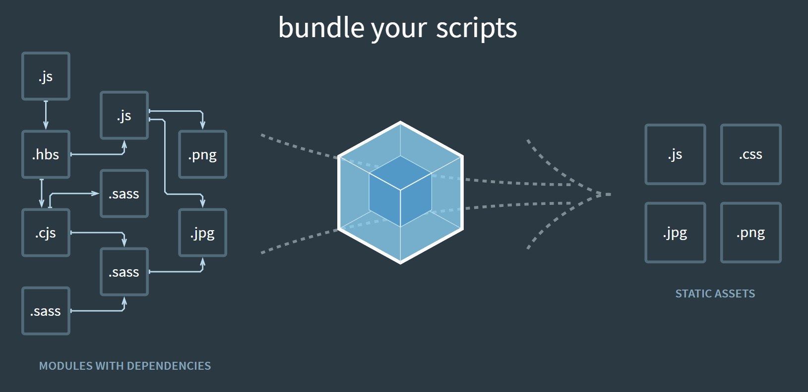
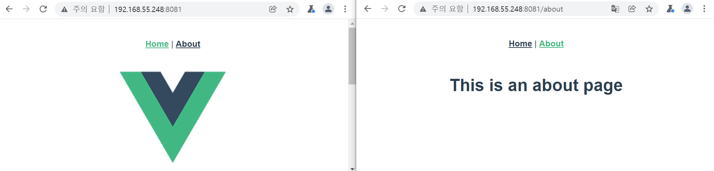
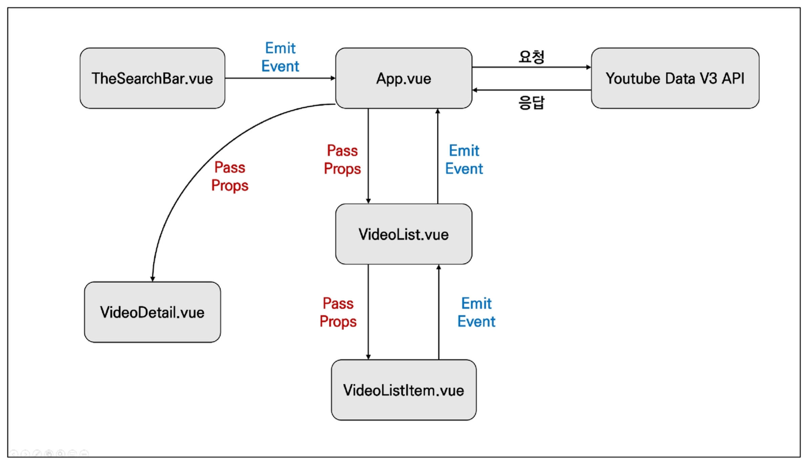

# Vue CLI & Router

:::info 목차

- SFC (Single File Component)
- Vue CLI
- Pass props & Emit event
- Vue Router
- Youtube Project

:::

<br/>

## SFC

### Component (컴포넌트)


- 기본 HTML 엘리먼트를 확장하여 재사용 가능한 코드를 캡슐화 하는데 도움을 줌
- CS에서 다시 사용할 수 있는 범용성을 위해 개발된 소프트웨어 구성 요소를 의미
- 즉, 컴포넌트는 유지보수를 쉽게 만들어 줄 뿐만 아니라, 재사용성의 측면에서도 매우 강력한 기능을 제공
- **Vue 컴포넌트 === Vue 인스턴스**


<br/>

### SFC (Single File Component)

- Vue의 컴포넌트 기반 개발의 핵심 특징
- 하나의 컴포넌트는 `.vue` 확장자를 가진 하나의 파일 안에서 작성되는 코드의 결과물
- 화면의 특정 영역에 대한 HTML, CSS, JavaScript 코드를 하나의 파일(.vue)에서 관리
- 즉, .vue 확장자를 가진 싱글 파일 컴포넌트를 통해 개발하는 방식
- **Vue 컴포넌트 === Vue 인스턴스 === .vue 파일**

<br/>

#### 단일 파일 관리 vs. 컴포넌트

- **단일 파일에서의 개발**
  - 처음 개발을 시작할 때는 크게 신경 쓸 것이 없기 때문에 쉽게 개발 가능
  - 하지만 코드의 양이 많아지면 변수 관리가 힘들어지고 유지보수에 많은 비용 발생

<br/>

- **각 기능 별로 파일을 나눠서 개발**
  - 처음 개발을 준비하는 단계에서 시간 소요가 증가
  - 하지만 이후 변수 관리가 용이하며 기능 별로 유지 & 보수 비용 감소

<br/>

### Vue Component 구조 예시


<br/>

- 한 화면 안에서도 기능 별로 각기 다른 컴포넌트가 존재
  - 하나의 컴포넌트는 여러 개의 하위 컴포넌트를 가질 수 있음
  - Vue는 컴포넌트 기반의 개발 환경 제공

<br/>

- Vue 컴포넌트는 `const app = new Vue({...})`의 app을 의미하며 이는 Vue 인스턴스
  - 여기서 오해하면 안되는 것은 컴포넌트 기반의 개발이 **반드시 파일 단위로 구분되어야 하는 것은 아님**
  - 단일 .html 파일 안에서도 여러 개의 컴포넌트를 만들어 개발 가능

<br/>

### 정리

- Vue 컴포넌트는 Vue 인스턴스(new Vue({}))이기도 함
- Vue 인스턴스는 .vue 파일 안에 작성된 코드의 집합
- HTML, CSS, 그리고 JavaScript를 .vue라는 확장자를 가진 파일 안에서 관리하며 개발

<br/>

## Vue CLI

### Vue CLI

- Vue.js 개발을 위한 표준 도구
- 프로젝트의 구성을 도와주는 역할을 하며 Vue 개발 생태계에서 표준 tool 기준을 목표로 함
- 확장 플러그인, GUI, ES2015 구성 요소 제공 등 다양한 tool 제공
- https://cli.vuejs.org/

<br/>

### Node.js

- 자바스크립트를 브라우저가 아닌 환경에서도 구동할 수 있도록 하는 자바스크립트 런타임 환경
  브라우저 밖을 벗어 날 수 없던 자바스크립트 언어의 태생적 한계를 해결
- Chrome V8 엔진을 제공하여 여러 OS 환경에서 실행할 수 있는 환경을 제공
- 즉, 단순히 브라우저만 조작할 수 있던 자바스크립트를 SSR 아키텍처에서도 사용할 수 있도록 함
  - [참고] 2009년 Ryan Dahl에 의해 발표
- https://nodejs.org/ko/

<br/>

### NPM (Node Package Manage)

- 자바스크립트 언어를 위한 패키지 관리자
  - Python에 pip가 있다면 Node.js에는 NPM
  - pip와 마찬가지로 다양한 의존성 패키지를 관리
- Node.js의 기본 패키지 관리자
- Node.js 설치 시 함께 설치됨

<br/>


### Vue CLI Quick Start

```bash
$ npm install -g @vue/cli   # 설치
# -g 옵션은 cli 계열에만 사용하기

$ vue --version             # 버전 확인
$ vue create my-first-app   # 프로젝트 생성
Vue CLI v4.5.15
? Please pick a preset: Default ([Vue 2] babel, eslint)


Vue CLI v4.5.15
✨  Creating project in C:\Users\User\github-private\SSAFY\07_vue.js\practice1.
⚙️  Installing CLI plugins. This might take a while...

...

Run `npm audit` for details.
🚀  Invoking generators...
📦  Installing additional dependencies...

...

Run `npm audit` for details.
⚓  Running completion hooks...

📄  Generating README.md...

🎉  Successfully created project practice1.
👉  Get started with the following commands:

 $ cd my-first-app
 $ npm run serve
```



<br/>

## Babel & Webpack

### Babel

- “JavaScript compiler"
- 자바스크립트의 ECMAScript 2015+ 코드를 이전 버전으로 번역/변환해 주는 도구
- 과거 자바스크립트의 파편화와 표준화의 영향으로 코드의 스펙트럼이 매우 다양
  - 이 때문에 최신 문법을 사용해도 이전 브라우저 혹은 환경에서 동작하지 않는 상황이 발생
- 원시 코드(최신 버전)를 목적 코드(구 버전)로 옮기는 번역기가 등장하면서 개발자는 더 이상 내 코드가 특정 브라우저에서 동작하지 않는 상황에 대해 크게 고민하지 않을 수 있게 됨
- https://babeljs.io/docs/en/index.html

<br/>

- Babel 동작 예시

```js
// Babel Input: ES2015 arrow function
[1, 2, 3].map(n => n + 1);

// Babel Output: ES5 equivalent
[1, 2, 3].map(function(n) {
  return n + 1;
});
```

<br/>

### Webpack



- “static module bundler"
- 모듈 간의 의존성 문제를 해결하기 위한 도구
- 프로젝트에 필요한 모든 모듈을 매핑하고 내부적으로 종속성 그래프를 빌드함
- https://webpack.js.org/

<br/>

#### Module

- 모듈은 단지 파일 하나를 의미 (ex. 스크립트 하나 === 모듈 하나)
- 배경
  - 브라우저만 조작할 수 있었던 시기의 자바스크립트는 모듈 관련 문법 없이 사용 됨
  - 하지만 자바스크립트와 애플리케이션이 복잡해지고 크기가 커지자 전역 scope를 공유하는 형태의 기존 개발 방식의 한계점이 드러남
  - 그래서 라이브러리를 만들어 필요한 모듈을 언제든지 불러오거나 코드를 모듈 단위로 작성하는 등의 다양한 시도가 이루어짐

<br/>

- 과거 모듈 시스템
  - AMD, CommonJS, UMD
- 모듈 시스템이 2015년 표준으로 등재 되었으며, 현재는 대부분의 브라우저와 Node.js가 모듈 시스템을 지원

<br/>

##### Module 의존성 문제

- 모듈의 수가 많아지고 라이브러리 혹은 모듈 간의 의존성(연결성)이 깊어지면서 특정한 곳에서 발생한 문제가 어떤 모듈 간의 문제인지 파악하기 어려워짐
- 즉, Webpack은 이 모듈 간의 의존성 문제를 해결하기 위해 등장

<br/>

#### Bundler

- 모듈 의존성 문제를 해결해주는 작업을 Bundling이라 함
- 이러한 일을 해주는 도구가 Bundler이고, Webpack은 다양한 Bundler 중 하나
- 여러 모듈을 하나로 묶어주고 묶인 파일은 하나(혹은 여러 개)로 합쳐짐
- Bundling된 결과물은 더 이상 순서에 영향을 받지 않고 동작하게 됨
- snowpack, parcel, rollup.js 등의 webpack 이외에도 다양한 모듈 번들러 존재
- **Vue CLI는 이러한 Babel, Webpack에 대한 초기 설정이 자동으로 되어 있음**

<br/>

#### node_module의 의존성 깊이


<br/>

### 정리

- Node.js
  - JavaScript Runtime Environment
  - JavaScript를 브라우저 밖에서 실행할 수 있는 새로운 환경
- Babel
  - Compiler
  - ES2015+ JavaScript 코드를 구 버전의 JavaScript로 바꿔주는 도구
- Webpack
  - Module Bundler
  - 모듈 간의 의존성 문제를 해결하기 위한 도구

<br/>

### Vue 프로젝트 구조

- `node_modules`
  - node.js 환경의 여러 의존성 모듈
- `public/index.html`
  - Vue 앱의 뼈대가 되는 파일
  - 실제 제공되는 단일 html 파일

<br/>

- `src/assets`
  - webpack에 의해 빌드된 정적 파일
- `src/components`
  - 하위 컴포넌트들이 위치
- `src/App.vue`
  - 최상위 컴포넌트

<br/>

- `src/main.js`

  - webpack이 빌드를 시작할 때 가장 먼저 불러오는 entry point

  - 실제 단일 파일에서 DOM과 data를 연결했던 것과 동일한 작업이 이루어지는 곳
  - Vue 전역에서 활용할 모듈을 등록할 수 있는 파일

<br/>

- `babel.config.js`
  - babel 관련 설정이 작성된 파일
- `package.json`
  - 프로젝트의 종속성 목록과 지원되는 브라우저에 대한 구성 옵션이 포함

- `package-lock.json`
  - node_modules에 설치되는 모듈과 관련된 모든 의존성을 설정 및 관리
  - 팀원 및 배포 환경에서 정확히 동일한 종속성을 설치하도록 보장하는 표현
  - 사용할 패키지의 버전을 고정
  - 개발 과정 간의 의존성 패키지 충돌 방지

<br/>

## Pass Props & Emit Events

### 컴포넌트 작성

- Vue app은 자연스럽게 중첩된 컴포넌트 트리로 구성됨
- 컴포넌트간 부모-자식 관계가 구성되며 이들 사이에 필연적으로 의사 소통이 필요함

- https://kr.vuejs.org/v2/guide/components.html#%EC%BB%B4%ED%8F%AC%EB%84%8C%ED%8A%B8-%EC%9E%91%EC%84%B1

<br/>

- 부모는 자식에게 데이터를 전달(Pass props)하며, 자식은 자신에게 일어난 일을 부모에게 알림(Emit event)
  - 부모와 자식이 명확하게 정의된 인터페이스를 통해 격리된 상태를 유지할 수 있음
- "**props는 아래로, events는 위로**"
- 부모는 props를 통해 자식에게 '데이터'를 전달하고, 자식은 events를 통해 부모에게 ‘메시지’를 보냄

<br/>

### 컴포넌트 구조

1. **템플릿** (HTML)

   - HTML의 body 부분
   - 각 컴포넌트를 작성

   

2. **스크립트** (JavaScript)

   - JavaScript가 작성되는 곳

   - 컴포넌트 정보, 데이터, 메서드 등 vue 인스턴스를 구성하는 대부분이 작성 됨

     

3. **스타일** (CSS)

   - CSS가 작성되며 컴포넌트의 스타일을 담당

<br/>

```html
<!-- 템플릿 (HTML) -->
<template>
  <div id="app">
    
    <HelloWorld msg="Welcome to Your Vue.js App"/>
  </div>
</template>

<!-- 스크립트 (JavaScript) -->
<script>
import HelloWorld from './components/HelloWorld.vue'

export default {
  name: 'App',
  components: {
    HelloWorld
  }
}
</script>

<!-- 스타일 (CSS) -->
<style>
#app {
  font-family: Avenir, Helvetica, Arial, sans-serif;
  -webkit-font-smoothing: antialiased;
  -moz-osx-font-smoothing: grayscale;
  text-align: center;
  color: #2c3e50;
  margin-top: 60px;
}
</style>
```

<br/>

### 컴포넌트 등록 3단계

1. 불러오기
2. 등록하기
3. 보여주기

```html
<!-- App.vue -->
<template>
  <div id="app">
    
    <!-- 보여주기 -->
    <HelloWorld msg="Welcome to Your Vue.js App"/>
  </div>
</template>

<script>
// 1. 불러오기
import HelloWorld from './components/HelloWorld.vue'

export default {
  name: 'App',
  components: {
    // 2. 등록하기
    HelloWorld
  }
}
</script>
```

```html
<!-- HelloWorld.vue -->
<script>
export default {
  name: 'HelloWorld',
  // Props
  props: {
    msg: String
  }
}
</script>
```


<br/>


### Props

- props는 부모(상위) 컴포넌트의 정보를 전달하기 위한 사용자 지정 특성
- 자식(하위) 컴포넌트는 props 옵션을 사용하여 수신하는 props를 명시적으로 선언해야 함
- 즉, 데이터는 props 옵션을 사용하여 자식 컴포넌트로 전달됨

<br/>

:::warning 주의

- 모든 컴포넌트 인스턴스에는 자체 격리된 범위가 있음
- 즉, 자식 컴포넌트의 템플릿에서 상위 데이터를 직접 참조할 수 없음

:::

<br/>

#### Static Props 작성

- 자식 컴포넌트(About.vue)에 보낼 prop 데이터 선언
- 작성
  - `prop-data-name="value"`

```html
<!-- App.vue -->
<template>
  <div id="app">
    
    <about my-message="this is prop data"></about>
  </div>
</template>

<script>
import About from "./components/About.vue";

export default {
  name: "App",
  components: {
    About,
  },
};
</script>
```

<br/>

- 수신할 prop 데이터를 명시적으로 선언 후 사용

```html
<!-- About.vue -->
<template>
  <div id="app">
    <h1>About</h1>
    <h2>{{ myMessage }}</h2>
  </div>
</template>

<script>
export default {
  name: "About",
  props: {
    myMessage: String,
  },
};
</script>

<style></style>
```

<br/>

#### Dynamic Props 작성

- v-bind directive를 사용해 부모의 데이터의 props를 동적으로 바인딩
- 부모에서 데이터가 업데이트 될 때마다 자식 데이터로도 전달됨

```html
<template>
  <div id="app">
    
    <about my-message="this is prop data" :parent-data="parentData"></about>
  </div>
</template>

<script>
import About from "./components/About.vue";

export default {
  name: "App",
  components: {
    About,
  },
  data: function () {
    return {
      parentData: "This is parent Data by v-bind",
    };
  },
};
</script>
```

<br/>

- 마찬가지로 수신할 prop 데이터를 명시적으로 선언 후 사용

```html
<template>
  <div id="app">
    <h1>About</h1>
    <h2>{{ myMessage }}</h2>
    <h2>{{ parentData }}</h2>
  </div>
</template>

<script>
export default {
  name: "About",
  props: {
    myMessage: String,
    parentData: String,
  },
};
</script>
```

<br/>

#### Props 이름 컨벤션

- during declaration (선언 시) : `camelCase`
- in template (HTML) : `kebab-case`

<br/>

#### 컴포넌트의 'data'는 반드시 함수여야 함

- 기본적으로 각 인스턴스는 모두 같은 data 객체를 공유하므로 새로운 data 객체를 반환(return)하여야 함
- 그렇지 않으면 각 인스턴스가 모두 같은 data 객체를 공유하게 됨

```html
<script>
data: function() {
  // 함수를 통해 일종의 scope를 만들어준다.
  return {
    myData: null,
  }
}
</script>
```

<br/>

#### Props시 자주하는 실수

- Static 구문을 사용하여 숫자를 전달하려고 시도하는 것
- 실제 JavaScript 숫자를 전달하려면 값이 JavaScript 표현식으로 평가되도록 v-bind를 사용해야함

```html
<!-- 이것은 일반 문자열 "1"을 전달합니다. -->
<comp some-prop="1"></comp>

<!-- 이것은 실제 숫자로 전달합니다. -->
<comp :some-prop="1"></comp>
```

<br/>

#### 단뱡향 데이터 흐름

- 모든 props는 하위 속성과 상위 속성 사이의 단방향 바인딩을 형성 (부모 → 자식)
- 부모의 속성이 변경되면 자식 속성에게 전달되지만, 반대 방향으로는 안 됨
  - 자식 요소가 의도치 않게 부모 요소의 상태를 변경하여 앱의 데이터 흐름을 이해하기 어렵게 만드는 일을 방지
- 부모 컴포넌트가 업데이트될 때마다 자식 요소의 모든 prop들이 최신 값으로 업데이트됨

<br/>

### Emit event
- “Listening to Child Components Events”
- `$emit(eventName)`
  - 현재 인스턴스에서 이벤트를 트리거
  - 추가 인자는 리스너의 콜백 함수로 전달
- 부모 컴포넌트는 자식 컴포넌트가 사용되는 템플릿에서 v-on을 사용하여 자식 컴포넌트가 보낸 이벤트를 청취 (v-on을 이용한 사용자 지정 이벤트)
- https://kr.vuejs.org/v2/api/#vm-emit

<br/>

#### Emit event 작성

- 현재 인스턴스에서 `$emit` 인스턴스 메서드를 이용해 child-input-change 이벤트를 트리거

```html
<!-- About.vue -->
<template>
  <div id="app">
    <h1>About</h1>
    <h2>{{ myMessage }}</h2>
    <h2>{{ parentData }}</h2>
    <input
      type="text"
      @keyup.enter="childInputChange"
      v-model="childeInputData"
    >
  </div>
</template>

<script>
export default {
  name: "About",
  data: function () {
    return {
      childInputData: null
    }
  },
  props: {
    myMessage: String,
    parentData: String,
  },
  methods: {
    childeInputChange: function () {
      thie.$emit('child-input-change', this.childInputData)
    }
  }
};
</script>
```

<br/>

- 부모 컴포넌트(App.vue)는 자식 컴포넌트(About.vue)가 사용되는 템플릿에서 v-on directive를 사용하여 자식 컴포넌트가 보낸 이벤트(child-input-change)를 청취

```html
<!-- App.vue -->

<template>
  <div id="app">
    
    <about 
      my-message="this is prop data"
      :parent-data="parentData"
      @child-input-change="parentGetChange"
    >
    </about>
  </div>
</template>

<script>
import About from './components/About.vue'

export default {
  name: 'App',
  components: {
    About,
  },
  data: function () {
    return {
      parentData: 'This is parent data by v-bind',
    }
  },
  methods: {
    parentGetChange: function (inputData) {
      console.log(`About으로부터 ${inputData}를 받음!!!`)
    }
  }
}
</script>

<style>
#app {
  font-family: Avenir, Helvetica, Arial, sans-serif;
  -webkit-font-smoothing: antialiased;
  -moz-osx-font-smoothing: grayscale;
  text-align: center;
  color: #2c3e50;
  margin-top: 60px;
}
</style>
```

<br/>

#### event 이름 컨벤션

- 컴포넌트 및 props와는 달리, 이벤트는 자동 대소문자 변환을 제공하지 않음
- HTML의 대소문자 구분을 위해 DOM 템플릿의 v-on 이벤트 리스너는 항상 자동으로 소문자 변환되기 때문에 `v-on:myEvent`는 자동으로 `v-on:myevent`로 변환
- 이러한 이유로 이벤트 이름에는 항상 kebab-case를 사용하는 것을 권장

```js
this.$emit('myEvent')
```

```html
<!-- 이벤트가 동작하지 않음 -->
<my-component @my-event="doSomething"></my-component>
```

<br/>

## Vue Router

- "Vue.js 공식 라우터"
- 라우트(route)에 컴포넌트를 매핑한 후, 어떤 주소에서 렌더링할 지 알려줌
- SPA 상에서 라우팅을 쉽게 개발할 수 있는 기능을 제공

<br/>

:::tip [참고] router

- 위치에 대한 최적의 경로를 지정하며, 이 경로를 따라 데이터를 다음 장치로 전향시키는 장치 [위키백과]
- https://router.vuejs.org/kr/

:::

<br/>

### Vue Router 시작하기

1. 프로젝트 생성 및 이동

```bash
$ vue create my-router-app
$ cd my-router-app
```

2. Vue Router plugin 설치 (Vue CLI 환경)

```bash
$ vue add router
```

<br/>

:::warning 주의

기존 프로젝트를 진행하고 있던 도중에 추가하게 되면 App.vue를 덮어쓰므로, 프로젝트 내에서 다음 명령을 실행하기 전에 필요한 경우 파일을 백업(커밋)해야 함.

:::

<br/>

3. commit 여부 (Yes)

```bash
WARN  There are uncommitted changes in the current repository, it's recommended to commit or stash them first.
? Still proceed? Yes
```

4. History mode 사용 여부 (Yes)

```bash
? Use history mode for router? (Requires proper server setup for index fallback in production) Yes
```

<br/>

#### Vue Router로 인한 변화

1. App.vue 코드
2. router/index.js 생성
3. views 디렉토리 생성

<br/>

##### index.js

- 라우트에 관련된 정보 및 설정이 작성 되는 곳

```js
import Vue from "vue";
import VueRouter from "vue-router";
import Home from "../views/Home.vue";
import About from "../views/About.vue";

Vue.use(VueRouter);

const routes = [
  {
    path: "/",
    name: "Home",
    component: Home,
  },
  {
    path: "/about",
    name: "About",
    component: About,
  },
];

const router = new VueRouter({
  mode: "history",
  base: process.env.BASE_URL,
  routes,
});

export default router;
```

<br/>

##### router-link

```html
<router-link to="/">Home</router-link> |
<router-link to="/about">About</router-link>
```

- 사용자 네비게이션을 가능하게 하는 컴포넌트
- 목표 경로는 ‘to' prop으로 지정됨
- HTML5 히스토리 모드에서 router-link는 클릭 이벤트를 차단하여 브라우저가 페이지를 다시 로드 하지 않도록 함
- a 태그지만 우리가 알고 있는 GET 요청을 보내는 a 태그와 조금 다르게, 기본 GET 요청을 보내는 이벤트를 제거한 형태로 구성됨
- https://router.vueis.org/kr/api/#router-link

<br/>

##### router-view

```html
<router-view/>
```

- 주어진 라우트에 대해 일치하는 컴포넌트를 렌더링하는 컴포넌트
- 실제 component가 DOM에 부착되어 보이는 자리를 의미
- router-link를 클릭하면 해당 경로와 연결되어 있는 index.js에 정의한 컴포넌트가 위치
- https://router.vueis.org/kr/api/#router-view

<br/>

#### History mode

- HTML History API를 사용해서 router를 구현한 것
- 브라우저의 히스토리는 남기지만 실제 페이지는 이동하지 않는 기능을 지원
- 즉, 페이지를 다시 로드하지 않고 URL을 탐색할 수 있음
  - SPA의 단점 중 하나인 “URL이 변경되지 않는다.”를 해결
- https://router.vuejs.org/guide/essentials/history-mode.html#htm15-history-mode



<br/>

:::tip [참고] History API

- DOM의 Window 객체는 history 객체를 통해 브라우저의 세션 기록에 접근할 수 있는 방법을 제공
- history 객체는 사용자를 자신의 방문 기록 앞과 뒤로 보내거나, 기록의 특정 지점으로 이동하는 등 유용한 메서드와 속성을 가짐
- https://developer.mozilla.org/ko/docs/Web/API/History_API

:::

<br/>

### 1. Named Routes

- 이름을 가지는 라우트
- 명명된 경로로 이동하려면 객체를 vue-router 컴포넌트 요소의 prop에 전달

```js
import Vue from "vue";
import VueRouter from "vue-router";
import Home from "../views/Home.vue";
import About from "../views/About.vue";

Vue.use(VueRouter);

const routes = [
  {
    path: "/",
    name: "Home",
    component: Home,
  },
  {
    path: "/about",
    name: "About",
    component: About,
  },
];
```

```html
<router-link :to="{ name: 'Home' }">Home</router-link> |
<router-link :to="{ name: 'About' }">About</router-link>
```

<br/>

### 2. 프로그래밍 방식 네비게이션

- `〈router-link〉`를 사용하여 선언적 탐색을 위한 a 태그를 만드는 것 외에도, router의 인스턴스 메서드를 사용하여 프로그래밍 방식으로 같은 작업을 수행할 수 있음
- https://router.vuejs.org/guide/essentials/navigation.html

|       선언적 방식        |  프로그래밍 방식   |
| :----------------------: | :----------------: |
| `<router-link to="...">` | `router.push(...)` |

<br/>

- Vue 인스턴스 내부에서 라우터 인스턴스에 `$router`로 접근할 수 있음
- 따라서 다른 URL로 이동하려면 `this.$​router.push`를 호출할 수 있음
  - 이 메서드는 새로운 항목을 히스토리 스택에 넣기 때문에 사용자가 브라우저의 뒤로 가기 버튼을 클릭하면 이전 URL로 이동하게 됨
- `<router-link>`를 클릭할 때 내부적으로 호출되는 메서드이므로 `<router-link :to="...">`를 클릭하면, `router.push(...)`를 호출하는 것과 같음
- https://router.vuejs.org/guide/essentials/navigation.html

<br/>

- 작성할 수 있는 인자 예시

```js
// literal string path
router.push('home' )

// object
router.push({ path: 'home' })

// named route
router.push({ name: 'user', params: { userId: '123' } })

// with query, resulting in /register?plan=private
router.push({ path: 'register', query: { plan: 'private' } })
```

<br/>

- About에서 Home으로 이동하는 로직 작성

```html
<!-- views/About.vue -->

<template>
  <div class="about">
    <h1>This is an about page</h1>
    <button @click="moveToHome">Home으로 이동</button>
  </div>
</template>

<script>
export default {
  name: "About",
  methods: {
    moveToHome: function () {
      // this.$router.push("/");
      this.$router.push({ name: "Home" });
    },
  },
};
</script>

<style></style>
```

<br/>

### 3. Dynamic Route Matching

- 동적 인자 전달
- 주어진 패턴을 가진 라우트를 동일한 컴포넌트에 매핑해야 하는 경우
- 예를 들어 모든 User에 대해 동일한 레이아웃을 가지지만, 다른 User ID로 렌더링 되어야하는 User 컴포넌트 예시

```js
const routes = [
  {
    path: '/user/:userId',
    name: 'User',
    component: User
  }
]
```

<br/>

- 동적 인자는 : (콜론)으로 시작
- 컴포넌트에서 `this.$route.params`로 사용가능

|               pattern                |      matched path       |            $route.params             |
| :----------------------------------: | :---------------------: | :----------------------------------: |
|          `/user/:userName`           |      `/user/john`       |        `{ username: 'john' }`        |
| `/user/:userName/article/:articleId` | `/user/john/article/12` | `{username: 'john', articleId: 12 }` |

<br/>

- https://router.vuejs.org/guide/essentials/dynamic-matching.html#reacting-to-params-changes

<br/>

- TheLotto.vue 예시

```js
// index.js

import TheLotto from "../views/TheLotto.vue"

const routes = [
  ...,
  {
    path: '/lotto/:lottoNum',
    name: 'TheLotto',
    component: TheLotto,
  },
];
```

```html
<!-- views/TheLotto.vue -->
<template>
  <div>
    <h1>로또번호 추천</h1>
    <h2>{{ $route.params.lottoNum }}개의 번호를 추천합니다.</h2>
    <button @click="getLuckyNums">Pick My Lotto Numbers</button>
    <p>오늘의 추천 로또 번호</p>
    <p>{{ selectedLuckyNums }}</p>
  </div>
</template>

<script>
import _ from "lodash";

export default {
  name: "TheLotto",
  data: function () {
    return {
      selectedLuckyNums: [],
    };
  },
  methods: {
    getLuckyNums: function () {
      const numbers = _.range(1, 46);
      this.selectedLuckyNums = _.sampleSize(numbers, this.$route.params.lottoNum);
    },
  },
};
</script>
```

```html
<!-- App.vue -->
<template>
  <div id="app">
    <div id="nav">
      <router-link :to="{ name: 'Home' }">Home</router-link> | 
      <router-link :to="{ name: 'About' }">About</router-link> |
      <router-link :to="{ name: 'TheLotto', params: { lottoNum: 6 } }">TheLotto</router-link>
    </div>
    <router-view />
  </div>
</template>
```


<br/>

### components of views

- 기본적으로 작성된 구조에서 components 폴더와 views 폴더 내부에 각기 다른 컴포넌트가 존재하게 됨
- 컴포넌트를 작성해 갈 때 정해진 구조가 있는 것은 아니며, 주로 아래와 같이 구조화하여 활용함
- `App.vue` :최상위 컴포넌트
- `views/`
  - router(index.js)에 매핑되는 컴포넌트를 모아두는 폴더
  - ex) App 컴포넌트 내부에 About & Home 컴포넌트 등록
- `components/`
  - router에 매핑된 컴포넌트 내부에 작성하는 컴포넌트를 모아두는 폴더
  - ex) Home 컴포넌트 내부에 HelloWorld 컴포넌트 등록

<br/>

### Vue Router가 필요한 이유

1. **SPA 등장 이전**

  - 서버가 모든 라우팅을 통제
  - 요청 경로에 맞는 HTML를 제공

2. **SPA 등장 이후**

  - 서버는 index.html 하나만 제공
  - 이후 모든 처리는 HTML 위에서 JS 코드를 활용해 진행
  - 즉, 요청에 대한 처리를 더 이상 서버가 하지 않음 (할 필요가 없어짐)

  <br/>

3. **라우팅 처리 차이**

  - SSR : 라우팅에 대한 결정권을 서버가 가짐
  - CSR
    - 클라이언트는 더 이상 서버로 요청을 보내지 않고 응답받은 HTML 문서안에서 주소가 변경되면 특정 주소에 맞는 컴포넌트를 렌더링
    - 라우팅에 대한 결정권을 클라이언트가 가짐
  - 결국 Vue Router는 라우팅의 결정권을 가진 Vue.js에서 라우팅을 편리하게 할 수 있는 Tool을 제공해주는 라이브러리

<br/>

## Youtube Project



<br/>

### 1. 프로젝트 준비

- 프로젝트 생성 및 lodash 설치

```bash
$ vue create youtube-project
$ cd youtube-project
$ npm i lodash
```

<br/>

### 2.유튜브 검색 데이터 (TheSearchBar.vue)

- 컴포넌트 등록

```html
<!-- App.vue -->
<template>
  <div id="app">
    <h1>My first Youtube Project</h1>
    <!-- the search bar -->
    <the-search-bar></the-search-bar>
  </div>
</template>

<script>
// @: src와 같은 의미, 단축키
import TheSearchBar from "@/components/TheSearchBar";

export default {
  name: "App",
  // 컴포넌트 등록
  components: {
    TheSearchBar,
  },
};
</script>
```

<br/>

- Emit Event (TheSearchBar.vue -> App.vue)

```html
<!-- components/TheSearchBar.vue -->
<template>
  <div>
    <input @keyup.enter="onInputKeyword" type="text" />
  </div>
</template>

<script>
export default {
  name: "SearchBar",
  methods: {
    onInputKeyword: function (event) {
      // emit event
      this.$emit("input-change", event.target.value);
    },
  },
};
</script>
```

<br/>

- 이벤트 청취 후 올라온 데이터 할당

```html
<!-- App.vue -->
<template>
  <div id="app">
    <h1>My first Youtube Project</h1>
    <!-- 이벤트 청취 -->
    <header>
      <the-search-bar @input-change="onInputChange"></the-search-bar>
    </header>
    <section>
      <video-list :videos="videos"></video-list>
    </section>
  </div>
</template>

<script>
import axios from "axios";
// @: src와 같은 의미, 단축키
import TheSearchBar from "@/components/TheSearchBar";

const API_KEY = process.env.VUE_APP_YOUTUBE_API_KEY;
const API_URL = "https://www.googleapis.com/youtube/v3/search";

export default {
  ...
  // 이벤트 청취 후 올라온 데이터 할당
  data: function () {
    return {
      inputValue: null,
    };
  },
  methods: {
    // theSearchBar가 보낸 두번째 인자 event.target.value
    onInputChange: function (inputText) {
      // console.log(this) -> Vue Instance
      this.inputValue = inputText;
      // console.log(this.inputValue)
    },
  },
};
</script>
```

<br/>

### 3. 유튜브 요청 & 응답 데이터 처리 (App.vue)

- API 키 환경변수 설정

```js
// .env.local

VUE_APP_YOUTUBE_API_KEY='Google Developer에서 발급받은 Youtube API Key 입력'
```

<br/>

- Youtube API 요청 & 응답 데이터를 변수에 할당

```html
<!-- App.vue -->
<script>
import axios from 'axios'
import TheSearchBar from '@/components/TheSearchBar'

const API_KEY = process.env.VUE_APP_YOUTUBE_API_KEY
const API_URL = 'https://www.googleapis.com/youtube/v3/search'

export default {
  name: 'App',
  components: {
    TheSearchBar,
  },
  data: function () {
    return {
      inputValue: null,
      // 응답 데이터 할당하기 위함
      videos: [],
    }
  },
  methods: {
    onInputChange: function (inputValue) {
      this.inputValue = inputValue

      const params = {
        key: API_KEY,
        part: 'snippet',
        type: 'video',
        q: this.inputValue,
      }

      axios({
        method: 'get',
        url: API_URL,
        params,
      })
        .then(res => {
          console.log(res)
          this.videos = res.data.items
        })
        .catch(err => {
          console.log(err)
        })
    },
  }
}
</script>
```

<br/>

- Pass props (App.vue -> VideoList.vue)
- 할당한 응답 데이터를 하위 컴포넌트로 전달

```html
<!-- App.vue -->
<template>
  <div id="app">
    <h1>My first Youtube Project</h1>
    <header>
      <the-search-bar @input-change="onInputChange"></the-search-bar>
    </header>
    <section>
      <video-detail :video="selectedVideo"></video-detail>
      <!-- props -->
      <video-list :videos="videos"></video-list>
    </section>
  </div>
</template>
```

<br/>

- 내려온 prop 데이터 선언 후 사용

```html
<!-- VideoList.vue -->

<template>
  <ul>
    <li v-for="(video, idx) in videos" :key="idx">
      {{ video.snippet.title }}
    </li>
  </ul>
</template>

<script>
import VideoListItem from "@/components/VideoListItem";

export default {
  name: "VideoList",
  props: {
    videos: {
      type: Array,
      required: true,
    },
  },
};
</script>
```

<br/>

- Pass props (VideoList.vue -> VideoListItem.vue)

```html
<!-- VideoList.vue -->

<template>
  <ul>
    <video-list-item v-for="(video, idx) in videos" :key="idx" :video="video">
      {{ video.snippet.title }}
    </video-list-item>
  </ul>
</template>

<script>
import VideoListItem from "@/components/VideoListItem";

export default {
  name: "VideoList",
  components: {
    VideoListItem,
  },
  props: {
    videos: {
      type: Array,
      required: true,
    },
  },
};
</script>

<style></style>
```

<br/>

- 내려온 prop 데이터 (개별 비디오) 선언 후 사용

```html
<!-- VideoListItem.vue -->

<template>
  <li>
    
    {{ video.snippet.title }}
  </li>
</template>

<script>
export default {
  name: "VideoListItem",
  props: {
    video: {
      type: Object,
      required: true,
    },
  },
};
</script>
```

<br/>

### 4. 유튜브 영상 상세 정보 - VideoDetail.vue

- 유튜브 상세 영상 정보 알리기

- VideoListItem.vue -> VideoList.vue

```html
<!-- VideoListItem.vue -->
<template>
  <!-- 클릭하면 --> 
  <li @click="selectVideo">
    ...
    {{ video.snippet.title }}
  </li>
</template>

<script>
export default {
  ...
  methods: {
    selectVideo: function () {
      this.$emit('select-video', this.video)
    },
  ...
}
</script>
```

```html
<!-- VideoList.vue -->

<template>
  <ul>
    <!-- 이벤트 청취 -->
    <video-list-item v-for="(video, idx) in videos" :key="idx" :video="video" @select-video="onSelectVideo">
      {{ video.snippet.title }}
    </video-list-item>
  </ul>
</template>

<script>
import VideoListItem from "@/components/VideoListItem";

export default {
  name: "VideoList",
  components: {
    VideoListItem,
  },
  props: {
    videos: {
      type: Array,
      required: true,
    },
  },
  // emit
  methods: {
    onSelectVideo: function (video) {
      this.$emit("select-video", video);
    },
  },
};
</script>
```

<br/>

- VideoList.vue -> App.vue

```html
<!-- App.vue -->

<template>
  <div id="app">
    <h1>My first Youtube Project</h1>
    <header>
      <the-search-bar @input-change="onInputChange"></the-search-bar>
    </header>
    <section>
      <!-- 유튜브 상세영상 정보 알리기 -->
      <video-list :videos="videos" @select-video="onVideoSelect"></video-list>
    </section>
  </div>
</template>

<script>
...
export default {
  name: "App",
  ...
  data: function () {
    return {
      inputValue: null,
      videos: [],
      selectedVideo: null,
    };
  },
  methods: {
    ...
    onVideoSelect: function (video) {
      this.selectedVideo = video
    }
  },
};
</script>
```

<br/>

- App 컴포넌트에서 내린 데이터가 VideoDetail에 잘 전달되었는지 확인

```html
<!-- App.vue -->
<template>
  <div id="app">
    <h1>My first Youtube Project</h1>
    <header>
      <the-search-bar @input-change="onInputChange"></the-search-bar>
    </header>
    <section>
      <!-- video-detail -->
      <video-detail :video="selectedVideo"></video-detail>
      <video-list :videos="videos" @select-video="onVideoSelect"></video-list>
    </section>
  </div>
</template>
```

<br/>

- App.vue -> VideoDetail.vue

```html
<!-- VideoDetail.vue -->

<template>
  <div>
    {{ video }}
  </div>
</template>

<script>
export default {
  name: 'VideoDetail',
  props: {
    video: {
      type: Object,
    }
  },
}
</script>
```

<br/>

- VideoDetail 컴포넌트 마무리
- Youtube iframe 문서를 참고하여  `videoId` 값 찾기

```html
<!-- VideoDetail.vue -->

<template>
  <div v-if="video">
    <iframe :src="videoUrl" frameborder="0"></iframe>
  </div>
</template>

<script>
export default {
  name: 'VideoDetail',
  props: {
    video: {
      type: Object,
    }
  },
  computed: {
    videoUrl: function () {
      const videoId = this.video.id.videoId
      return `https://www.youtube.com/embed/${videoId}`
    }
  }
}
</script>
```

<br/>

## 마무리

